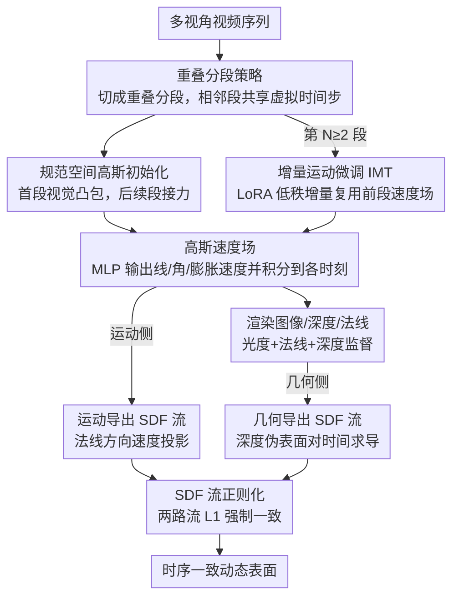

# 4DSurf: High-Fidelity Dynamic Scene Surface Reconstruction

**会议**: CVPR 2026  
**arXiv**: [2603.28064](https://arxiv.org/abs/2603.28064)  
**代码**: 无  
**领域**: 人体理解  
**关键词**: 动态表面重建、高斯泼溅、SDF流正则化、时序一致性、大变形处理

## 一句话总结

本文提出 4DSurf，一个基于2D高斯泼溅的通用动态场景表面重建框架，通过引入高斯运动诱导的SDF流正则化来约束表面时序一致演化，并采用重叠分段策略处理大变形，在 Hi4D 和 CMU Panoptic 数据集上分别以 49% 和 19% 的 Chamfer 距离改进超越现有 SOTA。

## 研究背景与动机

**领域现状**：动态表面重建旨在从视频序列中恢复时序一致的3D几何形状，是数字人、虚拟现实等应用的基础。近年来基于高斯泼溅（GS）的方法因实时渲染和高效优化而成为主流方向。

**现有痛点**：现有 GS 基动态表面重建方法（如 D-2DGS、DG-Mesh、DGNS 等）通常只在单一物体或小变形场景下表现良好，面对大变形场景时会出现表面抖动（jitter）和时序不一致的几何变形。许多方法还依赖 SMPL-X 等人体先验或预训练深度/法线估计模型，限制了通用性。

**核心矛盾**：如何在不依赖任何对象先验的前提下，同时实现：(1) 对任意动态场景（多物体、非刚体）的通用表面重建；(2) 大变形下的时序一致性；(3) 稀疏视角下的高保真几何。

**本文目标** (1) 约束高斯的运动与表面演化对齐，消除时序不一致；(2) 处理长序列中的大变形而不积累误差；(3) 构建一个无先验依赖的通用框架。

**切入角度**：从 SDF 流（SDF 场的时间导数）出发，将高斯的运动与 SDF 变化建立联系——如果高斯的运动能正确反映表面的时间演化，则二者导出的 SDF 流应一致。利用这一约束可以实现时序一致的表面重建。

**核心 idea**：通过高斯速度场定义的 SDF 流与从深度图变化估计的 SDF 流之间的一致性正则化，实现无先验的时序一致动态表面重建。

## 方法详解

### 整体框架

4DSurf 要解决的是：从一段多视角视频里恢复出一个随时间一致演化的动态表面，且不依赖 SMPL-X 之类的物体先验。它的做法是把整段视频切成若干**重叠分段**，每段内部建一个规范空间（canonical space）和一个高斯速度场，再用 SDF 流正则化把"高斯怎么动"和"表面怎么变"绑在一起。

具体来说，每个分段覆盖 $K+1$ 个时间步，其中末尾那个时间步是与下一分段共享的"虚拟时间步"，用来在段与段之间传递几何。首个分段从视觉凸包（visual hull）初始化高斯，之后每个分段从前一段虚拟时间步的高斯接力初始化。段内通过速度场把规范空间的高斯推到各个时间步，渲染出图像、深度和法线参与监督，而 SDF 流正则化则在训练全程约束运动与几何对齐，避免表面抖动。

### 关键设计

**1. 高斯速度场：用速度而非位移参数化运动，为 SDF 流推导铺路**

动态表面重建里最常见的做法是直接预测每个高斯的位移（变形场），但位移场和几何演化之间没有现成的解析桥梁，难以施加时序约束。4DSurf 改成预测**速度**：给定第 $i$ 个高斯的规范中心 $\mu_i$ 和时间步 $t$，用一个 MLP $\mathcal{F}_\theta$ 输出线速度 $\mathbf{v}(\mu_i, t)$、角速度 $\omega(\mu_i, t)$ 和膨胀速度 $\mathbf{e}(\mu_i, t)$ 三类运动量，再积分得到该时刻的位置 $\mu_i^t = \mu_i + \mathbf{v} \cdot t$、旋转 $q_i^t = \phi(\omega \cdot t) \otimes q_i$ 和尺度 $\xi_i^t = \xi_i + \mathbf{e} \cdot t$。

之所以坚持用速度，是因为表面随时间的变化率（SDF 流）本质上是一个关于速度的量——只有把运动表示成速度场，才能在数学上把"高斯怎么动"直接推导成"表面怎么变"，从而为下面的 SDF 流正则化提供可微的解析形式。

**2. SDF 流正则化：从运动和几何两条路算 SDF 流并强制一致**

有了速度场还不够，速度场自己并不保证表面随时间一致演化，大变形下仍会抖。SDF 流正则化的思路是：表面演化可以用 SDF 场的时间导数（SDF 流）刻画，而这个量能从两条互相独立的路径分别算出来，于是要求二者对齐就成了一个强约束。

第一条路从高斯运动出发：依据论文的定理，SDF 流等于场景流在表面法线方向上的负投影，$\mathbf{f} = -(\omega \times R^t \mathbf{x} + \mathbf{v})^\top \mathbf{n}(R^t \mathbf{x})$——直观地说，只有沿法线方向的运动才会改变到表面的距离，切向滑动不算。第二条路从几何变化出发：用渲染深度图当作伪表面来近似 SDF 值 $\tilde{s}(\mu_i^t, t) = \hat{D}(\mathbf{p}^*, t) - d(\mu_i^t, t)$，再对时间求导得到另一份 SDF 流。最后把两份流的差异做 L1 约束：

$$\mathcal{L}_{flow} = \sum_i |\mathbf{f}_i^t - \tilde{\mathbf{f}}_i^t|$$

这一项之所以有效，在于它把运动场和几何演化在物理层面直接缝合：运动侧的流由速度场解析给出，几何侧的流由渲染深度监督，两者互为校验，迫使高斯的运动真正反映表面的时序变化，而不是各动各的。

**3. 重叠分段策略 + 增量运动微调：把大变形拆成小变形，再用 LoRA 省存储**

单一规范空间加一个全局变形场，面对长序列里的大变形会力不从心，误差还会沿时间累积。4DSurf 把序列切成**重叠分段**，每段只需建模段内的小变形；相邻两段共享一个虚拟时间步，几何信息就顺着这个共享步在段间传递，重叠保证了边界处的连续。

但每段都从头训一套速度场，存储会随分段数线性膨胀。增量运动微调（IMT）利用相邻分段运动高度相关这一点：第 $N$ 段（$N \geq 2$）不重新学速度场，而是在前一段参数上做 LoRA 式低秩微调 $\theta^N = \theta^{N-1} + \Delta\theta^N$，其中 $\Delta\theta^N = A^N B^N$、秩 $r \ll d$，于是每多一段只需存一组低秩增量而非完整网络。实验里 LoRA 秩取 64 时几乎不掉精度，存储却大幅下降。

### 损失函数 / 训练策略

总损失为五项加权组合：$\mathcal{L}_{total} = \mathcal{L}_{img} + \lambda_1 \mathcal{L}_n + \lambda_2 \mathcal{L}_d + \lambda_3 \mathcal{L}_{flow} + \lambda_4 \mathcal{L}_m$，其中 $\mathcal{L}_{img}$ 是 L1+D-SSIM 光度损失，$\mathcal{L}_n$ 是法线对齐损失（来自 2DGS），$\mathcal{L}_d$ 是深度蒸馏损失，$\mathcal{L}_{flow}$ 是 SDF 流正则化，$\mathcal{L}_m$ 是 alpha mask 损失。

## 实验关键数据

### 主实验

CMU Panoptic 数据集 Chamfer 距离（mm）：

| 方法 | Band1 | Ian3 | Haggling_b2 | Pizza1 |
|------|-------|------|------------|--------|
| Neural SDF-Flow | 17.2 | 15.8 | 13.5 | 16.1 |
| Dynamic-2DGS | 16.0 | 12.5 | 13.7 | 16.2 |
| Space-Time-2DGS | 16.4 | 12.6 | 13.7 | 15.8 |
| GauSTAR | 17.6 | 13.7 | 14.8 | 14.7 |
| **Ours w IMT-64** | **12.8** | **10.4** | **11.0** | **12.1** |
| **Ours wo IMT** | **12.7** | **10.5** | **10.8** | **12.2** |

### 消融实验

| 配置 | 效果（Overall Chamfer Distance） |
|------|------|
| 完整 4DSurf | 最佳 |
| 去除 SDF 流正则化 | 时序一致性显著下降，表面抖动 |
| 去除重叠分段 | 大变形场景误差累积严重 |
| IMT-64 vs 完整速度场 | 几乎无性能损失，存储大幅减少 |

### 关键发现

- **大幅超越现有 SOTA**：在 CMU Panoptic 上整体 Chamfer 距离改善约 19%，Hi4D 上改善约 49%
- **无先验也能做好**：不依赖 SMPL-X 等先验，在多人交互等通用场景中通用性远超特化方法
- **SDF 流正则化是核心**：消融实验表明移除该正则化后时序一致性显著退化
- **IMT 几乎无损减存储**：LoRA 秩为 64 时性能与完整速度场几乎一致，但存储显著减少
- **稀疏视角鲁棒**：在少于10个视角的稀疏设置下仍保持优越性能

## 亮点与洞察

- **理论推导优雅**：从高斯运动到 SDF 流的定理推导是本文最大亮点，将运动约束与几何约束在数学上优雅地统一
- **通用性强**：真正的 prior-free 方法，不限定物体数量、类型和变形程度
- **LoRA 在 3D 重建中的新应用**：增量运动微调的思路可推广到其他动态场景建模任务
- **分段策略简单有效**：将长序列大变形分解为短序列小变形的思路直觉且有效

## 局限与展望

- 分段策略的超参（段长 K、重叠帧数）对结果有影响，需要根据场景手动调整
- 规范空间的合并仍是非平凡问题，导致存储随分段数线性增长
- 未考虑拓扑变化（如物体出现/消失），分段间的初始化传递可能在极端场景下失效
- 可探索将 SDF 流正则化与其他 3DGS 变体（如 3DGS、Mip-Splatting）结合

## 相关工作与启发

- Neural SDF-Flow 首先提出 SDF 流概念，但基于 NeRF 效率低；本文将其优雅地迁移到高斯泼溅框架
- 2DGS 提供了更好的几何建模基础（相比 3DGS），4DSurf 在其上构建动态扩展
- LoRA 在动态 3D 重建中的应用是一个值得更多探索的方向

## 评分

- **新颖性**: ⭐⭐⭐⭐⭐ — SDF 流正则化与高斯速度场的结合是原创性很强的贡献
- **实验充分度**: ⭐⭐⭐⭐ — 两个数据集、多个基线对比完整，但消融实验细节可更丰富
- **写作质量**: ⭐⭐⭐⭐ — 数学推导严谨清晰，方法阐述条理分明
- **价值**: ⭐⭐⭐⭐ — 解决了动态表面重建的核心痛点（时序一致性+大变形），对相关领域有较强推动作用

<!-- RELATED:START -->

## 相关论文

- [\[CVPR 2026\] Mobile-VTON: High-Fidelity On-Device Virtual Try-On](mobile_vton_ondevice_virtual_tryon.md)
- [\[ICCV 2025\] Avat3r: Large Animatable Gaussian Reconstruction Model for High-fidelity 3D Head Avatars](../../ICCV2025/human_understanding/avat3r_large_animatable_gaussian_reconstruction_model_for_hi.md)
- [\[CVPR 2026\] SyncMos: Scalable Motion Synchronisation for Multi-Agent Scene Interaction](syncmos_scalable_motion_synchronisation_for_multi-agent_scene_interaction.md)
- [\[CVPR 2026\] MetricHMSR: Metric Human Mesh and Scene Recovery from Monocular Images](metrichmsr_metric_human_mesh_and_scene_recovery_from_monocular_images.md)
- [\[CVPR 2026\] SceMoS: Scene-Aware 3D Human Motion Synthesis by Planning with Geometry-Grounded Tokens](scemos_scene-aware_3d_human_motion_synthesis_by_planning_with_geometry-grounded_.md)

<!-- RELATED:END -->
