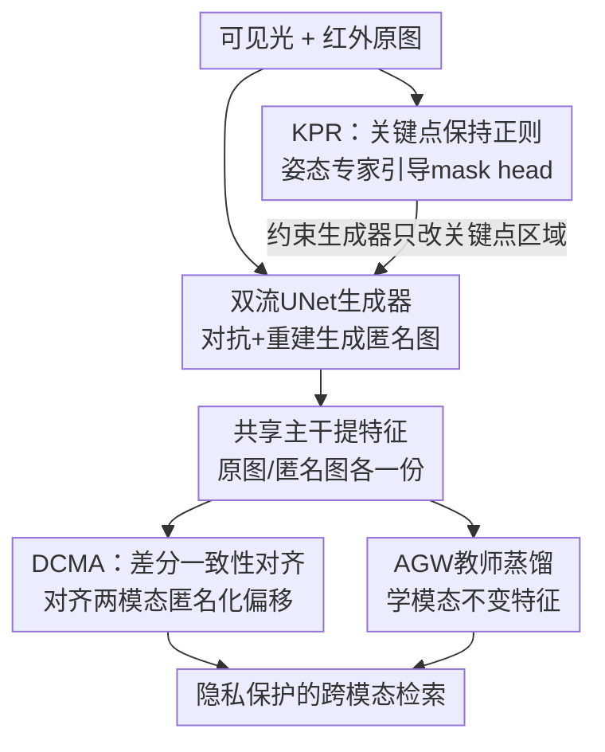

# Towards Cross-Modal Preservation, Consistency and Alignment for Privacy-Preserving Visible-Infrared Person Re-Identification

**会议**: CVPR 2026  
**论文**: [CVF Open Access](https://openaccess.thecvf.com/content/CVPR2026/html/Xie_Towards_Cross-Modal_Preservation_Consistency_and_Alignment_for_Privacy-Preserving_Visible-Infrared_Person_CVPR_2026_paper.html)  
**代码**: https://github.com/Dige945/PPA_CVPR26  
**领域**: 人体理解 / 行人重识别 / 隐私保护  
**关键词**: 隐私保护ReID, 可见光-红外, 跨模态对齐, 关键点正则, 匿名化偏移

## 一句话总结
本文提出全新任务 PP-VI-ReID（隐私保护的可见光-红外行人重识别），用一个 PPA 框架同时解决"匿名化破坏身份信息"和"匿名化扭曲在两模态间不一致"两大难题——KPR 模块借人体姿态先验做结构感知的精准匿名，DCMA 模块把匿名化扰动当作可学习的稳定偏移来对齐跨模态特征，在 SYSU-MM01 / RegDB 上大幅超越改造版 SecureReID，确立强基线。

## 研究背景与动机

**领域现状**：行人重识别（ReID）要在多个不重叠摄像头间检索同一个人，但监控图像携带大量敏感外貌/体型信息，引发严重隐私担忧。为此 SecureReID 等工作开创了隐私保护 ReID（PP-ReID）任务：用 GAN 等匿名化手段处理图像，再训练能同时在"原图域"和"匿名域"间检索的鲁棒模型。另一条线是可见光-红外重识别（VI-ReID），针对夜间/低光场景红外相机普及的现实，做 24 小时全天候跨模态检索。

**现有痛点**：这两条线一直是分开的。VI-ReID 只追检索精度、几乎不管隐私；而所有 PP-ReID 框架都被锁死在单模态可见光场景里。真实的 24 小时监控系统恰恰需要跨模态可见光-红外能力，把 PP-ReID 直接搬到 VI 场景却完全失效。

**核心矛盾**：把现有匿名化方法用到 VI 场景会暴露两个根本问题。其一，现有匿名化是"一刀切"（one-size-fits-all）的：它在遮盖外貌细节的同时，会破坏性地抹掉细粒度特征和结构信息（如身体轮廓），而这些恰是匹配身份所必需的，导致 ReID 精度崩盘。其二，匿名化对两个模态的破坏是**非对称**的——它会扰乱可见光图的颜色纹理、却模糊红外图的热轮廓。这种不一致叠加在本就存在的"模态鸿沟"上，形成本文命名的 **Mixed Gap（混合鸿沟）**。标准的共享空间对齐方法假设模态鸿沟是稳定的、要学一个不变表示，可一旦匿名化把特征空间扭曲成非对称的样子，它们就直接失灵。

**本文目标**：拆成两个子问题。I）如何从粗暴匿名化转向**精准、结构感知**的匿名化，保留匹配所需的关键结构与细粒度特征？II）如何弥合 Mixed Gap，即在稳定模态鸿沟之上又叠了非对称匿名化扭曲的情况下完成对齐？

**切入角度**：作者的两个关键观察是——（1）身份信息高度集中在人体关键点区域，姿态可以当作"哪里该保留、哪里该模糊"的先验；（2）匿名化造成的特征位移，与其当成随机噪声，不如建模成一个**可预测的、稳定的偏移量**。

**核心 idea**：用姿态引导让匿名化"精准开火"而非"无差别轰炸"（KPR），同时强制两个模态的"原图-匿名图特征差向量"保持一致，把不一致扭曲变成可学习的一致偏移（DCMA），从而在混合鸿沟下实现鲁棒对齐。

## 方法详解

### 整体框架

PPA（Precise Privacy-Preserving and Alignment Network）在一个标准基线之上插入两个模块。基线由一个基于 UNet 的**双流生成器**（分别处理可见光和红外，对抗式地把原图变成匿名图）和一个 ReID **主干**（双浅层特征提取器 + ResNet50 共享主干，配置同 AGW）组成；为缩小模态鸿沟，主干还从一个冻结的预训练跨模态教师（AGW）做知识蒸馏。在这之上：**KPR** 用一个冻结的姿态专家生成关键点引导图，监督一个可学习的 mask head，逼迫生成器只对身份敏感的关键点区域下手、保住其余结构；**DCMA** 则在特征层面，最小化"可见光原图-匿名图差向量"与"红外原图-匿名图差向量"之间的距离，把两个模态的匿名化位移拉平行、拉等长。两者一个管"图像侧精准匿名"、一个管"特征侧一致对齐"，协同产出既保护隐私又可判别的跨模态表示。

### 关键设计

**1. 双流对抗生成 + 蒸馏基线：先把"原图域↔匿名域"和"模态鸿沟"两件脏活铺好**

PP-VI-ReID 要同时检索原图和匿名图、还要跨模态，因此基线必须先把这两层域差打通。生成器对每个模态各训一个判别器：以传统匿名手段（马赛克 / 模糊 / 加噪）直接处理原图 $x^v$ 得到目标匿名图 $\hat{y}^v$，再用对抗损失逼生成器产出"看起来既真实又符合匿名风格"的 $y^v$，对抗目标为

$$\mathcal{L}_{adv} = \frac{1}{N}\sum_j \big(\log(1-D^{rgb}_Y(x^v_j, y^v_j)) + \log D^{rgb}_Y(x^v_j, \hat{y}^v_j)\big) + \text{(红外同理)}$$

再加 L1 重建损失 $\mathcal{L}_{rec}=\frac{1}{N}\sum_j\|\hat{y}^v_j-y^v_j\|_1+\text{(红外)}$ 做像素级约束，生成器总损失 $\mathcal{L}_{gen}=\mathcal{L}_{adv}+\lambda\mathcal{L}_{rec}$（$\lambda=100$ 抑制伪影）。主干这边，为压制模态鸿沟，从冻结的 AGW 教师蒸馏：学生模仿教师特征，$\mathcal{L}_{cross}=\sum_j\|f^{tv}_j-f^v_j\|_2^2+\sum_k\|f^{ti}_k-f^i_k\|_2^2$；再用对齐损失 $\mathcal{L}_{anno}=\frac{1}{B}\sum_j(\|f^v_j-f^{va}_j\|_2^2+\|f^i_j-f^{ia}_j\|_2^2)$ 把原图特征和它的匿名版拉近。主干总目标 $\mathcal{L}_{reid}=\mathcal{L}_{ce}+\mathcal{L}_{tri}+\beta\mathcal{L}_{cross}+\gamma\mathcal{L}_{anno}$。这套基线本身就是把单模态 PP-ReID 第一次扩到 VI 场景的工程地基，后两个模块都是在它的薄弱处补强。

**2. KPR 关键点保持正则：用姿态先验让匿名化"精准开火"而非无差别破坏**

针对子问题 I（粗暴匿名抹掉身份关键结构），KPR 的思路是给生成器一个"哪里不能乱动"的结构约束。它不把匿名化均匀铺满全图，而是充当一个结构正则器：先用冻结的 YOLOv8n-pose 专家在原图上检测最显著人物的关键点坐标 $K=\{k_1,\dots\}$，构造二值引导图——某像素到最近关键点距离在半径 $R$ 内则为 1，否则为 0：

$$C_{pose}(u,v)=\begin{cases}1 & \text{if } \min_j\sqrt{(u-u_j)^2+(v-v_j)^2}\le R\\ 0 & \text{otherwise}\end{cases}$$

这相当于取所有关键点圆形邻域的并集，作为稳定准确的监督信号。然后设计一个轻量卷积 mask head $m_\phi$（几层 $3\times3$ 卷积 + Sigmoid），直接从**匿名图** $Y$ 预测软掩码 $M_{pred}\in[0,1]^{H\times W}$；两个模态各用一个结构相同的 head。训练时用姿态引导损失逼预测掩码贴合引导图：$\mathcal{L}_{KPR}=\frac{1}{B}\sum_j(\|M^v_{pred,j}-C^v_{pose,j}\|_2^2+\|M^i_{pred,j}-C^i_{pose,j}\|_2^2)$。其妙处在于：mask head 必须从"已经被匿名化"的图里还能认出关键点区域，这条梯度反过来逼生成器在匿名化时**保住关键点处的结构完整**——于是匿名化在隐私保护与身份保留两个相互竞争的目标间被推向一个"智能"的平衡点，只抹身份线索、不毁姿态结构。一个值得注意的实证：把 RGB 上训练的姿态模型直接零样本用到红外，检测率 95.46%、平均置信度 0.763，几乎和 RGB（95.11% / 0.757）持平，说明热轮廓本身就提供了足够的结构线索，这是 KPR 能跨模态成立的前提。

**3. DCMA 差分一致性引导的模态对齐：把不一致的匿名扭曲建模成一致的可学习偏移**

针对子问题 II（混合鸿沟下对齐失效），DCMA 不去对齐最终特征本身，而是对齐"匿名化这件事造成的位移"。核心直觉是：匿名化在特征空间引起的偏移，对两个模态应该是相似的。为此先定义每个模态的**匿名化差向量**：$\Delta f^v=f^v-f^{va}$，$\Delta f^i=f^i-f^{ia}$，它们刻画了匿名化带来的语义位移。DCMA 强制这两个差向量平行且等长：

$$\mathcal{L}_{DCMA}=\frac{1}{B}\sum_j\|\Delta f^v_j-\Delta f^i_j\|_2^2=\frac{1}{B}\sum_j\|(f^v_j-f^{va}_j)-(f^i_j-f^{ia}_j)\|_2^2$$

全框架总目标 $\mathcal{L}_{PPA}=\mathcal{L}_b+\delta\mathcal{L}_{KPR}+\eta\mathcal{L}_{DCMA}$。为什么这有效？作者用三角不等式给了理论说明：匿名空间里的跨模态对齐误差被界为

$$\|f^{va}-f^{ia}\|=\|(f^v-f^i)-(\Delta f^v-\Delta f^i)\|\le\|f^v-f^i\|+\|\Delta f^v-\Delta f^i\|$$

也就是说，即便原图特征已经完美对齐（$f^v\approx f^i$），只要匿名位移不一致（$\Delta f^v\ne\Delta f^i$），就会引入一个不可消除的误差项。DCMA 恰好最小化的就是这个 $\|\Delta f^v-\Delta f^i\|$ 项。这与以往 PP-ReID 把扰动当变化噪声去对齐的做法形成对比——DCMA 第一次把"不一致扭曲"形式化成"可学习的一致偏移"，因而能在混合鸿沟下稳住对齐。

### 损失函数 / 训练策略

总损失 $\mathcal{L}_{PPA}=\mathcal{L}_b+\delta\mathcal{L}_{KPR}+\eta\mathcal{L}_{DCMA}$，其中基线 $\mathcal{L}_b=\mathcal{L}_{gen}+\mathcal{L}_{reid}$。超参：$\lambda=100$、$\beta=0.5$、$\gamma=1.0$、$\delta=1.0$、$\eta=0.1$、关键点半径 $R=5$。监督匿名图分别用马赛克（半径 24）、模糊（半径 12）、高斯噪声（方差 0.5）三种算法初始化。训练 120 epoch，每 3 epoch 评一次隐私质量与 ReID 性能；每个 batch 取 8 个身份、每模态每身份 4 个实例，输入 resize 到 $256\times128$；SGD（动量 0.9），生成器学习率前 10 epoch 从 $3.5\times10^{-5}$ 线性升到 $3.5\times10^{-4}$，再分段衰减到 $3.5\times10^{-6}$。

## 实验关键数据

数据集 SYSU-MM01（395 训练身份，2 近红外 + 4 可见光相机，分 all-search / indoor-search）和 RegDB（412 身份，可见光/热成像双相机，10 次随机划分取均值）。评测两面：匿名质量用 SSIM、PSNR（SSIM<0.5 且 PSNR<15 视为肉眼不可分阈值），ReID 性能用 Rank-k、mAP、mINP。对比对象是把单模态 SOTA 的 SecureReID 用 AGW + 单流对抗网络改造到跨模态后的版本。

### 主实验（ReID 性能，以马赛克初始化为例）

| 数据集 / 场景 | 检索设置 | 指标 | SecureReID | PPA(ours) |
|--------|------|------|----------|------|
| SYSU all-search | Raw→Raw | Rank1 | 35.6 | **60.7**（+25.1） |
| SYSU all-search | Anon→Anon | Rank1 | 32.2 | **46.2**（+14.0） |
| RegDB 红外→可见 | Raw→Raw | Rank1 | 45.9 | **80.5**（+34.6） |
| RegDB 红外→可见 | Anon→Anon | Rank1 | 28.3 | **39.7**（+11.4） |

PPA 在全部四种检索场景（Raw→Raw / Raw→Anon / Anon→Raw / Anon→Anon）下都超越 SecureReID。即便是最难的 Anon→Anon（查询和库都匿名），仍有两位数提升，说明它在模态鸿沟与匿名鸿沟双重存在时仍保有强检索力。

### 匿名质量（SSIM / PSNR，以模糊初始化 SYSU all-search 为例）

| 指标 | 模态 | SecureReID | PPA(ours) | 变化 |
|------|------|----------|------|------|
| SSIM | RGB | 0.16 | 0.11 | -0.05 |
| SSIM | IR | 0.33 | 0.25 | -0.08 |
| PSNR | RGB | 9.5 | 8.2 | -1.3 |
| PSNR | IR | 11.5 | 10.5 | -1.0 |

PPA 生成的匿名图 SSIM/PSNR 普遍更低（更难辨认），且全部落在 0.5 / 15 阈值之下——即匿名图在肉眼层面已无法分辨身份。关键是它在更强匿名的同时还把 ReID 精度大幅拉高，正面回应了"隐私-效用 trade-off"。

### 消融实验（SYSU-MM01，马赛克初始化，Anon→Raw all-search）

| 配置 | Rank1 | mAP | mINP | 说明 |
|------|---------|------|------|------|
| Baseline | 47.9 | 47.3 | 33.5 | 仅基线，匿名导致严重退化 |
| + KPR | 51.6 | 51.3 | 37.6 | 保结构，+3.7 |
| + DCMA | 49.9 | 48.9 | 35.0 | 一致偏移对齐，+2.0 |
| Full（KPR+DCMA） | **53.3** | 51.9 | 37.9 | 两者互补，比基线 +5.4 |

### 关键发现
- **KPR 单独贡献更大（+3.7 vs DCMA 的 +2.0）**，且它对"匿名查询"场景增益最明显——因为保住关键点结构直接挽回了被匿名抹掉的判别信息；两者叠加 +5.4，说明"图像侧保结构"与"特征侧保一致"是互补而非冗余。
- **DCMA 的理论必要性被三角不等式证明**：不一致匿名位移会带来一个不可约的对齐误差项，DCMA 正好消的就是它，这让"为什么要对齐差向量而非特征本身"有了形式化支撑。
- **超参 $\delta$（KPR 权重）在 1.0 时最优**，过大过小都掉点，说明匿名强度需要在隐私与效用间精细调。
- t-SNE 可视化显示 PPA 让"原始红外正样本"与"匿名可见光正样本"明显更收敛，直观印证它确实在缩小混合鸿沟（仍有少量散点，留有改进空间）。

## 亮点与洞察
- **把"不一致扭曲"重新框定为"可学习的一致偏移"**：这是全文最漂亮的视角转换——别人把匿名扰动当随机噪声去硬扛，本文发现只要让两模态的偏移平行等长，就能用一个三角不等式干净地证明对齐误差可降，思路可迁移到任何"双域+域内扰动"的对齐问题。
- **姿态先验当结构正则、且让 mask head 从匿名图反推关键点**：约束不是加在原图而是加在匿名图上，等于逼生成器"匿名后仍能被认出骨架"，这种用下游可检测性反向约束生成器的 trick 很巧。
- **零样本跨模态姿态检测的实证**（RGB 训练的姿态模型直接用到红外仍有 95%+ 检测率）顺手论证了方法的跨模态可行性，是个低成本但有说服力的旁证。
- 开创性地把 PP-ReID 和 VI-ReID 两条独立研究线缝合成 PP-VI-ReID 新任务，并给出强基线，填补了 24 小时隐私监控的空白。

## 局限与展望
- **只对比了 SecureReID 一个（且是改造版）基线**：作为新任务的首作可以理解，但缺少与多种单模态 PP-ReID / 多种 VI-ReID 方法的横向对比，"强基线"的说服力还需更多对手验证。
- **依赖外部姿态专家**：KPR 的效果绑定 YOLOv8n-pose 的检测质量，遮挡严重、多人重叠或极端低分辨率红外下姿态失准时，引导图会污染监督信号——论文未系统分析这类 corner case。
- **DCMA 假设两模态匿名位移"应当相似"**：若某些身份在两模态的可匿名信息天然不对称（如红外几乎无颜色纹理可抹），强行拉平偏移可能损失模态特异信息；t-SNE 里的散点或与此有关。
- **匿名质量与检索精度仍是手调权衡**（$\delta$ 敏感），缺少自适应平衡机制；可探索按区域/按身份动态调节匿名强度。

## 相关工作与启发
- **vs SecureReID（单模态 PP-ReID 开山作）**：SecureReID 用 GAN 匿名 + 跨域检索，但只在单模态可见光下成立，且匿名是"一刀切"。本文把它扩到跨模态、并用 KPR 做精准匿名 + DCMA 做混合鸿沟对齐，在改造版上全面超越——区别在于本文同时处理了"结构保留"和"跨模态一致性"两个 SecureReID 未触及的维度。
- **vs PixelFade / AVIH / PIS 等单模态匿名方法**：它们靠噪声引导 / 迭代去关联 / VAE 插值在单模态保效用，但跨模态场景精度急剧下降；本文指出根因是它们无法处理非对称匿名扭曲，并用差分一致性补上这块。
- **vs CAJ / AGW 等 VI-ReID 方法**：传统 VI-ReID（如 CAJ 的通道交换、AGW 的注意力 + 加权三元组）只学稳定模态鸿沟下的不变表示，一旦匿名化把特征空间扭曲成非对称就崩溃。本文沿用 AGW 当基线/教师，但额外把"匿名扰动"纳入对齐目标，是对 VI-ReID 在隐私约束下的扩展。

## 评分
- 新颖性: ⭐⭐⭐⭐⭐ 首次提出 PP-VI-ReID 任务，并把不一致匿名扭曲形式化为可学习一致偏移，视角新且有理论支撑。
- 实验充分度: ⭐⭐⭐⭐ 两数据集、三种匿名初始化、四种检索场景 + 消融 + 可视化较完整，但横向基线偏单一。
- 写作质量: ⭐⭐⭐⭐ 动机—方法—理论闭环清晰，图文对应，公式与符号规范；个别记号略密。
- 价值: ⭐⭐⭐⭐⭐ 切中 24 小时隐私监控的真实需求，确立强基线 + 开源代码，对隐私保护跨模态 ReID 有奠基意义。

<!-- RELATED:START -->

## 相关论文

- [\[CVPR 2026\] MFEN: Multi-Frequency Expert Network for Visible-Infrared Person Re-ID](mfen_multi-frequency_expert_network_for_visible-infrared_person_re-id.md)
- [\[CVPR 2026\] Spatial-Frequency Collaborative Learning for Occluded Visible-Infrared Person Re-Identification](spatial-frequency_collaborative_learning_for_occluded_visible-infrared_person_re.md)
- [\[CVPR 2026\] BIT: Matching-based Bi-directional Interaction Transformation Network for Visible-Infrared Person Re-Identification](bit_matching-based_bi-directional_interaction_transformation_network_for_visible.md)
- [\[CVPR 2026\] View-Aware Semantic Alignment for Aerial-Ground Person Re-Identification](view-aware_semantic_alignment_for_aerial-ground_person_re-identification.md)
- [\[CVPR 2026\] Vision-Language Attribute Disentanglement and Reinforcement for Lifelong Person Re-Identification](vision-language_attribute_disentanglement_and_reinforcement_for_lifelong_person_.md)

<!-- RELATED:END -->
