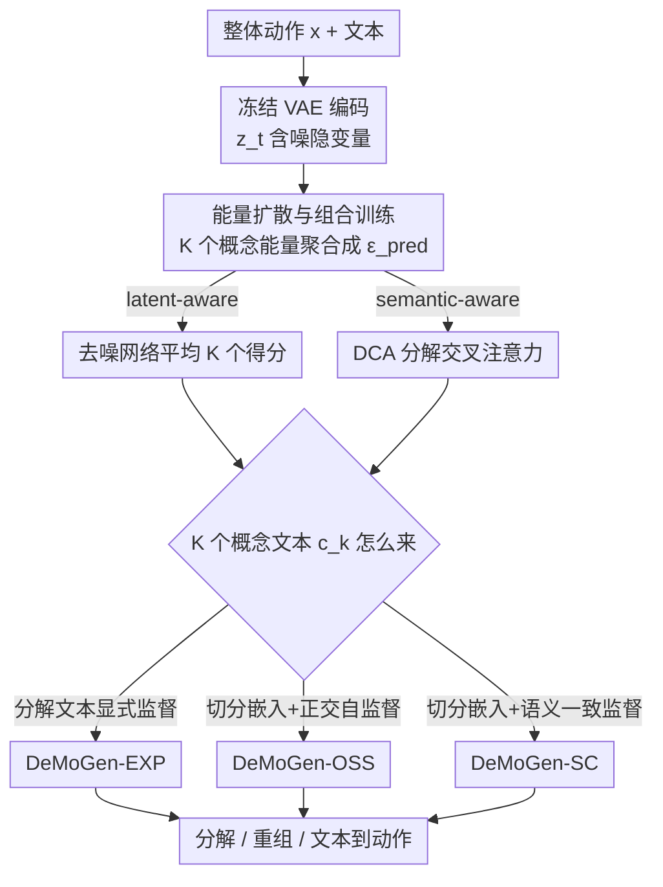

# Towards Decompositional Human Motion Generation with Energy-Based Diffusion Models

**会议**: CVPR 2026  
**论文**: [CVF Open Access](https://openaccess.thecvf.com/content/CVPR2026/html/Zhang_Towards_Decompositional_Human_Motion_Generation_with_Energy-Based_Diffusion_Models_CVPR_2026_paper.html)  
**项目页**: https://jiro-zhang.github.io/DeMoGen/  
**领域**: 人体动作生成 / 扩散模型  
**关键词**: 文本到动作、能量扩散、动作分解、概念重组、组合式训练

## 一句话总结
DeMoGen 把"文本生成人体动作"反过来做——用能量扩散模型在没有分解级真值的情况下，把一段整体动作拆成若干语义可解释的动作概念（如"走 Z 字形"+"挥左手"），再让这些概念自由重组生成训练集里没见过的新动作，同时在 HumanML3D 与 MTT 的文本到动作、组合、多概念三类任务上都拿到提升。

## 研究背景与动机
**领域现状**：文本到动作（text-to-motion）这几年靠大规模动作数据集和扩散模型进步很快，主流做法是学一个从单条文本到整段动作的整体映射（MDM、MLD、MotionDiffuse、MoMask、SALAD 等），追求生成动作与文本对齐、平滑、物理合理。也有一支做组合式生成（compositional），通过空间编辑、时间拼接，或像 EnergyMoGen 那样用能量聚合，把多个动作概念拼成长动作。

**现有痛点**：不管是整体映射还是组合，这些方法都把动作当成一段**整体序列**来对待，没有去捕捉动作内部"由多个基元（primitive）组合而成"的结构。结果是模型学不会像人那样把"曲线行走+双臂前举"理解成两个独立可复用的概念，也就难以把已知概念重新拼出没练过的新动作。

**核心矛盾**：人天生会做**逆向分解**——看到"边走 Z 字边挥左手"就自动拆成两个动作概念，从而靠重组少量基元做出罕见动作。但现有生成模型只会**正向建模**（文本→动作），缺一个"把整体动作拆回概念"的逆向能力；而真正的拦路虎是：**没有逐概念的分解级动作真值**，你没法直接监督模型"这一段对应走路、那一段对应挥手"。

**本文目标**：让生成模型获得类人的分解理解能力——在只有整体动作真值的前提下，自动发现整体动作背后的若干动作概念，并支持灵活重组。

**切入角度**：作者抓住扩散模型去噪网络 $\epsilon_\theta(x,t)$ 与能量模型（EBM）之间的内在联系——去噪网络可解释为得分函数 $\nabla_x \log p(x)$，进而对应能量函数 $\epsilon_\theta(x,t)\propto\nabla_x E_\theta(x)$，其中 $p(x)\sim e^{-E(x)}$。既然单个能量函数能表示一个分布，那一段整体动作就可以用**一组能量函数**来表示，每个能量函数负责一个动作概念。

**核心 idea**：用能量扩散直接建模"多个动作概念的**组合能量分布**"，而不是学单条文本到单段动作的一一映射；这样能量聚合天然强制了概念级因子分解（concept-level factorization），从而在没有分解真值的情况下让模型自己学会拆分动作。

## 方法详解

### 整体框架
DeMoGen 是一个**组合式训练范式**（compositional training paradigm），骨架是一个 skeleton-aware 的隐空间扩散模型（沿用 SALAD 的 VAE）。给定一段动作 $x\in\mathbb{R}^{L\times d_m}$（$L$ 帧、每帧 $d_m$ 维），先用冻结的动作编码器 $E$ 把它编码成隐表示 $z$，并能用解码器 $D$ 解回动作空间。

关键转法是：在噪声步 $t$，含噪隐变量 $z_t$ 不再只配**一条**文本嵌入，而是关联一组文本嵌入 $C=\{c_k\}_{k=1}^{K}$，每个 $c_k$ 对应一个目标动作概念（论文设 $K=2$）。模型把这 $K$ 个概念各自的能量（去噪得分）**聚合**成一个预测噪声 $\epsilon_{\text{pred}}$，再用标准的 MSE 去噪目标训练它去引导去噪过程。因为损失只盯整体动作（只有 $\epsilon$ 这一份真值），而预测是 $K$ 个概念能量的平均，模型为了把整体重建好，就被迫把整段动作"分摊"到 $K$ 个概念能量上——这就是它**不需要分解真值**却能学会分解的根源。

能量聚合有两种载体：**latent-aware** 用去噪网络本身，对 $K$ 个概念分别跑 $\epsilon_\theta(z_t,c_k,t)$ 再平均；**semantic-aware** 把交叉注意力当能量函数，提出 Decompositional Cross-Attention（DCA）把注意力拆成 $K$ 条并行分支再聚合。训练好后，就能从这个分解空间里直接抽出想要的概念、对它们做操作，实现动作分解与概念重组。三个变体（EXP / OSS / SC）则规定了"$\{c_k\}$ 这组概念文本从哪来、怎么学"。

### 关键设计

**1. 能量扩散的组合式训练：用一组能量函数重建整段动作**

这一设计直接对准"没有分解真值就没法监督分解"这个根本痛点。作者不去硬造逐概念标签，而是利用扩散去噪网络等价于能量梯度这一事实，把整段动作的去噪得分写成 $K$ 个概念得分的平均。latent-aware 的目标是

$$L_{\text{MSE}}=\Big\|\epsilon-\frac{1}{K}\sum_{k=1}^{K}\epsilon_\theta(z_t,c_k,t)\Big\|^2,$$

即用 $K$ 个概念条件下的去噪结果平均去逼近同一个噪声 $\epsilon$。由于监督信号只有整体动作的 $\epsilon$，而预测是多概念能量的组合，优化过程会自动把整段动作的语义"因子化"到各个概念能量里——概念之间的分工是被组合重建目标**隐式逼出来**的，而非人工标注。这与 EnergyMoGen 等"先有概念、再聚合成长动作"的正向组合相反：DeMoGen 是在训练里就强制了分解结构，因此推理时能直接抽概念、做重组。

**2. Decompositional Cross-Attention（DCA）：让交叉注意力按概念分支聚合能量**

latent-aware 把概念平均放在去噪网络外层，而 semantic-aware 这条路要把"能量"落到交叉注意力上。痛点是标准交叉注意力把所有文本 token 一锅炖，无法对应到独立概念。DCA 把注意力计算拆成 $K$ 条并行分支，每条用不同的 key–value（对应不同概念文本）做一次标准交叉注意力，再求平均：

$$\text{DCA}(z_t,C)=\frac{1}{K}\sum_{k=1}^{K}\text{CA}(z_t,c_k),$$

整体仍用 $L_{\text{MSE}}=\|\epsilon-\epsilon_\theta(z_t,C,t)\|^2$ 优化。这样能量聚合发生在语义层（文本-动作的关联模式，灵感来自 Hopfield 网络的联想记忆），好处是能更细地把不同概念的语义注入去噪，实验里 semantic-aware 在文本-动作一致性（R-Precision）上往往更强，而 latent-aware 因为在隐空间聚合得到更平滑的动作（FID 更低）。

**3. 三种监督变体（EXP / OSS / SC）：从显式分解文本到全自监督的谱系**

这三个变体回答同一个问题——式中那组概念文本 $\{c_k\}$ 到底从哪来，体现了从"给现成分解文本"到"完全不给"的不同监督强度。

- **DeMoGen-EXP（显式监督）**：直接用 DeCompML 里预先分解好的文本 $C=C^P$ 训练，每个概念配一条对应描述，语义边界最清晰，分解最精确多样、组合生成最强。但只用分解文本会让文本-动作映射变偏，于是加了 **text mixing 策略**：每个 batch 里有 $\tau\times100\%$（$\tau=0.7$）的样本仍用原始整体文本训练，把整体映射拉回来。推理做普通文本到动作时，把单条文本复制成所需的分解条件即可。
- **DeMoGen-OSS（正交自监督）**：完全不依赖预定义分解文本。把原始文本嵌入 $c\in\mathbb{R}^{L_c\times d_c}$ 沿维度轴切成 $K$ 段子嵌入，过一个全连接层得到 $C$，再施加正交化损失逼它们彼此解耦：

$$L_{\text{Ortho}}=\mathbb{E}_{l\sim L_c}\Big[\tfrac{1}{K^2}\big\|\hat Z_l\hat Z_l^{\top}-I_K\big\|_F^2\Big],$$

总目标 $L=L_{\text{MSE}}+\alpha_o L_{\text{Ortho}}$。无需任何分解标注就能做"无引导"的概念发现，并且实测能提升整体动作的多样性。
- **DeMoGen-SC（语义一致监督）**：切分方式同 OSS，但用两层 transformer 得到 $C$，再用语义一致损失 $L_{\text{SC}}=L_1^{\text{smooth}}(C^P,C)$ 把切分嵌入对齐到 DeCompML 的分解嵌入，同时也加 $L_{\text{Ortho}}$，总目标 $L=L_{\text{MSE}}+\alpha_{sc}L_{\text{SC}}+\alpha_o L_{\text{Ortho}}$。推理时同样不需要预定义分解文本。

三者各擅其长：EXP 分解最准、组合最强；OSS 多样性最好；SC 在两者之间。它们共享同一套能量组合训练范式，只是概念文本的来源不同。

**4. DeCompML 数据集：给整体描述配上分解文本**

EXP 和 SC 的显式/语义监督需要"分解后的文本"，但 HumanML3D 只有整体描述。作者用 GPT-4.1 配上精心设计的指令，把 HumanML3D 的每条整体描述自动拆成两句、分别刻画整体动作里的不同概念（例如"someone runs forward, turns around, and then walks backward"拆成"someone runs forward and turns around"与"someone walks backward"）。考虑到 HumanML3D 已有镜像增强，DeCompML 最终含 87,384 个分解文本组（每组两句，共 174,768 句）。它既给组合训练提供监督，本身也能当**动作组合的新 benchmark**；此外作者还用学好的 EXP 在训练集采样分解动作、挑出 15,000 段高质量动作-文本对，回头当扩展数据，发现联合训练能反哺文本到动作生成。

### 损失函数 / 训练策略
共用去噪目标 $L_{\text{MSE}}$（latent-aware 用 $K$ 个得分平均，semantic-aware 用 DCA）。OSS 额外加 $L_{\text{Ortho}}$、SC 额外加 $L_{\text{SC}}+L_{\text{Ortho}}$。VAE 用 SALAD 预训练权重并冻结；AdamW、batch 64、500 epoch；学习率 2e-4，50K 迭代后衰减到 2e-5；$K=2$；text mixing $\tau=0.7$、$\alpha_{sc}=1.0$、$\alpha_o$ 在 latent/semantic 下分别取 2.0/1.0；文本用 word-level token，$L_c=77$。组合与多概念生成直接用 HumanML3D 上预训练的模型迁移到 MTT 和 DeCompML 评测。

## 实验关键数据

### 主实验
HumanML3D 文本到动作（节选，箭头表示越大/越小/越接近真值越好）：

| 方法 | R-Prec Top-1 ↑ | R-Prec Top-3 ↑ | FID ↓ | MM-Dist ↓ |
|------|------|------|------|------|
| Real motion | 0.511 | 0.797 | 0.002 | 2.974 |
| EnergyMoGen | 0.523 | 0.815 | 0.188 | 2.915 |
| SALAD | 0.581 | 0.857 | 0.076 | 2.649 |
| DeMoGen-OSS (latent) | **0.588** | **0.861** | 0.092 | **2.625** |
| DeMoGen-EXP (semantic) | 0.586 | 0.863 | 0.116 | 2.623 |

DeMoGen-OSS 在文本-动作一致性（R-Precision、MM-Dist）上超过 SALAD，同时 FID 与之相当——说明强化分解理解确实反过来帮到了普通的文本到动作生成。

MTT 多概念 / 组合生成（latent-aware，† 标注）：

| 方法 | R@1 ↑ | R@3 ↑ | TMR-M2T ↑ | FID ↓ |
|------|------|------|------|------|
| EMG | 12.7 | 25.4 | 0.570 | 0.592 |
| EMG+AGD | 14.0 | 26.3 | 0.570 | 0.587 |
| DeMoGen-OSS† (多概念) | 14.9 | 29.5 | 0.584 | 0.580 |
| EMG+SEF (组合) | 15.9 | 28.0 | 0.591 | 0.604 |
| DeMoGen-EXP† (组合) | **16.2** | **31.9** | **0.597** | 0.621 |

多概念任务用 OSS/SC，组合任务用 EXP，两条线都超过 EnergyMoGen 的对应配置，R@3 提升尤为明显。

### 消融实验
DeCompML 上的动作组合评测，以及把 DeCompML 当扩展数据回灌文本到动作：

| 配置 | Top-1 ↑ | FID ↓ | 说明 |
|------|---------|------|------|
| EnergyMoGen (组合) | 0.326 | 2.502 | DeCompML 上基线 |
| SALAD (组合) | 0.342 | 1.267 | 加了 EMG 组合策略 |
| DeMoGen latent | 0.559 | 0.089 | 本文，组合质量大幅领先 |
| DeMoGen semantic | 0.567 | 0.102 | 本文 |
| SALAD | 0.581 | 0.076 | 原始 HumanML3D |
| SALAD* +DeCompML | 0.580 | **0.060** | 微调，FID 降约 21% |

### 关键发现
- DeCompML 上做动作组合时，DeMoGen 的 FID（0.089 / 0.102）比 EnergyMoGen（2.502）、加了组合策略的 SALAD（1.267）低一个量级，Top-1 也从 ~0.33 跳到 ~0.56——说明"训练时就强制分解"远比"推理时临时聚合预训练模型"更能生成高质量的可组合动作。
- 把 DeMoGen 产出的分解动作当扩展数据微调 SALAD，FID 降约 21% 而 Top-1、MM-Dist 基本不变；微调 EnergyMoGen 则所有指标都涨——分解出的动作-文本对是有效的数据增广。
- 对 HumanML3D 里很多本就简单、不可再分的动作，OSS 与 SC 会生成同一概念的不同变体（如逆时针画圆的大小、位移不同），多样性更好，间接验证了 $L_{\text{SC}}$ 与 $L_{\text{Ortho}}$ 的作用。

## 亮点与洞察
- **把生成问题反过来当分解问题**：大多数工作做"文本→动作"的正向映射，DeMoGen 关心"整段动作怎么拆回概念"，并证明逆向能力反哺正向生成。这种"逆问题驱动表示学习"的思路可迁移到图像/视频的概念分解。
- **无分解真值仍能学会分解**：靠"$K$ 个概念能量平均去逼近整体噪声"的组合重建目标，把概念分工隐式逼出来，绕开了最难拿的逐概念标注——这是整篇最巧的地方。
- **一套范式覆盖四类任务**：同一模型同时支持文本到动作、多概念、组合、分解+重组，且能与 MLD/MotionDiffuse 等主流扩散方法即插即用，工程上很省。
- **监督谱系清晰**：EXP/OSS/SC 把"要不要给分解文本"做成一条从全监督到全自监督的谱，读者能按数据条件挑变体，设计很有教学价值。

## 局限与展望
- **$K=2$ 偏小**：实现里固定每段动作只拆成两个概念，对"走+转+蹲+挥手"这类真正多基元的复杂动作可能不够；更大 $K$ 的扩展性与稳定性留在补充材料/未来工作。
- **依赖 LLM 造标注**：DeCompML 的分解文本由 GPT-4.1 自动切分，分解质量受 prompt 与 LLM 影响，可能把语义边界切歪，且基于 HumanML3D，领域偏窄（日常动作）。
- **OSS/SC 的概念是"无名"的**：无引导分解出的概念需要人工补字幕才看得懂，缺乏可控的概念命名/检索机制，下游精确编辑仍不便。
- **评测仍用代理指标**：R-Precision/FID/TMR 都依赖预训练评测模型，"分解是否语义正确"主要靠定性图示，缺乏对分解质量的直接量化。

## 相关工作与启发
- **vs EnergyMoGen**：两者都把去噪网络与交叉注意力解释为 latent-/semantic-aware 能量模型。EnergyMoGen 是**正向组合**——把预训练模型的若干能量分布在推理时聚合成长/复杂动作，还引入否定等逻辑算子；DeMoGen 则在**训练阶段**就用组合重建逼出分解结构，主打逆向分解+重组，且不需要分解真值，组合质量（DeCompML 上 FID）大幅领先。
- **vs SALAD / MLD / MotionDiffuse（整体映射扩散）**：这些方法学单文本到整段动作的整体映射，DeMoGen 复用其骨架但把条件换成一组概念能量，因此在它们之上既能保持文本到动作性能、又额外获得分解与组合能力，并能即插即用集成进去。
- **vs 图像域概念分解（Liu et al.、Su et al.）**：图像域已有用 EBM/预训练扩散发现视觉概念、做全局/局部因子分解的工作；DeMoGen 把这套"能量驱动的概念分解"思路引入到时空耦合的人体动作上，并配套构建了 DeCompML 数据集。

## 评分
- 新颖性: ⭐⭐⭐⭐⭐ 把文本到动作反转成"逆向分解"，并用组合能量重建在无分解真值下学会拆分，视角和机制都新。
- 实验充分度: ⭐⭐⭐⭐ 覆盖文本到动作/组合/多概念/分解四类任务、三变体两设置，但 $K$、超参的系统消融多在补充材料，正文偏定性。
- 写作质量: ⭐⭐⭐⭐ 能量-扩散-EBM 的桥接讲得清楚，三变体谱系条理分明；个别符号（DCA、正交损失）需对照公式才好懂。
- 价值: ⭐⭐⭐⭐ 一套范式打通四类任务且可即插即用，外加 DeCompML 数据集，对组合式动作生成社区有实用价值。

<!-- RELATED:START -->

## 相关论文

- [\[CVPR 2026\] Next-Scale Autoregressive Models for Text-to-Motion Generation](next-scale_autoregressive_models_for_text-to-motion_generation.md)
- [\[CVPR 2026\] Towards Highly-Constrained Human Motion Generation with Retrieval-Guided Diffusion Noise Optimization](towards_highly-constrained_human_motion_generation_with_retrieval-guided_diffusi.md)
- [\[CVPR 2026\] FloodDiffusion: Tailored Diffusion Forcing for Streaming Motion Generation](flooddiffusion_tailored_diffusion_forcing_for_streaming_motion_generation.md)
- [\[CVPR 2026\] Ultra Diffusion Poser: Diffusion-Based Human Motion Tracking From Sparse Inertial Sensors and Ranging-Based Between-Sensor Distances](ultra_diffusion_poser_diffusion-based_human_motion_tracking_from_sparse_inertial.md)
- [\[CVPR 2026\] LLaMo: Scaling Pretrained Language Models for Unified Motion Understanding and Generation with Continuous Autoregressive Tokens](llamo_scaling_pretrained_language_models_for_unified_motion_understanding_and_ge.md)

<!-- RELATED:END -->
