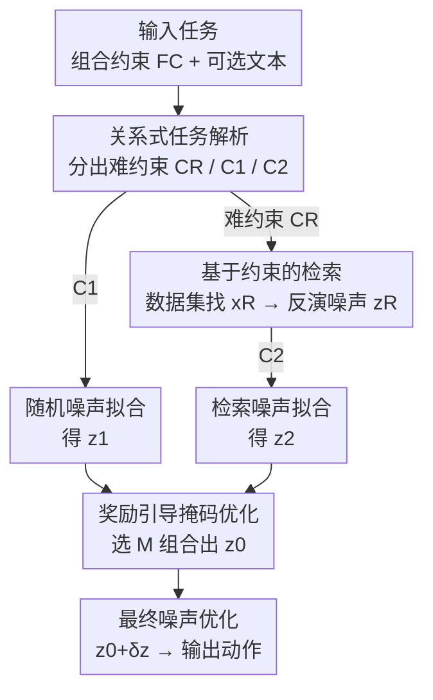

# Towards Highly-Constrained Human Motion Generation with Retrieval-Guided Diffusion Noise Optimization

**会议**: CVPR 2026  
**论文**: [CVF Open Access](https://openaccess.thecvf.com/content/CVPR2026/html/Liu_Towards_Highly-Constrained_Human_Motion_Generation_with_Retrieval-Guided_Diffusion_Noise_Optimization_CVPR_2026_paper.html)  
**代码**: 项目页 https://hanchaoliu.github.io/RetrievalGuidedDNO/  
**领域**: 人体动作生成 / 扩散模型  
**关键词**: 人体动作生成, 扩散噪声优化, 检索增强, 约束生成, 免训练

## 一句话总结
针对"穿过 0.4 米窄缝""走 4 米恰好 6 步"这类极难时空/数值约束的动作生成任务，本文在免训练的扩散噪声优化（DNO）框架上加了一条检索通道——先用关系式任务解析挑出最难的约束，再从动作数据集里检索能满足它的参考动作并反演成参考噪声，最后用奖励引导的掩码把随机噪声和检索噪声拼起来当作更好的初始化，使约束误差相比原生 DNO 大幅下降。

## 研究背景与动机
**领域现状**：让人体动作生成服从自定义的零样本目标函数（zero-shot goal function），是可控角色动画、虚拟智能体行为合成的核心能力。当前主流思路是"约束函数 + 免训练扩散噪声优化"：ProgMoGen 提出可编程的动作生成框架，把任意任务写成可微的组合约束函数 $F_C$；DNO 则给噪声优化加了梯度归一化和学习率衰减。两者都冻结一个预训练的动作扩散模型 $G$，只在噪声 $z$ 上做梯度下降，求解 $\min_z F(G(z, C))$，从而处理大量没见过的空间/时间约束。

**现有痛点**：作者观察到，一旦约束变得**特别难**，这些方法就崩了。比如要求角色精确地走某个步数再走到某个距离、或者从一条 0.4 米的窄缝里侧身钻过去——原生 DNO 给出的动作要么约束误差巨大，要么出现场景穿模、空中踏步等物理瑕疵（论文 Fig. 1）。这类"高度受约束"任务有两个共性：(1) 困难的时空约束（如严苛的空间障碍）；(2) 基于数值控制的行为约束（如指定步数）。现实环境恰恰充满这种硬性要求，但此前几乎没有工作专门解决。

**核心矛盾**：随机噪声只能捕捉一般性约束和文本语义，**它本身不携带"如何侧身走""如何控制步数"这类具体技能知识**。难约束需要超出随机噪声表达能力的特定先验，而单纯在随机噪声上做更多优化步数也补不上这个缺口。

**本文目标**：在不重训生成器的前提下，把"缺失的技能先验"注入到优化的**起点**——也就是扩散过程的初始噪声里。

**切入角度**：作者持有一个关键洞察——**早期的扩散噪声决定了生成结果的质量**，初始噪声的选择对最终动作的结构有决定性影响。既然随机噪声满足不了难约束，那就把现有大规模动作数据集当成知识库，从中检索一个"可能满足难约束"的参考动作（如侧身走、特定步数走），把初始随机噪声朝这个参考噪声引导过去。

**核心 idea**：用"检索到的参考动作反演出的噪声"去替换/混合随机噪声的初始化，让难约束所需的动作技能在优化一开始就被注入，从而求解 DNO 单独搞不定的高约束任务。

## 方法详解

### 整体框架
给定一个用组合约束函数 $F_C$（定义在约束集 $C$ 上，可由 ProgMoGen 的动作编程得到）描述的生成任务，目标是产出动作序列 $x \in \mathbb{R}^{T \times d}$，求解 $\min_z \sum_i F_{C_i}(G(z, C_0))$，其中 $G$ 是冻结的预训练生成器、$C_0$ 是可选文本条件。整条 RG-DNO 管线分四步走：**先解析、再检索、再拼噪声、最后精修**。

1. **关系式任务解析**：把完整约束集 $C$ 拆成三组——交给检索处理的难约束 $C_R$、用随机噪声拟合的 $C_1$、用检索噪声拟合的 $C_2$；
2. **基于约束的检索**：在动作数据集 $D$ 里找能最小化 $C_R$ 误差的参考动作 $x_R$，并把它反演成参考噪声 $z_R$；
3. **掩码噪声优化**：分别从随机噪声和 $z_R$ 出发优化出 $z_1$、$z_2$，再用一个二值掩码 $M$ 把两者线性组合成改进初始化 $z_0$；
4. **最终噪声优化**：以 $z_0$ 为起点再跑一轮标准 DNO 得到最终动作。

值得注意的是，第一步的关系式解析既可由用户手动指定（精确控制），也可交给大语言模型（DeepSeek R1）自动推理"该检索什么"，从而在免训练框架里提升了智能体的自主性。

### 关键设计

**1. 关系式任务解析：用分而治之挑出"该交给检索的那条难约束"**

直接拿整个任务去检索，效果很差——数据集里很难有一个样本同时满足所有约束，强行检索会把简单约束也带歪。本文先回答"哪些约束该检索、哪些该留给噪声优化"这个问题。形式上要找到检索集 $C_R$，并把剩余约束分成 $C_1$ 和 $C_2$，满足 $C = C_1 \oplus C_2,\ C_R \subseteq C_2$（$\oplus$ 是并集，$C_1$ 可额外含文本语义 $C_0$）。直觉是：最难的约束交给检索，而 $C_1$、$C_2$ 各自要尽量生成"视觉上合理"的动作，方便后面组合。

作者据此提出四条推理规则：Rule 1，$C_1$ 与 $C_2$ 都鼓励尽量满足各自约束以降低后续合并难度；Rule 2，识别出的难约束 $c_D$ 要连同与它紧密关联的约束一起放进 $C_R$；Rule 3，与 $C_R$ 冲突的约束要从 $C_2$ 里移除（例如"中间帧头部很低、末帧头部很高"这种相互矛盾的要求）；Rule 4，若检索不够自信，难约束也可放进 $C_1$ 用随机噪声一并处理。落地成一个贪心算法（Algorithm 1）：输入约束集 $C$ 和用户指定的检索置信度 $s \in \{0,1\}$，初始化 $C_1 = C_2 = C$、$C_R = \varnothing$，找出最难约束 $c_D$ 并判断它与其他约束的关系 $e_k \in \{\text{connected}, \text{conflict}, \text{none}\}$，把 $c_D$ 及其 connected 约束加进 $C_R$、把 conflict 约束从 $C_2$ 移除，若 $s=1$ 还从 $C_1$ 移除 $c_D$。允许 $C_1 = C_2 = C$ 的退化情形（同时从随机/检索两个视角解全问题）。这一步把 ProgMoGen 的约束编程进一步推进到"研究约束之间的关系"，难度排序和关系既可人工给，也可让 LLM 自动推断。

**2. 基于约束的检索：把"参考动作"反演成可引导的扩散噪声**

挑出 $C_R$ 后，要在数据集 $D$ 里找一个能满足它的动作。这被形式化为检索问题：找误差最小的样本 $x = \arg\min_{x \in D} F_{C_R}(x)$。但原始样本未必摆放在正确位置，作者允许样本在水平面做刚性变换来贴合约束：$x, H = \arg\min_{x, H} F_{C_R}(Hx)$，$H$ 是水平变换。检索还配了两道过滤：**语义一致性检查**（对比目标文本与样本标注，剔除语义差异大的动作）和**时间重采样**（用线性插值把检索样本的时长对齐到目标长度）。最后保留约束误差低于阈值的 top-$k$ 集合 $x_R$，选一个出来。

关键的一步是把这个参考动作**反演回扩散噪声**：$z_R = G^{-1}(Hx_R, C_0)$。这样 $z_R$ 就不再是一段固定动作，而是一份"携带难约束所需技能（如侧身走）的噪声引导信号"，可以无缝接入后续的噪声优化——这正是本文区别于普通检索增强生成的地方：检索的产物最终以**噪声初始化**的形式注入，而非直接拼接动作。

**3. 掩码噪声优化：用一个二值掩码把随机噪声与检索噪声"取长补短"地拼起来**

有了 $z_R$，要把它和随机噪声融合。从随机噪声 $z_0 \sim \mathcal{N}(0, I)$ 出发优化 $z_1$ 满足 $C_1$：$\min_{z_1} F_{C_1}(G(z_1, z_0))$；从检索噪声 $z_R$ 出发优化 $z_2$ 满足 $C_2$：$\min_{z_2} F_{C_2}(G(z_2, z_R))$。两者用一个与噪声同形的掩码 $M \in \mathbb{R}^{T \times d}$ 线性组合：

$$z_0 = M z_1 + (1 - M) z_2$$

掩码沿时间维（temporal）或姿态特征维（spatial）切分，使组合后的 $z_0$ 在某些时间段/某些身体部位用随机噪声、其余用检索噪声。组合好的 $z_0$ 再作为改进初始化跑最后一轮标准 DNO：$\min_{\delta z} F_C(G(z_0 + \delta z))$，最终动作 $x = G(z_0 + \delta z)$。这种"分段拼接 + 再精修"避免了单用检索噪声会出现的局部不自然（消融里检索噪声 only 的 local foot skate 高达 0.180），又保留了随机噪声的整体协调性。

**4. 奖励引导的掩码选择：用启发式候选 + 运动质量奖励避开过平滑/穿帮的组合**

如果直接在连续空间优化 $M$（Eq. 11），搜索空间极大且会破坏 $z_1$、$z_2$ 各自编码的动作先验。作者改用启发式掩码选择：构造一组**下采样的二值候选掩码** $\mathcal{M} = \{M \mid M_{ij} \in \{0,1\}\}$，从中选最优——时间掩码把序列切成 $N_T$ 段、每段整体置 0 或 1，得 $2^{N_T}$ 个候选（实践 $N_T=8$）；空间掩码把姿态特征切成 $N_S$ 部分（根轨迹/左右臂手/左右腿/头/两段脊柱，$N_S=8$）。最优掩码由 $M = \arg\min_{M \in \mathcal{M}} F_C(G(z_0)) + R(G(z_0))$ 选出，对时间掩码还可用 sigmoid 软混合细化边界。

其中奖励函数 $R$ 用来过滤会造成帧间/部位间剧烈不一致的组合，是一组简单运动检查代价的加权和：

$$R(G(z_0), z_0) = \lambda_1 L_\text{jitter} + \lambda_2 L_\text{foot skate} + \lambda_3 L_\text{decorr} + \lambda_4 L_\text{semantic}$$

分别惩罚关节最大抖动、脚部滑步、噪声去相关、以及文本语义对齐度，默认 $\lambda_k = 1.0$。由于每个候选的约束误差和奖励都易算且可并行，掩码选择很快。这个"先粗选离散掩码、再交给最后一轮优化精修"的设计，是本文在巨大组合空间里保持可解性的关键。

### 损失函数 / 训练策略
全程**免训练**，只优化噪声。基模型用 HumanML3D 训练的 MDM-RoHM（284 维 RoHM 表示，去掉了身材特征），DDIM 50 步。学习率：第一阶段（优化 $z_1, z_2, z_0$ 及拟合检索样本 $x_R$）lr=0.05、$N_1=100$ 步；最终 $\delta z$ 优化阶段 lr 降到 0.02、$N_2=400$ 步。数值约束用可微的计数函数实现。

## 实验关键数据

### 主实验
三个高约束任务：Task-1 穿过 0.4 米窄缝（走 5 米）、Task-2 避过 0.5 米低矮横栏（走 5 米）、Task-3 走 4 米恰好 6 步并附带抬手动作。指标含脚滑率 Foot Skate↓、最大关节加速度 Max Acc.↓（抖动）、约束误差 C.Err↓、最大场景穿模 Max SP.↓、以及 Task-3 的成功率 Succ.↑/语义成功率↑/步频一致性↑。每任务生成 32 个样本。

| 任务 | 指标(↓除注) | Unconstrained MDM | ProgMoGen+DNO | Ours |
|--------|------|------|------|------|
| Task-1 窄缝 | C.Err | 14.101 | 0.0162 | **0.0050** |
| Task-1 窄缝 | Max SP. | 0.506 | 0.073 | **0.027** |
| Task-2 横栏 | C.Err | 11.755 | 0.000115 | **0.000049** |
| Task-2 横栏 | Max Acc. | 0.098 | 0.261 | **0.194** |

| 任务 | 方法 | C.Err↓ | Succ.↑ | Sem. Succ.↑ |
|------|------|------|------|------|
| Task-3 步数 | ProgMoGen+DNO | 0.282 | 0.469 | 0.375 |
| Task-3 步数 | Ours | **0.0003** | **0.594** | **0.438** |

约束误差相比 ProgMoGen+DNO 普遍下降一个量级以上，同时关节抖动（Max Acc.）显著降低、脚滑大致持平。在只支持关节约束的 Task HSI-2 上，与 MaskControl 取得相当结果（C.Err 都做到 0.000，考虑基模型差异）。加上 5-run 初始噪声搜索（NS=5）后双方都更好，但基线的搜索主要降约束误差、对抖动改善不大，本文 NS=5 能把 Task-1 的 C.Err 压到 0.0000。

### 消融实验（Task-2 very low barrier）
| 配置 | C.Err↓ | Local FS↓ | Max Acc.↓ | 说明 |
|------|------|------|------|------|
| 仅随机噪声 z1 | 0.000115 | 0.096 | 0.261 | 难约束满足不足、抖动大 |
| 仅检索噪声 z2 | 0.000014 | 0.180 | 0.109 | 约束误差低但局部质量崩（脚滑大） |
| w/o 任务解析 CR | 0.000132 | 0.065 | 0.289 | 整任务检索→约束误差反升 |
| w/o 掩码优化 M | 0.000020 | 0.306 | 0.123 | 简单 0.5 线性混合→过平滑 |
| w/o 奖励 R | 0.000059 | 0.108 | 0.202 | 整体质量下降 |
| C1=C2=C | 0.000052 | 0.150 | 0.169 | 不细分任务 |
| Ours (full) | 0.000049 | 0.134 | 0.194 | 完整模型 |

### 关键发现
- **随机噪声与检索噪声单用都不行**：随机噪声满足不了难约束、抖动大；检索噪声 only 约束误差最低（0.000014）却局部质量最差（Local FS 0.180），印证了"必须两者融合"的核心论点。
- **掩码优化 M 是质量命门**：去掉它（用简单 $M=0.5$ 线性混合）会让 Local FS 飙到 0.306（全表最差），出现过平滑——说明融合的"在哪段时间/哪个部位用谁的噪声"必须按任务自适应选，不能一刀切。
- **关系式解析必要**：拿整任务检索（w/o $C_R$）的约束误差 0.000132 反而比完整模型差，证明"先挑难约束再检索"才有效。
- **奖励函数对文本对齐尤其重要**：Task-3 抬手动作里去掉语义项，语义成功率显著下降；且学习型奖励 MotionCritic 对高约束动作反而无效——它会给侧身走这类罕见动作打低分。
- **难度临界点**：DNO 在横栏低于 0.5 米、或步数偏离合理范围（4 米走 5 步或 8 步）时崩溃，本文在各难度下都能维持成功率。

## 亮点与洞察
- **"检索→反演成噪声"而非"检索→拼接动作"**：把检索结果转成 $z_R = G^{-1}(Hx_R)$ 作为初始化注入，既借到了数据集里的真实技能（侧身走/手撑地），又让它能继续被可微优化精修，绕开了直接拼接动作带来的不连贯——这是检索增强用在 DNO 上的巧妙切入点。
- **LLM 当"任务解析器"而非生成器**：用 DeepSeek R1 推理"哪条约束最难、该检索什么"，在完全免训练的框架里给智能体加了自主推理能力，且不依赖 LLM 生成动作本身，职责划分干净。
- **离散掩码候选 + 并行打分**：把连续掩码优化这个大搜索空间换成 $2^{N}$ 个下采样二值候选并行评估，再用最后一轮优化兜底，是在"可解性"和"表达力"之间的实用折中，值得迁移到其他"组合两路噪声/特征"的场景。
- **新基准**：把约束从轨迹扩展到身材、细粒度运动控制（步数），为高约束生成提供了量化评测任务。

## 局限性 / 可改进方向
- **效率代价明显**：方法有多个优化阶段，比 DNO 多约 300 步优化（作者承认），实时性差；可考虑训练一步生成模型来加速。
- **多样性下降**：约束越难解空间越窄，生成多样性弱于 ProgMoGen；本文靠"检索噪声 + 随机噪声"混合部分补回了多样性，但仍不如弱约束设定。
- **依赖数据集覆盖**：检索的前提是 HumanML3D 里真的存在能满足难约束的技能样本；若任务需要数据集中根本没有的动作，检索通道就失效了（论文未给出此情形的兜底）。
- **数值约束仍受限于 prompt**：作者观察到单靠把数字注入文本 prompt 仍难精确生成动作计数，说明数值控制本质上还是靠约束函数而非语言。
- **失败模式**：补充材料中讨论了不自然动作与文本错配的失败案例，正文未充分展开。

## 相关工作与启发
- **vs ProgMoGen**: 它提供可编程约束函数 + 随机噪声优化，本文直接在其框架上扩展，新增"约束之间关系的解析 + 检索引导初始化"，专门补上它在难约束上崩溃的短板；C.Err 普遍降一个量级。
- **vs DNO**: DNO 强在给定参考样本做编辑/精修（梯度归一化、学习率衰减），本文借用其优化策略，但把它从"编辑已有动作"推广到"从检索噪声出发做受约束生成"。
- **vs MaskControl**: 它只能处理关节约束，在 Task HSI-2 上与本文相当；但无法表达本文关注的场景穿模、数值步数这类任意约束函数。
- **vs ReMoDiffuse / ReMoMask / RMD 等检索增强生成**: 它们把检索接入生成模型来提升整体性能，但面向常规文本到动作；本文首次把检索专门用于"为难约束提供潜在动作技能"，且以噪声初始化形式注入，而非条件拼接。
- **vs 图像扩散的初始噪声搜索**: 共享"初始噪声很重要"的动机，但本文针对随机噪声对难约束表达力不足的问题，用检索样本来定制噪声，而非在随机噪声空间里搜索。

## 评分
- 新颖性: ⭐⭐⭐⭐ 首个专攻高约束动作生成、把"检索反演成噪声初始化"接进 DNO 的工作，切入点新颖。
- 实验充分度: ⭐⭐⭐⭐ 三个针对性任务 + 详尽消融 + 难度临界点分析 + 文本引导互补实验，但仅在 HumanML3D 单数据集、32 样本规模上验证。
- 写作质量: ⭐⭐⭐⭐ 动机—洞察—方法逻辑清晰，公式与算法完整；部分细节（软掩码、LLM 指令）外推到补充材料。
- 价值: ⭐⭐⭐⭐ 为具身智能体在严苛物理约束下的免训练可控生成提供了可落地方案，并贡献了高约束评测基准。

<!-- RELATED:START -->

## 相关论文

- [\[CVPR 2026\] Towards Decompositional Human Motion Generation with Energy-Based Diffusion Models](towards_decompositional_human_motion_generation_with_energy-based_diffusion_mode.md)
- [\[CVPR 2026\] Stability-Driven Motion Generation for Object-Guided Human-Human Co-Manipulation](stability-driven_motion_generation_for_object-guided_human-human_co-manipulation.md)
- [\[CVPR 2026\] FloodDiffusion: Tailored Diffusion Forcing for Streaming Motion Generation](flooddiffusion_tailored_diffusion_forcing_for_streaming_motion_generation.md)
- [\[CVPR 2026\] LaMoGen: Language to Motion Generation Through LLM-Guided Symbolic Inference](lamogen_language_to_motion_generation_through_llm-guided_symbolic_inference.md)
- [\[CVPR 2026\] Ultra Diffusion Poser: Diffusion-Based Human Motion Tracking From Sparse Inertial Sensors and Ranging-Based Between-Sensor Distances](ultra_diffusion_poser_diffusion-based_human_motion_tracking_from_sparse_inertial.md)

<!-- RELATED:END -->
