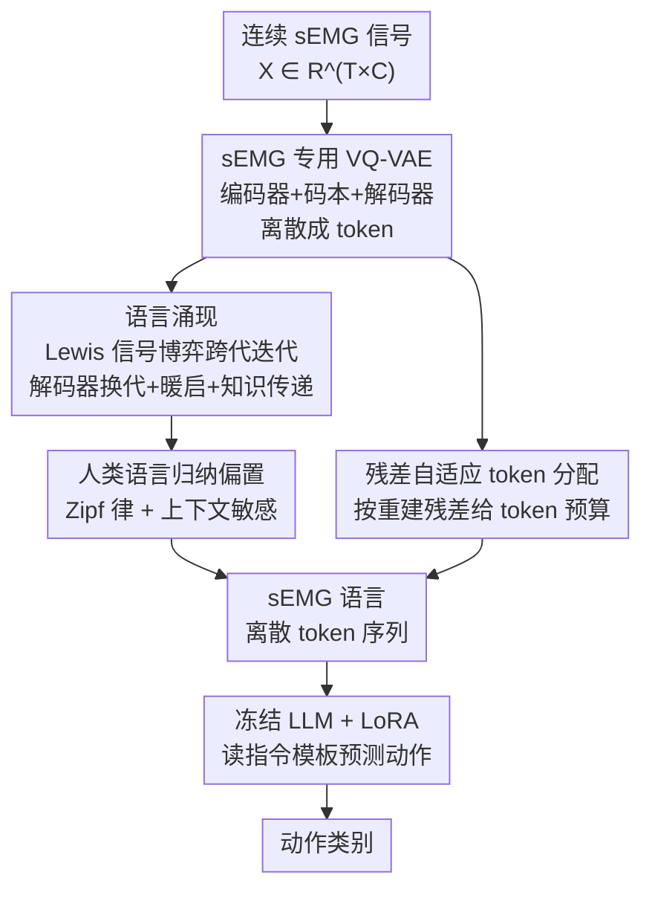

# Translating Signals to Languages for sEMG-Based Activity Recognition

**会议**: CVPR 2026  
**论文**: [CVF Open Access](https://openaccess.thecvf.com/content/CVPR2026/html/Wang_Translating_Signals_to_Languages_for_sEMG-Based_Activity_Recognition_CVPR_2026_paper.html)  
**领域**: 人体理解 / 时序信号 / LLM应用  
**关键词**: 表面肌电、活动识别、语言涌现、VQ-VAE、Lewis信号博弈

## 一句话总结
本文提出 LLM-sEMG，先用一个 sEMG 专用 VQ-VAE 把连续肌电信号离散成 token，再通过「Lewis 信号博弈 + 人类语言归纳偏置」让这些 token 演化成一种类自然语言的「sEMG 语言」，最后只用 LoRA 微调、冻结预训练权重的 LLM 直接读这门语言来识别动作，在 GRABMyo 和 NinaPro DB2 上把准确率分别推到 95.14% 和 93.17%，超过最强基线 STET 约 4 个点。

## 研究背景与动机
**领域现状**：表面肌电（surface electromyography, sEMG）是神经肌肉活动的直接反映，时间分辨率高、能捕捉肌肉激活的细微动态，是人机交互、具身感知里解码运动意图的重要模态。主流做法分两条路：一条是堆更深更强的网络架构（TCN、GRU、Transformer、ViT、脉冲网络）去提升信号表征力；另一条是靠大规模预训练注入先验。

**现有痛点**：sEMG 信号噪声大、跨被试差异大、时序非平稳——它由短促的爆发（burst）和持续收缩交替组成，分类很难。同时这两条主流路线都停留在「信号层建模」，从没把 sEMG 转成类语言形式，也就用不上 LLM 在海量动作文本描述里学到的语义推理能力。

**核心矛盾**：LLM 的预训练语料里其实藏着大量关于「动作及其语义意图」的语言描述，是识别活动的天然先验；但 LLM 只吃句子级、有结构的自然语言，而 sEMG 是连续、非语言的时间序列，两者存在表征鸿沟。最直接的想法是微调 LLM 让它直接吃非语言输入——但在规模有限的 sEMG 数据上改 LLM 权重，会冲掉它原本的知识，恰恰违背了「想借 LLM 知识」的初衷。

**切入角度**：作者抓住一个观察——LLM 因为在海量语料上学到了跨语言共享的语义结构，遇到训练时没见过的新语言时能快速迁移适配。那么与其改 LLM 去迁就信号，不如反过来：把 sEMG 信号「翻译」成一门 LLM 能像读新语言一样读懂的「sEMG 语言」，全程冻结 LLM 预训练权重，最大限度保住它的先验。

**核心 idea**：用「语言涌现」把连续肌电变成离散、且越来越像人话的 token 序列，再让冻结权重的 LLM（仅 LoRA 适配）把活动识别当成一次「读 sEMG 语言→输出动作标签」的语言理解任务。

## 方法详解

### 整体框架
LLM-sEMG 是一个两阶段管线：**阶段一**训练一个 sEMG 专用 VQ-VAE，把连续信号离散成 token，并在「迭代学习（iterated learning）」框架下让这些 token 演化成一门类自然语言的「sEMG 语言」，同时用残差自适应分配 token 保住信号的判别信息；**阶段二**冻结一个预训练 LLM（LLaMA-13B）的全部权重，只用 LoRA 适配，让它读这门 sEMG 语言、按指令模板输出动作类别。

整门「sEMG 语言」的产生靠三块协同：① VQ-VAE 负责离散化；② Lewis 信号博弈式的迭代学习让语言「跨代演化」得像人话；③ 残差自适应 token 分配让语言在信号信息密集处更精细。三者训练出 sEMG 语言后，再交给冻结的 LLM 推理。

### 关键设计

**1. sEMG 专用 VQ-VAE：把连续肌电离散成「词」**

要让 LLM 读信号，第一步得先有「离散符号」——自然语言本身就是离散词元的序列。作者沿用 VQ-VAE 的编码器 $E$、码本 $C$、解码器 $D$ 三件套，但针对 sEMG 定制。给定信号 $X \in \mathbb{R}^{T\times C}$（$T$ 时间步、$C$ 采集通道），先用固定长度滑窗切成重叠片段 $x \in \mathbb{R}^{t\times C}$；编码器（1D-CNN，专抓 sEMG 短时动态）把每段映射成连续隐向量序列 $z_e(x) = [z_{e,1}, \dots, z_{e,S}] \in \mathbb{R}^{D\times S}$。码本是 $K$ 个可学习向量 $C=\{e_j\}_{j=1}^{K}$，对每个位置 $s$ 用欧氏距离选最近的码本向量：

$$k_s = \arg\min_{j\in\{1,\dots,K\}} \lVert z_{e,s} - e_j \rVert_2,\quad z_{q,s}(x)=e_{k_s}$$

于是片段 $x$ 被映成离散 token 序列 $z_q(x)=[z_{q,1},\dots,z_{q,S}]$，解码器再据此重建 $\hat{x}$。关键细节是码本向量维度 $D$ 对齐 LLM 的词嵌入维度（LLaMA-13B 的 $D=5120$），让 sEMG token 天然落进 LLM 的「词表空间」。但作者强调：仅仅有 token 序列还不够，它不会自动像人话，LLM 也就激活不了相关语义先验——这正是下一个设计要补的。

**2. Lewis 信号博弈式迭代学习：让 sEMG 语言「跨代演化」成人话**

VQ-VAE 产出的 token 序列缺乏语言属性，LLM 读不出语义。作者借语言演化里的「文化传递理论」与 Lewis 信号博弈：博弈中两个参与者起初用彼此「听不懂」的符号交流，反复沟通后会自发涌现出一门共享、可解释的语言。作者把 VQ-VAE 的**编码器当「说话者（speaker）」、解码器当「新一代学习者」、码本当共享符号集**，通过周期性替换解码器来模拟「新一代人」，让 sEMG 语言在代际传递中演化。每一代包含三步：

- **解码器换代（Decoder Renewal）**：每代开始重新初始化一个解码器 $D^{(t+1)}\sim P_{\text{init}}$，模拟「语言要被下一代重新习得」；而编码器与码本从上一代继承并冻结 $E^{(t+1)}=E^{(t)},\ C^{(t+1)}=C^{(t)}$，充当「知识载体」保证语言的代际连续性。
- **暖启（Warm-up）**：新解码器随机初始化、还没学会上一代的语义映射，若直接联合训练会让码本梯度剧烈波动、毁掉已成型的语言。于是先冻结码本 $C^{(t)}$，只训新解码器若干步快速对齐，把上一代语言「无痛继承」过来。
- **知识传递（Knowledge Transmission）**：解冻码本，按 VQ-VAE 重建范式继续训练，让新学习者与编码器通过共享码本交换知识、推动语言持续演化。作者刻意让「老编码器→新解码器」的教学保持**不完整、有偏**，制造一个「学习瓶颈」，持续刺激语言自发进化。

这套机制是性能的命门：消融里去掉迭代学习，准确率从 95.14% 直接崩到 79.59%。其有效性在于——单纯重建只会得到「能重建但不像语言」的 token，而代际重学+瓶颈逼着系统压缩、规整出可泛化、可被新学习者快速习得的表达，这恰恰是「像人话」的核心。

**3. 人类语言归纳偏置：用 Zipf 律和上下文敏感性给演化「提速」**

真实语言演化要跨好几代文化积累，有限数据和迭代步数里复现不了，于是作者直接把人类语言里已被证实的两条归纳偏置注入演化过程：

- **Zipf 律先验**：自然语言词频服从幂律（少数高频核心词 + 大量低频扩展词）。早期模型还没有稳定 token 使用模式，直接上 Zipf 正则会让码本梯度不稳，所以前约 25% 训练用 **Zipf 加权采样**，让一小撮「核心词 token」更容易被激活，天然诱导「高频—稀有」分布；之后再加 Zipf 正则项，计算当前 batch 的经验 token 频率分布 $D_{\text{freq}}$ 与理论 Zipf 分布 $D_{\text{Zipf}}$ 的 JS 散度对齐：$L_{\text{zipf}} = \mathrm{JS}(D_{\text{freq}} \parallel D_{\text{Zipf}})$。
- **上下文敏感性先验**：人话里词的使用不独立、依赖上下文。作者用上下文损失 $L_{\text{context}} = 1 - \frac{1}{N}\sum_{n=1}^{N}\mathrm{Corr}(t_n)$（$\mathrm{Corr}(t_n)$ 量化第 $n$ 个序列里语义相关 token 的相关度，定义在补充材料）鼓励代内语义相关 token 共现；再用基于 token 共现矩阵 $M^{(t)}$ 的代际保持正则 $L_{\text{preserving}} = \lVert M^{(t+1)} - M^{(t)} \rVert_F^2$ 让上下文偏置稳定地代际继承。

三项合成 $L_{\text{human}} = L_{\text{zipf}} + L_{\text{context}} + L_{\text{preserving}}$。这条设计针对的是「演化太慢、数据不够」的痛点：与其等语言自己慢慢长，不如把人类语言的统计规律当先验灌进去加速收敛——消融显示全部去掉会从 95.14% 掉到 87.35%。

**4. 残差自适应 token 分配：在信号信息密集处多花 token**

sEMG 高度非平稳：高幅短促爆发往往标志动作的发起、峰值力或终止，判别信息最丰富；而稳态收缩/休息阶段信号平稳、信息少。标准均匀 token 化按固定时间间隔切，在瞬态阶段分得太少（丢判别信息）、在稳态阶段分得太多（冗余、干扰 LLM 推理）。作者据「重建残差能反映局部信息密度」这一观察，把每段 sEMG 表示成 $S$ 个时间切片 $x_1,\dots,x_S$，第 $s$ 片的残差能量定义为 $R_s = \lVert x_s - \hat{x}_s \rVert_2^2$（高残差=非平稳/突变，低残差=稳态）。残差归一化成概率分布 $P_s$ 作重要性权重，固定预算 $T_{\max}$ 下初始分配 $T_s = T_{\max}\times P_s$；并加最小覆盖约束保证每片至少 1 个 token，若总数超预算就从残差最小的片里扣。这样动态手势区段拿到更多 token、稳态区段稀疏 token 化，sEMG 语言因而更能保住信号的爆发式动态特征——消融里去掉它在单指/多指等动态手势上掉点最多（−2.50%/−3.30%），印证了它专攻动态判别。

### 损失函数 / 训练策略
**阶段一（VQ-VAE 语言涌现）**：在迭代学习框架下，把编码器/解码器/码本当 Lewis 信号博弈三方，按代轮换解码器并执行残差自适应 token 分配。基础 VQ-VAE 损失为重建损失 $L_{\text{rec}}=\text{Smooth-L1}(\{x_b\},\{\hat{x}_b\})$、嵌入损失 $L_{\text{emb}}=\lVert \mathrm{sg}(z_e)-z_q\rVert_2^2$、承诺损失 $L_{\text{com}}=\lVert z_e-\mathrm{sg}(z_q)\rVert_2^2$，加上语言偏置项后总损失：

$$L_{\text{total}} = L_{\text{rec}} + L_{\text{emb}} + \lambda_1 L_{\text{com}} + \lambda_2 L_{\text{human}}$$

**阶段二（LLM 适配）**：冻结 LLaMA-13B 权重，仅 LoRA 微调。每个样本是「sEMG token 序列 + 动作标签」，指令模板为 *"Given a sequence of sEMG tokens [tokens], please predict the corresponding activity."*，最小化预测动作 token 与真值标签的交叉熵 $L_{\text{LLM}} = L_{ce}(t_p, t_g)$。实现上用 LLaMA-13B、码本 $K=512$、$D=5120$，AdamW、批大小 320；迭代学习每代 200 步暖启 + 8000 步知识传递，末代延长到约 1.5k 步保证收敛。

## 实验关键数据

### 主实验
两个公开数据集：GRABMyo（17 类活动，>25 万条多通道序列）与 NinaPro DB2（40 被试、50 类手腕动作、12 电极），均采用 user-specific 评测协议。

| 数据集 | 指标 | LLM-sEMG (本文) | STET (前SOTA) | 提升 |
|--------|------|------|----------|------|
| GRABMyo | Overall ACC | **95.14%** | 90.76% | +4.38% |
| GRABMyo | Single-finger | 92.25% | 88.27% | +3.98% |
| GRABMyo | Multi-finger | 94.50% | 89.93% | +4.57% |
| NinaPro DB2 | Overall ACC | **93.17%** | 89.13% | +4.04% |
| NinaPro DB2 | Exercise B | 92.53% | 87.22% | +5.31% |

两个数据集、所有子类别上都全面领先，相对 STET 在 GRABMyo / NinaPro DB2 分别提升约 4.38% / 4.04%。

### 消融实验（GRABMyo Overall ACC）
| 配置 | Overall ACC | 说明 |
|------|---------|------|
| Full Model | 95.14% | 完整模型 |
| w/o Iteration | 79.59% | 去掉迭代学习，暴跌 15.55%（命门） |
| w/o Warm-up | 91.65% | 去暖启，掉 3.49%，早期重建损失震荡 |
| w/o Human Bias | 87.35% | 去全部语言偏置，掉 7.79% |
| w/o Zipf Bias | 90.65% | 仅去 Zipf 先验 |
| w/o Context Bias | 92.13% | 仅去上下文敏感约束 |
| w/o Preserving Bias | 93.85% | 仅去代际保持，主要稳定继承 |
| w/o Residual-based | 92.60% | 去残差自适应分配，动态手势掉点最多 |

### 关键发现
- **迭代学习是绝对核心**：去掉后从 95.14% 崩到 79.59%（−15.55%），说明「让 token 跨代演化成语言」才是 LLM 能读懂信号的根本，单纯离散化远远不够。
- **语言偏置整体贡献第二大**：全部去掉 −7.79%；其中 Zipf 偏置 > 上下文敏感 > 代际保持，代际保持更多是稳定上下文继承而非直接提精度。
- **残差自适应分配专攻动态判别**：去掉后动态手势（单指 −2.50%、多指 −3.30%）掉点明显大于稳态（腕 −1.45%、休息 −0.95%），印证它把 token 预算集中到了信息密集的瞬态爆发上。

## 亮点与洞察
- **「改信号去迁就 LLM」而非「改 LLM 去迁就信号」**：全程冻结 LLM 预训练权重、只 LoRA 适配，绕开了「小数据微调 LLM 冲掉先验」的死结——把跨模态对齐的负担丢给一个可训练的 VQ-VAE 翻译器，是很值得迁移到其它「非语言信号→LLM」任务的范式（脑电、IMU、雷达等同理）。
- **把语言学理论搬进表征学习**：用 Lewis 信号博弈+文化传递解释「为什么要周期换解码器」，再把 Zipf 律、上下文敏感性当显式归纳偏置注入，给「离散 token 为什么要像人话」提供了一套自洽的理论叙事，而不只是堆 trick。
- **「学习瓶颈」当正则**：刻意保持老编码器→新解码器的教学不完整、有偏来逼语言自发进化，这种「故意教不全」的思路与知识蒸馏里「过强教师反而压制学生探索」的直觉相通，可复用。
- **残差能量=信息密度的自适应 token 化**：用重建残差当 token 预算分配的依据，是一个轻巧且可解释的动态稀疏化手段，适用于任何非平稳时序的离散化。

## 局限与展望
- **依赖大模型**：用 LLaMA-13B + H100 训练，相比 STET 这类专用网络，推理/训练成本高很多，对边缘可穿戴 sEMG 设备的实时部署不友好；论文未报告延迟/参数量层面的代价。
- **核心机制定义藏在补充材料**：上下文相关度 $\mathrm{Corr}(\cdot)$、共现矩阵 $M^{(t)}$、残差分配的最小覆盖约束细节都放进了补充材料，正文无法完全复现；⚠️ 这些公式以原文补充材料为准。
- **可解释性宣称未充分量化**：贡献里提「提升可解释性」，但正文主要给的是准确率，没有展示「sEMG 语言」到底长什么样、token 是否真的对应可读的语义单元，缺乏定性可视化支撑。
- **评测仅两个数据集、user-specific 协议**：未做跨被试/跨数据集泛化的系统评估，而 sEMG 最难的恰恰是跨被试迁移；「sEMG 语言是否真泛化」仍待验证。
- **迭代学习对超参敏感**：换代周期、暖启步数、瓶颈强度都会影响语言质量，缺少对这些训练动力学超参的鲁棒性分析。

## 相关工作与启发
- **vs STET / LST-EMG-Net / JASNN（专用 sEMG 网络）**：它们停留在信号层建模，靠更强架构或脉冲网络提表征；本文反其道把信号翻成语言、借冻结 LLM 的语义先验做推理，在两个数据集上各超 STET 约 4 个点，优势是利用了外部语言知识，劣势是模型重、成本高。
- **vs 直接微调 LLM 吃非语言输入（如修改 LLM 权重处理非语言信号的工作）**：那类方法在有限 sEMG 数据上改权重会损伤 LLM 既有知识；本文坚持冻结权重、只造「新语言」让 LLM 当读新语言一样迁移，理念上更保守也更稳。
- **vs 通用 VQ-VAE 离散化（如运动/音频 tokenization）**：标准 VQ-VAE 只保证可重建、不保证「像语言」；本文加 Lewis 信号博弈迭代学习 + 人类语言归纳偏置 + 残差自适应分配，把「离散 token」推向「类自然语言序列」，这是它能接 LLM 的关键差异。

## 评分
- 新颖性: ⭐⭐⭐⭐⭐ 「把信号翻译成类自然语言再喂冻结 LLM」+ Lewis 信号博弈迭代演化，是一个相当新颖且自洽的跨模态范式。
- 实验充分度: ⭐⭐⭐⭐ 两数据集全面领先 + 四组消融把每个设计的贡献拆得清楚，但缺跨被试泛化和成本分析。
- 写作质量: ⭐⭐⭐⭐ 动机链条和语言学类比讲得清楚易读，扣分在多个核心定义被推到补充材料。
- 价值: ⭐⭐⭐⭐ 为「非语言时序信号 → LLM」提供了可迁移的设计模板，对可穿戴/生理信号方向有启发，落地成本是主要顾虑。

<!-- RELATED:START -->

## 相关论文

- [\[CVPR 2026\] Sign Language Recognition in the Age of LLMs](sign_language_recognition_llms.md)
- [\[CVPR 2026\] MMGait: Towards Multi-Modal Gait Recognition](mmgait_multi_modal_gait_recognition.md)
- [\[AAAI 2026\] KineST: A Kinematics-guided Spatiotemporal State Space Model for Human Motion Tracking from Sparse Signals](../../AAAI2026/human_understanding/kinest_a_kinematics-guided_spatiotemporal_state_space_model_for_human_motion_tra.md)
- [\[CVPR 2026\] EventGait: Towards Robust Gait Recognition with Event Streams](eventgait_towards_robust_gait_recognition_with_event_streams.md)
- [\[CVPR 2026\] Region-Aware Instance Consistency Learning for Micro-Expression Recognition](region-aware_instance_consistency_learning_for_micro-expression_recognition.md)

<!-- RELATED:END -->
