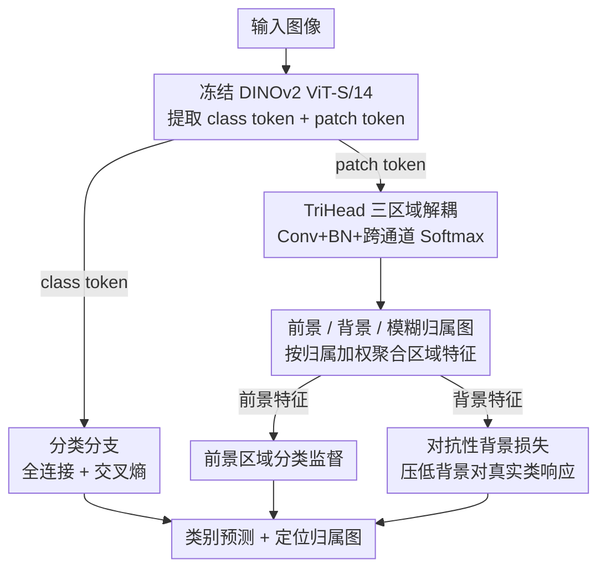

# TriLite: Efficient WSOL with Universal Visual Features and Tri-Region Disentanglement

**会议**: CVPR 2026  
**arXiv**: [2602.23120](https://arxiv.org/abs/2602.23120)  
**代码**: 即将发布  
**领域**: 人体理解  
**关键词**: 弱监督目标定位, ViT, DINOv2, 三区域解耦, 参数高效

## 一句话总结

仅使用冻结 DINOv2 ViT + 不到 800K 可训练参数的 TriHead 模块，通过将 patch 特征解耦为前景/背景/模糊三区域并引入对抗性背景损失，在 WSOL 上以极少参数刷新 SOTA。

## 研究背景与动机

WSOL 仅用图像级标签定位目标。从 CAM 开始的方法面临部分激活问题。现有方法：(1) 多阶段方法（GenPromp）效果好但参数巨大（1017M）；(2) 二分法（前景 vs 背景）忽略非目标显著区域。

核心洞察：引入"模糊区域"第三类，为非目标但显著的区域提供归属，减少前景/背景判定噪声。

## 方法详解

### 整体框架

TriLite 想在弱监督定位里只用图像级标签就把目标抠准，同时把可训练参数压到极致。它的做法是把一个冻结的 DINOv2 ViT-S/14 当作通用视觉特征提取器，在它上面挂两条轻量分支：分类分支取 class token 接一层全连接做图像分类，定位分支（TriHead）则吃 patch token、输出每个 patch 属于前景/背景/模糊三类的归属图。整条网络里只有这两个头在训练，骨干全程不动，所以可训练参数不到 800K，单阶段端到端就能跑完。

### 关键设计

**1. TriHead 三区域解耦：用第三类"模糊区域"吸走非目标的显著噪声**

传统 WSOL 把每个 patch 二分成前景或背景，可那些"显著但不是目标"的区域（背景里的强纹理、其它物体）会被硬塞进某一类，污染判定。TriHead 改成三分：把 patch token reshape 回特征图，过 Conv+BN 后用一个跨三通道的 Softmax 输出 $\mathbf{M} = [\mathbf{M}^{am}, \mathbf{M}^{fg}, \mathbf{M}^{bg}]$，分别对应模糊（ambiguous）、前景、背景。Softmax 让三通道在每个 patch 上归一化竞争，于是模糊通道天然成了一个缓冲带——拿不准的显著区域可以归到这里，前景和背景的判定就更干净。聚合时按归属图对特征做加权平均得到区域特征 $\mathbf{f}^c = \frac{\sum_i \mathbf{M}_i^c \mathbf{F}_i}{\sum_i \mathbf{M}_i^c + \epsilon}$，因为有 Softmax 约束，实际只需监督前景和背景两个通道，模糊通道由竞争自动获得。

**2. 对抗性背景损失：逼背景图"什么目标都认不出来"**

光有三通道还不够——背景通道仍可能在目标身上误激活。这里引入一个此前 WSOL 没用过的对抗思路：把背景区域特征送进分类器，反过来惩罚它对真实类别 $y$ 的响应

$$\mathcal{L}_{bg} = -\log\Big(1 - \frac{\exp(z_y^{bg})}{\sum_j \exp(z_j^{bg})} + \epsilon\Big)$$

其中 $z^{bg}$ 是背景特征过分类头得到的 logits。这个损失越小，背景对目标类的预测概率就越被压低，相当于要求背景图只在真正与目标无关的区域亮起来，从而把前景和背景拉得更开。

**3. 分类分支：独立的一条监督，给定位提供类别信号**

定位头本身只产生区域归属图，类别判断由分类分支单独负责——class token 接全连接再过交叉熵。它和定位分支共享同一个冻结骨干，但各自优化、互不干扰，这样既能复用 DINOv2 的通用特征，又让分类和定位两个目标不会相互拉扯。

### 训练策略

三项损失加权相加 $\mathcal{L} = \mathcal{L}_{fg} + \alpha \mathcal{L}_{bg} + \mathcal{L}_{cls}$，其中 $\mathcal{L}_{fg}$ 监督前景区域分类、$\mathcal{L}_{cls}$ 监督全图分类、$\mathcal{L}_{bg}$ 即上面的对抗背景项。骨干全程冻结，单阶段端到端训练，在 ImageNet-1K 上只需 20 个 epoch。

## 实验关键数据

### 主实验

| 数据集 | 指标 | TriLite | GenPromp | 提升 |
|--------|------|---------|----------|------|
| ImageNet-1K | Top-1 Loc | **65.5%** | 65.2% | +0.3% |
| ImageNet-1K | Top-5 Loc | **75.6%** | 73.4% | +2.2% |
| ImageNet-1K | GT Loc | **77.9%** | 75.0% | +2.9% |
| CUB-200-2011 | Top-1 Loc | **87.3%** | 87.0% | +0.3% |
| OpenImages | PxAP | **73.3%** | 72.1% | +1.2% |

### 参数效率

| 方法 | 可训练参数 | 总参数 |
|------|-----------|--------|
| GenPromp | 898M | 1017M |
| BAS | 25.6M | 25.6M |
| **TriLite** | **<0.8M** | 22.1M (冻结)+0.8M |

### 消融实验

| 配置 | CUB Top-1 | ImageNet GT | 说明 |
|------|-----------|-------------|------|
| Binary 无 Adv | 86.7 | 76.5 | 基线 |
| Binary + Adv | 86.5 | 77.2 | 单独对抗损失改善有限 |
| 3-ch 无 Adv | 85.0 | 77.4 | 单独三通道改善有限 |
| **3-ch + Adv** | **87.3** | **77.9** | 组合后显著提升 |

### 关键发现

- 三通道 + 对抗损失须组合使用——模糊区域为对抗损失提供缓冲带
- 自监督预训练 (DINOv2) 远优于有监督 (DeiT)
- TriLite 激活图精确到类似分割级别

## 亮点与洞察

1. <800K 参数打败 1000M+ 参数方法——冻结高质量 ViT + 轻量头是可行路线
2. 对抗性背景损失在 WSOL 中此前未被探索
3. 第三类"模糊区域"不是 soft assignment，而是显式建模

## 局限与展望

1. 精确激活在遮挡物体上导致碎片化定位框
2. 性能依赖 DINOv2 质量
3. 扩展到弱监督分割尚未验证

## 相关工作与启发

- 与 LOST/TokenCut 对比：可学习定位头优于后处理方法
- 冻结骨干 + 极轻量任务头范式可推广到其他弱监督任务

## 评分

- 新颖性: ⭐⭐⭐⭐ 三区域解耦+对抗背景损失，组合新颖
- 实验充分度: ⭐⭐⭐⭐⭐ 三数据集+多骨干+详细消融
- 写作质量: ⭐⭐⭐⭐ 清晰可视化
- 价值: ⭐⭐⭐⭐⭐ 极高实用性——低参数+简单训练+SOTA

<!-- RELATED:START -->

## 相关论文

- [\[CVPR 2026\] Region-Aware Instance Consistency Learning for Micro-Expression Recognition](region-aware_instance_consistency_learning_for_micro-expression_recognition.md)
- [\[ECCV 2024\] EDTalk: Efficient Disentanglement for Emotional Talking Head Synthesis](../../ECCV2024/human_understanding/edtalk_efficient_disentanglement_for_emotional_talking_head_synthesis.md)
- [\[CVPR 2026\] Text-guided Feature Disentanglement for Cross-modal Gait Recognition](text-guided_feature_disentanglement_for_cross-modal_gait_recognition.md)
- [\[CVPR 2026\] Composite-Attribute Person Re-Identification via Pose-Guided Disentanglement](composite-attribute_person_re-identification_via_pose-guided_disentanglement.md)
- [\[CVPR 2026\] Vision-Language Attribute Disentanglement and Reinforcement for Lifelong Person Re-Identification](vision-language_attribute_disentanglement_and_reinforcement_for_lifelong_person_.md)

<!-- RELATED:END -->
