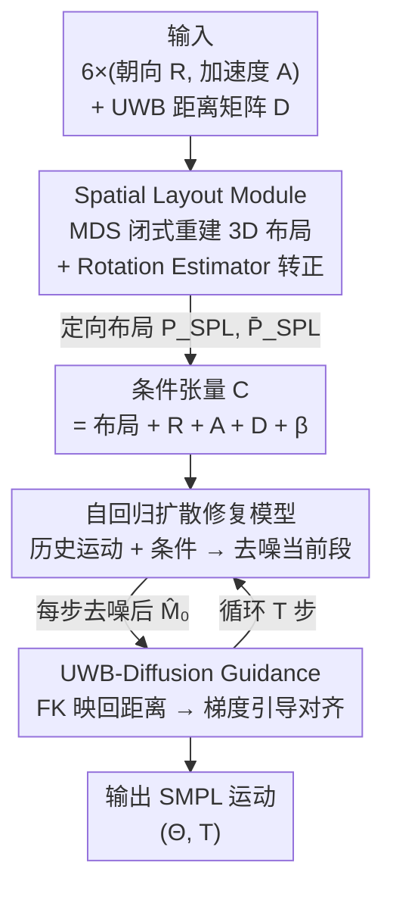

# Ultra Diffusion Poser: Diffusion-Based Human Motion Tracking From Sparse Inertial Sensors and Ranging-Based Between-Sensor Distances

**会议**: CVPR 2026  
**arXiv**: [2606.02153](https://arxiv.org/abs/2606.02153)  
**代码**: https://github.com/eth-siplab/UltraDiffusionPoser (有)  
**领域**: 人体姿态估计 / 可穿戴动捕 / 扩散模型  
**关键词**: 稀疏惯性动捕, UWB 测距, 扩散模型, 多维标度, 分类器引导

## 一句话总结
把 6 个 IMU 之间的 UWB 测距从"额外特征"升级为"几何约束"——先用多维标度（MDS）从两两距离解析重建 3D 传感器布局当作扩散条件，再在去噪采样时用前向运动学把预测姿态映回传感器距离做引导对齐，使稀疏惯性人体姿态估计的关节位置误差最多降低 22%。

## 研究背景与动机

**领域现状**：用穿戴式 IMU 做人体动捕是相机方案之外的轻便替代，但要达到 Xsens/Noitom 商用系统的精度通常需要 17–19 个传感器；学界近年聚焦在只用 6 个 IMU 的"稀疏惯性"配置（DIP、TIP、PIP、PNP 等）。为了对抗 IMU 固有的漂移，最新一批工作（UIP、UMotion、GIP）引入超宽带（UWB）测距，给出传感器之间**不漂移**的两两距离作为额外约束。

**现有痛点**：IMU 只有加速度和角速度，积分必然漂移，且帧间、体段间没有任何绝对观测，漂移校正极难。引入 UWB 后情况好转，但**现有 IMU+UWB 方法只把两两距离当成一个辅助输入标量喂进网络**，既没有利用这些距离能反推出的完整 3D 传感器空间布局，也没有在推理时强制让输出姿态满足这些距离——结果会出现预测手腕间距 70 cm、而 UWB 实测 90 cm 这种直接违反测量值的姿态。

**核心矛盾**：UWB 距离本质是对传感器位置的**几何刚性约束**，但被当成软特征后，模型既丢掉了"距离 → 3D 布局"这层更有信息量的先验，又在采样时放任预测违反约束。把约束硬塞进逐帧姿态优化又会引入不可行关节角、抖动和不自然姿态。

**本文目标**：(1) 把两两距离显式转成 3D 传感器布局当条件；(2) 在扩散采样中柔性地把姿态拉回满足 UWB 距离，同时保持运动平滑自然。

**切入角度**：作者观察到——既然 UWB 给的是两两距离矩阵，那么经典多维标度（MDS）就能在闭式解下从距离恢复出一组 3D 点（即传感器布局），这是比原始距离标量信息量大得多的条件；而扩散模型天然适合"欠约束的姿态补全"，且其分类器引导机制正好能在采样时注入"满足距离"这个外部目标。

**核心 idea**：用 MDS 把 UWB 距离解析重建成 3D 传感器布局作为扩散条件（Spatial Layout Module），再用环内前向运动学在去噪过程中引导姿态对齐实测距离（UWB-Diffusion Guidance）。

## 方法详解

### 整体框架
UDP（Ultra Diffusion Poser）是一个**全可学习的自回归扩散修复（diffusion-inpainting）模型**。输入是一段长度 N 的序列：每帧 6 个传感器的全局朝向 $\mathbf{R}_t\in\mathbb{R}^{k\times3\times3}$、全局加速度 $\mathbf{A}_t\in\mathbb{R}^{k\times3}$、两两 UWB 距离矩阵 $\mathbf{D}_t\in\mathbb{R}^{k\times k}$（$k=6$）；输出是 SMPL 人体运动 $(\Theta,\mathbf{T})$——24 个关节的局部旋转和全局平移。

整条管线分三段：① **Spatial Layout Module（SPL）** 先离线地、按帧用 MDS 从距离矩阵闭式解出一组无朝向的 3D 点，再用一个端到端训练的 Rotation Estimator 把它转正、并保留镜像版本，得到定向 3D 传感器布局 $(P_{SPL},\bar P_{SPL})$；② 这套布局连同 IMU、UWB、体型 $\beta$ 拼成条件张量 $\bm{\mathcal{C}}$，喂给 **自回归扩散修复模型**——它以"上一段已预测运动 + 当前条件"为输入去噪出当前段运动，保证长序列平滑；③ 采样的每一步去噪后，用 **UWB-Diffusion Guidance** 把预测姿态经前向运动学（FK）映回传感器距离，与实测 UWB 距离比对，用梯度把均值往"满足距离"方向推。

### 关键设计

**1. Spatial Layout Module：把 UWB 距离从标量特征升级成 3D 几何先验**

针对"现有方法只把距离当辅助标量"这个痛点，SPL 直接把两两距离矩阵 $\mathbf{D}_t$ 重建成 3D 传感器坐标。它用经典度量 MDS：要找一组 3D 点 $x_i$ 使其两两距离最逼近实测 $d_{ij}$，即最小化 $\sum_{i<j}(\lvert x_i-x_j\rvert^2 - d_{ij})^2$。这个问题在欧氏空间有**闭式解**——先做双中心化得到 Gram 矩阵 $\mathbf{B}=-\tfrac12\mathbf{H}\mathbf{D}^{(2)}\mathbf{H}$（$\mathbf{H}=\mathbf{I}-\tfrac1k\mathbf{1}\mathbf{1}^\top$，$\mathbf{D}^{(2)}$ 为平方距离），再对 $\mathbf{B}$ 做 SVD，取前三大特征向量与特征值得到 $\mathbf{X}_{\text{MDS}}=\mathbf{U}_3\mathbf{\Sigma}_3^{1/2}$。

但 MDS 解只确定到**平移、旋转、反射**的等价类，逐帧独立解出来在时序上是不连贯的（朝向乱跳、还可能整体镜像）。SPL 先把每帧布局归一化到一个标准框架：骨盆置原点、root-head 对齐 y 轴（站直）、左手腕落在 XY 平面正方向（朝前）；并用阈值规则消除逐帧反射——当 $\lVert X_{t-1}-X_t\rVert_2^2 > c$ 时翻转，保证时序一致。由于整段序列仍可能被整体镜像，作者同时保留布局 $X$ 和它的镜像 $\bar X$ 两个候选，其中一个对应真实配置。最后一个 **Rotation Estimator（3 层 LSTM）** 与扩散模型端到端联合训练，吃 $(X,\bar X,\mathbf{R},\mathbf{A},\mathbf{D})$ 预测出旋转 $R_{MDS}$ 和逐点残差 $P_{res}$，把布局转正并修掉 MDS 因噪声带来的偏差：$P_{SPL}=R_{MDS}X+P_{res}$、$\bar P_{SPL}=R_{MDS}\bar X+P_{res}$。这套定向布局描述了头、骨盆、双手腕、双膝的空间位置，作为扩散条件比裸距离标量信息量大得多。

**2. 自回归扩散修复模型：用 inpainting 保证长序列时序平滑**

把姿态当作生成问题、又要长序列连续，作者采用 DDPM 形式的扩散修复。运动表示为 $\mathcal{M}\in\mathbb{R}^{N\times147}=[\Theta^{6D},\mathbf{T}]$（关节用 6D 旋转表示 + 平移），并把每段归一化到 root 起点为 $(0,\text{root height},0)$ 的标准框架，缓解长序列的表示漂移。去噪器 $D_\theta$ 在每个扩散步预测干净运动 $\hat{\mathcal{M}}_0=D_\theta(\mathcal{M}_t,\mathcal{M}_{hist},\bm{\mathcal{C}},t)$，其中 $\mathcal{M}_{hist}$ 是前 $N_H$ 帧已预测运动（对齐后前置拼接），条件 $\bm{\mathcal{C}}\in\mathbb{R}^{N\times154}=[P_{SPL},\bar P_{SPL},\mathbf{R},\mathbf{A},\mathbf{D},\beta]$。具体地，噪声运动、历史、条件都投到共享嵌入空间，条件与噪声运动相加后接到历史后面、用可学习 history token $h_e$ 标记历史段，扩散步 $t$ 经 MLP 编码后前置，组合成长度 $1+N_H+N$ 的序列 $S$，再用 LSTM 去噪。推理时自回归地滚动预测任意长序列，并加 $\sigma=2$ 的高斯平滑。和 DiffusionPoser 不同，UDP 训练时**不需要拖慢训练的 FK 损失**，靠条件本身 + 辅助损失就能学好。

**3. UWB-Diffusion Guidance：在采样回路里用前向运动学把姿态拉回满足实测距离**

即便有 3D 布局这么强的条件，去噪结果仍可能违反两两距离 $\mathbf{D}$；而事后逐帧硬优化又会产生不可行关节角和抖动。作者借鉴**分类器引导**：标准采样中 $\mathcal{M}_{t-1}$ 从均值为 $\mu_t$ 的高斯采出，只要把均值沿某个"鼓励期望性质"的函数 $\epsilon$ 的梯度方向平移，就能把采样引向偏好的预测。这里的 $\epsilon$ 是 UWB 一致性损失：每步去噪得到 $\hat{\mathcal{M}}_0$ 后，用**环内前向运动学**从 SMPL 姿态算出预测传感器位置、得到预测距离 $\hat d_{ij}$，与实测距离比对——

$$\epsilon_{uwb}=\sum_{i<j}\lVert \hat d_{ij}(\hat{\mathcal{M}}_0)-d_{ij}\rVert^2$$

然后更新均值 $\tilde\mu_t=\mu_t(\mathcal{M}_t,\hat{\mathcal{M}}_0)-\lambda\,\Sigma_t\,\nabla\epsilon_{uwb}$，引导强度 $\lambda$ 可按噪声水平调。因为 UWB 是体内（inter-body）约束、与全局位置无关，root 平移的梯度被置零。把 FK 直接嵌进采样回路（而非事后优化）的好处是：纠正在去噪过程中柔性发生，输出仍保持平滑、不会像逐帧后优化那样抖。

### 损失函数 / 训练策略
主损失是标准扩散损失 $\mathcal{L}_{\text{simple}}=\mathbb{E}_{q(x_t|x_0)}[\lVert x_0-D_\theta(x_t,t,\bm{\mathcal{C}})\rVert_2^2]$。辅助损失包括：平移损失 $\mathcal{L}_{tran}=\lVert \mathbf{T}^{pred}-\mathbf{T}^{gt}\rVert_2$、SMPL 关节角损失 $\mathcal{L}_{smpl}=\lvert\Theta_{6d}^{pred}-\Theta_{6d}^{gt}\rvert$，以及鼓励更活跃平移的速度损失 $\mathcal{L}_{vel}=(\lVert\mathbf{T}_n^{pred}-\mathbf{T}_{n-1}^{pred}\rVert_2-\lVert\mathbf{T}_n^{gt}-\mathbf{T}_{n-1}^{gt}\rVert_2)^2$。Rotation Estimator 与扩散模型端到端联合训练。训练数据沿用前人协议、在 AMASS 同一划分上训练。

## 实验关键数据

评测指标定义：**SIP**（肩髋全局角度误差，°）、**GAE**（所有关节平均全局角度误差，°）、**JPE**（root 对齐的关节位置误差，cm）、**Jitter**（全局关节位置三阶导即 jerk 的平均幅值，m/s³，越接近 GT 越好）。

### 主实验

DIP-IMU 测试集（GT Jitter = 1.830）：

| 模型 | UWB | SIP(°)↓ | GAE(°)↓ | JPE(cm)↓ | Jitter |
|------|-----|---------|---------|----------|--------|
| TIP | ✗ | 17.07 | 10.51 | 5.82 | 0.882 |
| PIP | ✗ | 15.02 | 8.78 | 5.12 | 0.240 |
| PNP | ✗ | 13.71 | 8.75 | 4.98 | 0.260 |
| GlobalPose | ✗ | 13.55 | 8.47 | 4.65 | 0.260 |
| DynaIP | ✗ | 14.41 | **7.12** | 5.03 | - |
| UMotion | ✓ | 15.05 | 10.41 | 4.38 | 0.216 |
| UIP | ✓ | 13.20 | 8.23 | 5.05 | 0.240 |
| **UDP (ours)** | ✓ | **10.39** | 8.19 | **3.42** | **0.125** |

跨数据集对比（节选 SIP / JPE，单位 °/cm）：

| 数据集 | 指标 | 之前最好(IMU+UWB) | UDP | 说明 |
|--------|------|------|------|------|
| DanceDB | JPE | 5.19 (UMotion) | **4.67** | SIP 11.79 也最低 |
| TotalCapture | JPE | 4.83 (UMotion) | **3.76** | SIP 8.95 最低 |
| GIP-DB(zero-shot) | JPE | 9.45 (GIP) | **8.86** | 新式低噪 UWB，SOTA |
| GIP-DB(微调) | JPE | 8.70 (GIP) | **6.68** | 大幅领先 |
| UIP-DB(zero-shot) | JPE | 10.65 (UIP) | 11.72 | 唯一不占优，UWB 噪声>17cm |
| UIP-DB(微调) | JPE | 10.65 (UIP) | **9.04** | 微调后反超 |

关键结论：UDP 在几乎所有设置下取得最低 JPE，相对此前最佳最多提升 22%，相对纯 IMU 方法最多提升 35%；且无需 PIP/PNP/UIP 那样的物理优化器就能产出 jitter 最低的平滑运动。唯一失手是 UIP-DB 零样本——该集 IMU 漂移达 3.21°/min、UWB 误差 17.5 cm，UDP 因深度依赖 UWB 而更敏感，但微调后即反超。

### 噪声敏感性（UIP-DB，把实测 UWB 线性插值向 GT 靠拢）

| UWB 噪声水平 | GAE 优于 UIP(°) | JPE 优于 UIP(cm) |
|--------------|-----------------|------------------|
| 100%（真实噪声） | 1.67 | -1.07（略差） |
| 75% | 3.19 | 0.71 |
| 50% | 3.76 | 0.91 |
| 25% | 4.12 | 1.14 |
| 0%（完美距离） | 4.59 | 1.40 |

随 UWB 噪声下降，UDP 相对 UIP 的优势单调扩大——印证了"把距离深度耦合进架构"在低噪现代 UWB 上收益最大、在高噪老数据上是双刃剑。

### 消融实验（TotalCapture）

| 配置 | SIP(°)↓ | GAE(°)↓ | JPE(cm)↓ | 说明 |
|------|---------|---------|----------|------|
| w/o SPL & UWB Guidance | 10.22 | 10.79 | 4.39 | 两个模块都去掉，JPE +17% |
| w/o SPL | 9.58 | 10.45 | 4.03 | 去 SPL，SIP +7% |
| w/o UWB Guidance | 9.46 | 10.46 | 4.05 | 去引导，SIP +5%、JPE +7% |
| w/o RotEstimator | 9.11 | 10.45 | 3.92 | 用未定向 MDS 布局替代 |
| RotEstimator w/o $P_{res}$ | 9.01 | 10.22 | 3.79 | 去残差细化 |
| **UDP（完整）** | **8.95** | **10.19** | **3.76** | — |

### 关键发现
- SPL 和 UWB-Diffusion Guidance 是**互补**的：单独去掉各掉一点，两个一起去掉 JPE 暴涨 17%，说明"重建布局当条件"和"采样时拉回距离"分别管不同的事。
- Rotation Estimator 和它的残差 $P_{res}$ 各有贡献：把定向布局换成裸 MDS 布局会让所有指标变差，证明"把距离重建成定向 3D 布局"确实比"距离当辅助输入"更好。
- UWB-Diffusion Guidance 对**四肢段**改善最明显（SIP/JPE 降幅集中在肢体），因为肢体最受两两距离约束、也最影响视觉质量；快速手臂动作下 UDP 不会像其他方法那样滞后。

## 亮点与洞察
- **把"测量噪声"重新解释成"几何约束"**：同样一组 UWB 距离，前人当特征喂，本文用 MDS 闭式解反推 3D 布局——同一份输入换个用法就拿到信息量更高的条件，这个视角转换很巧妙，且 MDS 是闭式的、几乎零额外成本。
- **用扩散的分类器引导做"软物理约束"**：把 FK 嵌进采样回路、用距离一致性梯度引导均值，等于在不引入物理优化器的前提下做了柔性约束，既纠偏又保平滑——避开了逐帧硬优化带来的抖动和不可行关节角。这套"环内 FK + 引导"可迁移到任何"有可微测量约束的姿态/运动生成"任务（如带距离/接触/可见性约束的手部、多人姿态）。
- **MDS 歧义的工程化处理**：用归一化框架 + 阈值消反射 + 同时保留镜像候选 + 学习式转正，把"解只确定到旋转反射"这个数学障碍干净化解，是把经典几何方法塞进端到端深度管线的范本。

## 局限与展望
- **对高噪 UWB 敏感**（作者承认）：因为把距离深度耦进架构，UWB 误差>17 cm 时零样本会输给把距离当软特征的 UIP；引导系数 $\lambda$ 需按预期噪声手调。作者建议未来把传感器不确定性建进 SPL 或引导损失。
- **不带硬物理约束**：UDP 全数据驱动、不需调后优化/Kalman 超参，但也享受不到物理优化器的好处——零脚滑、防穿地、严格物理一致这类场景（尤其有地面/环境信息时）物理方法仍占优。
- **固定 6 传感器配置**：和前人一样被锁死在 6 个 IMU，扩展到任意传感器布局会更实用。
- **仅体内约束**：目前只用 on-body 两两距离做局部姿态，未利用人际/环境锚点 UWB；作者指出可结合 GIP 的人际优化做全局一致的多人动捕。

## 相关工作与启发
- **vs UIP**：UIP 首次把 IMU+UWB 融合、用图卷积处理两两距离，但距离仅作辅助特征、且推理不强制满足距离。UDP 把距离重建成 3D 布局当条件、并在采样时引导对齐，低噪场景全面领先；高噪零样本时 UIP 因更"软"反而更鲁棒。
- **vs UMotion**：UMotion 用 Kalman 滤波建模并校正 UWB 噪声，但需手调参数、且无法估计全局平移。UDP 全可学习、能出全局平移，且 jitter 更低。
- **vs GIP**：GIP 把 UWB 姿态扩到双人、靠优化框架细化平移。UDP 在单人 GIP-DB 上（零样本和微调）都拿 SOTA，作者提出可把 UDP 的平滑预测与 GIP 的人际优化结合。
- **vs DiffusionPoser**：同样用 Transformer/扩散做惯性动捕，但其量化提升有限、代码未公开、且训练需要拖慢速度的 FK 损失。UDP 把 FK 移到采样引导而非训练损失，训练更快、提升更显著。

## 评分
- 新颖性: ⭐⭐⭐⭐⭐ 把 UWB 距离从特征升级为几何约束（MDS 重建布局 + 采样内 FK 引导）是清晰且少见的视角转换。
- 实验充分度: ⭐⭐⭐⭐⭐ 5 个数据集 + 零样本/微调 + 噪声敏感性 + 细粒度消融，连失手的 UIP-DB 都做了机制分析。
- 写作质量: ⭐⭐⭐⭐ 方法链路清楚、公式完整；MDS 反射/镜像处理的若干工程细节稍密，需要对照图理解。
- 价值: ⭐⭐⭐⭐ 在低噪现代 UWB 下显著刷新稀疏惯性动捕 SOTA，且"环内 FK 引导"范式可迁移到更广的约束化运动生成。

<!-- RELATED:START -->

## 相关论文

- [\[CVPR 2026\] FloodDiffusion: Tailored Diffusion Forcing for Streaming Motion Generation](flooddiffusion_tailored_diffusion_forcing_for_streaming_motion_generation.md)
- [\[CVPR 2026\] Towards Decompositional Human Motion Generation with Energy-Based Diffusion Models](towards_decompositional_human_motion_generation_with_energy-based_diffusion_mode.md)
- [\[CVPR 2026\] Towards Highly-Constrained Human Motion Generation with Retrieval-Guided Diffusion Noise Optimization](towards_highly-constrained_human_motion_generation_with_retrieval-guided_diffusi.md)
- [\[CVPR 2026\] Bi-directional Autoregressive Diffusion for Large Complex Motion Interpolation](bi-directional_autoregressive_diffusion_for_large_complex_motion_interpolation.md)
- [\[CVPR 2026\] HSI-GPT2: A Dual-Granularity Large Motion Reasoning Model with Diffusion Refinement for Human-Scene Interaction](hsi-gpt2_a_dual-granularity_large_motion_reasoning_model_with_diffusion_refineme.md)

<!-- RELATED:END -->
