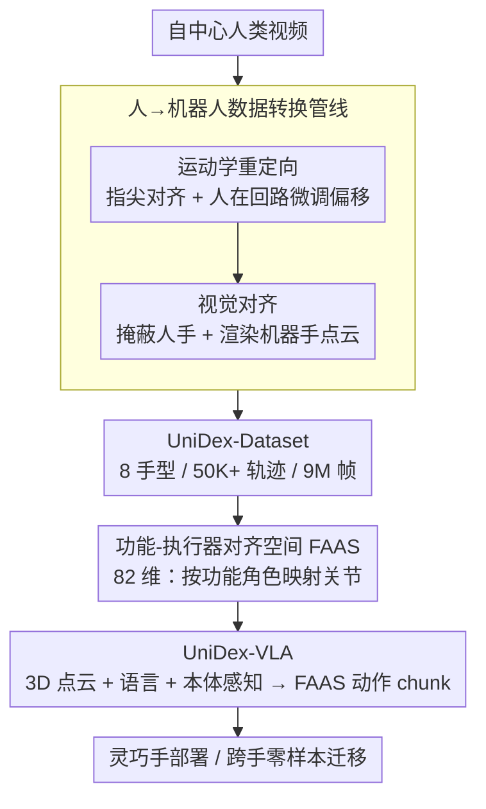

# UniDex: A Robot Foundation Suite for Universal Dexterous Hand Control from Egocentric Human Videos

**会议**: CVPR 2026  
**arXiv**: [2603.22264](https://arxiv.org/abs/2603.22264)  
**代码**: [https://unidex-ai.github.io/](https://unidex-ai.github.io/)  
**领域**: 人体理解  
**关键词**: 灵巧操作, VLA基础模型, 统一动作空间, 人类视频学习, 跨手迁移

## 一句话总结
提出UniDex机器人基础套件——包含跨8种灵巧手的大规模数据集（50K+轨迹/9M帧）、功能-执行器对齐的统一动作空间（FAAS）和3D VLA策略（UniDex-VLA），在真实世界工具使用任务上达到81%平均任务进度（vs π₀的38%），并展示了空间、物体和零样本跨手泛化能力。

## 研究背景与动机

1. **领域现状**：从示范中学习（Learning from Demonstrations）是当前视觉运动控制的主流范式。Vision-Language-Action（VLA）模型在抓取等任务上表现优秀，但大多针对平行夹爪，灵巧手的基础模型仍极为稀缺。

2. **现有痛点**：为灵巧手构建基础模型比夹爪难得多，面临三大挑战——(a) **数据稀缺**：灵巧手遥操作数据极其昂贵且难以大规模收集，缺乏可用于预训练的大规模数据集；(b) **具身异质性**：灵巧手种类繁多（6-24自由度，不同运动学结构），数据和策略难以跨手迁移；(c) **高维控制**：灵巧手动作空间维度远高于夹爪，需要更具表现力的动作表示和学习算法。

3. **核心矛盾**：灵巧手需要大规模多样化数据做预训练，但遥操作数据昂贵且手型特定；人类自然产生大量操控数据（自中心视频），但人手和机器手之间存在巨大的运动学和视觉差距。

4. **本文目标**：(a) 如何将人类自中心视频转化为机器人可执行的灵巧手轨迹？(b) 如何设计统一动作空间实现跨手迁移？(c) 如何构建灵巧手VLA基础模型？

5. **切入角度**：灵巧手设计的初衷就是模拟人手，功能上有对应关系。利用这种对应关系，从人手运动学重定向到机器手，同时在视觉上掩蔽人手并替换为机器手点云，大幅缩小运动学和视觉的domain gap。

6. **核心 idea**：通过人→机器人数据转换管线构建大规模多手型预训练数据集，设计功能对齐的统一动作空间FAAS实现跨手迁移，训练3D VLA基础模型用于通用灵巧操控。

## 方法详解

### 整体框架
UniDex由三部分组成：(1) **UniDex-Dataset**——从自中心人类视频转化来的机器人中心数据集，跨8种手型、50K+轨迹、9M帧；(2) **FAAS + UniDex-VLA**——功能-执行器对齐的统一动作空间和基于它训练的3D VLA策略；(3) **UniDex-Cap**——便携式人类数据采集装置，支持人-机数据共训练，减少遥操作成本。

### 关键设计

**1. 人→机器人数据转换管线：把人手视频"翻译"成机器手能执行的轨迹**

灵巧手遥操作数据太贵，但人类自己每天都在产生海量操控视频——问题是人手和机器手之间隔着两道鸿沟：运动学结构不一样，画面里看到的还是肉手。这条管线就是要同时填平这两道沟。先做**运动学重定向**：把指尖当作主要接触点，提取人手 $m$ 个指尖位置 $X^* = [x_1^*, ..., x_m^*]$，再给机器手挂一个 6-DoF 的对齐偏移 $T_{\text{offset}}$（dummy base），用 IK 求解关节角 $q$ 让机器手指尖去贴合人手指尖、同时保证接触在物理上说得通。这里不追求全自动——纯自动 IK 在接触区很容易解歪，于是把人放进回路：自动求解后给用户一个 GUI 滑块微调 $T_{\text{offset}}$，通常拨几下就收敛，成本极低却换来明显更干净的接触。重定向解决了"动作"，但画面里还是人手；于是再做**视觉对齐**：从 RGB-D 帧算出点云，用 WiLoR+SAM2 把人手分割掉并移除对应点，把重定向后的机器手 mesh 渲染进场景点云、再经针孔投影写回 RGB-D 帧。这样产出的预训练数据看到的就是机器手在操作物体，和下游真实机器人的视觉设置完全一致，"看到人手却要执行机器手动作"的域差被一并抹掉。

**2. 功能-执行器对齐空间（FAAS）：按"手指干什么"而不是"URDF怎么编号"来对齐动作**

要让 8 种手共享数据、互相迁移技能，必须有一套谁都能读的动作语言。难点在于灵巧手从 6 到 24 自由度、运动学结构各异，直接拼关节向量根本对不齐。FAAS 给出一个 82 维向量：前 18 维是双手腕部位姿（每手 9 维 = 6 维连续旋转表示 + 3 维平移），后 64 维是关节指令（每手 32 个槽位）。关键不在维度，而在映射规则——它按**功能角色**而非 URDF 序号安放执行器：功能相近的关节落进同一个 FAAS 索引，哪怕它们在不同手上编号完全不同。比如拇指、无名指的弯曲与外展关节，在 Oymotion（11 执行器）、Allegro（16）、Inspire（12）、Wuji（20）这四种手上都映射到同一组索引 {0,1,3,5,6}；多出来的槽位留给手型特有自由度和未来新手。相比之下，RDT-1B、π₀ 这类统一空间主要服务夹爪，EgoVLA 虽然尝试用人手参数当灵巧手表示，却要在后处理阶段补一次逆运动学、引入额外误差。FAAS 直接在功能层对齐、不需要任何后处理，对高自由度灵巧手更稳。

**3. UniDex-VLA：吃 3D 点云、吐 FAAS 动作的灵巧操控基础模型**

灵巧工具使用要推理 3D 几何和接触 affordance（剪刀刃从哪切、壶嘴往哪倒），2D 图像编码器把深度信息压没了，自然不够用。UniDex-VLA 沿用 π₀ 的骨架，输入彩色点云 $P_t$、语言指令 $\ell_t$ 和本体感知 $q_t$，输出 $H$ 步动作 chunk $A_t = [a_t, ..., a_{t+H-1}]$，但把 π₀ 里的 SigLIP 2D 编码器整个换成 Uni3D 点云编码器——它是 ViT 结构、从 2D 预训练 ViT 初始化，并已把点云特征对齐到图文对齐空间，因此一上手就是个强 3D 编码器，恰好接住前面管线产出的点云数据。腕部动作用相对表示（相对 action chunk 首帧），训练目标是 conditional flow-matching，正好适合给高维灵巧动作做生成式建模。整套先在 UniDex-Dataset 上跨 8 手型预训练拿到运动先验，再用每任务少量示范微调即可上岗。

### 损失函数 / 训练策略
使用conditional flow-matching目标训练，推理时通过forward-Euler积分生成去噪的action chunk。预训练在UniDex-Dataset上（跨8手型），微调每任务仅需50条遥操作示范。UniDex-Cap支持人-机数据共训练，实验表明人-机数据交换比约2:1（两条人类示范≈一条机器人示范）。

## 实验关键数据

### 主实验
5个真实世界工具使用任务（每任务20次试验）：

| 模型 | 平均任务进度 | 最终成功率 |
|------|-------------|-----------|
| Diffusion Policy | 29.0% | 22.0% |
| DP3 | 35.0% | 30.0% |
| π₀ | 38.0% | 35.0% |
| UniDex-VLA (No Pretrain) | 32.5% | 23.0% |
| **UniDex-VLA** | **81.0%** | **76.0%** |

最难的"用剪刀剪袋子"任务上相对最佳baseline提升84.6%。

### 消融/泛化实验

| 泛化类型 | 实验 | 结果 |
|----------|------|------|
| 空间泛化 | 壶和滴漏器OOD位置 | UniDex-VLA保持高成功率，+DemoGen增强后接近完美 |
| 物体泛化 | 换颜色/大小不同的壶 | UniDex-VLA保持强性能 |
| 跨手零样本 | Inspire训练→Oymotion部署 | 60%成功率 vs baseline≈0% |
| 跨手零样本 | Inspire训练→Wuji部署 | 40%成功率 vs baseline≈0% |
| 人-机共训练 | 50 robot + human demos | 2:1交换比，人类数据采集快5.2× |

### 关键发现
- 预训练效果巨大：UniDex-VLA vs No Pretrain（81% vs 32.5%），说明大规模多手型预训练为灵巧操控提供了strong motion prior
- FAAS使零样本跨手迁移成为可能：Inspire→Oymotion 60%、→Wuji 40%，而baseline≈0%，证明功能对齐的动作空间确实保留了可迁移的技能语义
- 人-机数据共训练性价比高：1条机器人demo≈2条人类demo，人类数据采集快5.2倍，实际成本约1:2.6的交换效率
- 3D点云输入使空间泛化自然进行（通过几何编辑做数据增强）

## 亮点与洞察
- **FAAS的功能对齐设计**：不按URDF关节序号而按功能角色映射，简单但极其有效。这种思路可推广到其他异构机器人具身的统一控制（如不同构型的双臂系统）
- **人在回路的轻量级重定向**：不追求全自动化，而是通过GUI滑块让人用几次调整即可保证接触合理性，以极低成本换取高质量数据
- **50条示范即可微调**：得益于大规模预训练，下游任务仅需极少量real demo，大幅降低部署门槛

## 局限与展望
- 尚未利用大规模无动作标注的自中心活动数据集（如Ego4D），这些数据虽无精确手部标注但视觉多样性极高，可进一步扩展预训练
- 当前评估集中在工具使用任务，精细的手内重定向和in-hand manipulation未涉及
- FAAS的32关节槽位预留可能不够灵活，更高自由度的新手型可能需要重新设计映射
- 人-机共训练的效果依赖于重定向质量，非接触式操作（如按键、滑动）的重定向效果有待验证

## 相关工作与启发
- **vs π₀**: π₀在灵巧手上仅38%任务进度，因为预训练用的夹爪数据对灵巧手几乎无帮助。UniDex-VLA通过灵巧手专用预训练数据实现81%，差距显著
- **vs EgoVLA**: EgoVLA用人手参数做灵巧手表示，但需要后处理IK引入额外误差。FAAS直接输出关节角，后处理free
- **vs RDT-1B**: RDT-1B保留语义结构的动作空间主要针对夹爪，未处理多自由度灵巧手的功能对齐问题

## 评分
- 新颖性: ⭐⭐⭐⭐⭐ 首个跨8种灵巧手的大规模基础套件，FAAS设计巧妙，人-机共训练有创新
- 实验充分度: ⭐⭐⭐⭐⭐ 5个真实任务、多种泛化测试、定量人-机共训练分析，实验极其充分
- 写作质量: ⭐⭐⭐⭐ 论文组织良好，系统级工作写得清晰有条理
- 价值: ⭐⭐⭐⭐⭐ 对灵巧手基础模型研究有里程碑意义，数据集+模型+采集装置全套开源潜力巨大

<!-- RELATED:START -->

## 相关论文

- [\[CVPR 2026\] E-3DPSM: A State Machine for Event-Based Egocentric 3D Human Pose Estimation](e-3dpsm_a_state_machine_for_event-based_egocentric_3d_human_pose_estimation.md)
- [\[ECCV 2024\] 3D Hand Pose Estimation in Everyday Egocentric Images](../../ECCV2024/human_understanding/3d_hand_pose_estimation_in_everyday_egocentric_images.md)
- [\[CVPR 2026\] TriLite: Efficient WSOL with Universal Visual Features and Tri-Region Disentanglement](trilite_efficient_weakly_supervised_object_localization_with_universal_visual_fe.md)
- [\[CVPR 2026\] EgoPoseFormer v2: Accurate Egocentric Human Motion Estimation for AR/VR](egoposeformer_v2_accurate_egocentric_human_motion_estimation_for_arvr.md)
- [\[CVPR 2026\] Editing Physiological Signals in Videos Using Latent Representations](editing_physiological_signals_in_videos_using_latent_representations.md)

<!-- RELATED:END -->
