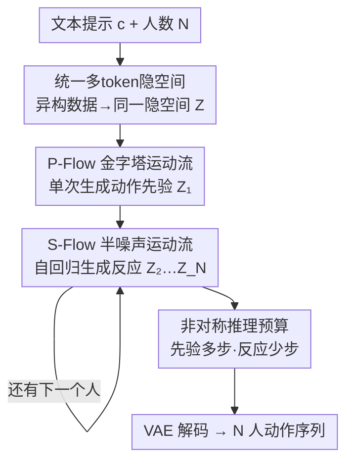

# Unified Number-Free Text-to-Motion Generation Via Flow Matching

**会议**: CVPR 2026  
**论文**: [CVF Open Access](https://openaccess.thecvf.com/content/CVPR2026/html/Huang_Unified_Number-Free_Text-to-Motion_Generation_Via_Flow_Matching_CVPR_2026_paper.html)  
**代码**: https://githubhgh.github.io/umf/ （项目页）  
**领域**: 文本到动作生成 / 人体理解  
**关键词**: 多人动作生成、Flow Matching、金字塔流、误差累积、异构数据统一

## 一句话总结
UMF 用一个统一的多 token 隐空间把单人和多人动作数据集打通，再用「金字塔运动流（P-Flow）单次生成动作先验 + 半噪声运动流（S-Flow）多次自回归生成反应」的 1+N 范式，在文本驱动的「任意人数」多人动作生成上做到 SOTA（InterHuman FID 4.772），同时推理比 FreeMotion 快约 5 倍。

## 研究背景与动机
**领域现状**：文本到动作生成（text-to-motion）这两年靠扩散模型快速进步，但绝大多数工作只能处理**固定人数**——要么单人（HumanML3D 路线），要么严格的双人交互（InterHuman 路线）。一旦人数变成「任意值」（number-free，即 1、2、3、…、N 人），现有模型就抓瞎。

**现有痛点**：想生成「任意人数」的多人动作，主流做法（如 FreeMotion）是**自回归**——先生成一个人的动作先验，再以它为条件、一个接一个地递归生成后续人的反应动作。这条路有两个硬伤：① **效率低**，每个人都要跑一遍完整的扩散/采样，人一多开销爆炸；② **误差累积**，自回归把前面生成的（可能有瑕疵的）动作当成静态条件喂给后面，错误一路滚雪球，人越多越崩。

**核心矛盾**：多人交互数据本身又少又不够多样（InterHuman 只有 7779 条交互序列），而单人数据相对丰富（HumanML3D 有 14616 条）。但两类数据集的**表示格式不兼容**——单人数据用规范化（canonical）骨架，交互数据用非规范化表示，没法直接合到一个生成框架里训练。于是「数据稀缺」和「想训通用模型」之间形成死结。

**本文目标**：做一个真正的 generalist 模型，既能吃异构（单人 + 多人）数据联合训练，又能在推理时生成任意人数的动作，还要躲开自回归的低效和误差累积。

**切入角度**：作者把问题拆成两段——「单次生成一个高质量动作先验」+「多次生成对它的反应」。关键观察有二：（1）扩散/流模型在**早期时间步**上样本很噪、信息量低，没必要在全分辨率上算；（2）自回归之所以累积误差，是因为把已生成动作当**静态条件**，模型只会被动跟随、捕捉不到交互的因果关系。

**核心 idea**：用 Flow Matching 统一两段生成——动作先验段用「金字塔流」按噪声等级分层降分辨率，省算力；反应段不再把上下文当静态条件，而是把它当成反应生成路径的**自适应起点**，并额外学一条「上下文重建」路径做正则，从而既高效又抗误差累积。

## 方法详解

### 整体框架
UMF（Unified Motion Flow）的输入是一段文本提示 $c$ 和目标人数 $N$，输出是 $N$ 个人协同的 SMPL 骨架动作序列。整条管线分三段串行：先用一个**统一多 token VAE** 把异构数据集编码进同一个隐空间 $Z$；再用 **P-Flow** 在隐空间里单次生成第一个人的动作先验 $\hat{Z}_1$；最后用 **S-Flow** 以已生成的动作为上下文，自回归地一个个生成后续人的反应 $\hat{Z}_2,\dots,\hat{Z}_N$，最后 VAE 解码回原始动作空间。这就是论文反复强调的「1 次先验 + N 次反应」的 1+N 范式。

### 关键设计

**1. 统一多 token 隐空间：把单人和多人数据集焊到一个空间里训练**

这一步直接针对「异构数据格式不兼容、多人数据稀缺」的痛点。作者先做数据归一化：把单人动作统一转成 22 关节的**非规范化 SMPL 骨架**，再把每条多人交互样本拆成多条单人序列——这样所有数据都变成「一个人的动作序列」这一种格式，单人和多人数据就能喂进同一个 VAE。VAE 用带 skip connection 和 layer norm 的 transformer 编解码器（类似 TEMOS），把一段动作 $x^{1:N}_I\in\mathbb{R}^{N\times D}$ 压成隐表示 $z\in\mathbb{R}^{p\times r}$，并用重参数化技巧采样。

真正的巧思在「多 token + latent adapter」。过去的隐空间动作扩散用**单 token**（如 $1\times256$），重建是瓶颈；可单纯加 token 数（如 $16\times256$）虽然重建变好，却会**拖垮生成质量**。UMF 借鉴 latent adapter 的思路把「内部 token 表示」和「最终隐维度」解耦：VAE 编码器先用大 token（$16\times256$）抓住动作细节，再投影到一个紧凑、语义稠密的小空间（$16\times32$）供生成用，兼顾重建容量和生成质量。VAE 训练损失在 MSE + KL 之外还加了几何损失，提升物理合理性并保住个体间的交互关系：

$$\mathcal{L}_\text{VAE} = \mathcal{L}_\text{geometric} + \mathcal{L}_\text{reconstruction} + \lambda_\text{KL}\,\mathcal{L}_\text{KL}.$$

消融里 w/o LA、w/o MT 都明显掉点，证明这个解耦设计是多 token 流匹配能跑通的关键。

**2. P-Flow 金字塔运动流：让动作先验在一个 transformer 里按噪声等级分层降分辨率**

多 token 隐空间换来了表达力，代价是算力变大。P-Flow 抓住「早期时间步样本噪、信息量低」这个事实——既然早期没必要全分辨率，那就在早期用低分辨率、晚期才回到原分辨率。过去的级联模型为不同分辨率训多个模型，徒增复杂度；P-Flow 把整条高斯流匹配轨迹**重新解释成一个 transformer 内部的分层阶段**，每个阶段的分辨率对应一段时间步，只有最后一个阶段用原分辨率。

具体地，它把 $[0,1]$ 切成 $K$ 个时间窗，每个窗在相邻两个分辨率之间做分段流（piecewise flow）。对第 $k$ 个窗 $[s_k, e_k]$，端点与噪声 $\epsilon\sim\mathcal{N}(0,I)$、数据点 $z_1$ 耦合采样：

$$\hat{z}_{s_k} = s_k\,\mathrm{Up}(\mathrm{Down}(z_1, 2^k)) + (1-s_k)\epsilon,\qquad \hat{z}_{e_k} = e_k\,\mathrm{Down}(z_1, 2^{k-1}) + (1-e_k)\epsilon.$$

这里 $\mathrm{Up}(\mathrm{Down}(z,2))$ 是 $z$ 的有损近似，逼着模型去学不同分辨率之间的关联；整条路径从纯噪声（$k=K$）一路走到数据点（$k=1$）。窗内的流按 $\hat{z}_t = t'\hat{z}_{e_k} + (1-t')\hat{z}_{s_k}$ 演化（$t'$ 是重缩放时间步），并通过让噪声同向来「拉直」轨迹。模型在 $\hat{z}_{e_k}-\hat{z}_{s_k}$ 上做速度场回归：

$$\mathcal{L}_\text{P-Flow} = \mathbb{E}\big\|G^P_\theta(\hat{z}_t; t, c) - (\hat{z}_{e_k}-\hat{z}_{s_k})\big\|^2.$$

由于计算集中在低分辨率，理论上把开销降到约 $1/K$。采样时跨阶段「跳点」要保证概率路径连续，作者用一套「重缩放 + 重加噪」方案 $\hat{z}_{s_{k-1}} = \frac{s_{k-1}}{e_k}\mathrm{Up}(\hat{z}_{e_k}) + \alpha n'$（$n'\sim\mathcal{N}(0,\Sigma')$，块对角协方差），并推导出 $e_k = 2s_{k-1}/(1+s_{k-1})$、$\alpha = \sqrt{3}(1-s_{k-1})/2$ 来匹配跳点前后的均值和协方差。

**3. S-Flow 半噪声运动流：把上下文从「静态条件」变成「反应路径的自适应起点」，并加一条重建路径压住误差累积**

反应生成是自回归误差累积的重灾区。过去靠 ControlNet 之类的确定性条件机制把已生成动作当**静态条件**塞给模型，抓不住交互主体之间的因果关系。S-Flow 换了个思路：不把已生成动作当条件，而是把它们**整合成上下文分布、当作反应生成流路径的起点**，让模型直接去学「上下文 → 反应」这个动态变换。

它同时优化两条概率路径：（1）**反应变换路径**，在上下文 $w_0=C$ 和目标反应 $w_1=W$ 之间插值 $w^\text{react}_t = tw_1 + (1-t)w_0$，目标是 $\mathcal{L}_\text{trans} = \mathbb{E}\|G^S_\theta(w^\text{react}_t, t, c) - (W-C)\|_2^2$；（2）**上下文重建路径**，在高斯噪声 $\epsilon$ 和上下文 $C$ 之间插值 $w^\text{cont}_t = tw'_1 + (1-t)w'_0$，目标是 $\mathcal{L}_\text{recon} = \mathbb{E}\|G^S_\theta(w^\text{cont}_t, t, c) - (C-\epsilon)\|_2^2$。总损失 $\mathcal{L}_\text{S-Flow} = \mathcal{L}_\text{trans} + \lambda_\text{recon}\mathcal{L}_\text{recon}$。

第二条「从噪声重建上下文」的辅助路径是关键——它逼 S-Flow 在全局层面理解上下文，做反应预测时不至于只顾眼前、忽略整体交互依赖，从而平衡「反应预测」和「上下文感知」，降低误差累积。上下文本身由一个 transformer 编码器 $C_i = \mathrm{TranEnc}(\mathcal{Z}_\text{gen})$ 从所有已生成动作聚合而来（$i>2$ 时再做 agent-wise 平均池化压成简洁的全局上下文），这个**上下文适配器**保留了对整段上下文的全局视野，比 ControlNet 那种条件机制灵活得多——消融里去掉上下文适配器 FID 从 4.772 暴涨到 7.038。

**4. 非对称推理预算 + P/S 独立 backbone：按「先验定上限」分配算力，并拒绝共享参数**

这是把效率优势落地的工程设计。生成 $N$ 个人要跑 1 次 P-Flow + $N-1$ 次 S-Flow，而**动作先验的质量决定了所有后续反应的上限**，所以预算应该非对称分配：给 P-Flow 多步（如 50 步，靠金字塔结构仍然便宜），其中绝大多数（如 45 步）放在低分辨率；给每次 S-Flow 极少步（如 10 步），这样 $N$ 变大时总开销仍可控。作者还发现 P-Flow 对总步数敏感、但对「低/高分辨率步数比例」不敏感，这正好支持把步数堆在低分辨率上。

另外，作者明确**不共享** P-Flow 和 S-Flow 的 transformer backbone（虽然共享能省参数）。原因有二：① P-Flow 只学「噪声→动作」，S-Flow 要同时学「动作→动作」和「噪声→动作」，两类任务不兼容、难一起优化；② P-Flow 跳点的连续性保证依赖可解析的（高斯）分布，而 S-Flow 跑在均值方差都不可解析的复杂动作分布上。消融（Table 5）显示共享 backbone FID 从 4.772 恶化到 6.206，印证了分开的必要。S-Flow 的 transformer 则在自回归生成各个后续 agent 时被复用。

### 损失函数 / 训练策略
三阶段分开训：VAE 阶段用 $\mathcal{L}_\text{VAE}$（几何 + 重建 + KL）训 6K epochs，P-Flow 训 2K epochs，S-Flow 训 2K epochs。优化器 AdamW，初始学习率 $10^{-4}$ + 余弦衰减，VAE 阶段 batch 128、流匹配阶段 batch 64。S-Flow 只在多人数据集上训。

## 实验关键数据

### 主实验
在 InterHuman 测试集（Table 1）上，UMF 相对 generalist 基线 FreeMotion 大幅领先，并在专门为双人定制的方法中也很有竞争力：

| 数据集 | 方法 | R Top3↑ | FID↓ | MM Dist↓ | Diversity→ |
|--------|------|---------|------|----------|------------|
| InterHuman | Ground Truth | 0.701 | 0.273 | 3.755 | 7.948 |
| InterHuman | FreeMotion（generalist 基线） | 0.544 | 6.740 | 3.848 | 7.828 |
| InterHuman | InterMask（最强 specialist） | 0.683 | 5.154 | 3.790 | 7.944 |
| InterHuman | TIMotion（specialist） | **0.724** | 5.433 | 3.775 | 8.032 |
| InterHuman | **UMF（本文）** | 0.694 | **4.772** | 3.784 | **8.039** |

相对 FreeMotion，UMF 把 Top3 R-Precision 提升 28%、FID 降低 29%；相对最强 specialist InterMask，FID 再优 7%，R-Precision/MM-Dist 取得第二好——一个 generalist 能压过专门为双人调的模型，是这篇最硬的结果。在 InterHuman-AS（动作–反应合成，Table 2）上，UMF 的 Top3 R-Precision 0.530 比 ReGenNet 的 0.407 高 30% 以上，MM Dist 4.987 比 6.860 降 27%。

### 消融实验

| 配置 | InterHuman FID↓ | InterHuman RTop3↑ | 说明 |
|------|------|------|------|
| UMF (Full, HP+LA+MT) | **4.772** | 0.694 | 完整模型 |
| w/o LA（去 latent adapter） | 5.473 | 0.627 | 多 token 流匹配失去解耦，掉点 |
| w/o MT（退回单 token） | 5.231 | 0.655 | 单 token 容量不足 |
| w/o HP（去单人异构先验） | 4.933 | 0.651 | 去掉单人数据增益，FID 略升 |
| UMF w. Shared Transformer | 6.206 | 0.644 | P/S 共享 backbone，明显恶化 |
| UMF w. ControlNet | 6.868 | 0.637 | 用 ControlNet 替上下文适配器 |
| UMF w/o Context Adapter | 7.038 | 0.642 | 去掉上下文适配器，最差 |
| UMF w. Noise-Free path | 5.617 | 0.646 | 只学反应路径、不管误差累积 |
| UMF w/o $\mathcal{L}_\text{recon}$ | 5.765 | 0.649 | 去掉重建正则，掉点 |

效率上（Table 4），UMF 在与 FreeMotion 相同 60 步推理下，FLOPs 140.3G vs 217.8G，AITS 0.623s vs 3.059s（约 5× 加速）；非对称步数分配（$T_{P2}=45, T_{P1}=5$）在速度-质量权衡上最优，优于对称分配（$25/25$，206G FLOPs）。

### 关键发现
- **上下文适配器贡献最大**：去掉它 FID 从 4.772 飙到 7.038，是所有消融里掉得最狠的——说明「把上下文当自适应起点 + 全局重建」才是 S-Flow 抗误差累积的核心，而非简单换个条件机制。
- **单人异构先验确实有用但增益温和**：加上 HumanML3D 先验后文本贴合度和保真度都提升（w/o HP 时 InterHuman FID 4.933→4.772），作者归因于单/多人生成目标之间存在「复杂度鸿沟」，跨数据集迁移本身有难度。
- **P-Flow 对步数总量敏感、对分辨率步数比例不敏感**：这条经验直接支撑了「把步数堆在低分辨率」的非对称预算策略，是 5× 加速的来源。
- **金字塔必须是时间维度而非盲目空间降采样**：UMF-PFS（空间金字塔变体）FID 反而恶化到 7.238，说明降分辨率的维度选择很关键。

## 亮点与洞察
- **把上下文从「静态条件」改成「流的起点」是个可迁移的范式**：自回归生成里普遍存在「前一步当条件喂下一步」的误差累积，UMF 证明「让上下文当生成路径的自适应起点 + 加一条上下文重建辅助路径」比 ControlNet 式硬条件更抗累积——这个思路在视频生成、长序列生成等任何自回归扩散场景都值得借鉴。
- **金字塔流塞进单个 transformer**：用「时间步 = 分辨率阶段」把级联多模型的复杂度收进一个模型，并用跳点处的重缩放+重加噪保证概率路径连续，这套数学处理很干净，是省 5× 算力的关键。
- **数据格式归一化看似朴素却是 generalist 的地基**：把多人交互拆成多条单人序列、统一成非规范化 SMPL，使得单人海量数据能直接补足多人数据稀缺——「先统一格式再统一模型」的工程直觉很值得复用。
- **「先验定上限」的非对称预算**：意识到 1+N 范式里先验质量是天花板，于是把算力压在先验、反应只给极少步，这是把架构洞察直接变成效率的范例。

## 局限与展望
- **作者承认的局限**：1+N 范式虽然增强了泛化，但 UMF 仍局限于「中等规模、以一个主 agent 为中心」的群体交互（约 10 人级别），还做不到密集人群（约 100 人）。未来想借大规模视频扩散模型的视觉先验来扩展到稠密人群。
- **多人 ≥3 人几乎没有定量评测**：由于 SMPL 标注的 ≥3 人交互数据极度稀缺，模型主要在双人场景训练和评测，群体场景（N>2）只能靠 30 人参与的 user study 做零样本验证——缺乏客观指标，泛化能力的证据相对软。
- **单人异构先验增益有限**：跨数据集迁移存在「复杂度鸿沟」，单人数据带来的提升较温和（FID 4.933→4.772），说明「单人数据补多人」这条路还没吃满，可能需要更对齐的表示或迁移策略。
- **三阶段分开训、流程偏重**：VAE / P-Flow / S-Flow 各训数千 epoch 且互不共享 backbone，端到端联合训练或参数共享被证明会掉点，整体训练成本和工程复杂度不低。

## 相关工作与启发
- **vs FreeMotion**：同样做 number-free，FreeMotion 在原始动作空间上自回归、用 ControlNet 式条件解耦先验与反应，受困于低效和误差累积；UMF 在统一多 token 隐空间上做、用金字塔流省算力、用半噪声流的双路径抗累积，FID（4.772 vs 6.740）、R-Precision 全面领先且快约 5×。
- **vs InterMask / TIMotion（双人 specialist）**：它们为双人场景专门设计，TIMotion 在 R-Precision 上仍最强（0.724）；但 UMF 作为 generalist 在 FID 上反超 InterMask 7%，证明统一框架不必以牺牲质量换泛化。
- **vs ReGenNet（动作–反应合成）**：在 InterHuman-AS 上 UMF 的 Top3 R-Precision +30%、MM Dist −27%，靠的是把反应建模成上下文驱动的概率路径而非确定性回归。
- **vs Jiang et al. 的 noise-free flow**：后者直接学「动作→反应」的无噪声映射、只有反应路径，忽略了自回归的误差累积；UMF 多加的上下文重建路径正是补这个洞（消融里 noise-free 变体 FID 5.617 vs UMF 4.772）。

## 评分
- 新颖性: ⭐⭐⭐⭐ 「金字塔流单模型 + 半噪声流双路径抗累积」两个组件都不是简单拼接，把上下文从条件改成流起点的思路有迁移价值。
- 实验充分度: ⭐⭐⭐⭐ 主实验 + 三张消融把每个组件都拆开验证，效率分析到位；但 ≥3 人群体场景只有 user study、缺客观指标。
- 写作质量: ⭐⭐⭐⭐ 动机—方法—justification 链条清晰，公式和算法伪代码完整，金字塔跳点的处理交代得很细。
- 价值: ⭐⭐⭐⭐ 给「任意人数」文本到动作生成提供了一个高效且 SOTA 的 generalist 框架，对机器人/VR 多人动画有实用意义。

<!-- RELATED:START -->

## 相关论文

- [\[CVPR 2026\] MotionHiFlow: Text-to-Motion via Hierarchical Flow Matching](motionhiflow_text-to-motion_via_hierarchical_flow_matching.md)
- [\[ECCV 2024\] FreeMotion: A Unified Framework for Number-free Text-to-Motion Synthesis](../../ECCV2024/human_understanding/freemotion_a_unified_framework_for_number-free_text-to-motion_synthesis.md)
- [\[CVPR 2026\] FMPose3D: monocular 3D pose estimation via flow matching](fmpose3d_monocular_3d_pose_estimation_via_flow_matching.md)
- [\[CVPR 2026\] ProjFlow: Projection Sampling with Flow Matching for Zero-Shot Exact Spatial Motion Control](projflow_projection_sampling_with_flow_matching_for_zero-shot_exact_spatial_moti.md)
- [\[CVPR 2026\] Gaussian-Mixture Latent Flow for Stochastic 3D Human Motion Prediction](gaussian-mixture_latent_flow_for_stochastic_3d_human_motion_prediction.md)

<!-- RELATED:END -->
