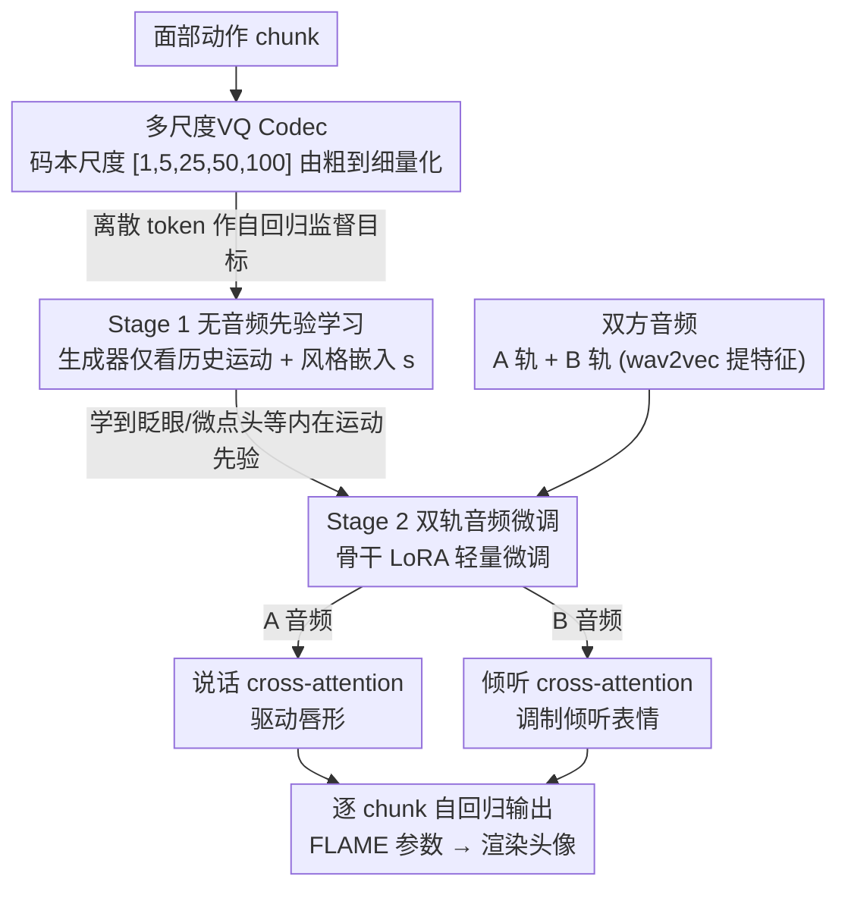

# UniLS: End-to-End Audio-Driven Avatars for Unified Listening and Speaking

**会议**: CVPR 2026  
**arXiv**: [2512.09327](https://arxiv.org/abs/2512.09327)  
**代码**: 无  
**领域**: 人体理解  
**关键词**: 对话虚拟人, 说话-倾听统一生成, 音频驱动, 面部动画, 两阶段训练

## 一句话总结
提出首个端到端统一说话-倾听面部表情生成框架UniLS，通过两阶段训练范式（先学内在运动先验、再用双轨音频微调），仅需双方音频输入即可同时生成自然的说话和倾听面部动作，倾听指标提升高达44.1%。

## 研究背景与动机

1. **领域现状**：对话虚拟人领域的大多数系统仍然是单向的——要么只做说话生成（speech-driven），要么只做倾听生成（listener generation）。真正的交互需要虚拟人同时具备说话和倾听两种模式。

2. **现有痛点**：
    - **说话-only方法**（如FaceFormer、CodeTalker、ARTalk）：虽然能生成高质量的说话面部动作，但完全忽略了倾听行为，无法在对话场景中使用。
    - **唯一的说话-倾听方法DualTalk**：依赖说话者A的预计算面部序列来生成说话者B的动作，不是端到端的，需要额外的动作获取/生成流水线，无法实时部署。
    - **直接端到端联合训练失败**：导致倾听表情变得僵硬、不自然（"poker face"现象）。

3. **核心矛盾**：说话动作与音频有强相关性（音素-唇形对齐），但倾听动作与对方音频的相关性很弱——倾听时的眨眼、点头、微表情主要来自内在运动先验，而非外部语音信号。这种音频-动作相关性的不平衡导致联合训练中倾听分支崩溃到低方差的安全静态先验。

4. **本文目标** 设计一个端到端框架，仅用双方音频就能同时生成说话者A和B的说话+倾听面部动作，关键挑战是解决倾听表情的僵硬问题。

5. **切入角度**：将倾听行为重新理解为"内在运动先验"与"外部音频调制"的组合——人的倾听表情首先遵循自身的运动模式（如眨眼频率、微妙点头），然后才受外部语音的调制。

6. **核心 idea**：通过两阶段训练——先无音频学运动先验、再用双轨音频微调——将倾听的内在动力学和外部音频调制解耦学习，彻底解决端到端倾听僵硬问题。

## 方法详解

### 整体框架
UniLS要解决的问题是：只给两路音频（说话者A和说话者B各一轨），就同时生成A的说话面部动作和B的倾听面部动作，而且倾听不能僵成"poker face"。整体是一个chunk级别的自回归模型——把面部动作切成时间块，逐块预测下一块。输出不是像素，而是FLAME参数（表情参数 $\psi$ 和姿态参数 $\theta$）描述的3D面部，最后渲染成头像。

关键在于训练拆成两阶段，且顺序不能颠倒。底层先训一个多尺度VQ codec，把连续面部动作压成离散token，给自回归生成器当监督目标；然后Stage 1在**没有音频**的条件下训生成器，逼它学会自然面部的内在节律；最后Stage 2才接入双轨音频做微调。这套"先无音频建先验、再用音频调制"的顺序，正是为了不让强势的说话音频信号在训练里把弱势的倾听分支压垮。

### 关键设计

**1. 多尺度VQ Codec：把面部动作离散成既细又连贯的token**

自回归生成器需要一个离散的监督目标，但面部动作在不同时间尺度上同时含有快变（唇形、眨眼）和慢变（头部姿态漂移）成分，单一分辨率的量化要么丢细节要么丢连贯。这里的做法是逐层、由粗到细地量化：Transformer encoder先把动作chunk $M$ 编成时序特征 $\mathbf{f}$，再用一组尺度依次为 $[1, 5, 25, 50, 100]$ 的码本逐层逼近。每一层先量化再插值回原长度，并把已表示的部分从残差里减掉——

$$\mathbf{c}^{(l+1)} = \text{Interp}(\text{Quant}(\mathbf{f}^{(l)}), k_l), \qquad \mathbf{f}^{(l+1)} = \mathbf{f}^{(l)} - \mathbf{c}^{(l+1)}$$

粗尺度先抓住整体走向，细尺度再补上局部抖动（码本256条、每维64）。这样得到的token既保真又时间连贯，为后面的自回归预测打好底。

**2. Stage 1 无音频先验学习：让模型先学会"人本来就会的脸"**

这一步直接针对核心矛盾——倾听时的眨眼、微点头、微表情主要来自人自身的运动习惯，而非对方的语音；如果一开始就让音频参与，倾听分支会偷懒收敛到一个低方差的静态安全解。所以Stage 1**刻意不给任何音频**，生成器 $\mathcal{G}$ 只看历史运动chunk和一个编码说话人个体习惯的风格嵌入 $\mathbf{s}$，预测下一块：

$$\hat{M}_{t:2t} = \mathcal{G}(M_{1:t}, \mathbf{s}), \qquad \mathcal{L} = \sum_{t=1}^{T} \lVert \hat{M}_{t:2t} - M_{t:2t} \rVert$$

训练数据用的是新闻、访谈、直播、日常对话等多场景的非配对视频（546.5小时），目的是让模型见够各种自然面部行为，建立起对眨眼频率、微妙头动这类内在动力学的先验。这份先验后面就是倾听表情的"地基"，不应被音频接管。

**3. Stage 2 双轨音频微调：用两个独立cross-attention区分"我说"和"对方说"**

有了运动先验，Stage 2才在配对对话数据上接入音频，让说话受自己的语音驱动、倾听受对方的语音调制。难点是这两路音频功能完全相反却要同时进网络。做法是在每个Transformer块里新增**两个**cross-attention：一个只看说话者A的音频特征 $\mathbf{a}^A$（管说话），另一个只看说话者B的音频特征 $\mathbf{a}^B$（管倾听），生成变成

$$\hat{M}_{t:2t} = \mathcal{G}(M_{1:t}, \mathbf{a}^A_{1:t}, \mathbf{a}^B_{1:t}, \mathbf{s})$$

音频特征由冻结的wav2vec编码器提取。之所以要拆成两路而不是把两段音频混进一个cross-attention，是因为混合后模型分不清哪段语音该驱动唇形，说话质量会断崖式下跌（LVE从5.83劣化到11.48）。同时，骨干网络只用LoRA做轻量微调、新增的两个cross-attention从头训——这样Stage 1学到的运动先验被保护住，不会因为过拟合音频而把倾听的多样性又抹平回去。

### 损失函数 / 训练策略
两个阶段都用chunk-wise自回归重建损失。Stage 1在4卡H200上训练约10 GPU小时，Stage 2训练约30 GPU小时；优化器AdamW，学习率1e-4，batch size 128，共200K迭代。

## 实验关键数据

### 主实验
在Seamless Interaction数据集测试集上评估说话和倾听性能。

| 方法 | LVE↓ | MHD↓ | 说话FDD↓ | 说话PDD↓ | 说话JDD↓ | 倾听FDD↓ | 倾听PDD↓ | 倾听JDD↓ | F-FID↓ | P-FID↓ |
|------|------|------|---------|---------|---------|---------|---------|---------|--------|--------|
| DiffPoseTalk | 9.48 | 2.96 | 32.66 | 7.89 | 1.40 | - | - | - | - | - |
| ARTalk | 7.46 | 2.12 | 31.64 | 7.66 | 1.19 | - | - | - | - | - |
| ARTalk* | 6.79 | 2.02 | 27.41 | 8.55 | 0.81 | 30.62 | 9.52 | 1.53 | 10.78 | 0.072 |
| DualTalk | 6.35 | 1.95 | 37.46 | 9.70 | 1.02 | 43.58 | 10.71 | 2.02 | 13.14 | 0.079 |
| **UniLS** | **5.83** | **1.89** | **18.41** | **4.67** | **0.71** | **17.12** | **4.75** | **0.98** | **4.30** | **0.038** |

### 消融实验

| 配置 | LVE↓ | MHD↓ | 倾听FDD↓ | F-FID↓ | 说明 |
|------|------|------|---------|--------|------|
| 单cross-attention | 11.48 | 3.00 | 27.46 | 5.97 | 混合音频导致说话严重退化 |
| 无Stage 1 | 6.32 | 2.02 | 25.64 | 5.97 | 无运动先验导致倾听僵硬 |
| 无多场景数据 | 6.26 | 1.99 | 17.81 | 4.62 | 数据多样性对倾听有帮助 |
| 完整UniLS | **5.83** | **1.89** | **17.12** | **4.30** | 所有组件协同最优 |

### 关键发现
- **倾听指标提升巨大**：UniLS的F-FID (4.30) 相比DualTalk (13.14) 降低了67.3%，P-FID降低51.9%，说明生成的倾听动作的分布与真实分布更接近。
- **说话精度也是SOTA**：LVE 5.83是最低的，说明唇形同步精度最好。
- **双cross-attention至关重要**：单cross-attention导致LVE几乎翻倍（5.83→11.48），因为模型无法区分混合音频流中的说话/倾听信号。
- **Stage 1不可或缺**：去掉Stage 1后倾听FDD从17.12升至25.64（增50%），验证了运动先验学习对解决倾听僵硬的核心作用。
- 用户研究中25人参与者对DualTalk的倾听偏好高达91.35%。

## 亮点与洞察
- **"音频-动作相关性不平衡"的分析非常精准**：通过t-SNE可视化清晰展示了说话音频与运动特征的强对齐vs倾听音频的弱对齐，定位了问题本质。这个insight比直接的方法设计更有价值。
- **两阶段解耦设计简洁有效**：先学运动先验再用LoRA微调，既保护了多样性又引入了音频控制，是一个非常优雅的方案。这种"先建先验再微调"的思路可以迁移到其他存在多模态不平衡的任务。
- **第一个端到端说话-倾听框架**：直接用双轨音频驱动，不需要预生成对方的面部序列，具有明确的实际应用价值（实时对话系统）。

## 局限与展望
- 目前只处理面部动作（FLAME参数），未涉及身体姿态和手势，完整的对话虚拟人需要全身动作。
- 倾听行为的评估指标主要是分布性指标（FID等），缺乏对倾听反应"时机"和"语义相关性"的评估——是否在正确时刻做出恰当反应。
- 训练需要大规模配对对话数据（657.5小时），数据获取成本较高。
- 未探讨多人对话场景（>2人）的扩展。

## 相关工作与启发
- **vs DualTalk**：DualTalk需要预计算说话者A的面部序列，非端到端，本文仅用双轨音频即可。倾听F-FID从13.14降至4.30。
- **vs ARTalk***：ARTalk*是作者适配的基线（添加额外音频输入），但倾听仍然僵硬，F-FID 10.78远高于UniLS的4.30。
- **vs FaceFormer/CodeTalker**：这些说话-only方法完全不处理倾听，UniLS在说话精度上也超越了它们。

## 评分
- 新颖性: ⭐⭐⭐⭐⭐ 首个端到端说话-倾听框架，两阶段训练范式解决了倾听僵硬的根本问题
- 实验充分度: ⭐⭐⭐⭐ 定量+用户研究+消融充分，但缺乏时序语义对齐评估
- 写作质量: ⭐⭐⭐⭐⭐ 动机分析透彻，t-SNE可视化直观
- 价值: ⭐⭐⭐⭐⭐ 对交互式虚拟人系统有重要推动作用

<!-- RELATED:START -->

## 相关论文

- [\[CVPR 2026\] MatchED: Crisp Edge Detection Using End-to-End, Matching-based Supervision](matched_crisp_edge_detection_using_end-to-end_matching-based_supervision.md)
- [\[CVPR 2026\] AudioAvatar: Personalized Audio-driven Whole-body Talking Avatars](audioavatar_personalized_audio-driven_whole-body_talking_avatars.md)
- [\[CVPR 2026\] PolySLGen: Online Multimodal Speaking-Listening Reaction Generation in Polyadic Interaction](polyslgen_online_multimodal_speaking-listening_reaction_generation_in_polyadic_i.md)
- [\[CVPR 2025\] CryptoFace: End-to-End Encrypted Face Recognition](../../CVPR2025/human_understanding/cryptoface_end-to-end_encrypted_face_recognition.md)
- [\[CVPR 2025\] WiLoR: End-to-end 3D Hand Localization and Reconstruction in-the-wild](../../CVPR2025/human_understanding/wilor_end-to-end_3d_hand_localization_and_reconstruction_in-the-wild.md)

<!-- RELATED:END -->
