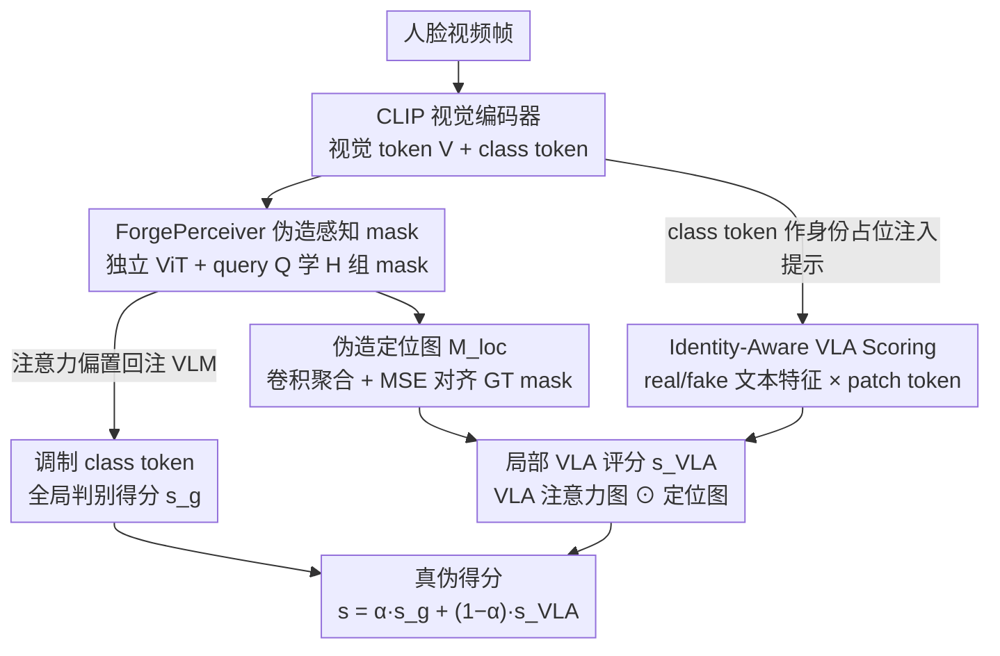

# Unleashing Vision-Language Semantics for Deepfake Video Detection

**会议**: CVPR 2026  
**arXiv**: [2603.24454](https://arxiv.org/abs/2603.24454)  
**代码**: [https://github.com/mala-lab/VLAForge](https://github.com/mala-lab/VLAForge)  
**领域**: 人脸理解 / 深度伪造检测  
**关键词**: 深度伪造检测, 视觉语言对齐, CLIP, 注意力模块, 身份感知

## 一句话总结

提出VLAForge，通过ForgePerceiver独立学习多样的伪造线索和伪造定位图，并结合身份感知的视觉-语言对齐（VLA）评分机制，释放VLM跨模态语义的潜力来增强深度伪造视频检测的判别能力，在9个数据集上全面超越现有SOTA。

## 研究背景与动机

1. **领域现状**：深度伪造视频检测（DFD）旨在判断人脸视频真伪。传统方法主要聚焦于空间伪影或时序不一致性的检测。近期，基于CLIP等预训练视觉语言模型（VLM）的方法因其强大的泛化能力而受到关注。

2. **现有痛点**：现有VLM-based方法主要通过adapter调优、偏差校正或时空建模来增强视觉编码器本身，但忽略了VLM最独特的优势——潜在空间中丰富的视觉-语言语义。这些方法仅利用了视觉单模态特征，未能发挥跨模态语义的判别潜力。

3. **核心矛盾**：VLM的视觉编码器在预训练时学习的是理解图像中的语义对象，而非检测伪造伪影。直接应用于DFD时，注意力往往分布在与伪造无关的对象上。同时，操纵的面部区域常表现出多样且异质的低层伪影（边界不一致、纹理失真），但这些高信息量的低层线索难以被语义导向的VLM视觉编码器有效捕获。

4. **本文目标** (1) 如何在不破坏VLM预训练知识的前提下增强其对伪造伪影的视觉感知？(2) 如何利用VLM内在的视觉-语言对齐来提供互补的细粒度判别线索？

5. **切入角度**：通过注入身份先验到文本提示中，将视觉-文本对齐适配为更细粒度的形式，使模型能捕获针对每个个体定制的真实性线索。

6. **核心 idea**：用独立的ForgePerceiver学习多样伪造线索来调制VLM视觉token，同时通过身份先验增强的文本提示释放VLM跨模态语义用于patch级真实性判断，二者融合实现全局+局部的判别。

## 方法详解

### 整体框架

VLAForge基于CLIP构建，包含两个核心组件：ForgePerceiver和Identity-Aware VLA Scoring。ForgePerceiver作为VLM的独立视觉伪造学习器，生成伪造感知mask来调制VLM的class token（全局判别），并输出伪造定位图（局部线索）。Identity-Aware VLA Scoring通过身份先验增强文本提示，计算patch级VLA注意力图，与伪造定位图融合产生局部真实性评分。最终真实性得分由全局和局部两个分支加权组合。

### 关键设计

**1. ForgePerceiver 的伪造感知 mask：让 VLM 的 class token「看见」它原本不敏感的伪影**

CLIP 的视觉编码器在预训练时学的是认物体，class token 天然对边界不一致、纹理失真这类低层伪影迟钝，直接拿来做检测注意力会飘到与伪造无关的对象上。VLAForge 不去改 VLM，而是另搭一个轻量级 ViT 当独立的「伪造学习器」：它接收 VLM 给出的视觉 token $\mathbf{V}$ 和一组可学习 query token $\mathbf{Q}$，用 query 与视觉特征的相似度算出 $H$ 组逐头的伪造感知 mask $\mathcal{M}_i = \hat{\mathbf{Q}} \hat{\mathbf{V}}_i^\top$。这些 mask 不是用来覆盖图像，而是作为注意力偏置回注 VLM 自注意力：

$$\mathbf{z}_j^{(l)} = \text{softmax}\Big(\frac{\mathbb{Q}_j^{(l)} \mathbb{K}_P^{\top(l)}}{\sqrt{d}} + \mathcal{M}_{i,j}\Big) \mathbb{V}_P^{(l)}$$

偏置把 VLM 的注意力往伪造区域引，class token 于是从多个互补角度积累伪造相关语义。因为感知 mask 由外挂 ViT 学、只通过加性偏置作用，VLM 的预训练知识没被破坏；而多个 query 各看一类伪影，又让 class token 不至于只盯住单一线索。为了逼着不同 query 真的分工而不是学成一样，对 query 级 mask 加了正交约束 $\mathcal{L}_{orth}$。

**2. 伪造定位图：给 mask 一份空间监督，顺带为局部判别铺底**

光让 query 学 mask，没有空间标签约束时学到的先验容易飘。这里再用一个投影 $g_3(\cdot)$ 把视觉 token 映到任务自适应空间，算出每个 query 的定位图，再用卷积头聚合成一张粗粒度的区域感知伪造定位图 $\mathbf{M}_{loc} = h([\tilde{\mathcal{M}}_1, \ldots, \tilde{\mathcal{M}}_q])$，并用 MSE 损失对齐 GT 伪造 mask。关键是这层监督加在聚合后的定位图上，而非直接压每个 query，所以 mask 的多样性没被牺牲——既把伪造先验校准到正确的空间位置，又给下一步的 VLA 评分留了一张可用的局部线索图。

**3. Identity-Aware VLA Scoring：把 VLM 的视觉-语言对齐本身当判别信号，并按人定制**

前两步还都在「增强视觉编码器」，没碰 VLM 最独特的资产——跨模态语义。已有 VLM 检测方法即便用文本，也只做图像级的全局对齐，给不出 patch 级的真假对应。VLAForge 构造 `"This is a real/fake photo of <id> person."` 的提示模板，把 `<id>` 占位符直接替换成 VLM 视觉编码器最后一层的 class token embedding $\mathbf{z}^{(L)}$——这一步把当前人脸的身份先验注入了文本侧，而且 embedding 本就在 VLM 文本编码空间里，无需额外对齐。文本编码器据此产出 real/fake 两个 ID 感知特征 $\mathbf{F}_r$、$\mathbf{F}_f$，再与每个 patch token 做 softmax 得到 VLA 注意力图：

$$\mathbf{M}_{VLA}(i,j) = \frac{\exp(\phi(\mathbf{P}(i,j))\mathbf{F}_f^\top)}{\sum_{c}\exp(\phi(\mathbf{P}(i,j))\mathbf{F}_c^\top)}$$

把它和第 2 步的定位图逐元素融合，就得到局部 VLA 评分。注入身份先验之所以管用，是因为对齐从「这张图整体像不像真的」细化成了「这个人的这块区域像不像真的」——对 fake 样本能精确高亮被操纵的区域，对 real 样本则不会无中生有地起关注。

### 损失函数 / 训练策略

- 总损失：$\mathcal{L}_{final} = \mathcal{L}_{loc} + \mathcal{L}_{VLA} + \mathcal{L}_G + \mathcal{L}_L$
- $\mathcal{L}_G$：全局级二分类交叉熵损失（基于伪造mask调制后的class token）
- $\mathcal{L}_L$：局部级二分类交叉熵损失（基于VLA融合评分）
- $\mathcal{L}_{loc}$：MSE损失监督伪造定位图
- $\mathcal{L}_{VLA}$：Dice损失监督VLA注意力图
- 推理时最终评分：$s(x') = \alpha s_g' + (1-\alpha)s_{VLA}'$，$\alpha$平衡全局和局部贡献

## 实验关键数据

### 主实验

| 数据集 | 指标(AUROC) | VLAForge | 之前SOTA(ForAda) | 提升 |
|--------|------|------|----------|------|
| CDF-v1 (帧级) | AUROC | 93.9% | 91.4% | +2.5% |
| CDF-v2 (帧级) | AUROC | 91.2% | 90.0% | +1.2% |
| DFDC (帧级) | AUROC | 87.0% | 84.3% | +2.7% |
| DFD (帧级) | AUROC | 93.6% | 93.3% | +0.3% |
| CDF-v2 (视频级) | AUROC | 96.8% | 95.7% | +1.1% |
| DFDC (视频级) | AUROC | 89.6% | 87.2% | +2.4% |
| DFD (视频级) | AUROC | 97.2% | 96.5% | +0.7% |
| VQGAN (帧级) | AUROC | 98.4% | 93.9% | +4.5% |
| SiT (帧级) | AUROC | 77.4% | 69.0% | +8.4% |

### 消融实验

| 配置 | CDF-v2(帧) | DFDC(帧) | DFD(帧) | 说明 |
|------|---------|------|------|------|
| Base (CLIP) | 58.3% | 64.0% | 77.5% | 基础CLIP编码器 |
| +T1 (伪造mask) | 76.3% | 76.0% | 74.6% | 加入伪造感知mask调制 |
| +T2 (伪造定位) | 82.3% | 80.9% | 87.4% | 加入伪造定位监督 |
| +T3 (VLA评分) | 90.8% | 86.5% | 92.8% | 加入身份感知VLA |
| +T4 (正交约束) | 91.2% | 87.0% | 93.6% | 完整模型 |

### 关键发现

- 每个组件都有显著贡献：从Base到完整模型，CDF-v2帧级AUROC从58.3%提升至91.2%
- 伪造感知mask（+T1）带来最大单步提升（CDF-v2从58.3%→76.3%），说明增强VLM视觉感知是关键
- VLA评分提供重要补充增益（+T3在CDF-v2上从82.3%→90.8%），证明跨模态语义的判别价值
- 在全脸生成伪造（GAN/Diffusion）场景下提升更显著——SiT帧级从69.0%到77.4%，说明VLA语义对新型伪造更具鲁棒性
- 正交约束虽然增益较小，但确保了不同query学习互补伪造先验

## 亮点与洞察

- 释放VLM跨模态语义的思路独特——不仅增强视觉编码器，还利用vision-language alignment本身作为判别信号，这是之前方法完全忽略的方向
- 身份先验注入文本提示的设计非常巧妙：将VLM class token作为<id>占位符的embedding，既编码了身份信息，又适配了VLM的文本编码空间
- ForgePerceiver作为独立学习器的设计保护了VLM预训练知识，同时通过mask调制而非直接修改实现了信息注入
- VLA注意力图的可视化展示了其在fake/real样本上的显著差异性——fake上精确高亮伪造区域，real上保持平静

## 局限与展望

- 身份先验来自VLM自身的class token，若VLM提取的视觉特征本身不够判别性，身份先验的质量会受限
- 跨数据集评估虽然全面，但主要在FF++上训练，实际场景中的训练数据分布更加复杂
- 多个损失函数的权重均设为1，缺乏针对不同损失重要性的探讨
- 当前仅使用CLIP作为VLM backbone，更强的VLM（如SigLIP、EVA-CLIP）可能带来进一步提升

## 相关工作与启发

- **vs ForAda**: ForAda通过adapter调优CLIP视觉编码器，属于纯视觉增强；VLAForge额外利用了视觉-语言对齐语义，在DFDC上帧级超出2.7%
- **vs RepDFD**: RepDFD通过外部人脸embedding生成样本特定文本提示来重编程VLM，但仅做图像级全局对齐；VLAForge实现了patch级的细粒度对齐
- **vs FFTG**: FFTG用合成的图像-文本对和mask增强可解释性，但文本描述是额外的而非适配VLM内在对齐；VLAForge直接释放VLM内在的跨模态判别力

## 评分

- 新颖性: ⭐⭐⭐⭐⭐ 首次系统性地释放VLM跨模态语义用于DFD，身份先验注入设计巧妙
- 实验充分度: ⭐⭐⭐⭐⭐ 9个数据集、帧+视频两个级别、经典换脸+全脸生成两类伪造
- 写作质量: ⭐⭐⭐⭐ 方法描述清晰，可视化有说服力
- 价值: ⭐⭐⭐⭐⭐ 为VLM在DFD中的应用开辟了新方向，全面SOTA

<!-- RELATED:START -->

## 相关论文

- [\[CVPR 2026\] Vision-Language Attribute Disentanglement and Reinforcement for Lifelong Person Re-Identification](vision-language_attribute_disentanglement_and_reinforcement_for_lifelong_person_.md)
- [\[CVPR 2026\] All in One: Unifying Deepfake Detection, Tampering Localization, and Source Tracing with a Robust Landmark-Identity Watermark](all_in_one_unifying_deepfake_detection_tampering_localization_and_source_tracing.md)
- [\[CVPR 2026\] Real-Time Multimodal Fingertip Contact Detection via Depth and Motion Fusion for Vision-Based Human-Computer Interaction](real-time_multimodal_fingertip_contact_detection_via_depth_and_motion_fusion_for.md)
- [\[CVPR 2026\] HyperGait: Unleashing the Power of Parsing for Gait Recognition in the Wild via Hypergraph](hypergait_unleashing_the_power_of_parsing_for_gait_recognition_in_the_wild_via_h.md)
- [\[CVPR 2026\] Prompt-Anchored Vision–Text Distillation for Lifelong Person Re-identification](prompt-anchored_vision-text_distillation_for_lifelong_person_re-identification.md)

<!-- RELATED:END -->
