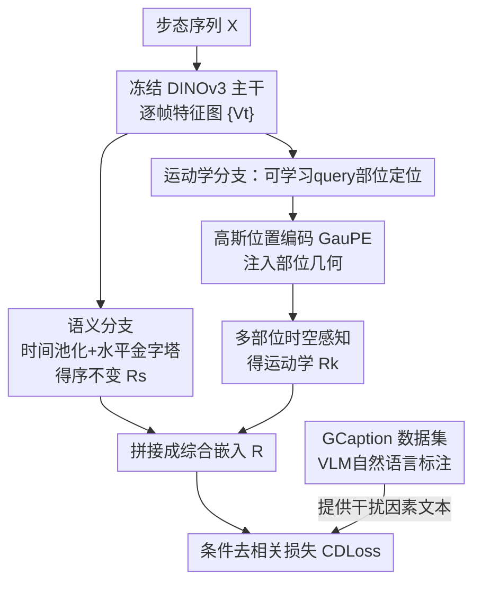

# Unlocking Motion from Large Vision Models with a Semantic and Kinematic Duality for Gait Recognition

**会议**: CVPR 2026  
**论文**: [CVF Open Access](https://openaccess.thecvf.com/content/CVPR2026/html/Huang_Unlocking_Motion_from_Large_Vision_Models_with_a_Semantic_and_CVPR_2026_paper.html)  
**代码**: https://zbhuang.com/gait-max  
**领域**: 人体理解 / 步态识别  
**关键词**: 步态识别, 运动建模, 大视觉模型, 解耦学习, 视觉语言监督

## 一句话总结
GaitMax 在冻结的 DINOv3 大视觉模型上同时挂一条「语义分支」（捕捉全局、序不变的整体轮廓）和一条「运动学分支」（用可学习 query 跟踪各身体部位的时空轨迹），再用一个把步态嵌入与服饰/视角等干扰因素文本描述做二阶统计去相关的损失 CDLoss 抑制捷径，配套自建带自然语言标注的 GCaption 数据集，在多个跨域步态基准上刷新 SOTA。

## 研究背景与动机
**领域现状**：步态识别靠人走路的姿态来远距离认人，主流是「语义范式」——以 GEI、GaitSet、GaitBase 为代表，把一个步态周期内的轮廓/特征做时间维度池化，得到一个**与帧序无关（order-invariant）**的全局嵌入。这种做法对单帧噪声鲁棒、不需要复杂时序建模，简单又有效。

**现有痛点**：序不变是把双刃剑。池化掉时间顺序后，模型**无法表达运动的动态过程**——比如同侧肢体是否同步摆动这种细粒度的部位协调信息全丢了。为补回动态，「运动学范式」（GFI、AttenGait）引入光流建模时空信息，但光流有两个硬伤：① 它在**像素级**无差别估计运动，无视人体是「铰接刚体」，计算贵、且在步态常见的低分辨率/弱光照下噪声敏感、容易失败；② 它只能做帧到帧的**短时**建模，覆盖不了一个完整步态周期的长程依赖。

**核心矛盾**：全局语义（鲁棒但丢动态）与细粒度运动学（有动态但依赖脆弱的光流）之间存在割裂，没有方法把两者统一起来。更深一层，当用 DINOv3 这种强大 LVM 当编码器时，它会把**所有**外观信息都编进去（衣服颜色、携带物、视角），表征能力越强、越容易学到「靠衣服认人」的捷径，导致跨域（OOD）泛化崩盘。

**本文目标**：① 设计一个不依赖光流、能建模长程稀疏运动的「人本」运动学分支；② 把它和语义分支融合成统一框架；③ 显式地把步态嵌入从干扰因素里解耦出来。

**切入角度**：作者观察到 LVM（DINOv3）本身就有很强的部位定位潜力，只要用 DETR 式的可学习 query 去「问」它每个身体部位在哪，就能拿到部位级注意力，再把注意力区域的几何形状编码进去，就能在不算光流的前提下重建部位轨迹。

**核心 idea**：用「语义 + 运动学」双分支统一全局与过程级运动，并用「视觉-语言监督下的条件去相关损失」把嵌入和干扰因素的文本描述统计独立开。

## 方法详解

### 整体框架
GaitMax 把一段步态序列 $X$ 映射为身份嵌入 $R \in \mathbb{R}^{n\times d}$，整体优化目标是身份判别损失加一个去相关正则：

$$\theta^* = \arg\min_\theta \left[ \mathcal{L}_{id}(R, y) + \lambda \mathcal{L}_{cd}(R, N) \right]$$

其中 $N$ 是干扰因素。流程上，先用冻结的 DINOv3 主干 $\phi$ 把每帧 $X_t$ 编成特征图 $V_t$，这组 $\{V_t\}$ 同时喂给两条分支：**语义分支**做空间增强 + 时间均值池化 + 水平金字塔池化，得到序不变的 $R_s$；**运动学分支**用可学习 query 定位部位、用高斯位置编码 GauPE 注入部位几何、再做多部位时空感知，得到 $R_k$。两者拼接成综合嵌入 $R$。训练时除了身份损失，还加上把 $R$ 与干扰因素文本嵌入去相关的 CDLoss，而这些文本描述由自建的 GCaption 数据集提供。

### 关键设计

**1. 双分支互补运动表征：用序不变语义补全局、用部位轨迹补动态**

针对「语义丢动态、运动学依赖光流」这个核心矛盾，GaitMax 把两种范式拼到一起而非二选一。语义分支沿用成熟做法：特征图 $\{V_t\}$ 经帧级编码器 $\psi_p$ 增强空间信息后，用时间均值池化 $P_t$ 把时间维拍平（这一步实现序不变、也压掉单帧噪声），再用水平金字塔池化 $P_s$ 切成 $n_1$ 条水平条带提取空间嵌入，得到 $R_s = P_s(P_t(\{\psi_p(V_t)\}))$。它擅长「外观变化小」时的整体匹配。运动学分支则反过来显式建模部位级时序轨迹。消融（表 5）证实两者是真互补：语义分支在 BG（背包）协议上领先运动学分支 +2.7%，而运动学分支在 CL（换衣）上反超语义分支 +6.7%——衣服一换，全局轮廓就废了，只有部位运动节律还认得出人。

**2. 可学习 query 部位定位：让 LVM「指认」身体部位而非算光流**

为了不靠光流也能拿到部位运动，作者受 DETR 启发，引入 $n_2$ 个可学习 query $q$，每个 query 负责在所有时间步**一致地跟踪某个特定身体部位**。对每帧，query 作为 query、向量化的帧特征 $v_t=\text{vec}(V_t)$ 作为 key/value，经温度增强的交叉注意力得到注意力图 $a$ 和部位潜特征 $m$：

$$a = \text{Softmax}\!\left(\frac{(qW_q)(v_tW_v)^\top/\tau}{\sqrt{d}}\right),\quad m = a(v_tW'_v)$$

为防止多个 query 都盯着同一块区域，作者加了多样性损失 $\mathcal{L}_{div}$（受 ADL 启发），惩罚各注意力图相似度矩阵 $A=[a_1,\dots,a_{n_2}]^\top$ 的非对角元素：$\mathcal{L}_{div}=\mathbf{1}^\top(AA^\top)\mathbf{1}-\text{tr}(AA^\top)$，逼各 query 去关注空间上互不重叠的部位。这样部位定位就成了对 LVM 的「软探针」，无需任何关键点/parsing 标注。

**3. 高斯位置编码 GauPE：不只编位置，还编部位的形状与朝向**

人体是铰接刚体，一个部位不仅有位置、还有大小和朝向，标准的 RoPE 只编了「位置」，信息不够。GauPE 把每个注意力图 $a$ 的显著区域用**矩匹配**参数化成一个高斯协方差椭圆，从而拿到一组几何属性：质心 $(\mu_x,\mu_y)$ 表位置、方差 $(\sigma_x^2,\sigma_y^2)$ 表尺度、协方差 $\sigma_{xy}$ 表朝向。不同几何成分用不同机制注入——质心捕捉**帧间**位置动态，用旋转操作（类 RoPE）注入；形状参数 $\sigma=\{\sigma_x^2,\sigma_y^2,\sigma_{xy}\}$ 描述**帧内**属性，直接拼接：

$$\bar{m} = \left[\sigma,\ R(\omega_i\mu_x)m^{(x)},\ R(\omega_i\mu_y)m^{(y)}\right]$$

其中 $m^{(x)}, m^{(y)}$ 是部位特征 $m$ 的前后两半，$R(\cdot)$ 是旋转矩阵，$\omega_i$ 是旋转频率。消融（表 6）显示：无位置编码只能靠潜特征、严重掉点；加 RoPE 恢复了「质心移动」感知、回升 1.7%；GauPE 在 RoPE 基础上再补「覆盖面积/轴长/朝向」，又涨 3.1%，证明同时建模部位的形状和位置对鲁棒运动学分析是关键。增强后的特征再按部位分组成 $n_2$ 条时间序列 $M_p$，各自过时序模块 $\psi_t$，最后用联合感知模块 $\psi_u$ 建模部位间关联得 $R_k=\psi_u(\{\psi_t(M_p)\})$。

**4. 条件去相关损失 CDLoss：把步态嵌入和干扰因素的文本描述统计独立开**

LVM 越强、越会把衣服等无关外观编进嵌入，标准的 CE + triplet 损失只追求「类间可分」，反而会把「靠衣服分类」当成捷径学下来。CDLoss 走的是和「对齐」相反的**解耦**路线：它不去把表征往某个语义拉近/推远，而是强制步态嵌入 $R$ 在统计上**独立于**干扰因素的文本描述。具体做法是用 OpenCLIP 把干扰因素文本编成嵌入空间 $N$（代表「信息完全暴露」的状态），则 $R$ 与 $N$ 的相关程度就反映了信息泄漏量，于是去抑制两个空间间的二阶统计相关：

$$\mathcal{L}_{cd} = \sum_{i,j}\left(\frac{D(R_i,R_j)-\mu_r}{\sigma_r}\cdot\frac{S(N_i,N_j)-\mu_N}{\sigma_N}\right)^2$$

其中 $D$ 是欧氏距离、$S$ 是余弦相似度、$\mu,\sigma$ 是均值与标准差。直觉是：如果两条样本在文本空间里很像（都穿蓝卫衣），CDLoss 就惩罚它们在步态空间里也凑得近，逼模型别用衣服认人。消融（表 7）表明，单独约束某个属性会精准改善对应协议（attire→CL +5.0%、carrying→BG +4.3%、viewpoint 全协议 +3.2%），三者全开 OOD 平均涨 +11.0%。最终总损失为 $\mathcal{L}_{tot}=\gamma_{id}\mathcal{L}_{id}+\gamma_{cd}\mathcal{L}_{cd}+\mathcal{L}_{div}$。

**5. GCaption 数据集：给多个 RGB 步态数据集补上自然语言标注**

CDLoss 需要「丰富、描述性」的标注（如「a red shirt」），而现有数据集只有粗粒度类别标签（如「U0」），喂不动。GCaption 因此被构建出来：它为多个 RGB 步态数据集定义 7 个属性、分两类——主体相关（年龄/着装/动作/携带物）与环境相关（场景/视角/光照），标注格式多样（年龄是五类选择、视角是 roll/pitch/yaw 三轴复合描述、着装是「颜色+类型」组合）。为保可靠，用两阶段流程：① 先选最优标注模型（经评测选了与人工标注一致性最高的 Gemini-2-Flash-Lite，平均相似度 93.7%）；② 引入嵌入空间聚合保证序列级一致性——对每条序列独立标注 8 帧，算文本嵌入均值，取最接近均值那帧的标注作为整段标注，从而得到稳定一致的标签。

## 实验关键数据

### 主实验
训练集为 CCPG 与 CCGR，域内测 CCPG/CCGR、跨域测 CASIA-B/SUSTech1K。输入训练取 30 连续帧、测试至多 120 帧，缩放到 448×224。

域内评测（CCPG 各换衣/携带协议 Rank-1，CCGR MINI 报 R1/mAP/mINP）：

| 方法 | 输入 | CCPG CL | CCPG UP | CCPG DN | CCPG BG | CCPG Mean | CCGR R1 | CCGR mAP | CCGR mINP |
|------|------|---------|---------|---------|---------|-----------|---------|----------|-----------|
| GaitBase | Silh. | 71.6 | 75.0 | 76.8 | 78.6 | 75.5 | 27.0 | 24.9 | 9.7 |
| DeepGaitv2 | Silh. | 78.6 | 84.8 | 80.7 | 89.2 | 83.3 | 39.4 | 36.0 | 16.8 |
| MultiGait++ | Silh.+Parsing+Flow | 83.9 | 89.0 | 86.0 | 91.5 | 87.6 | – | – | – |
| BigGait | RGB | 82.6 | 85.9 | 87.1 | 93.1 | 87.2 | 80.7 | 65.8 | 59.8 |
| **GaitMax** | RGB | **86.6** | 88.2 | 90.2 | 93.2 | **89.6** | **83.6** | **74.2** | **62.2** |

跨域评测（Rank-1，CCPG→CASIA-B / SUSTech1K，直接测不微调）：

| 方法 | CASIA-B NM | BG | CL | Mean | SUSTech1K NM | BG | CL | UM | Mean |
|------|-----------|----|----|------|-------------|----|----|----|------|
| DenoisingGait | 83.9 | 76.1 | 34.8 | 64.9 | 66.9 | 59.7 | 37.3 | 45.7 | 52.4 |
| BigGait | 77.4 | 71.5 | 33.6 | 60.8 | 60.7 | 57.2 | 43.7 | 57.1 | 54.7 |
| **GaitMax** | **85.6** | **86.9** | **46.2** | **72.9** | **67.1** | **62.8** | **55.0** | **61.3** | **59.7** |

跨域是 GaitMax 优势最大的地方：相对同样用 RGB 的 BigGait，在 CASIA-B 的 CL +12.6%、BG +15.4%；SUSTech1K 各协议全面领先（CL +11.3%）。

### 消融实验

| 配置 | 关键指标 | 说明 |
|------|---------|------|
| 仅语义分支 | CCPG Mean 85.7 | BG 上强（94.8），整体匹配好但丢动态 |
| 仅运动学分支 | CCPG Mean 88.5 | CL 上强（87.6），换衣鲁棒 |
| 双分支融合（Full） | CCPG Mean **89.8** | 多数协议最佳，但 CL 反比仅运动学低 2.2% |
| GauPE: None | Mean 85.0 | 无几何信息，运动学分支几乎失效 |
| GauPE: RoPE | Mean 86.7 | 只编质心位移，+1.7% |
| GauPE: 完整 | Mean **89.8** | 加形状/朝向，再 +3.1% |
| CDLoss 全关 | CASIA-B Mean 64.5 | OOD 明显退化，过拟合训练域 |
| CDLoss 三属性全开 | CASIA-B Mean **75.5** | OOD +11.0% |

效率上（表 4），GaitMax 整体参数/算力与 BigGait 同量级；单看运动学分支，对比「光流 + GaitBase」（5.25M 参数、211 GFLOPs），本文的运动学分支只要 12.7 GFLOPs，证明部位级感知比像素级运动向量既准又省。

### 关键发现
- **语义与运动学真互补**：背包等空间变化小的场景靠语义全局匹配（BG），换衣场景靠部位运动节律（CL），两者侧重点正好错开。
- **简单并行融合有缺陷**：融合模型在 CL 上反而比纯运动学分支低 2.2%——错误的语义匹配（被衣服带偏）会干扰正确的运动学分析，作者自己点名「自适应融合」是未来方向。
- **GauPE 的形状/朝向不是装饰**：从 RoPE 到 GauPE 再涨 3.1%，说明把部位当「有形状的椭圆」而非「一个点」对铰接运动建模确有价值。
- **去相关比对齐更适合做解耦**：CDLoss 不把表征往某个文本拉，而是强制统计独立，单属性约束能精准改善对应协议，三属性叠加 OOD 大涨。
- **方法可迁移到更广动作分析**：在 Diving48 上把 GaitMax 接到 TSN / Video-FocalNet 上也能涨点，说明语义-运动学表征不止用于步态。

## 亮点与洞察
- **把 LVM 当「可探针的部位定位器」**：用 DETR 式可学习 query + 多样性损失，从冻结 DINOv3 里「问」出部位级注意力，绕开了关键点/parsing 标注，也绕开了光流——这个「不算光流也能拿运动学」的思路很可复用。
- **GauPE 用矩匹配把注意力图变椭圆**：把软注意力的二阶矩当几何先验注入位置编码，既给了位置又给了形状/朝向，是个轻巧但信息密度高的设计。
- **CDLoss 的「反对齐」视角很提神**：大多数视觉-语言工作是把表征往文本对齐，这里反过来用文本嵌入当「完全泄漏」的参照，去抑制二阶相关来做解耦，思路迁移性强（任何想去掉已知干扰因素的任务都能借鉴）。
- **作者诚实地暴露了融合的失败**：CL 上融合反而掉点，没藏着，反而把它当未来方向，这种自我批判让消融更可信。

## 局限性 / 可改进方向
- **简单并行融合是短板**：作者承认 CL 协议上融合反而不如纯运动学，需要「自适应、按场景选最鲁棒表征」的融合机制，当前版本会让错误的语义匹配污染运动学。
- **强依赖 GCaption 的标注质量**：CDLoss 的效果建立在 VLM（Gemini）生成的属性描述上，开放属性（动作、携带物）相似度 84%–97% 并非完美，标注噪声可能上限化解耦效果；且 GCaption 只覆盖 RGB 数据集，纯轮廓数据集用不上。
- **冻结 LVM 主干**：DINOv3 全程冻结，没探讨微调主干能否进一步释放部位定位能力；同时 DINOv3 这类大主干对低分辨率/极端光照步态的鲁棒性未单独验证。
- **多 query/部位数等超参敏感性**：$n_2$（部位数）、温度 $\tau$、各损失权重的敏感性正文未充分展开，实际部署到新数据集时调参成本未知。

## 相关工作与启发
- **vs 语义范式（GaitSet / GaitBase / BigGait）**：它们做序不变全局池化，鲁棒但丢动态；GaitMax 保留这条作为语义分支，再补一条运动学分支，把「过程级」运动找回来，跨域上明显反超 BigGait。
- **vs 光流运动学范式（GFI / AttenGait / MultiGait++）**：它们靠像素级光流建模运动，贵、噪声敏感、只能短时；GaitMax 用部位级 query + GauPE 做长程稀疏运动学，算力省一个量级且更鲁棒。
- **vs 标准度量损失（triplet / ArcFace / CosFace）**：它们都只追求类间可分，会把衣服当捷径；CDLoss 加了第二目标——显式惩罚与干扰因素文本的统计相关，专治 OOD 泄漏。
- **vs 视觉-语言对齐方法**：多数工作把表征往文本语义拉近或推远，CDLoss 反其道用文本当「泄漏参照」做去相关解耦，是一个不同的范式。

## 评分
- 新颖性: ⭐⭐⭐⭐⭐ 「双分支统一语义+运动学」「query+GauPE 替代光流」「反对齐式 CDLoss 解耦」三个点都不落俗套，且 GCaption 是有价值的新资源。
- 实验充分度: ⭐⭐⭐⭐⭐ 4 个数据集、域内+跨域、三大消融逐一验证每个组件、还做了效率对比和 Diving48 泛化，覆盖很全。
- 写作质量: ⭐⭐⭐⭐ 逻辑清晰、公式完整、图示到位；个别符号（如各模块 $\psi$）稍密，但整体好读且敢于暴露失败案例。
- 价值: ⭐⭐⭐⭐⭐ 跨域大幅提升 + 开源模型/代码/GCaption 资源，对步态识别社区和「LVM 做细粒度运动理解」都有直接推动作用。

<!-- RELATED:START -->

## 相关论文

- [\[CVPR 2026\] MMGait: Towards Multi-Modal Gait Recognition](mmgait_multi_modal_gait_recognition.md)
- [\[CVPR 2026\] EventGait: Towards Robust Gait Recognition with Event Streams](eventgait_towards_robust_gait_recognition_with_event_streams.md)
- [\[CVPR 2026\] HyperGait: Unleashing the Power of Parsing for Gait Recognition in the Wild via Hypergraph](hypergait_unleashing_the_power_of_parsing_for_gait_recognition_in_the_wild_via_h.md)
- [\[CVPR 2026\] Text-guided Feature Disentanglement for Cross-modal Gait Recognition](text-guided_feature_disentanglement_for_cross-modal_gait_recognition.md)
- [\[CVPR 2026\] RoMo: A Large-Scale, Richly Organized Dataset and Semantic Taxonomy for Human Motion Generation](romo_a_large-scale_richly_organized_dataset_and_semantic_taxonomy_for_human_moti.md)

<!-- RELATED:END -->
