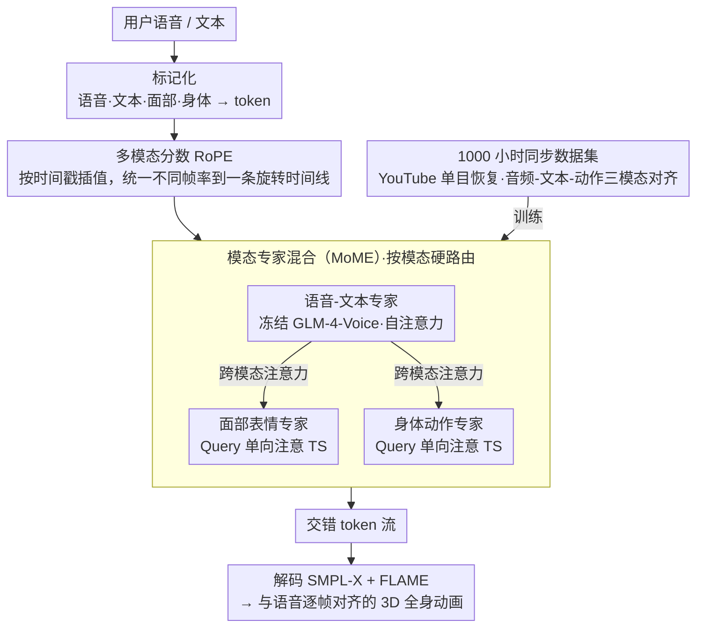

# ViBES: A Conversational Agent with Behaviorally-Intelligent 3D Virtual Body

**会议**: CVPR 2026  
**arXiv**: [2512.14234](https://arxiv.org/abs/2512.14234)  
**代码**: [ai.stanford.edu/~juze/ViBES/](https://ai.stanford.edu/~juze/ViBES/)  
**领域**: 人体理解 / 多模态交互  
**关键词**: 对话式虚拟人, 多模态专家混合, 共语手势生成, 语音-动作同步, 3D身体动画

## 一句话总结

提出 ViBES，一个统一语言、语音和身体动作的 3D 对话代理，通过模态专家混合（MoME）架构和跨模态注意力机制，在保留预训练语音 LLM 对话能力的同时生成时间对齐的面部表情和全身动作，超越了将行为视为简单"模态翻译"的范式。

## 研究背景与动机

现有对话AI系统已具备流畅的文本和语音交互能力，但**缺少身体**——人类交流本质上是多模态的，言语、韵律和身体语言共同传达意图。当前将行为建模为"模态翻译"（如语音→手势、文本→动作）的方法存在根本缺陷：它们不需要"何时动、做什么、如何适应多轮对话"的智能决策，导致时序脆弱、社交根基薄弱。

直觉上可以将语音 LLM 和动作生成器串联（two-stage），但实践中困难重重：没有统一的时序和选择策略，没有共享的对话状态，无法保证跨轮次一致性。最相关的工作 LoM 和 SOLAMI 侧重于模态对齐而非保留对话智能。

核心目标：构建真正的"具身对话代理"——不仅能在回答时生成共语手势，还能遵循明确的动作指令（如"请后退一步并挥手"）。这需要将非言语行为从"条件生成"提升为"智能代理行为"。

## 方法详解

### 整体框架

ViBES 要解决的核心问题是：让一个已经会"说话"的对话模型同时长出"身体"，并且在多轮对话里自己决定何时动、做什么、怎么配合语言。它的做法是把语音、语言、面部、身体全部标记化成 token，再让它们在同一条时间线上交错排列、自回归地一个接一个吐出来——本质上是把"具身行为"当成对话模型的另一种输出模态，而不是事后挂一个动作生成器。

模型整体是一个语音-语言-行为（SLB）模型，用模态专家混合（MoME）把三类参数分开：语音-文本专家直接冻结自预训练的 GLM-4-Voice，负责对话智能；面部表情专家和身体动作专家是两个轻量侧车，负责把语言/语音里的意图翻译成具体动作。三个专家通过 SLB 跨模态注意力耦合，在统一时间线上联合生成交错的 token 流。

### 关键设计

**1. 模态专家混合（MoME）：让动作专家"读取"对话状态，又不破坏 LLM 已有的说话能力**

最直接的做法是把所有模态喂进一个大 Transformer 做全稠密融合，但那样会冲掉 GLM-4-Voice 预训练好的对话能力——这正是 two-stage 串联和 LoM/SOLAMI 这类方法绕不开的代价。ViBES 的解法是给三个专家各配独立的 FFN 和 LayerNorm，并用硬路由：按模态标签确定性地把每个 token 分给对应专家，不引入需要学习的路由器。注意力拓扑是这个设计的关键——语音-文本（TS）专家内部做自注意力，面部和身体专家的 Query 只单向去注意 TS 的 Key/Value，面部和身体之间不互相注意。这样 TS 专家可以原封不动继承冻结的 GLM-4-Voice 权重，面部/身体专家则像挂在旁边的侧车，只"读取"TS 的对话状态来决定动作，不必从头做大规模音频-文本-动作联合预训练。消融也印证了这个拓扑的合理性：一旦以 TS 为条件，面部和身体已经近乎独立，加上两者之间的交叉注意力并没有带来改善。

**2. 多模态分数 RoPE（Fractional RoPE）：在一条旋转时间线上精确对齐帧率不同的模态**

语音、动作、身体三类 token 的帧率并不一致（语音 12.5fps、动作 25fps、身体 6.25fps）⚠️ 以原文为准，而标准 RoPE 假设位置是等间距的整数索引，没法表达"动作第 t 帧落在语音第 i 与第 i+1 个 token 之间"这种跨模态时间对应。ViBES 以 TS 流为锚点占据整数索引，动作 token 则通过线性插值拿到一个分数索引：

$$s_t = s_{a_i} + \alpha_t$$

其中 $\alpha_t$ 是该动作 token 的实际时间戳在相邻两个 TS 锚点之间的归一化位置（0 到 1）。这样旋转位置编码算出的注意力分数就自然反映了跨模态的真实时间距离，而不必把所有模态重采样到同一帧率再硬对齐——比帧重采样更省、也更精确。

**3. 1000 小时同步数据集：补上"三模态同时对齐"这块缺失的训练语料**

训练这样一个统一代理的真正瓶颈不在模型，而在数据：现有数据集大多只有成对对齐（文本→动作、或音频→动作），缺少大规模的音频-文本-动作三元组同时对齐。ViBES 从 YouTube 的对话视频（访谈、播客、演讲）里自动恢复单目 3D 人体运动——身体和手用 SMPL-X、面部用 FLAME——再与语音和文本转录在时间轴上对齐，叠加现有动作数据集凑成约 1000 小时训练语料。代价是单目恢复带来的噪声（遮挡、深度歧义），但实验显示大规模训练后模型仍能从中学到有意义的对话行为模式。

### 一个完整示例：一句话回答如何在时间线上铺成 token 流

设代理要边说一句话边配合手势。语音-文本专家先自回归吐出 TS token，占据整数锚点 0, 1, 2, …；这些 token 编码了"说什么"以及语音的韵律。身体动作专家同步生成手势 token，但身体只有 6.25fps、比语音慢，于是某个手势 token 的时间戳可能落在 TS 锚点 3 和 4 之间 40% 处，分数 RoPE 就给它索引 $s_t = 3 + 0.4 = 3.4$。面部专家以同样方式插值出自己的索引。注意力时，面部和身体 token 的 Query 都只回头看 TS 的 Key/Value——也就是"看着这句话在说什么、语气如何"来决定此刻该做什么表情、什么手势——而彼此不互相牵制。最终三路 token 在同一条时间线上交错落位，解码回 SMPL-X + FLAME 就得到与语音逐帧对齐的全身动画。

### 损失函数 / 训练策略

采用标准的下一 token 预测损失做自回归训练。面部沿用 LoM 的 tokenizer（25fps），身体用组合式 tokenizer 分上身/下身/手（6.25fps），所有流对齐到 25fps 主时钟。训练分阶段：先在大规模数据上预训练，再在对话交互数据上微调。

## 实验关键数据

### 主实验

| 任务 | 方法 | 关键指标 | 说明 |
|------|------|---------|------|
| 多轮对话+动作 | ViBES | 对话-动作对齐 / 行为质量 / 社交适当性均最优 | 综合基准 |
| 共语手势 | ViBES | SOTA | 在 BEAT2 基准上 |
| 文本到动作 | ViBES | SOTA | 在 HumanML3D 基准上 |

### 消融实验

| 配置 | 效果 | 说明 |
|------|------|------|
| 启用面部↔身体注意力 | 无改善 | 面部/身体以 TS 为条件后独立 |
| 去除分数 RoPE | 时序对齐下降 | 证明精确时间编码重要 |
| Two-stage (LLM+动作生成器) | 一致性差 | 无共享对话状态 |

### 关键发现

- 硬模态路由 + 单向跨注意力（面部/身体→TS）是最有效的架构选择，比双向或全连接注意力更好
- 从 YouTube 恢复的单目 3D 动作虽然有噪声，但大规模训练后仍能学到有意义的对话行为模式
- 分数 RoPE 对保持多模态时间同步至关重要

## 亮点与洞察

- **将非言语行为升级为"代理行为"而非"模态翻译"**：ViBES 不仅生成与语音同步的手势，还能理解和执行自然语言动作指令，这是从生成到智能的质变
- **冻结预训练 LLM + 轻量侧车专家**的架构范式：避免了从零训练三模态模型的天文级数据和计算需求，可推广到其他新模态的引入
- **分数 RoPE** 巧妙解决了多帧率模态的时间对齐问题，比帧重采样更优雅

## 局限与展望

- 3D 动作从 YouTube 单目视频恢复，质量有限（遮挡、深度歧义）
- 面部和身体之间无直接交互建模，可能错过眼神-手势协调等细微社交信号
- 缓存文件截断，完整实验数据有限
- 当前仅支持单人代理，多人交互场景未涉及

## 相关工作与启发

- **vs LoM/SOLAMI**: 仅做模态对齐，无 LLM 推理骨干，不支持动作指令
- **vs Co-speech 方法**: 仅音频→动作翻译，无对话理解能力
- **vs Two-stage 系统**: 无统一策略和共享对话状态

## 评分

- 新颖性: ⭐⭐⭐⭐⭐ 首个将对话智能与具身行为统一的 3D 代理，MoME+分数 RoPE 设计巧妙
- 实验充分度: ⭐⭐⭐⭐ 多任务评估+消融（缓存截断，部分数据不全）
- 写作质量: ⭐⭐⭐⭐⭐ 问题定义清晰，架构描述详尽
- 价值: ⭐⭐⭐⭐⭐ 为具身对话 AI 开辟新方向，数据集和框架对社区有重大价值

<!-- RELATED:START -->

## 相关论文

- [\[CVPR 2026\] SAM 3D Body: Robust Full-Body Human Mesh Recovery](sam_3d_body_robust_full-body_human_mesh_recovery.md)
- [\[CVPR 2026\] Tackling Alignment Ambiguity in Person Retrieval through Conversational Attribute Mining](tackling_alignment_ambiguity_in_person_retrieval_through_conversational_attribut.md)
- [\[CVPR 2026\] SyncMos: Scalable Motion Synchronisation for Multi-Agent Scene Interaction](syncmos_scalable_motion_synchronisation_for_multi-agent_scene_interaction.md)
- [\[CVPR 2026\] FusionAgent: A Multimodal Agent with Dynamic Model Selection for Human Recognition](fusionagent_a_multimodal_agent_with_dynamic_model_selection_for_human_recognitio.md)
- [\[CVPR 2026\] AssistMimic: Physics-Grounded Humanoid Assistance via Multi-Agent RL](assistmimic_physics_grounded_humanoid_assistance.md)

<!-- RELATED:END -->
