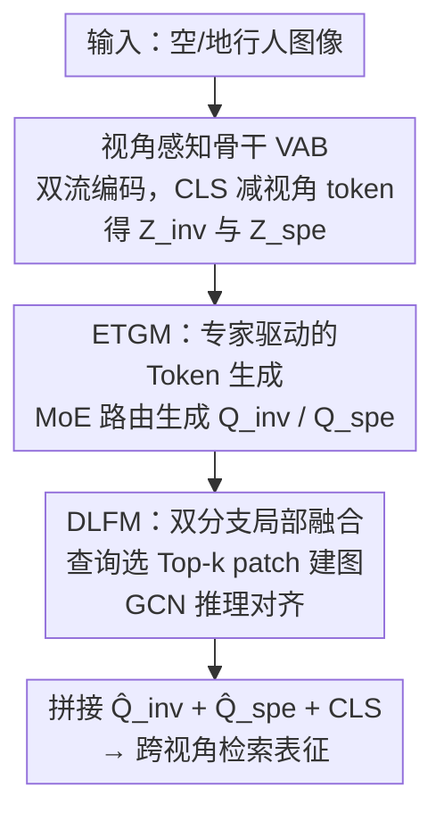

# View-Aware Semantic Alignment for Aerial-Ground Person Re-Identification

**会议**: CVPR 2026  
**arXiv**: [2605.18192](https://arxiv.org/abs/2605.18192)  
**代码**: https://github.com/Cat-Zero/ViSA (有)  
**领域**: 人体理解 / 行人重识别  
**关键词**: 空地行人重识别, 视角感知, 混合专家, 图卷积, 特征解耦

## 一句话总结
针对无人机与地面相机间剧烈视角差异的空地行人重识别（AGPReID），本文提出 ViSA：不再追求"视角不变"地强行对齐共享部件，而是用一组视角感知专家（ETGM）生成自适应语义查询、再用双分支图推理（DLFM）把每个查询锚到它响应的局部区域，从而同时保留视角不变与视角特有的身份线索，在 CARGO 跨视角协议上把 mAP 拉高 10.06%。

## 研究背景与动机
**领域现状**：行人重识别（ReID）要在不重叠的相机间匹配同一个人。无人机进入监控网络后催生了空地行人重识别（AGPReID）——查询和图库分别来自俯拍的无人机与平视的固定相机，视角差异极端。现有 AGPReID 主流走"视角不变"（view-invariant）范式，典型如 VDT 把视角因子解耦掉，让模型对齐跨视角的共享表征。

**现有痛点**：作者指出"视角不变"范式有一个被忽视的副作用——它本质上强制**部件级对齐**（part-level alignment）。为了让两个视角的特征对得上，模型只能去匹配两边都看得见的共享部件，从而**抑制了那些与身份强相关、但只在某个视角才显著的判别线索**（如地面视角下的腿部、空中俯拍下的肩部）。此外现有方法多依赖全局表征，而俯拍的陡峭角度与遮挡常导致部分身体缺失，全局描述子在这种情况下并不可靠——细粒度身份证据其实藏在局部 patch 里。

**核心矛盾**：信息论视角下，表征 $Z=f(X,V)$ 同时纠缠了身份因子 $X$ 与视角因子 $V$。理想目标是 $\max I(Z;Y)$ 同时让 $I(Z;V)$ 最小，但**严格压低 $I(Z;V)$ 会连带压低 $I(Z;Y)$**——因为衣物褶皱、体型一致性这类视角相关线索本身就和身份部分相关。一刀切地抑制视角，等于把有用的判别信息也扔了。

**本文目标 / 切入角度**：与其抑制视角，不如**解耦后并用**。作者把表征显式拆成 $Z=[Z_{inv}, Z_{spe}]$，约束 $I(Z_{inv};V)\approx 0$（视角不变、保身份语义）、$I(Z_{spe};V)>0$（显式编码视角带来的系统性外观变化），避开对抗式压制造成的信息瓶颈。

**核心 idea**：用"视角感知的语义对齐"代替"视角不变的部件对齐"——构造视角专属专家生成自适应查询，再让查询去对齐各自响应的局部区域，从而把视角不变与视角特有的身份线索一起利用起来。

## 方法详解

### 整体框架
ViSA 是一个 encoder-decoder 结构，建立在 View-Decoupled Transformer (VDT) 之上。**编码器**是双流设计：每层为 aerial / ground 两个视角引入独立的可学习视角 token，`[CLS]` token 逐层减去对应视角 token，剥掉视角偏置得到更视角不变的全局表征；同时保留视角敏感的语义。但 `[CLS]` 单独一个 token 无法刻画分散在各 patch 里的衣物纹理、姿态、局部语义，于是**解码器**接两个互补模块：ETGM（Expert-driven Token Generation Module）用混合专家机制把局部 patch 信息路由进一组语义查询、并保持不变/视角依赖分量分离；DLFM（Dual-branch Local Fusion Module）用图推理把每个查询锚到它最相关的局部 patch 上做结构化对齐。最终把两分支精炼后的局部特征与全局 `[CLS]` 拼接，得到用于跨视角检索的判别表征。

### 关键设计

**1. 视角感知骨干（VAB）：把视角因子显式拆成两路而非抹掉**

针对"视角不变范式连带丢身份线索"的痛点，ViSA 不再让骨干去逼近单一的视角不变特征，而是沿用 VDT 的双流思路：每个 Transformer 层为空中、地面各配一组独立可学习的视角 token，`[CLS]` 逐层减去其对应视角 token 得到去偏的视角不变表征 $Z_{inv}$，与此同时保留视角特有表征 $Z_{spe}$。形式化为信息论目标——希望 $I(Z_{inv};V)\approx 0$ 而 $I(Z_{spe};V)>0$，把"压视角"换成"分视角"。消融里单加 VAB 就把 ALL mAP 从 53.54% 提到 55.20%，但更大的增益要靠后两个模块把分散的局部线索捞回来。

**2. 专家驱动的 Token 生成模块（ETGM）：用 MoE 把局部线索路由成视角自适应查询**

`[CLS]` 一个 token 装不下分散在各 patch 的细粒度身份证据，ETGM 因此为视角不变与视角特有分别构造一组视角感知专家。每个专家是一组可学习 token $\{t_1,\dots,t_M\}$，通过一个含交叉注意力、自注意力、FFN 的 Transformer block 与输入特征交互：$T' = \text{FFN}(\text{SelfAttn}(\text{CrossAttn}(T, Z)))$，其中 $Z$ 取 $Z_{inv}$ 或 $Z_{spe}$。交叉注意力让专家 token 吸收输入特征、自注意力让 token 间交互、FFN 做非线性变换。一个 MoE 路由器为每个样本动态选 Top-2 专家，输出加权求和得到最终查询 $Q_{inv}$、$Q_{spe}$。目标上 ETGM 要 $Q_{inv}$ 与视角无关（$I(Q_{inv};V)\approx 0$）、$Q_{spe}$ 在给定视角下仍保有身份信息（$I(Q_{spe};Y\mid V)>0$）。这样下游 DLFM 拿到的是"分散且分工明确"的查询指引，而非单一全局向量。

**3. 双分支局部融合模块（DLFM）：查询引导的稀疏图推理把抽象查询落到具体局部**

直接在查询 $Q$ 和全部局部特征 $F=\{f_i\}_{i=1}^N$ 间做交叉注意力会忽略 patch 之间固有的结构关系，DLFM 改用图推理。每个查询先按余弦相似度选出 Top-$k$ 个最相关的局部 token：$\mathcal{N}_k(Z)=\text{TopK}(\cos(Z,F))$，强制语义局部性、压掉无关 patch。再以这些邻居建全连接图，边权用成对余弦相似度 $A_{ij}(Z)=\cos(f_i,f_j)$；并把查询 token $Q$ 作为额外节点插入图中（$\mathcal{N}_{qv}(Q)=[Q,\mathcal{N}_k(Z)]$），让查询嵌进局部特征流形。随后用专用 GCN $g_{qv}$ 在拉普拉斯归一化邻接上更新：$\mathcal{N}^*_{qv}(Q)=g_{qv}(\mathcal{N}_{qv}(Q),\hat{A}_{qv}(Q))$，取出精炼后的查询 $\hat{Q}=\mathcal{N}^*_{qv}(Q)[0,:]$。视角不变分支与视角特有分支各跑一套，最后把两分支 $\hat{Q}_{inv}$、$\hat{Q}_{spe}$ 与 `[CLS]` 经一个自注意力块融合得局部表征 $F_{local}=\text{Attn}([\hat{Q}_{inv},\hat{Q}_{spe},\text{CLS}])$。稀疏化（Top-$k$）+ 双分支解耦让不变分支提供稳健身份特征、视角分支建模系统性视角变化，二者互补提升跨视角判别力。消融里单加 DLFM 就把 ALL Rank-1 从 61.54% 拉到 67.31%，是贡献最大的模块。

### 损失函数 / 训练策略
总目标联合监督身份学习、视角解耦与专家利用：

$$\mathcal{L}=(\mathcal{L}_{id}^{global}+\mathcal{L}_{tri}^{global})+(\mathcal{L}_{id}^{local}+\mathcal{L}_{tri}^{local})+\mathcal{L}_{o}+\mathcal{L}_{view}+\lambda\mathcal{L}_{balance}$$

- **身份监督** $\mathcal{L}_{id}$（交叉熵）+ $\mathcal{L}_{tri}$（带 margin $m$ 的三元组损失），同时作用于全局特征与精炼后的局部特征。
- **视角分类** $\mathcal{L}_{view}$：一个轻量二分类器从视角 token 预测相机域（地面 vs 空中）。
- **正交解耦** $\mathcal{L}_{o}=\frac{1}{|B|}\sum_i |\cos(f_i^{inv}, f_i^{spe})|$，显式约束不变特征与视角特征正交，进一步分离身份与视角。
- **MoE 负载均衡** $\mathcal{L}_{balance}=E\sum_{j=1}^E \bar{p}_j^2$（$\bar{p}_j$ 为第 $j$ 个专家的平均路由概率），防止专家坍塌、鼓励均匀利用，由 $\lambda$ 加权。

训练细节：ViT 骨干（ImageNet 预训练），输入 $256\times128$，单卡 RTX 4090，120 epoch，SGD + momentum，学习率 $8\times10^{-3}$ 余弦退火至 $1.6\times10^{-6}$；每 batch 256 样本（64 ID × 4 实例）。ETGM 每类（不变/特有）8 个专家，路由选 Top-2，$\lambda=0.001$。

## 实验关键数据

### 主实验
在合成数据集 CARGO 上与 SOTA 对比（Rank-1 / mAP，%）。ALL 为整体检索；A↔G / G↔G / A↔A 为各检索模式：

| 方法 | 来源 | ALL R1 | ALL mAP | A↔G R1 | A↔G mAP |
|------|------|--------|---------|--------|---------|
| VDT | CVPR'24 | 64.10 | 55.20 | 48.12 | 42.76 |
| DTST | ICME'25 | 64.42 | 55.73 | 50.63 | 43.39 |
| CLIP-ReID | AAAI'23 | 68.27 | 64.25 | 55.62 | 53.83 |
| SeCap | CVPR'25 | 68.59 | 60.19 | 69.43 | 58.94 |
| **ViSA** | - | **70.51** | **65.46** | **71.28** | **69.00** |

ALL 协议下 ViSA 较此前最佳 +1.92% Rank-1 / +5.27% mAP；最关键的 **A↔G 跨视角协议** mAP 从 SeCap 的 58.94% 提到 69.00%，即论文标榜的 **+10.06% mAP**。在真实数据集 AG-ReID.v2、LAGPeR 上也取得各协议最高 mAP、Rank-1 基本第一或第二（细表在补充材料）。

### 消融实验
CARGO 上逐组件分析（Average 为四协议平均，%）：

| VAB | ETGM | DLFM | ALL R1 | ALL mAP | A↔G R1 | A↔G mAP |
|-----|------|------|--------|---------|--------|---------|
| | | | 61.54 | 53.54 | 43.13 | 40.11 |
| ✓ | | | 64.10 | 55.20 | 48.12 | 42.76 |
| | | ✓ | 67.31 | 62.86 | 65.96 | 66.72 |
| ✓ | | ✓ | 68.59 | 62.40 | 68.09 | 65.53 |
| | ✓ | ✓ | 69.55 | 64.06 | 69.15 | 66.59 |
| ✓ | ✓ | ✓ | **70.51** | **65.46** | **71.28** | **69.00** |

### 关键发现
- **DLFM 贡献最大**：在 ViT baseline 上单加 DLFM，ALL Rank-1 61.54%→67.31%、mAP 53.54%→62.86%，A↔G mAP 更是 40.11%→66.72%——说明跨视角下"把查询锚到局部 patch 并做图推理"是关键。
- **ETGM 负责显式分离身份与视角**：去掉 ETGM 后 A↔G Rank-1 从 71.28% 掉到 68.09%，因为缺了把身份线索从视角依赖变化中分离出来的机制。
- **超参敏感性**：专家数 $E$ 在 8 时最佳（过多会因冗余与竞争退化）；每样本激活 $k=2$ 个专家最好（激活 1 个表达力不足、>3 个稀释专家专长引入噪声）；负载均衡系数 $\lambda=0.001$ 最佳（太大会强制均匀利用、压制专长）。

## 亮点与洞察
- **范式反转很有说服力**：作者用一张图点破"视角不变 = 部件级对齐"的隐性代价，再用信息论 $\max I(Z;Y)$ s.t. $\min I(Z;V)$ 的连带损失论证为什么该解耦并用，而非压制——动机扎实，不是为创新而创新。
- **MoE 用在"视角"维度而非"属性"维度**：以往 ReID 的 MoE 多按属性分组（如 MoSCE、HAMoBE），本文把专家分配给不同视角，是 AGPReID 里较少被探索的角度，可复用到任意有系统性域差（光照/季节/模态）的检索任务。
- **查询增广图（query-augmented graph）的小技巧**：把抽象查询 token 当成额外节点插进局部 patch 图里再跑 GCN，让"语义查询"真正落到"具体局部区域"，比单纯交叉注意力多了结构关系建模——这个把 query 嵌入 manifold 的做法可迁到任意 query-based 局部对齐场景。

## 局限与展望
- **大量结果压在补充材料**：正文只给了 CARGO 主表，AG-ReID.v2 / LAGPeR 的完整对比、可视化都在附录，正文的可验证性偏弱。
- **复杂度与开销未量化**：双流编码 + 两类各 8 专家 MoE + 双分支 GCN 叠了不少模块，但文中没给参数量/推理延迟对比，"+5.27% mAP"是否值这份开销不清楚。
- **依赖 VDT 骨干与视角标签**：方法建立在 VDT 双流之上，且 $\mathcal{L}_{view}$ 需要相机域（空/地）标注，迁到没有明确视角标签的场景需改造。
- **合成数据上增益最大**：最亮眼的 +10.06% 出现在合成的 CARGO；真实数据集上的提升幅度（尤其 Rank-1 仅第一/第二）相对温和。

## 相关工作与启发
- **vs VDT (CVPR'24)**：VDT 也做视角解耦，但走"视角不变"——把视角因子减掉后对齐共享表征，本质仍是部件级对齐。ViSA 在 VDT 双流编码之上，额外保留并利用 $Z_{spe}$，用 MoE 查询 + 图推理把视角特有线索捞回来，是从"抑制视角"到"分离并用"的升级。
- **vs SeCap (CVPR'25)**：SeCap 用 prompt learning 捕捉局部特征，在 A↔G 上已较强（R1 69.43）。ViSA 的 A↔G mAP（69.00 vs 58.94）大幅领先，差距来自显式的不变/特有双分支解耦与查询引导的稀疏图融合，而非单纯 prompt。
- **vs ReID 中的 MoE（MoSCE / HAMoBE）**：它们按属性组或生物特征分专家解决属性冲突；ViSA 把专家分到视角维度，专攻跨视角差异建模，同时保留全局行人信息。
- **vs ReID 中的 GCN（GPS / ADGC / RTGAT）**：前人用 GCN 建人体拓扑或处理遮挡对齐；ViSA 用 GCN 从局部特征里抽视角感知的拓扑信息，服务于跨视角语义对齐。

## 评分
- 新颖性: ⭐⭐⭐⭐ "视角不变→视角感知"的范式反转有洞见，MoE 用在视角维度 + 查询增广图都属巧思。
- 实验充分度: ⭐⭐⭐⭐ 三个 benchmark + 逐组件消融 + 三个超参分析较全，但主表只放 CARGO、缺复杂度对比。
- 写作质量: ⭐⭐⭐⭐ 动机用信息论串得清楚，模块职责分明；公式偏多、部分细节挤在补充材料。
- 价值: ⭐⭐⭐⭐ 跨视角 mAP +10.06% 显著，范式与查询-图融合思路可迁移到其他有域差的检索任务。

<!-- RELATED:START -->

## 相关论文

- [\[CVPR 2026\] WHU-MARS: A Multispectral Aerial-Ground Benchmark Towards Any-Scenario Person Re-Identification](whu-mars_a_multispectral_aerial-ground_benchmark_towards_any-scenario_person_re-.md)
- [\[CVPR 2026\] Towards Cross-Modal Preservation, Consistency and Alignment for Privacy-Preserving Visible-Infrared Person Re-Identification](towards_cross-modal_preservation_consistency_and_alignment_for_privacy-preservin.md)
- [\[CVPR 2026\] SSM-Aware Token-Efficient VMamba via Adaptive Patch Pruning and Merging for Person Re-Identification](ssm-aware_token-efficient_vmamba_via_adaptive_patch_pruning_and_merging_for_pers.md)
- [\[CVPR 2026\] Composite-Attribute Person Re-Identification via Pose-Guided Disentanglement](composite-attribute_person_re-identification_via_pose-guided_disentanglement.md)
- [\[CVPR 2026\] Vision-Language Attribute Disentanglement and Reinforcement for Lifelong Person Re-Identification](vision-language_attribute_disentanglement_and_reinforcement_for_lifelong_person_.md)

<!-- RELATED:END -->
