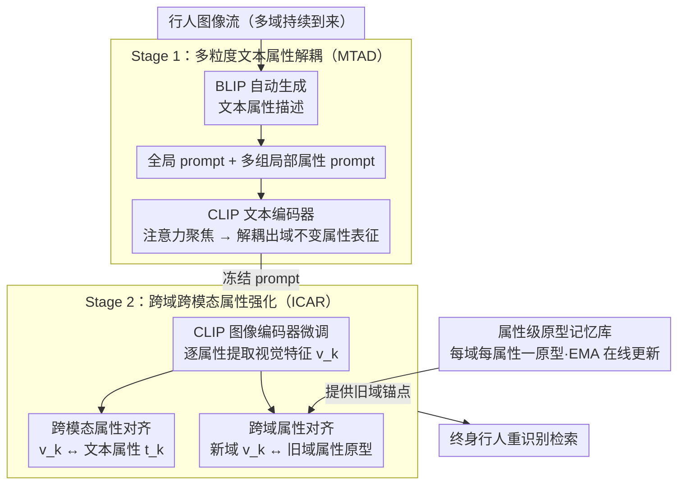

# Vision-Language Attribute Disentanglement and Reinforcement for Lifelong Person Re-Identification

**会议**: CVPR 2026  
**arXiv**: [2603.19678](https://arxiv.org/abs/2603.19678)  
**代码**: [https://github.com/zhoujiahuan1991/CVPR2026-VLADR](https://github.com/zhoujiahuan1991/CVPR2026-VLADR)  
**领域**: 行人理解  
**关键词**: 终身行人重识别, 视觉语言模型, 属性解耦, 跨模态对齐, 遗忘缓解

## 一句话总结

VLADR 提出利用视觉-语言模型（VLM）中的细粒度属性知识来增强终身行人重识别，通过多粒度文本属性解耦（MTAD）和跨域跨模态属性强化（ICAR）两阶段训练，显式建模跨域共享的人体属性以实现高效知识转移和遗忘缓解，在抗遗忘和泛化能力上分别超越 SOTA 1.9%-2.2% 和 2.1%-2.5%。

## 研究背景与动机

**领域现状**：终身行人重识别（Lifelong Person Re-Identification, LReID）要求模型从持续到来的不同域数据中学习，构建统一的行人检索系统。与标准 ReID 不同，LReID 面临灾难性遗忘问题——学习新域知识时容易丢失旧域知识。现有方法主要从视觉分类预训练模型出发，利用知识蒸馏、原型记忆、分布建模等策略缓解遗忘。

**现有痛点**：尽管视觉-语言模型（如 CLIP）已展现出强大的泛化能力，但现有 LReID 方法直接适配 VLM 时存在明显不足——它们仅考虑全局表征学习，忽视了细粒度属性知识的利用。全局表征在域变化时容易被域特定的背景、光照等冗余信息干扰，而人体属性（如衣着颜色、体型、配饰等）是跨域稳定的语义锚点，被严重低估。

**核心矛盾**：LReID 的核心挑战在于"新知识获取"与"旧知识保持"之间的矛盾。全局表征对域变化敏感，导致学新忘旧。而细粒度属性（如"穿红色上衣、背黑色背包"）是域不变的语义描述子，理论上可以作为跨域知识转移的桥梁——但现有方法缺乏显式的属性建模机制。

**本文目标**：设计一个 VLM 驱动的 LReID 框架，(1) 显式解耦全局和局部人体属性，(2) 利用跨模态属性对齐实现细粒度知识转移，(3) 通过跨域属性对齐缓解遗忘。

**切入角度**：作者观察到人体属性具有"跨域共享性"——无论在 Market-1501 还是 MSMT17 数据集中，"穿蓝色牛仔裤"的语义都是一致的。如果能将这些共享属性显式地解耦出来并建立跨模态对齐，就能作为跨域知识转移的锚点。

**核心 idea**：使用 VLM（BLIP）自动生成行人图像的多粒度文本属性描述，然后通过可学习 prompt 将全局和局部属性在文本空间中解耦，再利用跨模态和跨域多层对齐将属性知识注入视觉编码器，实现属性引导的终身学习。

## 方法详解

### 整体框架

VLADR 采用两阶段训练流程：**Stage 1（MTAD）**——在 CLIP 文本编码器端进行多粒度文本属性解耦，学习全局和局部属性的 prompt 表征；**Stage 2（ICAR）**——冻结 Stage 1 的 prompt 权重，利用预提取的文本描述对 CLIP 图像编码器进行微调，通过跨模态属性对齐和跨域属性对齐实现知识转移。基础架构基于 CLIP-ReID 和 DASK 框架。

### 关键设计

**1. 多粒度文本属性解耦 MTAD：把一句行人描述拆成全局 + 多个域不变的局部属性**

直接把 CLIP 的全局表征拿来做 LReID 有个老问题——全局向量里身份信息和背景、光照这些域特定噪声纠缠在一起，换个数据集就容易学新忘旧。MTAD 的做法是先借语言端把"什么是稳定的"显式拆出来：用 BLIP 给每张行人图自动生成一句文本描述（如 "a person wearing a red shirt and blue jeans, carrying a black backpack"），再准备两组可学习 prompt——一组**全局 prompt** 抓整体外观，多组**局部属性 prompt** 各盯一个属性维度（上衣颜色、裤型、配饰等）。把描述和 prompt 拼起来过 CLIP 文本编码器，靠注意力让每个 prompt 各自聚焦到描述里对应的那一段，从而在文本空间把"红上衣""蓝牛仔裤""黑背包"这些语义单元分别落到独立的属性表征上。这样得到的局部属性是跨域共享的——无论 Market-1501 还是 MSMT17，"穿蓝色牛仔裤"语义都一致，于是它就成了跨域知识转移的最小可共享单位，比裹挟着域噪声的全局向量稳得多。

**2. 跨域跨模态属性强化 ICAR：把文本端解耦好的属性同时灌进视觉编码器、并跨域锁住**

光在文本空间拆好属性还不够，真正做检索的是图像编码器，它得"懂"这些属性、而不是又退回去依赖域特定线索。ICAR 因此叠了两道对齐。一是**跨模态属性对齐**：冻结 Stage 1 的 prompt，逐属性维度计算图像特征与对应文本属性特征的匹配损失，强迫视觉编码器对第 $k$ 个属性提取出的视觉特征 $\mathbf{v}_k$ 向文本属性 $\mathbf{t}_k$ 靠拢，把语言端的属性语义"翻译"成视觉端可识别的特征。二是**跨域属性对齐**：训新域时不再像传统做法那样在全局粒度上做蒸馏，而是把新域每个属性的表征拉向旧域同名属性的原型，约束它别漂太远。关键在粒度——遗忘其实是细粒度的，某些属性会被新域覆盖、另一些仍稳定，在属性级别逐维保持，比把整个全局向量一锅端地蒸馏要精准得多，这也是消融里"全局 + IDA"只有 49.2% 而"属性 + IDA"能到 52.3% 的原因。

**3. 属性级原型记忆库：用每域每属性一个原型，替掉昂贵的样本回放**

跨域对齐需要一个"旧域长什么样"的锚点。最直接的办法是存一堆旧域样本回放，但那既占空间又是在原始特征空间里硬比。这里改成给每个已学域的每个属性维度只维护一个原型向量，用指数移动平均在线更新。学新域时就拿新域属性表征去对齐这些旧原型。好处有三：原型比成堆 exemplar 紧凑得多，几乎不增存储；对齐发生在语义属性空间而非原始像素/特征空间，更贴近"保持身份语义"这个真实目标；而属性本身跨域共享，原型天然就是合法的对齐锚点，不像实例那样换域就失效。

### 损失函数 / 训练策略

**Stage 1 损失**：

- 文本-图像匹配损失：确保全局 prompt 和局部属性 prompt 与对应文本描述对齐
- 属性正交性损失：鼓励不同局部属性 prompt 关注不同的属性维度，避免冗余
- 标准交叉熵和 triplet 损失用于身份分类

**Stage 2 损失**：

- 跨模态属性对齐损失：$\mathcal{L}_{\text{CMA}} = \sum_{k=1}^{K} \text{dist}(\mathbf{v}_k, \mathbf{t}_k)$，将第 $k$ 个视觉属性特征 $\mathbf{v}_k$ 与对应文本属性特征 $\mathbf{t}_k$ 对齐
- 跨域属性对齐损失：$\mathcal{L}_{\text{IDA}} = \sum_{k=1}^{K} \text{dist}(\mathbf{v}_k^{\text{new}}, \mathbf{p}_k^{\text{old}})$，将新域属性表征与旧域属性原型对齐
- 标准 ReID 损失（交叉熵 + triplet）

两阶段分别训练，Stage 2 加载 Stage 1 的 prompt checkpoint 和预提取的 BLIP 文本描述。

## 实验关键数据

### 主实验

| 指标 | VLADR | KRKC (前SOTA) | 提升 |
|------|-------|---------------|------|
| 抗遗忘 mAP (Setting 1) | ~52.3% | ~50.1% | +2.2% |
| 抗遗忘 Rank-1 (Setting 1) | ~68.2% | ~66.3% | +1.9% |
| 泛化 mAP (Setting 1) | ~34.5% | ~32.0% | +2.5% |
| 泛化 Rank-1 (Setting 1) | ~49.8% | ~47.7% | +2.1% |
| 抗遗忘 mAP (Setting 2) | ~48.7% | ~46.8% | +1.9% |
| 泛化 mAP (Setting 2) | ~31.2% | ~28.8% | +2.4% |

在两种标准 LReID 评测设置下均实现一致超越。抗遗忘指标衡量在所有已见域上的平均性能，泛化指标衡量在未见域上的迁移能力。

### 消融实验

| 配置 | 抗遗忘 mAP | 泛化 mAP | 说明 |
|------|-----------|---------|------|
| Baseline (CLIP-ReID + LReID) | 47.1% | 28.5% | VLM 直接适配 |
| + MTAD (Stage 1 only) | 49.6% | 30.8% | 属性解耦有效 |
| + CMA (跨模态对齐) | 51.0% | 32.3% | 属性知识注入视觉编码器 |
| + IDA (跨域对齐) | 52.3% | 34.5% | 属性级知识转移缓解遗忘 |
| 全局表征 + IDA (无属性解耦) | 49.2% | 30.1% | 全局粒度不如属性粒度 |
| 随机属性划分 (替代 MTAD) | 48.8% | 29.7% | 学习的属性解耦优于随机 |

### 关键发现

- MTAD 的属性解耦是性能提升的基础：+2.5% 抗遗忘 mAP，+2.3% 泛化 mAP
- 跨模态属性对齐（CMA）将文本属性知识有效注入视觉编码器，进一步提升 +1.4% / +1.5%
- 跨域属性对齐（IDA）在新域学习时提供精细的知识保持，再带来 +1.3% / +2.2% 提升
- 属性粒度的知识转移显著优于全局粒度：全局+IDA 仅 49.2%，而属性+IDA 达到 52.3%
- 两种 LReID 设置下的提升趋势一致，证明方法的鲁棒性

## 亮点与洞察

- **属性作为跨域桥梁**的思路很有说服力：衣着、体型等人体属性天然跨域共享，作为知识转移的最小语义单位比全局表征更稳定
- **两阶段解耦-强化**设计将复杂问题分而治之：Stage 1 专注文本空间的属性挖掘，Stage 2 专注视觉空间的属性注入，各司其职
- **利用 BLIP 自动生成属性描述**避免了人工标注属性标签的开销，使方法具有良好的可扩展性
- **属性级原型记忆**相比实例回放更加紧凑高效，且在语义层面操作更有意义
- 代码已开源，基于 CLIP-ReID 和 DASK 框架构建，复现性好

## 局限与展望

- 属性描述的质量依赖 BLIP 模型的描述能力，对遮挡严重或图像质量差的行人可能生成不准确的描述
- 属性数量（局部 prompt 数量 $K$）需要预先设定，不同数据集的最优值可能不同
- 当前方法假设属性是域不变的，但某些属性（如特定文化背景的着装）可能存在域特异性
- 未来可以探索将属性解耦从离散 prompt 扩展为连续属性空间，实现更灵活的属性建模
- 与大语言模型结合进行更精细的属性推理（如从"穿着制服"推断职业属性）也是有前景的方向
- 将方法扩展到 open-set ReID 和 text-to-image person retrieval 等相关任务

## 相关工作与启发

- **DASK (AAAI 2025)**：同一团队的前续工作，通过分布排练缓解遗忘，VLADR 在此基础上引入属性级知识转移
- **CLIP-ReID**：基线框架，将 CLIP 适配到 ReID 任务，VLADR 进一步挖掘了 VLM 的细粒度属性潜力
- **LSTKC (AAAI 2024)**：同一团队的长短期知识整合方法，VLADR 从知识级别提升到属性语义级别
- **持续学习领域**：属性级知识转移的思路可推广到其他持续学习任务（如物体检测、语义分割）中
- 启发：在 VLM 时代，"如何更好地利用语言端的结构化知识"是一个值得深入的通用问题

## 评分

- 新颖性: ⭐⭐⭐⭐ （属性解耦+跨域强化的组合有创新，但单个组件相对成熟）
- 实验充分度: ⭐⭐⭐⭐ （两种设置+完整消融，但缺少大规模数据集验证）
- 写作质量: ⭐⭐⭐⭐ （结构清晰，动机明确）
- 价值: ⭐⭐⭐⭐ （对 VLM 驱动的终身学习有启发，属性迁移思路通用性好）

<!-- RELATED:START -->

## 相关论文

- [\[CVPR 2026\] Prompt-Anchored Vision–Text Distillation for Lifelong Person Re-identification](prompt-anchored_vision-text_distillation_for_lifelong_person_re-identification.md)
- [\[CVPR 2026\] Composite-Attribute Person Re-Identification via Pose-Guided Disentanglement](composite-attribute_person_re-identification_via_pose-guided_disentanglement.md)
- [\[CVPR 2026\] Dynamic Magic: Unleashing Restricted Knowledge for Lifelong Person Re-Identification](dynamic_magic_unleashing_restricted_knowledge_for_lifelong_person_re-identificat.md)
- [\[CVPR 2026\] Towards Cross-Modal Preservation, Consistency and Alignment for Privacy-Preserving Visible-Infrared Person Re-Identification](towards_cross-modal_preservation_consistency_and_alignment_for_privacy-preservin.md)
- [\[CVPR 2026\] Tackling Alignment Ambiguity in Person Retrieval through Conversational Attribute Mining](tackling_alignment_ambiguity_in_person_retrieval_through_conversational_attribut.md)

<!-- RELATED:END -->
