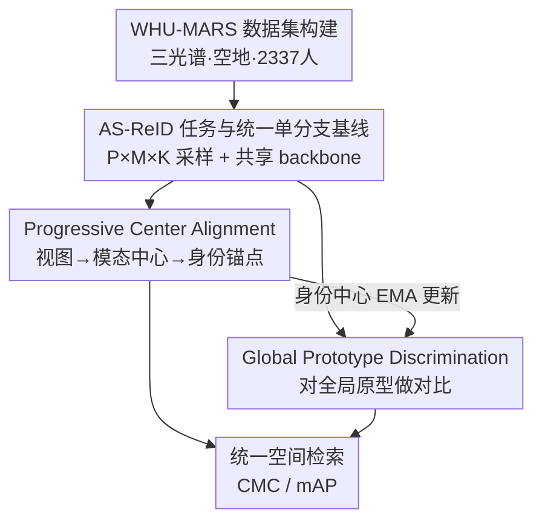

# WHU-MARS: A Multispectral Aerial-Ground Benchmark Towards Any-Scenario Person Re-Identification

**会议**: CVPR 2026  
**论文**: [CVF Open Access](https://openaccess.thecvf.com/content/CVPR2026/html/Zhao_WHU-MARS_A_Multispectral_Aerial-Ground_Benchmark_Towards_Any-Scenario_Person_Re-Identification_CVPR_2026_paper.html)  
**代码**: https://github.com/msm8976/WHU-MARS  
**领域**: 行人重识别  
**关键词**: 行人重识别、多光谱、空地协同、统一表征、benchmark

## 一句话总结
论文提出"任意场景行人重识别"(AS-ReID)新任务——用单一模型在混合所有模态/视角的异构图库里做任意到任意检索，并构建了迄今最大的多光谱空地数据集 WHU-MARS（2,337 人、43 万张 RGB/近红外/热红外、地面+无人机），同时给出一个不需要多分支、不需要成对对齐的 UAD 框架，靠渐进式中心对齐 + 全局原型判别在 AS-ReID 上达到最佳且参数最省。

## 研究背景与动机

**领域现状**：行人重识别（ReID）早已从单一 RGB 摄像头扩展到异构感知——近红外(NIR)在弱光下有效、热红外(TIR)能穿透烟雾/伪装、无人机(UAV)提供大范围灵活视角。于是衍生出一堆细分设定：传统 ReID、可见-红外 ReID（VI-ReID）、空地 ReID（AG-ReID）、多模态 ReID（MM-ReID）。

**现有痛点**：这些任务全都围绕**预定义的场景对**组织（如"可见-红外""空-地"两两配对），每种配对训一个专用模型、用一套专用协议评测。但真实部署里，query 可能来自任意模态、任意视角，而图库里同时混着所有场景。两两配对的设计把检索割裂成一堆子任务，既无法训练也无法评测一个"通用"模型；同时随着模态/视角增多，多分支或成对对齐损失会**随场景数二次膨胀**，参数和复杂度爆炸。数据层面也有缺口：现有数据集大多按场景对切分、每个身份的跨场景覆盖有限，而且**偏白天采集**，恰恰漏掉了红外传感器最该发挥作用的夜间。

**核心矛盾**：把所有场景塞进一个异构图库后，会同时撞上两个相互纠缠的表征难题——(a) **场景无关的类内聚合**：同一身份在不同模态/视角下特征四散，应该在统一空间里聚拢；(b) **大间隔的类间判别**：混合图库里冒出海量"看着像但不是同一人"的难负样本，特征间必须维持清晰的全局间隔。

**本文目标**：(I) 跳出预定义场景对，立一个跨任意场景都成立的统一检索范式；(II) 造一个真实世界对齐、场景覆盖广的 benchmark；(III) 设计一个可扩展的单模型，既学好异构源又同时满足 (a)(b)。

**核心 idea**：把"任意到任意检索"显式定义成 AS-ReID 任务，用一个共享单分支 backbone 学统一表征，再用**先聚合再对齐的中心对齐**解决类内聚合、用**对全局原型做对比**解决类间判别——全程无成对假设、随场景数线性扩展。

## 方法详解

### 整体框架

论文有三块贡献串成一条线：**新任务 AS-ReID → 新数据集 WHU-MARS → 新框架 UAD**。

AS-ReID 把场景定义为"模态 × 视角"的组合：模态集合 $\mathcal{M}=\{\text{RGB, NIR, TIR}\}$、视角集合 $\mathcal{V}=\{\text{ground, aerial}\}$，场景空间是笛卡尔积 $\mathcal{S}=\mathcal{M}\times\mathcal{V}$。每张图带 $(y,s,c)$（身份、场景、相机），任务要求用单一模型 $f_\theta:\mathcal{X}\to\mathbb{R}^d$ 把图映到一个统一空间，给定任意场景的 query，从横跨所有场景的图库里检索同一身份（评测时按 VI-ReID 惯例排除与 query 同相机的图库项）。

为支撑这个任务，作者用两个无人机平台（DJI H20T，20–50m 高度）+ 五个地面节点（自研三光谱相机，约 1.5m）同步录制 RGB/NIR/TIR 视频，跨 7 个月（7 月到次年 1 月）、覆盖昼夜/多季节/多天气，建成 WHU-MARS：2,337 人、434,620 张图、13 个采集场次、38 小时视频，每个身份都被三种模态、多视角观测。并切出两个官方版本——全量 WHU-MARS-2337 和帧同步三光谱三元组的子集 WHU-MARS-1000，让 AG/VI/MM/AS-ReID 能在同一批身份上一致评测。

方法侧的 UAD 框架架在一个共享单分支 backbone 上，训练时叠两个互补正则项：ProCA 管类内聚合、GPD 管类间判别。下图给出从输入到检索的整条流向：

### 关键设计

**1. WHU-MARS 数据集：每个身份都有三光谱 + 空地全覆盖**

针对"现有数据集按场景对切分、跨场景覆盖有限、偏白天"的缺口，WHU-MARS 让**每个身份**都同步出现在 RGB/NIR/TIR 三模态、地面与无人机两类视角下，并横跨昼夜、多季节、多天气，因此第一次能在同一份数据里既做 AS-ReID 又兼容标准 AG/VI/MM-ReID 协议。规模上 2,337 人、434,620 张图，是目前最大的多光谱行人 ReID 数据集。为了平衡"真实世界的非成对性"与"成对任务的可比性"，作者切了两个版本：WHU-MARS-2337 保留全部图像（含大量无帧同步配对的图，贴合真实部署），WHU-MARS-1000 则取 1,000 人、61,974 组帧同步三光谱三元组，且其训练/测试身份是 2337 版本对应划分的子集，保证跨尺度的身份对齐。隐私上做了人脸自动马赛克、去除可识别元数据。

**2. AS-ReID 任务与统一单分支基线：用一个 backbone 暴露所有异构条件**

把"任意到任意检索"形式化后，作者刻意不走多分支路线，而是给 AS-ReID 配一个极简的统一单分支基线，作为场景无关的参照。关键在采样器：用 $P\times M\times K$ 采样（$P$ 个身份、$M=|\mathcal{M}|$ 个模态、每身份每模态 $K$ 张），让每个 mini-batch 内就富含跨模态、跨视角的变化。所有图过同一个 backbone 得到特征 $f=f_\theta(x)$，再过共享的 BNNeck 得 $z=\mathrm{BN}(f)$；BN 层和分类器共享以逼模型在统一空间里学习，推理时对 $f$ 做 $\ell_2$ 归一化检索。基线损失就是常规度量+分类：$\mathcal{L}_{base}=\mathcal{L}_{ce}+\mathcal{L}_{WRT}$（加权正则三元组损失 + 交叉熵）。这一步的意义是：先证明"单模型不靠任何场景专用模块"本身是可行参照，后面 ProCA/GPD 才是叠在它上面的提升。

**3. Progressive Center Alignment（ProCA）：先把视图聚成模态中心，再把模态拉向身份锚点**

异构感知会带来场景特定偏置——同一人的特征在不同模态/视角下发散，伤害跨场景检索。直接对齐场景对要么随场景数二次膨胀、要么需要图像级配对，作者改用**两级渐进对齐**。第一级把同一身份同一模态的 $K$ 个视图取均值再归一化成模态中心：$\boldsymbol{\mu}_{y,m}=\mathrm{norm}\big(\tfrac{1}{K}\sum_{k=1}^{K}f^{y}_{m,k}\big)$，这一步隐式压掉视角噪声和尺度变化。第二级再把各模态中心聚成身份锚点 $\boldsymbol{\mu}_{y}=\mathrm{norm}\big(\tfrac{1}{|\mathcal{M}|}\sum_{m}\boldsymbol{\mu}_{y,m}\big)$，并把它当作 **stop-gradient 锚点**。最后把每个模态中心拉向身份锚点、最小化身份内的跨场景散度：

$$\mathcal{L}_{ProCA}=\frac{1}{P}\sum_{y\in\mathcal{B}}\frac{1}{|\mathcal{M}|}\sum_{m\in\mathcal{M}}\big\|\boldsymbol{\mu}_{y,m}-\boldsymbol{\mu}_{y}\big\|_2^2.$$

"先在模态内消化多视角、再在身份层对齐模态"的顺序很关键：它产出更干净、噪声更低的身份中心 $\boldsymbol{\mu}_y$，既降低了跨场景散度，又给下游 GPD 提供稳定锚点。整个设计无配对、随场景数线性扩展。

**4. Global Prototype Discrimination（GPD）：把样本对全数据集身份原型做对比，逼出全局大间隔**

ProCA 把同身份聚拢了，但异构大图库里全是难负样本，需要强类间判别；而三元组这类度量损失只在 mini-batch 内塑造局部几何，缺全局结构。GPD 维护一份身份级、$\ell_2$ 归一化的原型记忆 $\mathcal{P}^{(t)}=\{p_y\}$，每轮迭代里**先固定原型做全局对比、再用 ProCA 算出的身份中心 $\boldsymbol{\mu}_y$ 以动量 EMA 更新原型**：$p_y\leftarrow\mathrm{norm}\big(\alpha\,p_y+(1-\alpha)\,\boldsymbol{\mu}_y\big)$，从而跨迭代累积全数据集信息、又不必每步重算全集。对比目标对每个归一化特征 $f_i$，把自己身份的原型 $p_{y_i}$ 当正、其余所有原型当负：

$$\mathcal{L}^{(i)}_{GPD}=-\log\frac{\exp(f_i^\top p_{y_i}/\tau)}{\sum_{y\in\mathcal{Y}_{train}}\exp(f_i^\top p_{y}/\tau)},$$

$\tau$ 为温度。这等于让每个样本同时被推离**所有**其他身份，逼出接近均匀的全局分离。它和 ProCA 互补：ProCA 给出低噪身份中心稳住原型记忆，GPD 反过来用全局监督把身份中心推得更开。

### 损失函数 / 训练策略

UAD 总目标把两个正则项叠在基线上、且都作用在 BN 前的特征 $f$（与检索排序协议一致）：

$$\mathcal{L}_{UAD}=\mathcal{L}_{base}+\lambda_{ProCA}\,\mathcal{L}_{ProCA}+\lambda_{GPD}\,\mathcal{L}_{GPD}.$$

实现：ViT-Base（ImageNet 预训练）backbone，4×RTX 3090 + DDP，图像 128×256，$P{=}16,M{=}3,K{=}4$（单卡 batch 192），SGD 训 120 epoch（5 epoch 线性 warm-up + 余弦衰减），GPD 动量 $\alpha{=}0.8$、温度 $\tau{=}0.03$，$\lambda_{ProCA}{=}0.01$、$\lambda_{GPD}{=}1.0$。

## 实验关键数据

### 主实验

AS-ReID 协议下（Table 3），UAD 在 WHU-MARS-1000 / 2337 上全面领先，且是 Transformer 类方法里参数最少的（85.7M）。下表摘录 1000 与 2337 两个划分的代表性对比：

| 方法 | 参数 | 1000 mAP | 1000 R-1 | 2337 mAP | 2337 R-1 |
|------|------|---------|---------|---------|---------|
| BoT (CVPRW19) | 23.5M | 5.9 | 18.4 | 4.6 | 14.8 |
| TransReID (ICCV21) | 99.9M | 7.4 | 17.1 | 5.5 | 13.1 |
| TransReID-SSL (21) | 88.4M | 10.1 | 26.7 | 9.2 | 24.4 |
| CLIP-ReID (AAAI23) | 125.3M | 10.6 | 26.6 | 9.3 | 24.1 |
| SeCap (CVPR25) | 130.9M | 10.4 | 26.4 | 8.0 | 21.4 |
| **UAD (本文)** | **85.7M** | **11.0** | **29.5** | **9.6** | **25.7** |

从 1000 扩到更大更杂的 2337，所有方法都掉点（难负样本和域偏移增多），印证了 benchmark 的难度随规模上升。

UAD 虽未针对单一子任务设计，却在多个传统协议上也有竞争力：AG-ReID（Table 4）的 A→G / G→A 上 mAP 取得最佳（11.5 / 13.3）；VI-ReID（Table 5）在更难的 TIR→RGB 上拿下最佳（R-1 9.04、mAP 6.32），作者认为是统一训练让稀缺、噪声大的 TIR 借到了 RGB/NIR 的监督。值得注意的是，即便最简单的 MM-ReID 成对设定（Table 7），最强方法 DeMo 也只有 44.8 mAP / 56.2 R-1，说明 WHU-MARS 整体比已有数据集难得多。

### 消融实验

AS-ReID 协议、WHU-MARS-1000（Table 8）：

| 配置 | mAP | R-1 | R-5 | R-10 |
|------|-----|-----|-----|------|
| 仅 $\mathcal{L}_{base}$ | 8.9 | 23.9 | 41.4 | 50.5 |
| base + ProCA | 9.3 | 24.5 | 42.0 | 50.7 |
| base + GPD | 10.9 | 28.7 | 45.9 | 54.2 |
| base + ProCA + GPD（完整） | 11.0 | 29.5 | 46.3 | 54.8 |

### 关键发现
- **GPD 单独贡献最大**：只加 GPD 就把 R-1 从 23.9 拉到 28.7（+4.8），全局原型结构是判别力的主要来源；ProCA 单加提升较小（R-1 +0.6），但它的价值在于产出低噪身份中心、稳住原型记忆，与 GPD 协同后达到最佳（R-1 29.5）。
- **统一表征的迁移性**：一个 UAD 模型在 3×3 query-gallery 模态对（Table 6）上都给出合理结果——同模态检索最易（RGB→RGB R-1 40.47），TIR 相关最难，但单模型无需任何模态专用分支即可覆盖全部 VI-ReID 子任务。
- **可视化**（Figure 4）：相比基线，UAD 把类内/类间余弦相似度分布的均值间隔从 0.16 拉大到 0.27，表征空间更可分。
- **规模即难度**：所有方法从 1000 到 2337 一致掉点，说明更多身份/场景带来的难负样本是核心挑战。

## 亮点与洞察
- **把割裂的子任务收编成一个任务**：AS-ReID 用"模态×视角"的笛卡尔积把 Tr/VI/AG/MM-ReID 统一成"任意到任意检索"的特例，避免了"每种配对训一个模型"的闭世界假设——这种问题重定义比单纯刷点更有价值。
- **"先聚合再对齐"的渐进式中心**很巧：第一级模态内取均值天然抹平视角噪声，第二级才在身份层对齐，且身份锚点用 stop-gradient，既给 GPD 稳定锚点又避免二次膨胀；这种"层次化中心"思路可迁移到任何多源/多域的类内聚合问题。
- **ProCA 喂 GPD 的闭环**：ProCA 产出的低噪身份中心正好拿去 EMA 更新原型记忆，GPD 的全局监督又反推中心更分散——两个正则项不是简单相加而是互为输入，设计上有机。
- **参数最省却最强**：在一众 100M+ 的 Transformer 方法里，UAD 用 85.7M 拿下 AS-ReID 最佳，对部署友好。

## 局限与展望
- **绝对指标偏低**：AS-ReID 上最好也只有 mAP 11.0 / R-1 29.5，离实用还远；这既说明 benchmark 难，也意味着 UAD 只是"可行的第一步"，远未解决问题。
- **单一校园场景采集**：数据全部来自一所大学校园，跨城市/跨地域的域差异、人群多样性是否覆盖充分存疑，泛化到真实开放城市仍待验证。
- **模态固定为三光谱**："任意场景"目前只实例化到 RGB/NIR/TIR × 地面/无人机；扩到更多模态（深度、事件相机、文本）或视角时，ProCA 的中心聚合与 GPD 的原型记忆是否仍线性可扩展、是否需要重新调权重，论文未深究。
- **TIR 相关任务普遍很弱**（TIR→RGB R-1 仅 9 左右），热红外这条最有"全天候"价值的模态反而是短板，后续可针对热红外的退化建模或更强跨光谱对齐发力。

## 相关工作与启发
- **vs VI-ReID 多分支/成对方法（如 CAJ、DEEN、PMT）**：它们为可见-红外两两配对训独立模型、带模态专用分支或成对对齐损失，随场景数二次膨胀；UAD 一次性在三模态上训单模型、无成对假设，在更难的 TIR→RGB 上反超，但在相对容易的 NIR→RGB 上略逊于专精的 PMT，体现"通用 vs 专精"的取舍。
- **vs AG-ReID 方法（VDT、DTST、SeCap）**：它们专门学视角不变性；UAD 未针对 AG 设计却在 A→G/G→A 上拿到最佳 mAP，说明统一表征本身就能缓解尺度与透视变化。
- **vs prompt/统一表征类多场景方法（Uni-Prompt、Instruct-ReID、VersReID）**：这类要么为预定义场景对训独立模型、要么用 RGB 锚定的目标偏向可见图库；UAD 走对称的任意到任意匹配，且不依赖 prompt 条件或场景专用检索头。
- **vs 现有数据集（SYSU-MM01、AG-ReID.v2、RGBNT201 等）**：它们按场景对组织、每身份跨场景覆盖有限且偏白天；WHU-MARS 以"每身份三光谱×空地全覆盖 + 昼夜/季节/天气"补齐了真实世界的一致多场景观测，并把规模推到 43 万张。

## 评分
- 新颖性: ⭐⭐⭐⭐⭐ 重定义任务（AS-ReID）+ 最大多光谱空地数据集 + 无成对/无多分支的统一框架，三位一体。
- 实验充分度: ⭐⭐⭐⭐⭐ 覆盖 AS/AG/VI/MM 四套协议、双规模划分、3×3 模态对、消融与可视化齐全。
- 写作质量: ⭐⭐⭐⭐ 问题—数据—方法逻辑清晰，公式完整；但绝对指标低、对失败模态分析略浅。
- 价值: ⭐⭐⭐⭐⭐ 为 ReID 社区提供了贴近真实部署的统一 benchmark 与可扩展基线，方向意义大。

<!-- RELATED:START -->

## 相关论文

- [\[CVPR 2026\] View-Aware Semantic Alignment for Aerial-Ground Person Re-Identification](view-aware_semantic_alignment_for_aerial-ground_person_re-identification.md)
- [\[CVPR 2026\] Composite-Attribute Person Re-Identification via Pose-Guided Disentanglement](composite-attribute_person_re-identification_via_pose-guided_disentanglement.md)
- [\[CVPR 2026\] Pose-guided Enriched Feature Learning for Federated-by-camera Person Re-identification](pose-guided_enriched_feature_learning_for_federated-by-camera_person_re-identifi.md)
- [\[CVPR 2026\] SSM-Aware Token-Efficient VMamba via Adaptive Patch Pruning and Merging for Person Re-Identification](ssm-aware_token-efficient_vmamba_via_adaptive_patch_pruning_and_merging_for_pers.md)
- [\[CVPR 2026\] Prompt-Anchored Vision–Text Distillation for Lifelong Person Re-identification](prompt-anchored_vision-text_distillation_for_lifelong_person_re-identification.md)

<!-- RELATED:END -->
