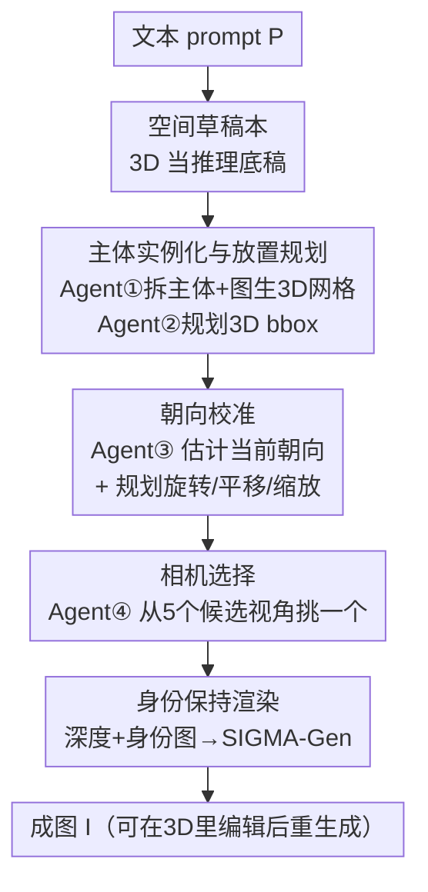

# 3D Space as a Scratchpad for Editable Text-to-Image Generation

**会议**: CVPR 2026  
**论文**: [CVF Open Access](https://openaccess.thecvf.com/content/CVPR2026/html/Saha_3D_Space_as_a_Scratchpad_for_Editable_Text-to-Image_Generation_CVPR_2026_paper.html)  
**代码**: https://oindrilasaha.github.io/3DScratchpad/ （项目主页，有）  
**领域**: 扩散模型 / 图像生成 / 可控生成  
**关键词**: 3D 空间推理、空间草稿本、智能体规划、组合生成、可编辑生成

## 一句话总结
本文提出把一个可编辑的 **3D 场景当作文生图的"空间草稿本"**：用一组 LLM 智能体把文本 prompt 解析成主体网格、在 3D 里规划摆放/朝向/相机，再用身份保持的深度可控生成把这个 3D 布局渲染成图，在 GenAI-Bench 上文本对齐 **免训练提升 32%**，且支持在 3D 里改一下就能一致地反映到成图。

## 研究背景与动机

**领域现状**：LLM 在推理任务上的一个核心经验是——把中间思考"外化"到显式工作区（scratchpad、chain-of-thought、ReAct/PAL/Toolformer 之类的工具增强）后，推理质量会显著变好。文生图（VLM / 扩散模型）虽然能合成细节丰富的图像，却没有一个对应的"空间工作区"来事先推敲几何关系再落笔。

**现有痛点**：组合性强的 prompt（多个主体、相对位置、朝向、计数、否定）经常生成失败：位置乱、朝向错、主体身份串味、数量对不上。现有的可控生成大多在 **2D 平面**上做布局——掩码、bounding box、分割图、区域 prompt（ControlNet、GLIGEN、LayoutGPT、RPG、SLD 等），只能给出"粗糙的平面空间提示"。

**核心矛盾**：很多空间属性本质是 3D 的（谁在谁前面、朝向相机还是侧身、近大远小），**把推理限制在平面实体上**，就无法可靠表达和编辑这些关系；而且 2D 布局改动很难一致地传播回成图、也保不住主体身份。

**本文目标**：给生成模型一个能让它"在三维里先想清楚再画"的中间介质——既能精确对齐文本意图，又天生支持平移/旋转/缩放这类 3D 编辑并可靠传回成图。

**切入角度**：作者把 3D **重新定位为"推理底稿"而非"渲染目标"**——3D 场景不是最终产物，而是连接语言意图和像素合成的中间工作区。在 3D 里 grounding 主体后，translation/rotation/rescale 这类约束就能可靠地传播到成图。

**核心 idea**：用 **3D 空间草稿本（spatial scratchpad）** 替代 2D 布局当推理介质，用一串专职 LLM 智能体规划场景，再用身份保持的深度可控生成把 3D 布局"画"出来。

## 方法详解

### 整体框架

给定文本 prompt $P$，目标是生成忠实于 $P$ 的图像 $I$。当 $P$ 是复杂组合时，直接让扩散模型从 $P$ 生成很困难，于是本文先构造一个**中间 3D 草稿本**：一个带地平面、固定 XYZ 边界和固定光照的空场景，往里实例化、摆放、定向若干主体，最后渲染成图。整条流水线被拆成四个子任务，每个交给一个（或多个）LLM 智能体，最后用多主体身份+深度可控生成出图：

- **Agent ①** 把 prompt 拆成 $n$ 个主体 $S$ 和背景，并生成增强 prompt $P'$；每个主体先文生图得到身份图 $S^I$，再图生 3D 得到无纹理网格 $S^M$。
- **Agent ②**（BboxPlanner）给每个主体规划 3D bounding box $S_{BBOX}$，把网格摆进场景，并给出自然语言的目标朝向 $S^{O}_{tgt}$（如"面向相机""平躺"）。
- **Agent ③** 调整每个主体的旋转/平移/缩放——内部再分成两个智能体：OrientationEstimator 从当前渲染图的主体裁剪框估计当前绝对朝向 $S^{O}_{est}$，TransformPlanner 用目标朝向、估计朝向和多视角渲染 $R$ 给出变换建议 $S_{TR}$。
- **Agent ④**（CameraPicker）从 5 个包含全部主体的候选视角里挑一个最贴合 prompt 的相机。

最后用深度 + 身份图 $S^I$ + 增强 prompt $P'$，经 SIGMA-Gen 生成最终图 $I$。

### 关键设计

**1. 空间草稿本：把 3D 场景当推理底稿而非渲染目标**

这是全文的范式创新，直接针对"2D 布局表达不了真 3D 空间关系"的痛点。作者构造一个固定边界、固定光照、带地平面的虚拟 3D 场景，把每个主体实例化成显式网格，于是"谁在谁前面、朝哪个方向、多大"这些约束都变成了可计算、可编辑的几何量。关键区别在于：3D 草稿本**不是要被当成最终画面渲染出来**，而是一块供模型（和用户）"先想清楚空间结构再落笔"的工作区——平移/旋转/缩放在 3D 里改完，再经统一的出图步骤可靠地传播到成图，从而同时拿到 3D 一致性、身份保持和组合可控性，这正是 2D 中心的系统普遍缺的能力。为效率起见，主体网格不做纹理生成，只给每个主体分配固定颜色并在 prompt 里告诉 LLM 颜色↔主体的对应。

**2. 主体实例化与 3D 放置规划：先图生 3D，再让 LLM 摆 bounding box**

针对"如何把语言里的主体变成可摆放的几何 + 摆到正确相对位置"。Agent ① 把 $P$ 拆成主体描述 $S^P$ 和增强 prompt $P'$，主体生成走的是 **"文生图 → 图生 3D"** 而不是直接文生 3D——因为前者能产出身份图 $S^I$，供最后一步做身份控制（论文 Figure 3 证明只给深度+prompt 会丢失文本对齐，加上身份才保得住）。Agent ②（BboxPlanner）在一段用文本描述的 3D 空间 $D$（坐标轴、地平面、边界，都相对前视相机 $C_{front}$ 定义）里规划每个主体的 3D bbox：

$$S_{BBOX} = \text{BboxPlanner}(P', S^P, S^I, S^A, D)$$

这里同时喂全局 prompt $P'$（管相对摆放）、主体 prompt $S^P$（管每个主体是什么）和 3D 长宽比 $S^A$（管 bbox 比例），多路信息一起给才能让 LLM 输出可靠的 3D bbox。该 agent 还顺带给每个主体一个自然语言目标朝向 $S^{O}_{tgt}$，供下一步用。

**3. 朝向校准：把"估计当前朝向"和"规划变换"拆给两个智能体**

针对一个很实在的发现——**LLM 规划 3D 摆放还行，但理解 3D 旋转很差**，直接拿当前场景渲染让 LLM 提旋转建议不可靠。作者把任务拆成两步：OrientationEstimator 先从"基于当前 3D 深度 + 身份图生成的图"里**裁出每个主体的局部框**来估计其当前绝对朝向 $S^{O}_{est}$（用裁剪而非整图，论文称给整图+描述会失败；不用草稿本渲染是因为网格无纹理看不出朝向）；TransformPlanner 再用多视角渲染 $R$（前/左/右/顶）、目标朝向和估计朝向给出变换建议：

$$S_{TR} = \text{TransformPlanner}(P', R, S^{O}_{est}, S^{O}_{tgt}, S^P, D)$$

它主任务是旋转，但也会按需给平移/缩放微调。"先客观估计现状、再规划差量"这种解耦，避免了让 LLM 一步到位猜旋转坐标这种它不擅长的事。

**4. 相机选择 + 身份保持出图：用候选视角投票，用 SIGMA-Gen 渲染**

针对"默认前视相机往往不好看也不贴 prompt"，以及"多主体出图怎么保身份"两件事。CameraPicker 不让 LLM 直接吐相机坐标（太抽象、输出不可靠），而是**先渲 5 个一定包含全部主体的候选视角，让 agent 从这 5 张里挑一张**最符合 prompt 的——把开放的回归问题变成可靠的选择题。出图阶段用深度把 3D 信息传给生成器，配合身份图 $S^I$ 和 $P'$，由 **SIGMA-Gen** 在单次去噪里同时控制多主体身份和深度结构（比 InsertAnything 那种逐个插入主体的迭代式做法质量更好）。编辑时先用 inpainting 把要改的主体抠掉，再在新位置/朝向插回，从而保住背景和其余主体身份。

### 一个完整示例

以 prompt"草地中央小圆桌上从左到右放着勺子、银刀、黑叉"为例（论文 Figure 4 的"需要朝向+相机更新"案例）：① Agent① 拆出勺/刀/叉/桌/草地，各自文生图→图生 3D 得到网格；② Agent② 在 3D 空间里把三件餐具按"从左到右"摆出 bbox、桌子居中、置于草地，并标注目标朝向；③ 渲染后 OrientationEstimator 发现餐具朝向不对，TransformPlanner 给出旋转把它们摆正；④ CameraPicker 从 5 个候选视角里选一个能同时看清三件餐具且构图好看的，最终经 SIGMA-Gen 出图。论文显示只用 ①②（0.821）→ 加 ③（0.824）→ 再加 ④（0.830）文本对齐逐级上升。

### 损失函数 / 训练策略

**本方法完全免训练**：所有规划 agent 用 GPT-5、格式化抽取用 GPT-4o，主体文生图用 Flux.1[dev]、图生 3D 用 Hunyuan-3D 2.5、渲染用 PyTorch3D（灰色地平面 + XYZ 标尺）、身份保持出图用 SIGMA-Gen；编辑时抠图用 ObjectClear、插入用 SIGMA-Gen + latent blending。没有任何额外训练或微调。

## 实验关键数据

### 主实验

在 GenAI-Bench advanced（870 prompts）和 CompoundPrompts（540 prompts）上，用 VQAScore 评文本对齐、Q-Align 评图像质量。

| 方法 | 推理介质 | GenAI 文本对齐 | GenAI 图像质量 | Compound 文本对齐 | Compound 图像质量 |
|------|----------|------|------|------|------|
| Flux.1[dev] | 无 | 0.63 | 4.75 | 0.85 | 4.84 |
| Idea2Img | 文本 | 0.80 | 4.76 | 0.87 | 4.76 |
| RPG - SDXL | 2D | 0.60 | 4.65 | 0.71 | 4.66 |
| RPG - Flux | 2D | 0.71 | 4.81 | 0.84 | 4.83 |
| **Ours** | **3D** | **0.83** | 4.81 | **0.91** | 4.84 |

GenAI-Bench 文本对齐相对 Flux 基线（0.63→0.83）提升约 32%，且图像质量持平或更好，同时是唯一支持一致可编辑的方法。

### 消融实验

| 配置 | 文本对齐 | 图像质量 | 说明 |
|------|---------|---------|------|
| ①+② | 0.821 | 4.81 | 仅拆主体 + 3D bbox 放置 |
| ①+②+③ | 0.824 | 4.80 | 加朝向校准 agent |
| ①+②+③+④ | 0.830 | 4.81 | 加相机选择 agent（完整） |
| ground plane（无标尺） | 0.821 | 4.82 | 草稿本渲染只有地平面 |
| ground plane + rulers | 0.830 | 4.81 | 给草稿本加 XYZ 标尺 |
| Iterative Insert-Anything | 0.81 | 4.60 | 换成逐个插主体出图 |
| SIGMA-Gen | 0.83 | 4.81 | 本文采用，单次去噪多主体 |

### 关键发现
- **③ 朝向、④ 相机两个 agent 都带来递增收益**（0.821→0.824→0.830），说明朝向校准和视角选择确实是组合保真的关键环节，而非可有可无。
- **给草稿本渲染加"标尺"很有用**：有标尺把文本对齐从 0.821 抬到 0.830，相当于给 LLM 一个量化的空间参照系。
- **身份保持出图是文本对齐的命门**：只给深度+prompt 会丢失对齐（Figure 3），换成质量较低的 Iterative Insert-Anything 文本对齐 0.81 仍高于所有 2D/文本基线——说明方法对未来更好的多主体身份保持生成器是兼容的。
- **与 Idea2Img 互补**：本文 + Idea2Img(full) 把 GenAI 文本对齐进一步推到 0.85，且本文仅用单轮 prompt 增强就已超过 Idea2Img 三轮（0.83 vs 0.80）。

## 亮点与洞察
- **把"3D 当推理底稿"这个类比落地得很干净**：它把 LLM 的 scratchpad/CoT 思想迁移到视觉空间推理，且选了 3D 而非 2D，正好对上"空间关系本质是三维"的真实需求——这是最让人"啊哈"的地方。
- **"把回归问题改成选择题"的工程智慧反复出现**：相机不让 LLM 吐坐标而是从 5 个候选里选、朝向先估计现状再规划差量——都是绕开 LLM 不擅长的连续/绝对量预测，转成它擅长的判断/选择，很可复用。
- **无纹理网格 + 固定颜色 + 文本颜色映射**是个省算力又保信息的小 trick：既不用做纹理生成，又让 LLM 能在 prompt 里指代具体主体。
- **3D 草稿本天然支持一致编辑**：在 3D 里平移/旋转主体后经统一出图传回，身份和背景都保住，这是 2D 布局法做不到的，编辑能力可迁移到交互式创作工具。

## 局限与展望
- **完全依赖闭源大模型（GPT-5/GPT-4o）做规划**，复现成本和稳定性受 API 影响，⚠️ 可控性和可复现性存疑。
- **主体网格无纹理**，导致朝向必须从生成图裁剪估计而非直接从草稿本读，多了一层依赖生成质量的环节。
- **流水线很长**（文生图→图生 3D→多轮 agent 规划→多视角渲染→身份保持出图），单图耗时与失败传播未在正文充分讨论。
- 评测主要在 GenAI-Bench / CompoundPrompts 等组合 prompt 上，对极多主体（如十几个）或强遮挡场景的扩展性未知。

## 相关工作与启发
- **vs RPG / SLD / LayoutGPT（2D 布局）**: 它们用 LLM 在 2D 平面规划 bbox/区域，本文在 **3D 空间**规划摆放+朝向+相机，区别在于能表达并可靠编辑真三维关系（前后、朝向、近大远小），代价是流水线更重。
- **vs Idea2Img（纯文本推理）**: Idea2Img 靠多轮 prompt 增强+图像反馈迭代，本文靠显式 3D 几何，单轮即超过其多轮，且两者互补叠加还能再涨。
- **vs SceneCraft / OptiScene / Scenethesis（3D 场景生成）**: 那些把 3D 场景本身当产物（室内布局、资产摆放），本文把 3D 当**中间推理介质**来提升 2D 出图的文本保真度，目标和落点不同。
- **vs SIGMA-Gen / DreamBooth（身份控制）**: 本文直接复用 SIGMA-Gen 做多主体身份+深度统一控制，把它当出图后端而非贡献点，并证明对更弱的身份生成器也兼容。

## 评分
- 新颖性: ⭐⭐⭐⭐⭐ 首个把 LLM 规划纯粹放在 3D 空间做文生图，"3D 当推理底稿"是清晰且有说服力的新范式
- 实验充分度: ⭐⭐⭐⭐ 两个组合 benchmark + 逐 agent/渲染/出图器多组消融，但缺大规模主体数和耗时分析
- 写作质量: ⭐⭐⭐⭐⭐ 类比贯穿、流水线讲得清楚，图示与消融对得上
- 价值: ⭐⭐⭐⭐ 免训练、可编辑、对未来生成器兼容，对可控组合生成与交互创作有实用价值

<!-- RELATED:START -->

## 相关论文

- [\[CVPR 2026\] FG-Portrait: 3D Flow Guided Editable Portrait Animation](fg-portrait_3d_flow_guided_editable_portrait_animation.md)
- [\[CVPR 2026\] SeeThrough3D: Occlusion Aware 3D Control in Text-to-Image Generation](seethrough3d_occlusion_aware_3d_control_in_text-to-image_generation.md)
- [\[CVPR 2026\] Vinedresser3D: Agentic Text-guided 3D Editing](vinedresser3d_agentic_text-guided_3d_editing.md)
- [\[CVPR 2026\] CAST: Context-Aware Dynamic Latent Space Transformation for Interactive Text-to-Image Retrieval](cast_context-aware_dynamic_latent_space_transformation_for_interactive_text-to-i.md)
- [\[CVPR 2026\] ShapeAR: Generating Editable Shape Layers via Autoregressive Diffusion](shapear_generating_editable_shape_layers_via_autoregressive_diffusion.md)

<!-- RELATED:END -->
