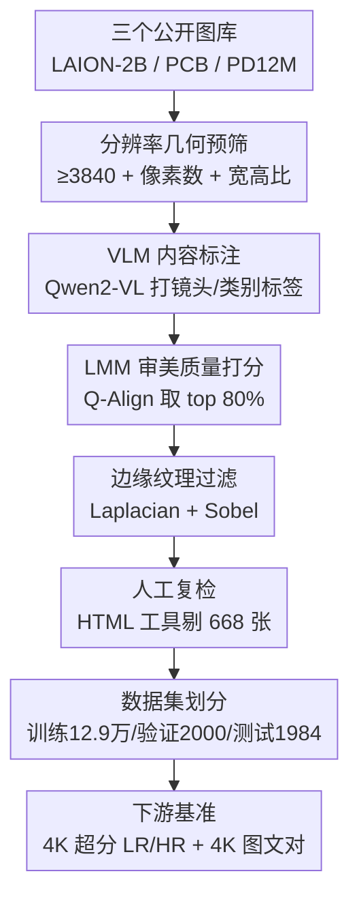

# 4KLSDB: A Large-Scale Dataset for 4K Image Restoration and Generation

**会议**: CVPR 2026  
**arXiv**: [2605.24762](https://arxiv.org/abs/2605.24762)  
**代码**: https://4klsdb.github.io/ (项目主页)  
**领域**: 扩散模型 / 图像生成 / 超分辨率 / 数据集  
**关键词**: 4K 数据集, 原生高分辨率, 超分辨率, 文生图, 多阶段筛选

## 一句话总结
这篇论文构建了 4KLSDB——一个含 12.9 万张**原生 4K**（≥3840×2160，非放大）训练图、覆盖自然/城市/人物/美食/艺术/CGI 等多类别的大规模数据集，通过"几何预筛 → LMM 质量打分 → 边缘纹理过滤 → 人工复检"的多阶段管线把约 39 万候选图压到高质量子集，并配套提供成对 LR/HR 的 4K 超分基准与图文对，实验证明把 SwinIR/MambaIR/Sana 等模型在它上面微调后，4K 超分和 4K 文生图的保真度与感知质量都明显提升。

## 研究背景与动机

**领域现状**：无论是超分辨率（SR）这类图像复原任务，还是文生图（T2I）扩散模型，"更高分辨率、更多样的训练数据通常带来更锐利的重建和更强的泛化"几乎是公认规律。要训练能输出 $2048^2$、$4096^2$ 的现代生成/复原模型，原生高分辨率训练样本是刚需。

**现有痛点**：公开数据集卡在 HD/2K 这一档，"原生 4K"且"规模够大"两者很难兼得。DIV2K 只有 1000 张 2K 图，规模太小；LSDIR 把规模做到 8.7 万但仍以 HD/2K 为主；DIV8K 分辨率上到 8K 却只有 1500 张训练图，量不够；生成侧的 DiffusionDB、HQ-Edit 提供图文对，但分辨率很少超过 $1024^2$，而且不提供 SR 需要的成对 LR/HR 数据。

**核心矛盾**：现有资源是**割裂**的——支持复原的缺原生 4K 规模，支持生成的又没被设计成"既能复原又能生成"的公开 4K 基准。结果是很多研究只能用合成放大图或私有数据集，损害了可复现性和公平比较。

**本文目标**：造一个**统一**的、公开的原生 4K 资源，同时服务 4K 复原（含成对 LR/HR 基准）和 4K 生成（含对齐图文对），且必须保证图是真 4K、画质过硬。

**切入角度**：单靠"分辨率达标"远不够——很多图像素够了却有压缩伪影、模糊、纹理贫乏。所以作者的关键不在"找 4K 图"，而在**如何用低人力成本把大量看似合格的 4K 图里真正高质量、富纹理的那批筛出来**。

**核心 idea**：用"规则 + 大多模态模型（LMM）打分 + 人工抽检"三层互补的多阶段管线，从 LAION-2B / Photo Concept Bucket / PD12M 三个公开语料里淘出 12.9 万张原生 4K 高质量图，并直接配好复原与生成两套下游基准。

## 方法详解

### 整体框架
4KLSDB 的核心是一条**漏斗式筛选管线**：从三个公开大规模图库出发，经过四道一层比一层严的关卡，把原始候选池逐级精炼成高质量、审美对齐的 4K 数据集，最后切成训练/验证/测试集并附带标注。整条流程的设计哲学是"前面用便宜的自动规则砍掉大头，后面用越来越贵（LMM、人工）的手段精修小批量"，从而在巨大体量下把人工成本压到最低。

### 关键设计

**1. 分辨率几何预筛：用三条硬约束先界定"什么才算 4K 候选"**

最先要解决的是"鱼龙混杂的原始图库里哪些有资格进 4K 池"。作者不靠模型，而用三条可批量执行的几何硬规则同时满足才保留：① **最小边约束**——图的高或宽至少有一边 $\geq 3840$ 像素；② **像素总量约束**——总像素数 $\geq 3840 \times 2160$；③ **宽高比约束**——宽高比落在 $[0.6, 1.6]$，把极端全景图或细长条图排除。三条规则缺一不可，确保进入下一阶段的都是接近标准 4K 画幅、不会是又长又窄的"伪高分辨率"图。这一步对应图中 Raw Pool → Phase 1，几乎零成本地砍掉绝大多数不合格图。

**2. VLM 内容标注：给候选池打上镜头尺度与内容类别标签，保证后续多样性可控**

光有高分辨率还不够，作者要保证最终数据集**类别和景别都均衡**，否则可能全是风景大图。于是用 Qwen2-VL-7B 给每张保留图标注两类标签：**镜头尺度**（long shot / medium shot / close-up / extreme close-up）和**内容类别**（自然场景 / 游戏CGI / 动漫 / 绘画）。这些标签不直接用来筛图，而是在后面切分训练/验证/测试集时用来**监控并维持内容多样性**，避免某一类或某种景别占比失衡。这也是为什么最终数据集能横跨 nature、urban、people、food、artwork、CGI 多个类别。

**3. LMM 审美质量打分：用 Q-Align 把"分辨率达标但画质拉胯"的图刷掉**

预筛只看尺寸，但很多 4K 图仍带压缩伪影、模糊、畸变或审美差。作者对约 39 万张 Phase-1 图用 **Q-Align** 同时打"图像质量分"和"审美分"，然后通过对多个保留比例做可视化抽检，最终选 **top 80%** 作为画质与数据量之间的最佳折中。这一层在更贵的纹理过滤之前，先批量清掉一大批"看着不行"的样本，是质量门槛的第一道把关。

**4. Laplacian + Sobel 双算子纹理过滤：保住高频信息丰富、对训练真正有监督价值的图**

这是管线里最有"技术含量"的一关，针对的痛点是：过于平坦、模糊、低对比的图对 SR 和 4K T2I 的高频学习几乎没价值，甚至会削弱模型恢复细节的能力。作者用两个互补的边缘算子来量化"纹理是否丰富"。

*全局边缘强度（Laplacian）*：先用拉普拉斯核 $K_L$ 卷积得到 $L = I * K_L$，再算其响应方差 $\operatorname{Var}(L)=\frac{1}{N}\sum_{x,y}[L(x,y)-\mu_L]^2$。方差落在经验区间外的图被剔除——方差过小说明图整体太平滑/模糊，过大的离群值则可能是异常锐化或噪声。

*局部纹理（Sobel 平坦块比例）*：先算 Sobel 梯度幅值 $M(x,y)=\sqrt{G_x^2+G_y^2}$，把 $M$ 切成不重叠的 $s\times s$（$s=240$）小块，对每块算方差 $\operatorname{Var}(P_k)$；若某块方差 $< T_{\text{flat}}$ 则判为"平坦块"。再统计整图的平坦块比例 $R_{\text{flat}}=\frac{1}{N_p}\sum_{k=1}^{N_p}\mathbb{I}[\operatorname{Var}(P_k)<T_{\text{flat}}]$，当 $R_{\text{flat}}\geq T_{\text{ratio}}$ 时整图被拒。经过试点实验，作者取 $T_{\text{flat}}=100$、$T_{\text{ratio}}=65\%$，即一张图里超过 65% 的块都很平坦就丢掉。Laplacian 管"全局够不够锐"、Sobel 管"局部纹理够不够密"，两者互补，专门保住对高频学习有用的富纹理样本。

**5. 人工复检与数据集划分：用 HTML 工具修正机器残留误判并切出基准**

自动管线之后还剩一个约 134,136 张的中间池。再强的自动规则也会漏掉个别审美差/细节不足的图，于是两位人工标注员借助一个 **HTML 在线审查工具**逐张过，移除 **668** 张不合格图。从剩下的可靠池里，作者手工核对类别和景别多样性后，划出 **2000 张验证集**、**1984 张测试集**，余下 **129,484 张**作训练集。关键是验证/测试样本全保持原生 4K，没有缩放或低分裁剪，这让基准能评测那些"缩放后就被掩盖"的尺度相关伪影（过平滑、重复纹理、边界畸变等）。

## 实验关键数据

实验思路很直接：拿现有代表性模型，分别用**常规低分辨率数据集**和 **4KLSDB** 训练/微调（架构完全相同），看 4KLSDB 带来多大增益。覆盖三类任务：经典超分、真实盲超分、4K 文生图。硬件为 2×A100。

### 主实验：经典超分（PSNR/SSIM，越高越好）

在 4KLSDB 自身测试集和跨域 DIV8K 上，三种架构（HiT-SR、SwinIR、MambaIR）微调后全面提升。以 HiT-SR 为例：

| 测试集 | 模型 | ×4 PSNR | ×8 PSNR | ×16 PSNR |
|--------|------|---------|---------|----------|
| 4KLSDB | HiT-SR (baseline) | 24.50 | 22.25 | 19.47 |
| 4KLSDB | HiT-SR (Ours) | **29.27** | **24.75** | **23.69** |
| DIV8K | HiT-SR (baseline) | 26.51 | 21.90 | 19.99 |
| DIV8K | HiT-SR (Ours) | **31.71** | **23.22** | **24.61** |

HiT-SR 在 4KLSDB 上 ×4/×8/×16 的 PSNR 分别提升约 **+4.77 / +2.47 / +4.22 dB**；跨域 DIV8K 上同样提升，说明增益不局限于训练域。SwinIR 在 4KLSDB 上微调后（×4 PSNR 28.79）一致超过 DIV2K（24.11）和 DF2K（24.11）基线；MambaIR 同理（×4 PSNR 从 25.92 → 30.92）。倍率越大（×8、×16）增益越突出。

### 真实盲超分（4KLSDB 测试集，Baseline / Ours）

| 方法 | 倍率 | PSNR↑ | SSIM↑ | LPIPS↓ | FID↓ |
|------|------|-------|-------|--------|------|
| SeeSR | ×4 | 27.01 / **28.25** | 0.700 / **0.734** | 0.523 / **0.451** | 38.95 / **33.88** |
| OSEDiff | ×16 | 22.65 / **22.69** | 0.621 / 0.597 | 0.657 / **0.487** | 51.76 / **33.97** |

SeeSR 在所有倍率、几乎所有指标上一致提升（×4 时 PSNR/SSIM/LPIPS/FID 全面变好）。OSEDiff 在 PSNR/LPIPS/DISTS 上大多改善，×16 时 FID 大幅下降（51.76 → 33.97）；但最难的 ×16 下 SSIM、NIQE 等少数指标互有胜负，反映真实盲超分里"感知真实感 vs 失真保真度"本身难两全。

### 4K 文生图（Sana，基线 vs 4KLSDB 微调）

| 模型 | pCLIPScore↑ | pNIQE↓ |
|------|-------------|--------|
| Sana (baseline) | 28.62 | 5.21 |
| Sana + 4KLSDB | **29.27** | **4.63** |

patch 级指标（把 4K 输出切成不重叠 $1024^2$ 块算）显示局部图文一致性和感知质量都变好。双盲成对用户研究中，微调版对原版的偏好胜率：**总体 57.34%**、细节 60.89%、**真实感 74.27%**、伪影 64.40%、对齐 52.29%——人类评测者在局部锐度、视觉自然度、伪影减少上明显更偏好微调版。

### 关键发现
- **纹理过滤（设计 4）是数据"含金量"的核心**：去掉平坦/模糊图直接决定模型能学到多少高频细节，这正是 SR 与 4K T2I 都受益的根本。
- **原生 4K 监督的价值随放大倍率放大**：×8、×16 的增益普遍比 ×4 更显著，说明真 4K 数据对极端超分尤其关键。
- **增益跨域成立**：在没见过的 DIV8K 上也涨点，说明 4KLSDB 提供的是更强的通用高分辨率先验，而非过拟合自身测试集。
- **真实感提升最猛**：用户研究里 realism 胜率 74.27% 远高于 alignment 的 52.29%，说明 4KLSDB 主要补的是"感知质量/局部细节"而非"文图语义对齐"。

## 亮点与洞察
- **"先便宜后昂贵"的漏斗式管线**：用几何规则（白菜价）砍大头、Q-Align 打分（中等成本）筛画质、人工只复检 13 万的中间池移除 668 张——这套成本分层思路可直接迁移到任何需要从海量噪声数据里淘高质量子集的数据工程任务。
- **把"分辨率达标"和"画质达标"明确解耦**：作者反复强调像素数够不等于能用，纹理算子（Laplacian 全局 + Sobel 局部）这种可量化、可调阈值的硬指标，比单纯靠 LMM 主观打分更稳、更可复现。
- **一份数据同时喂两类任务**：成对 LR/HR 给复原、对齐图文对给生成，避免了"复原数据集"和"生成数据集"长期割裂的问题。
- **保留原生 4K 的验证/测试集本身就是贡献**：很多伪影只有在不缩放的 4K 下放大才看得见，这让基准能评测过平滑、重复纹理、边界畸变等"缩放后隐身"的失败模式。

## 局限与展望
- **未提供完整的去重/重叠分析**：源自 LAION-2B 等公开图库，与下游已有 benchmark 是否存在图像重叠、版权与隐私（含人物图）问题，文中着墨不多。
- **筛选阈值偏经验**：$T_{\text{flat}}=100$、$T_{\text{ratio}}=65\%$、Q-Align top 80% 等都靠试点实验+可视化抽检定，缺少对阈值敏感性的系统消融，换数据域可能要重调。⚠️ 这些阈值的最优性以原文实验为准。
- **生成实验只验证了 Sana 单一模型**：4K T2I 仅在 Sana 上微调验证，是否对其他扩散架构（如 PixArt、SDXL 系）同样有效未知。
- **真实盲超分在 ×16 互有胜负**：极端倍率下感知与保真难两全，说明数据并不能解决所有问题，方法侧改进仍有空间。
- **改进思路**：补充重复纹理/小目标的细粒度标注，可进一步支撑高分辨率 captioning、VQA、区域级推理等多模态任务（作者也把这列为未来方向）。

## 相关工作与启发
- **vs DIV2K / LSDIR**：它们是经典 SR 基准但停在 2K，规模或分辨率二选一；4KLSDB 同时做到原生 4K + 12.9 万规模，且配套跨域 DIV8K 评测验证泛化。
- **vs DIV8K**：DIV8K 分辨率更高（到 8K）但只有 1500 张训练图，不足以支撑大规模训练；4KLSDB 用规模换取了可训练性。
- **vs DiffusionDB / HQ-Edit**：这些是生成侧图文对数据集，但分辨率很少超 $1024^2$ 且不提供成对 LR/HR；4KLSDB 既给图文对又给 LR/HR，横跨生成与复原。
- **vs Diffusion-4K (Aesthetic-4K) / PixArt-σ / Sana 的 4K 评测集**：它们多聚焦生成或表示学习的单一侧面、部分数据半封闭；4KLSDB 定位为统一的公开原生 4K 复原+生成基准。

## 评分
- 新颖性: ⭐⭐⭐⭐ 不是新算法，但"统一的原生 4K + 复原&生成双用基准"填补了明确空白，数据工程管线设计扎实。
- 实验充分度: ⭐⭐⭐⭐ 覆盖经典 SR / 真实盲 SR / 4K T2I 三任务、多架构、跨域 DIV8K 验证，还有双盲用户研究；缺阈值敏感性消融。
- 写作质量: ⭐⭐⭐⭐ 管线分阶段清晰、公式与阈值都给了，表格数字完整可查。
- 价值: ⭐⭐⭐⭐⭐ 公开原生 4K 数据集+基准对社区是稀缺资源，可直接复用推动 4K 复原与生成研究。

<!-- RELATED:START -->

## 相关论文

- [\[CVPR 2026\] Pico-Banana-400K: A Large-Scale Dataset for Text-Guided Image Editing](pico-banana-400k_a_large-scale_dataset_for_text-guided_image_editing.md)
- [\[CVPR 2026\] StyleText: A Large-Scale Dataset and Benchmark for Stylized Scene Text Inpainting](styletext_a_large-scale_dataset_and_benchmark_for_stylized_scene_text_inpainting.md)
- [\[CVPR 2026\] CG-Floor: Centroid-Guided Diffusion for Large-Scale Floorplan Generation](cg-floor_centroid-guided_diffusion_for_large-scale_floorplan_generation.md)
- [\[NeurIPS 2025\] UltraHR-100K: Enhancing UHR Image Synthesis with A Large-Scale High-Quality Dataset](../../NeurIPS2025/image_generation/ultrahr-100k_enhancing_uhr_image_synthesis_with_a_large-scale_high-quality_datas.md)
- [\[CVPR 2026\] MRT: Masked Region Transformer for Layered Image Generation and Editing at Scale](mrt_masked_region_transformer_for_layered_image_generation_and_editing_at_scale.md)

<!-- RELATED:END -->
