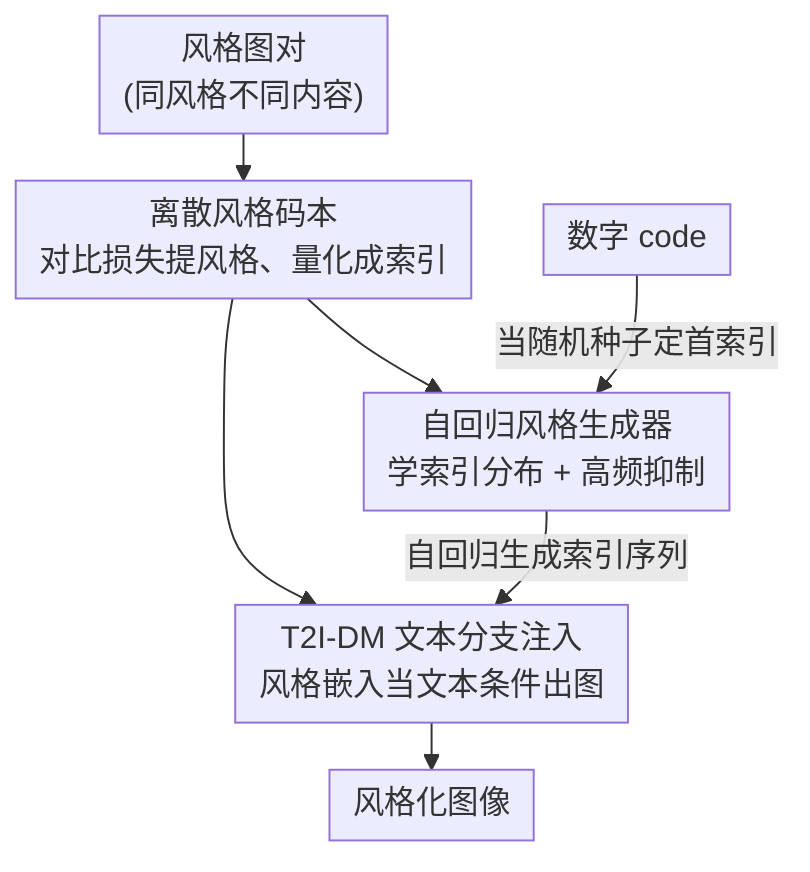

# A Style is Worth One Code: Unlocking Code-to-Style Image Generation with Discrete Style Space

**会议**: CVPR 2026  
**论文**: [CVF Open Access](https://openaccess.thecvf.com/content/CVPR2026/html/Liu_A_Style_is_Worth_One_Code_Unlocking_Code-to-Style_Image_Generation_CVPR_2026_paper.html)  
**代码**: https://kwai-kolors.github.io/CoTyle/ （项目主页）  
**领域**: 图像生成 / 扩散模型  
**关键词**: 风格生成, 离散码本, 自回归生成, 代码到风格, 扩散模型  

## 一句话总结
CoTyle 用一个纯数字 code 就能召唤出一种新颖且可复现的视觉风格：先训练一个离散风格码本把图像压成风格索引、再让一个 T2I 扩散模型以这些索引为条件出图，最后训练一个自回归生成器去"凭空造"新的风格索引序列，从而把"一个数字 = 一种风格"这件事在开源社区第一次实现。

## 研究背景与动机
**领域现状**：风格化图像生成目前主流靠三类条件——文本提示词（"用中国水墨风…"）、参考风格图、或预训练的风格 LoRA。它们都能让扩散模型出带风格的图。

**现有痛点**：这三类各有硬伤。文本提示词的风格一致性很差——同一句风格描述生成多张图，外观差异巨大；参考图和 LoRA 虽然一致性好，但它们的"风格"本质上来自已有图像，**无法创造没见过的新风格**（创造力差）；而且要把一种风格分享给别人复现，得传像素级参考图或一大坨 LoRA 权重，**可复现性也差**。换句话说，一致性、创造力、可复现性这三者，现有方法没有一个能同时拿下。

**核心矛盾**：风格的"表示载体"决定了上限——只要风格还绑定在参考图/权重这种"实体"上，就既造不出新风格、又难以轻量复现。

**本文目标**：找到一种最小、可移植、又能凭空生成的风格表示，让用户只输入一个数字就能得到一种**新颖**、**自洽一致**、**可被别人精确复现**的风格。

**切入角度**：工业界（Midjourney）已经能做"输入一串数字 code 出特定风格"，但没有任何技术报告，学术界一片空白。作者要做的就是把这件事开源化、可复现化。关键观察是：如果把风格编码成**离散索引**，那么索引天然契合自回归的 next-token 预测——于是"生成新风格"就等价于"自回归地生成一段新的索引序列"。

**核心 idea**：训练一个**离散风格码本**当风格提取器，再训练一个**自回归风格生成器**去采样新的风格索引序列，用一个数字 code 当随机种子来确定这条序列，最终由 T2I 扩散模型按索引出图——"一种风格值一个 code"。

## 方法详解

### 整体框架
CoTyle 把"code → 风格图"拆成三段串行训练、推理时再拼起来。**第一段**训练一个离散风格码本：用对比损失把"同风格不同内容"的图压到相近分布、"不同风格"的图推开，于是任意一张图都能被量化成一串离散风格索引。**第二段**把码本接进一个预训练 T2I 扩散模型（DiT），让它学会"以风格嵌入为条件"出图——此时模型已经能做图像驱动的风格迁移。**第三段**单独训练一个自回归 Transformer（风格生成器），它只学码本索引序列的分布（无条件、next-token 预测），于是能凭空吐出一段全新的、自洽的风格索引序列。

推理时（图 3c）：用户给的数字 code 被当作随机种子 → 固定种子下采样出首个索引 $I_0$ → 自回归补全剩下 $N-1$ 个索引 → 查码本得到风格嵌入 → 喂给 T2I-DM 出图。同一个 code 永远走同一条序列，所以风格可精确复现；换一个 code 就是另一种风格。

### 关键设计

**1. 离散风格码本：用对比损失把"风格"从内容里抽出来量化成索引**

痛点是：要让自回归生成器能"造风格"，必须先有一种**离散**且**只含风格、不含内容**的表示。作者训练一个码本 $\mathcal{F}(\cdot)$ 作风格提取器，输入是 ViT 特征。与传统用于重建图像的码本不同，它的目标不是高保真还原原图，而是把"同风格异内容"的图编码到同一分布、"异风格"的图编码到不同分布。为此用对比损失 $\mathcal{L}_{\text{contrast}} = \frac{1}{B}\sum_i [\,y_i (1-s_i)^2 + (1-y_i)(\text{ReLU}(s_i-m))^2\,]$，其中 $s_i$ 是第 $i$ 对样本两张图特征的余弦相似度，$y_i=1$ 表示同风格（拉近）、$y_i=0$ 表示异风格（推开到 margin $m$ 之外）。没有这个对比损失，模型会偷懒把所有风格都映射成同一个嵌入。

但只有对比损失会**码本坍缩**。作者发现必须再加一个重建损失 $\mathcal{L}_{\text{recon}}$，让风格嵌入 $\mathcal{F}(\mathbf{v})$ 别离原始 ViT 特征 $\mathbf{v}$ 太远（保持与 VLM 图像编码器输出的分布对齐，为第二段做铺垫）；再叠加标准的向量量化损失 $\mathcal{L}_{\text{VQ}}=\frac{1}{N}\sum_i(\|z_i-\text{sg}[e_i]\|_2^2 + \gamma\|z_i-e_i\|_2^2)$ 把连续编码 $z_i$ 拉到最近码字 $e_i$。总损失 $\mathcal{L}_{\text{style}}=\mathcal{L}_{\text{contrast}}+\alpha\mathcal{L}_{\text{recon}}+\beta\mathcal{L}_{\text{vq}}$。量化的好处有二：离散索引天然对接 next-token 预测；量化过程本身就抑制了无关的内容信息，让风格特征被更干净地"池化"出来。

**2. 文本分支注入风格：把风格嵌入当成"文本"喂进 DiT，而不是当图像条件**

痛点是：传统风格迁移把"风格"窄化为颜色，且习惯走视觉分支（把风格特征和噪声特征沿 token 维拼接），结果常常只抓到色调、丢掉语义级的风格元素。作者主张风格不只是颜色，而是含丰富语义特征，于是反其道而行——用一个 VLM 当文本编码器，**让风格嵌入替换掉原本的图像特征位置，从文本分支注入 DiT**。训练时对每对同风格图 $x_1,x_2$，从 $x_1$ 提 ViT 特征量化成 $\mathcal{F}(v_1)$，再以 $\mathcal{F}(v_1)$ 加上 $x_2$ 的文本提示 $y_2$ 为条件，用 rectified flow matching 生成目标图 $x_2$。这样风格信息能学得更贴合人类感知。消融里可以看到：视觉分支注入只能抓到剪纸的红色调、抓不到"圆形轮廓"这种语义风格；文本分支注入则能生成"由水晶块组成的人体"这类需要语义理解的风格。

**3. 自回归风格生成器 + 高频抑制采样：让数字 code 凭空造出新颖且不退化成写实的风格**

痛点是：第二段的风格嵌入都来自**已有图像**，因此造不出没见过的新风格。作者再训练一个自回归 Transformer（用 Qwen2-0.5B 架构但**从零训练**），对每张图取其码本索引序列，按 next-token 预测学这些索引的分布——于是它成了一个**无条件**风格生成器，能吐出全新的、自洽的索引序列。推理时（Alg. 1）：数字 code $n$ 设种子 → 采样首索引 $I_0\sim U\{0,\dots,K\}$ → 自回归生成全序列 → 查码本解码成风格嵌入 → 走第二段流程出图。

但直接采样有个坑：作者统计码本索引频率，发现少数索引出现频率极高，它们像"无意义占位符"——只从高频索引采样，出来的图**没有任何特定风格、退化成写实照片**。为此提出高频抑制：对索引 $i$ 的 logit 乘一个抑制系数 $s(i)=1$（当频率 $f(i)<\tau$）或 $e^{-k(f(i)-\tau)}$（当 $f(i)\ge\tau$），即频率越高、压得越狠。这一步把风格强度和多样性显著拉起来。

### 损失函数 / 训练策略
三个组件分阶段训练：① 码本——词表 1024、嵌入维度 64，2 万步、batch 128、lr 1e-5；② DiT——从预训练 T2I-DM 初始化，6 万步、batch 64、lr 4e-6；③ 风格生成器——Qwen2-0.5B 架构从零训，10 万步、batch 64、lr 1e-5。风格参考图统一缩放到 392×392（风格特征对几何变换鲁棒），每张图编码成 196 个风格 token，即序列长度 $N=196$。

## 实验关键数据

### 主实验
评测用 CSD 度量风格一致性与多样性，并用 CLIP-T 测文图对齐、QualityCLIP 测美学。code-to-style 任务随机采 500 个 code、每个出 4 张图共 2000 张评测。

| 方法 | 条件 | Diversity ↑ | Aesthetics ↑ | CLIP-T ↑ | Consistency ↑ |
|------|------|------|------|------|------|
| Midjourney（闭源） | Code | **0.8088** | 0.5948 | 0.3090 | 0.4734 |
| **CoTyle（本文）** | Code | 0.7764 | **0.7173** | 0.3119 | **0.6007** |
| USO | Image | - | 0.7153 | 0.3331 | 0.4395 |
| InstantStyleXL | Image | - | 0.7135 | 0.3134 | 0.5753 |
| **CoTyle\*（本文，图条件）** | Image | - | 0.7178 | 0.3230 | **0.5791** |

在 code-to-style 上，CoTyle 的风格一致性（0.6007）显著高于 Midjourney（0.4734），美学也大幅领先（0.7173 vs 0.5948）；仅多样性略低于 Midjourney（0.7764 vs 0.8088），作者归因于训练数据风格广度不够。在图条件设定下，CoTyle\* 的一致性（0.5791）也优于所有开源参考图方法。

### 消融实验
| 配置 | Aesthetics ↑ | CLIP-T ↑ | Consistency ↑ | 说明 |
|------|------|------|------|------|
| 完整 $\mathcal{L}_{\text{style}}$ | 0.7178 | 0.3230 | **0.5791** | 对比+重建+VQ |
| w/o 负样本 | 0.7174 | 0.3260 | 0.4890 | 每对都同风格，一致性掉到 0.489 |
| w/o $\mathcal{L}_{\text{recon}}$ | 0.7001 | 0.3237 | 0.4102 | 码本坍缩，一致性塌到 0.410 |

| 配置 | Diversity ↑ | Aesthetics ↑ | CLIP-T ↑ | Consistency ↑ |
|------|------|------|------|------|
| CoTyle（含高频抑制 $s(i)$） | **0.7764** | 0.7173 | 0.3119 | **0.6007** |
| w/o $s(i)$ | 0.7488 | 0.7177 | 0.3210 | 0.5301 |

### 关键发现
- **重建损失是防坍缩的命门**：去掉 $\mathcal{L}_{\text{recon}}$ 一致性从 0.5791 暴跌到 0.4102，因为风格嵌入飘离 VLM 图像编码器分布、码本坍缩；负样本（对比）则主要保一致性，去掉后掉到 0.4890。
- **高频抑制换来的是"风格 vs 写实"的取舍**：去掉 $s(i)$ 后多样性从 0.7764 掉到 0.7488、一致性从 0.6007 掉到 0.5301（大多数 code 退化成写实图）；有意思的是 CLIP-T 反而略升（0.3119→0.3210），说明写实图与文本对得更"准"，但那不是想要的风格化结果。
- **文本分支 > 视觉分支**：视觉分支注入只抓色调、丢语义风格元素；文本分支能理解"圆形轮廓""水晶质感"这类语义级风格。

## 亮点与洞察
- **"离散索引 = 可自回归生成的风格"这个桥接很巧**：把风格量化成离散 token 后，"创造新风格"就被转化成了语言模型最擅长的 next-token 生成，思路干净且可迁移到任何"想凭空造某种离散结构"的任务。
- **数字 code 当随机种子，是可复现性的精髓**：风格不再绑定像素图或权重，一串数字即可精确复现并轻松分享——这正是参考图/LoRA 范式做不到的。
- **高频索引≈无意义占位符**这个观察很实用：它解释了"为什么不加抑制就退化成写实"，并给出一个简单的 logit 抑制修复；类似的"高频 token 是垃圾占位"现象在其他离散表示里也值得排查。
- 把风格嵌入塞进**文本分支**而非视觉分支，挑战了"风格=颜色、走视觉条件"的惯性，提示风格其实是语义级概念。

## 局限与展望
- **多样性受训练数据广度限制**：作者明示 CoTyle 多样性略逊 Midjourney，源于训练集风格不够广——扩充数据是直接的改进方向。
- **评测主要靠 CSD/CLIP 类自动指标**：风格"新颖性""审美"本质偏主观，缺大规模人评，结论的可解释性有限。⚠️ 与闭源 Midjourney 的对比是手动从其网站收图评测，可能存在选样偏差。
- **token 序列长度固定 $N=196$、码本 1024**：风格空间容量与这些超参强相关，能表达的风格上限、以及不同长度/词表的影响尚未系统研究。
- 三段式分阶段训练、组件较多，端到端联训是否能更好或更省，留作开放问题。

## 相关工作与启发
- **vs 文本提示词风格生成**：它们靠语言描述风格，同一句话出图差异巨大、一致性差；CoTyle 用确定性的 code→索引序列，同 code 风格高度一致。
- **vs 参考图 / 风格 LoRA（USO、InstantStyleXL、CSGO 等）**：它们的风格来自已有图像/权重，造不出新风格且复现要传重资产；CoTyle 用自回归生成器凭空造新风格、用一个数字复现，且在图条件设定下一致性还反超它们。
- **vs StyleCodes**：同样想把风格编码成最小输入，但缺创造力和一致性；CoTyle 通过离散码本+对比损失+自回归生成补齐了这两点。
- **vs Midjourney（闭源 code-to-style）**：CoTyle 是首个开源复现该能力的框架，一致性/美学更优，仅多样性略低。

## 评分
- 新颖性: ⭐⭐⭐⭐⭐ 首个开源实现 code-to-style，把"离散索引+自回归"桥接到风格创造，范式新。
- 实验充分度: ⭐⭐⭐⭐ 主表+两组消融到位，但缺人评、与闭源对比靠手动收图。
- 写作质量: ⭐⭐⭐⭐⭐ 三段式 pipeline 讲得清楚，动机—机制—消融闭环。
- 价值: ⭐⭐⭐⭐⭐ 把"一个数字=一种可复现风格"开源化，对创作工具与社区有直接价值。

<!-- RELATED:START -->

## 相关论文

- [\[CVPR 2026\] Evaluating Generative Models via One-Dimensional Code Distributions](evaluating_generative_models_via_one-dimensional_code_distributions.md)
- [\[CVPR 2026\] Style-GRPO: Semantic-Aware Preference Optimization for Image Style Transfer Guided by Reward Modeling](style-grpo_semantic-aware_preference_optimization_for_image_style_transfer_guide.md)
- [\[CVPR 2026\] StyleTextGen: Style-Conditioned Multilingual Scene Text Generation](styletextgen_style-conditioned_multilingual_scene_text_generation.md)
- [\[CVPR 2026\] SplitFlux: Learning to Decouple Content and Style from a Single Image](splitflux_learning_to_decouple_content_and_style_from_a_single_image.md)
- [\[CVPR 2026\] StyleDoctor: Towards Specialist Reward Model for Style-centric Generation Tasks](styledoctor_towards_specialist_reward_model_for_style-centric_generation_tasks.md)

<!-- RELATED:END -->
