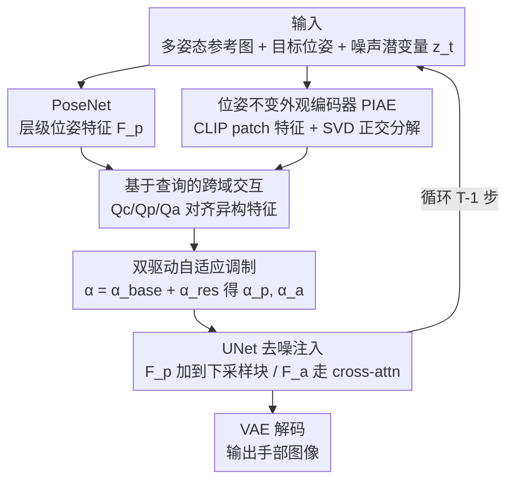

# A Temporal and Content Co-Awareness Latent Diffusion for Controllable Hand Image Generation

**会议**: CVPR 2026  
**论文**: [CVF Open Access](https://openaccess.thecvf.com/content/CVPR2026/html/Hao_A_Temporal_and_Content_Co-Awareness_Latent_Diffusion_for_Controllable_Hand_CVPR_2026_paper.html)  
**代码**: https://github.com/samukahs/TCCA  
**领域**: 扩散模型 / 可控图像生成  
**关键词**: 可控手部图像生成, 潜在扩散, 自适应调制, 位姿-外观解耦, SVD 正交分解

## 一句话总结
针对"可控手部图像生成里 pose/appearance 控制信号在所有去噪步用固定强度注入"这一痛点，本文提出 TCCA：用一组可学习 query 把噪声潜变量、3D 位姿、外观三类异构特征对齐到统一空间，据此**逐时间步动态调整**位姿与外观的注入强度，并配一个用 SVD 正交分解去掉位姿伪影的位姿不变外观编码器，在 InterHand2.6M 等数据上 FID/LPIPS/PCK 全面超过 FoundHand。

## 研究背景与动机

**领域现状**：可控手部图像生成的目标是——给一张/几张参考外观图 + 一个目标位姿，合成出"位姿对、外观也对"的手部图像，用于补充 AR/VR、3D 手部姿态估计、机器人等场景里稀缺的高质量手数据。当前主流是扩散模型，把 pose、appearance 当条件信号注入 UNet：要么 **input-level fusion**（把位姿/外观和噪声潜变量在通道维直接 concat），要么 **feature-level modulation**（通过 cross-attention 把条件灌进去）。

**现有痛点**：无论哪种注入方式，它们都在**所有去噪时间步用同一个固定强度**注入控制信号（static modulation）。但去噪过程本身是渐进的——早期定全局结构、晚期抠局部纹理——固定强度无视了这种渐进性，结果就是位姿被扭曲、局部纹理糊掉。

**核心矛盾**：作者做了一个"分时段特征注入"实验（Fig. 2：在不同去噪区间分别 mask 掉 pose 或 appearance 信号，看 LPIPS/PCK 怎么变），挖出两个被忽视的现象：(1) **早期 pose 和 appearance 强耦合**——这俩在早期是联合决定全局布局的，不是独立控制；早期缺了位姿条件不仅结构垮，连外观一致性都会被破坏（颜色断层、纹理糊）。(2) **条件复杂度强烈影响去噪**——复杂位姿、纹理丰富的区域需要更强的结构与外观约束；比如晚期时位姿条件对"复杂位姿"的几何一致性影响很大，但对"简单位姿"几乎没影响。一句话：pose/appearance 的最佳调制强度同时取决于**去噪状态**和**条件复杂度**，根本不是常数。

**本文目标**：让模型具备"时间感知 + 内容感知"的协同能力，按当前去噪状态和条件复杂度动态分配 pose/appearance 的注入强度。难点在于：噪声潜变量、3D 位姿、手部外观这三类表示语义分布和信息密度差异巨大，直接融合会语义错位、特征互相竞争干扰。

**核心 idea**：用一组可学习 query 把三类异构特征投影到**统一表示空间**做结构化跨域交互，从中推断"此刻需要多强的 pose / appearance 控制"，再用一个基础权重 + 残差修正的双驱动方式逐步注入；外观侧另配 PIAE，用 SVD 正交分解从多姿态参考图里抽出**位姿不变**的稳定外观表示。

## 方法详解

### 整体框架

训练时，输入是同一身份（ID）的多张参考外观图 $\{X_{ra}^i\}$、对应参考位姿 $\{X_{rp}^i\}$、一个目标位姿 $X_{tp}$，目标是重建出 GT 图 $X_g$。整个 pipeline 建在 Stable Diffusion 1.5 的 LDM 之上：先用一个轻量 **PoseNet** 从位姿图抽出层级位姿特征 $F_p=[f_1,f_2,f_3,f_4]$；用 **PIAE** 从多姿态参考图抽出稳定外观特征 $F_a$。这两路条件不再固定强度注入，而是先送进 **TCCA 模块**——它用三组可学习 query 把"噪声潜变量 $z_t$ / 位姿 / 外观"对齐到统一空间，推断出当前去噪步该用的位姿权重 $\alpha_p$ 和外观权重 $\alpha_a$，对 $F_p$、$F_a$ 做缩放后再注入 UNet（位姿特征加到每个下采样块末尾，外观特征通过 cross-attention 灌进每个 UNet block）。如此循环 $T-1$ 步去噪，最后 VAE 解码得到目标手部图像。

### 关键设计

**1. 基于查询的跨域交互机制：把三类异构特征对齐到统一空间再交互**

痛点很直接：要想"既感知去噪状态、又感知条件复杂度"，就得让噪声潜变量、3D 位姿、手部外观这三类特征互相对话；但它们来自不同域、语义分布和信息密度都不同，简单 concat/相加会语义错位，还会出现特征竞争与干扰。作者的做法是设三组**可学习 query** $(Q_c, Q_p, Q_a)$，分别去抽取三个跨"时间-内容"维度的语义因子：$Q_c$ 从噪声潜变量 $z_t$ 推断**当前去噪状态**（时间维的全局上下文），$Q_p$ 从位姿特征的最后一尺度 $f_4$（flatten 后）学**几何先验**，$Q_a$ 从 $F_a$ 抓**细粒度外观**；后两者共同构成内容维。这三组 query 随机初始化，通过标准 Transformer decoder 在训练中逐步精炼。这样异构特征被投影进**结构统一的表示空间**，跨域交互变得可控——这是后面动态调制能成立的前提。

**2. 双驱动自适应调制：基础权重定时间先验 + 残差修正补内容细节**

有了带时间/内容感知的语义因子，怎么把它变成"注入多强"的标量？作者用"基础权重 + 残差修正"的双驱动方式。先从 timestep embedding $t_{emb}$ 经 MLP 预测位姿**基础权重** $\alpha_p^{base}$，外观基础权重取其补 $\alpha_a^{base}=1-\alpha_p^{base}$——这一步只编码"早期偏结构、晚期偏外观"的时间先验，且天然让两路控制保持平衡。再让两个内容因子 $Q_p, Q_a$ 各自与时间因子 $Q_c$ 通过 Transformer encoder 交互（$t_{emb}$ 当可学习 `[CLS]` token 聚合全局语义、用 self-attention 建模三者依赖），据此预测出**残差修正**：考虑到 pose 与 appearance 在通道/token 层级的特征粒度不同，用两个 MLP 分别生成**通道级**残差 $\alpha_p^{res}$（位姿）和**token 级**残差 $\alpha_a^{res}$（外观）。最终调制强度与注入写成：

$$F_p^t = \alpha_p \odot F_p,\quad \alpha_p = \alpha_p^{base} + \alpha_p^{res}$$
$$F_a^t = \alpha_a \odot F_a,\quad \alpha_a = \alpha_a^{base} + \alpha_a^{res}$$

其中 $\odot$ 表示与对应特征的通道维/token 维缩放。$F_p^t$ 加到每个 UNet 下采样块末尾，$F_a^t$ 经 cross-attention 注入每个 block。基础权重负责"时间该往哪偏"，残差负责"这张图的内容复杂度需要多补一点"，二者相加正好实现"时间 + 内容协同"的动态注入，避免了静态调制的位姿错位与纹理漂移。

**3. 位姿不变外观编码器 PIAE：用 SVD 正交分解把位姿伪影从外观特征里剔掉**

单张参考图在新视角/新位姿、尤其严重自遮挡下信息不足；用多张参考图能互补，但每张图各自缠着自己的位姿伪影（阴影、褶皱），naive 融合会糊或不一致。PIAE 先用 **CLIP image encoder** 抽 patch-level 特征 $\{f_a^i\in\mathbb{R}^{H\times W\times D}\}$ 当初始外观表示（patch 级感受野小、分辨率高，能精确抓局部纹理）。关键一步是 **SVD 正交分解**：把同一 ID 多姿态的 patch 特征聚成"身份专属外观空间"（ISAS）embedding $e_p$，reshape 成矩阵 $M\in\mathbb{R}^{Q\times D}$（每行是一个 patch 在多个位姿下的 embedding），做 $M=U\Sigma V^\top$ 取前 $r$ 个奇异向量构成投影矩阵 $P_{proj}$（捕捉 ISAS 里的主要变化方向，即位姿相关成分），再把 $e_p$ 投到 $P_{proj}$ 的正交补上以剔除位姿成分：

$$e_p' = e_p - e_p^T P_{proj}$$

这样得到的 $e_p'$ 对位姿不变、又保留外观细节。之后用空间注意力权重自适应聚合 patch embedding 成紧凑语义 token，再把 CLIP 的 `[CLS]` token（全局一致性）和细粒度外观 embedding 拼起来，得到既有全局语义、又有局部纹理的稳定外观表示 $F_a$。⚠️ 公式 (4) 的具体记号以原文为准。

### 损失函数 / 训练策略

整体沿用 LDM 的噪声预测目标。训练基于 Stable Diffusion 1.5，单卡 RTX 4090，AdamW、学习率 $10^{-5}$。采用 classifier-free guidance：采样时 $w_{pose}=w_{id}=2.0$，训练时以概率 $\eta=10\%$ 丢弃参考外观与位姿条件。

## 实验关键数据

数据集为 FoundHand-10M 的子集，主文聚焦真实数据集 InterHand2.6M（合成集 DART / RenderIH / ReInterHand 在补充材料）。指标：FID/LPIPS/SSIM/PSNR 衡量图像质量，PCK/MPE（用 HaMer 估计 3D 姿态后做 2D 重投影）衡量几何一致性。

### 主实验

图像质量对比（InterHand2.6M，所有模型同数据训练，FoundHand 用官方 checkpoint）：

| 方法 | FID↓ | LPIPS↓ | SSIM↑ | PSNR↑ |
|------|------|--------|-------|-------|
| GestureGAN | 31.089 | 0.6720 | 0.3850 | 12.418 |
| CosHand | 17.343 | 0.5082 | 0.4211 | 13.772 |
| CFLD | 15.690 | 0.4701 | 0.4982 | 13.521 |
| FoundHand | 10.462 | 0.4390 | 0.5374 | 14.394 |
| **Ours (TCCA)** | **9.046** | **0.4078** | **0.5714** | **14.965** |

手部姿态评估（PCK 越高越好、MPE 越低越好）：本文 PCK@0.05 达 87.34、MPE 7.81，全面超过 FoundHand（83.93 / 8.76），且在合成数据上的姿态估计精度接近真实图像（Real PCK@0.05=91.82），说明生成图保有准确的 3D 几何结构。在更复杂的 hand-object interaction（全量 FoundHand-10M）上 FID 8.183 vs FoundHand 9.981，同样领先。

### 消融实验

PIAE 与 TCCA 两组组件消融（Table 4）：

| 类型 | 配置 | FID↓ | LPIPS↓ | SSIM↑ | 说明 |
|------|------|------|--------|-------|------|
| PIAE | PAT（仅 patch 特征） | 15.423 | 0.5422 | 0.4709 | 缺全局语义，颜色漂移/光照不一致 |
| PIAE | CLS（仅全局 [CLS]） | 14.002 | 0.5081 | 0.4839 | 外观保真差、纹理糊 |
| PIAE | ENG（不做 SVD 的纠缠特征） | 12.946 | 0.5117 | 0.5363 | 位姿泄漏进外观空间，强色偏+结构畸变 |
| PIAE | Ours (w/o TCCA) | 11.089 | 0.4390 | 0.5413 | 完整 PIAE，无 TCCA |
| TCCA | FH（简单 MLP 融合） | 11.436 | 0.4881 | 0.5010 | 特征竞争、保真下降 |
| TCCA | CT（仅粗时间线索） | 10.263 | 0.4201 | 0.5175 | 内容无感，content-agnostic |
| TCCA | CA（仅内容感知） | 9.804 | 0.4572 | 0.5693 | 缺时间分层，几何漂移+过平滑 |
| TCCA | TA（仅时间感知） | 9.652 | 0.4299 | 0.5673 | 复杂条件下几何不一致、纹理糊 |
| — | **Ours (full)** | **9.046** | **0.4078** | **0.5714** | 完整模型 |

### 关键发现
- **SVD 正交分解是 PIAE 的关键**：ENG（不做分解）FID 12.946，加上 TCCA 的完整模型才 9.046；位姿泄漏进外观空间会严重破坏生成（强色偏+结构畸变），证明把位姿伪影正交剔除确有必要。
- **时间感知和内容感知缺一不可**：只用时间感知（TA）在复杂条件下几何不一致；只用内容感知（CA）缺时间分层导致几何漂移、纹理过平滑；二者协同（full）才最优——印证了动机里"调制强度同时依赖去噪状态和条件复杂度"。
- **学到的调制强度有清晰时间模式**：Fig. 9 显示位姿权重 $\alpha_p$ 早期强（先定全局几何）、随去噪推进逐渐减弱（转向外观细化）；更妙的是 50 步和 1000 步采样下 $\alpha_p$ 轨迹几乎重合，说明该自适应策略稳定且具普适性。

## 亮点与洞察
- **把"控制强度该多大"也交给模型学**：以往可控扩散纠结于"怎么注入"，本文转而问"每一步该注入多强"，用 timestep embedding 的基础权重 + 内容残差实现逐步动态调制，是个很容易迁移到其他 pose/text/depth 条件生成任务的思路。
- **`[CLS]` token 当聚合枢纽**：用 $t_{emb}$ 充当 `[CLS]` token 去聚合位姿/外观/时间三因子的依赖，把"算注入强度"变成一次 self-attention，结构干净。
- **SVD 正交补做特征解耦**：从多姿态同 ID 图里用 SVD 抽主变化方向当"位姿子空间"，再投到正交补去掉位姿成分——这种无监督的解耦手段，对任何"想从一堆带干扰因素的样本里抽不变表示"的任务都有借鉴价值。
- **分时段注入实验本身有方法论价值**：通过在不同去噪区间 mask 条件信号来量化 pose/appearance 的时间行为，揭示了"早期强耦合"这一被忽视的现象，这个诊断式实验设计值得学习。

## 局限与展望
- 主文真实数据评测集中在 InterHand2.6M，合成集结果放在补充材料；跨数据集、in-the-wild 真实场景的泛化性待进一步验证。
- 依赖 CLIP 抽外观特征、HaMer 做姿态评估，外观/几何质量上限受这些 off-the-shelf 模型限制。
- SVD 正交分解里前 $r$ 个奇异向量的秩 $r$ 是关键超参，文中未充分讨论其敏感性与自适应选取。
- 仍是 ID-specific 设定（需同一身份多张参考图），对完全无参考或单参考极端自遮挡的情形鲁棒性如何，正文只在补充材料一笔带过。

## 相关工作与启发
- **vs FoundHand**：FoundHand 在 input level 把参考外观+空间标注与目标条件紧耦合，HOI 场景下目标物体姿态常被参考姿态带偏、手指畸变；本文靠细粒度外观抽取 + 动态调制把 pose-appearance 解耦，HOI 上 FID 更低、交互更自然。
- **vs CosHand / CFLD（feature-level modulation）**：它们用 cross-attention 固定强度注入条件；本文指出固定强度无视去噪渐进性，改为按去噪状态+条件复杂度动态调制。
- **vs DSW 等修复式方法**：依赖现成重建模型修结构畸变，对畸形输入脆弱；本文从生成端直接保证几何一致，不依赖后处理重建。

## 评分
- 新颖性: ⭐⭐⭐⭐ 把"动态调制控制强度"和 SVD 外观解耦引入可控手部生成，诊断实验切入点扎实
- 实验充分度: ⭐⭐⭐⭐ 主结果+姿态评估+HOI+两组组件消融齐全，调制权重可视化有说服力，但跨域泛化偏弱
- 写作质量: ⭐⭐⭐⭐ 动机由诊断实验自然导出，方法叙述清晰
- 价值: ⭐⭐⭐⭐ 动态调制思路可迁移到其他条件可控扩散，对手数据合成实用

<!-- RELATED:START -->

## 相关论文

- [\[CVPR 2026\] Learning Latent Proxies for Controllable Single-Image Relighting](learning_latent_proxies_for_controllable_single-image_relighting.md)
- [\[CVPR 2026\] MoCoDiff: A Controllable Autoregressive Diffusion Model for Expressive Motion Generation](mocodiff_a_controllable_autoregressive_diffusion_model_for_expressive_motion_gen.md)
- [\[CVPR 2026\] Unified Latent Space for Understanding and Generation via Semantic Auto-encoder](unified_latent_space_for_understanding_and_generation_via_semantic_auto-encoder.md)
- [\[CVPR 2025\] FoundHand: Large-Scale Domain-Specific Learning for Controllable Hand Image Generation](../../CVPR2025/image_generation/foundhand_large-scale_domain-specific_learning_for_controllable_hand_image_gener.md)
- [\[CVPR 2026\] Self-Corrected Image Generation with Explainable Latent Rewards](self-corrected_image_generation_with_explainable_latent_rewards.md)

<!-- RELATED:END -->
