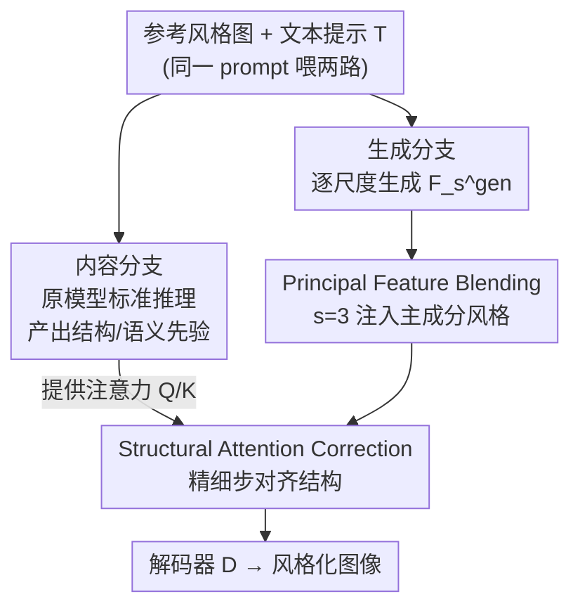

# A Training-Free Style-Personalization via SVD-Based Feature Decomposition

**会议**: CVPR 2026  
**论文**: [CVF Open Access](https://openaccess.thecvf.com/content/CVPR2026/html/Lee_A_Training-Free_Style-Personalization_via_SVD-Based_Feature_Decomposition_CVPR_2026_paper.html)  
**代码**: 待确认  
**领域**: 图像生成  
**关键词**: 风格个性化, 免训练, SVD特征分解, 尺度自回归模型, 注意力修正

## 一句话总结
基于尺度自回归模型 Infinity，本文发现生成过程第 3 个特征 $F_3$ 的**最大奇异值分量**专门编码风格信息，于是免训练地用 SVD 把参考图风格注入这一步特征（Principal Feature Blending），再借内容分支的注意力图稳住结构（Structural Attention Correction），在 3.58 秒内做到与微调方法相当的风格保真度，速度快达 195 倍。

## 研究背景与动机

**领域现状**：风格个性化图像生成（给一张参考风格图 + 一段文本，生成同风格、不同内容的图）目前主流做法分两类——要么按 DreamBooth/LoRA 思路为每个风格单独微调一个模型实例，要么用 IP-Adapter 这类适配器；底层几乎都建在扩散模型上。

**现有痛点**：① 微调类方法每来一个新风格就要重训一次，部署上无法规模化；② 扩散模型迭代去噪天然慢，单张图动辄几十到几百秒（StyleDrop 520s、DreamStyler 699s），不适合实时/交互场景；③ 很多方法虽然风格相似度（$S_{img}$）高，但其实是把参考图的**内容**也泄漏进来了（content leakage / mode collapse），看着像但语义对不上文本。

**核心矛盾**：风格保真（$S_{img}$ 高）与文本保真（$S_{txt}$ 高，即内容听话）之间存在直接 trade-off——把风格特征整块塞进去，风格上来了但内容跟着泄漏；保守一点不注入，内容干净但风格上不去。问题根源是现有方法把"风格"和"内容"在特征层面**混在一起**处理，缺乏一个能把二者干净分离的手段。

**本文目标**：在一个**免训练、单参考图、推理快**的框架里，找到一个能只动风格、不碰内容的特征操作，从而打破上述 trade-off。

**切入角度**：作者放弃扩散模型，改用尺度自回归模型 Infinity（next-scale prediction，12 步逐尺度生成，推理远快于扩散）；然后对它的生成过程做逐步剖析，想找到"哪一步、哪个分量"恰好承载风格。

**核心 idea**：通过 step-wise 分析定位到第 3 个特征 $F_3$ 同时主宰内容与风格，再通过 SVD 谱分析发现 $F_3$ 的**第一主成分（最大奇异值分量）几乎只编码风格**——于是只替换这个主成分就能换风格而几乎不动内容，全程不训练。

## 方法详解

### 整体框架

方法建在冻结的 Infinity-2B 上（12 步逐尺度生成，最终由解码器 $D$ 重建 $1024\times1024$ 图）。整篇的关键是两个先导分析得出的结论：(1) **逐步分析**把提示词只在某一步 $\hat{s}$ 替换、其余步保持原提示，发现 $\hat{s}=2$ 这一步对最终图改动最大——意味着该步之后生成的第 3 个特征 $F_3$ 同时决定内容与风格；(2) **关键步特征分析**对 $F_3$ 做 SVD $F_3=U\Sigma V^\top$，只保留最大奇异值 $\sigma_1$ 重建出 $F_3^{svd}$，发现把目标特征的主成分换成参考特征的主成分后，**只有颜色/风格相似度大涨、物体内容相似度几乎不变**——证明第一主成分主要装风格。

基于这两点，推理时采用**双分支（dual-stream）**结构，两路都用同一段文本提示 $T$（"\<content\> in \<style\>"，同 prompt 避免两路语义错位）：

- **内容分支（content path）**：原模型不做任何改动的标准推理，产出结构稳定、语义对齐的内容特征序列 $\{F_s^{con}\}$，充当结构先验。
- **生成分支（generation path）**：同样的更新规则，但其特征 $\{F_s^{gen}\}$ 会被本文两个模块改写，最终解码成带风格的输出。

两个模块只作用在生成分支：**PFB（Principal Feature Blending）**在 $s=3$ 这一步，把参考风格图的主成分风格注入生成特征；**SAC（Structural Attention Correction）**从 $s=3$ 起的所有精细步（$S_{fine}=\{3,4,\dots,S\}$），把内容分支的注意力 Query/Key 注入生成分支，稳住结构。

### 关键设计

**1. Principal Feature Blending（PFB）：只换 $F_3$ 的"主成分"就能换风格而不泄漏内容**

痛点是直接把参考图的整块特征 $F_3^{sty}$ 塞进生成分支（即下文消融里的 REP）会风格猛涨但内容严重泄漏。PFB 的关键在于：先用预训练多尺度图像编码器 $E_I$ 从参考图抽出多尺度风格特征 $\{F_1^{sty},\dots,F_S^{sty}\}$，只取第 3 个 $F_3^{sty}$（前面分析定位的关键步）；再设计一个**风格抽取函数 $\Phi$**，它不是只留第一主成分硬切，而是按奇异值谱序做**指数重加权**——放大主成分、平滑保留次要成分以维持风格连续性：

$$\Phi(F)\triangleq \mathbf{U}\mathbf{W}\boldsymbol{\Sigma}\mathbf{V}^\top,\quad F=\mathbf{U}\boldsymbol{\Sigma}\mathbf{V}^\top,\quad \mathbf{W}=\mathrm{diag}\big(e^{-0\cdot\alpha},e^{-1\cdot\alpha},\dots,e^{-(r-1)\alpha}\big)$$

其中 $r$ 是特征矩阵的秩，$\alpha>0$（实现取 $1.0$）控制沿奇异谱的衰减速率。随后用一个巧妙的"换主成分、留残差"的更新公式把风格融进生成分支：

$$\hat{F}_3^{gen}=\Phi(F_3^{sty})+\big(F_3^{gen}-\Phi(F_3^{gen})\big)$$

直觉是：$\big(F_3^{gen}-\Phi(F_3^{gen})\big)$ 抠掉了生成特征自己的风格主成分、留下结构/内容；再补上参考图的风格主成分 $\Phi(F_3^{sty})$。这样既换了风格、又保住了生成路自己的结构，是为什么它比整块替换泄漏小得多的根本原因。

**2. Structural Attention Correction（SAC）：借内容分支的注意力图修复 PFB 带来的结构扭曲**

痛点是 PFB 在特征层动刀后，偶尔会破坏结构连贯性，出现空间错位或形状扭曲。SAC 借鉴扩散模型自注意力里 Query–Key 交互能保住空间/结构关系的现象，把**内容分支的注意力 Q、K 直接注入生成分支**的自注意力层。在所有精细步 $s\in S_{fine}=\{3,\dots,S\}$（即内容与风格持续交互的阶段）做：

$$Q_s^{gen}\leftarrow Q_s^{con},\quad K_s^{gen}\leftarrow K_s^{con},\quad Q_s^{con}=W_Q F_s^{con},\ K_s^{con}=W_K F_s^{con}$$

即用内容分支算出的 $Q/K$ 替换生成分支的，从而让生成分支的注意力图对齐到结构稳定的内容分支上，整条精细化过程都被一个"结构先验"牵着走。注意这里只换 $Q/K$（决定 attend 到哪、即结构）、不换 Value（携带被注入的风格内容），所以结构被稳住而风格不被冲掉。

### 一个完整示例

以提示 "A photo of a \<red\> \<truck\>"（目标 $\hat{T}$）注入参考 "A photo of a \<blue\> \<bunny\>" 的主成分为例：① Baseline 直接出 $\hat{I}$，红卡车；② Full replacement 把整个 $\hat{F}_3$ 换成参考的 $F_3$，结果颜色（blue）和物体（bunny）相似度都大涨——内容泄漏成了"蓝兔子"；③ SVD-guided 只换最大奇异值分量，结果颜色相似度（blue 风格）显著上升、而物体（bunny）相似度几乎不动——仍是卡车但染上了参考的蓝色调风格。正是这个对照实验直接验证了"第一主成分≈风格"，并支撑了 PFB 的设计。

## 实验关键数据

实现：Infinity-2B 全参冻结，12 步生成；PFB 仅在 $s=3$、SAC 在 $S_{fine}=\{3,\dots,12\}$；$\alpha=1.0$；单张 $1024^2$ 图在单卡 A6000 上约 **3.58 秒**。评测沿用 FineStyle 协议：Parti 子集 190 个提示 × 10 种风格，指标为 $S_{txt}$（文本/内容保真）、$S_{img}$（风格保真）及二者的调和平均 $S_{harmonic}=\frac{2S_{txt}S_{img}}{S_{txt}+S_{img}}$（因为单看 $S_{img}$ 高可能是内容泄漏，调和平均更公允）。

### 主实验：与 8 个 SOTA 对比

| 指标 | 本文 | IP-Adapter | StyleAligned | DB-LoRA | B-LoRA | StyleAR |
|------|------|-----------|--------------|---------|--------|---------|
| 调和分数 $S_{harmonic}$ ↑ | **0.437** | 0.433 | 0.438 | 0.420 | 0.410 | 0.434 |
| 文本保真 $S_{txt}$ ↑ | **0.334** | 0.302 | 0.315 | 0.323 | 0.324 | 0.314 |
| 风格保真 $S_{img}$ ↑ | 0.630 | 0.763 | 0.716 | 0.602 | 0.559 | 0.701 |
| 推理时间(秒) ↓ | **3.58** | 10.13 | 64.58 | 342.01 | 630.42 | 346.68 |

StyleAligned/IP-Adapter 的 $S_{img}$ 虽高（0.72/0.76），但 $S_{txt}$ 明显低、定性图里普遍内容泄漏；DB-LoRA/B-LoRA 的 $S_{txt}$ 不错但每个新风格都要微调、且要几百秒。本文调和分数与最佳并列（0.437 vs StyleAligned 0.438），**$S_{txt}$ 最高**，且推理时间比微调类快最多约 195×，做到免训练 + 快 + 平衡。

### 消融：PFB 与 SAC 各自的作用

| # | 配置 | $S_{txt}$ ↑ | $S_{img}$ ↑ | $S_{harmonic}$ ↑ | 说明 |
|---|------|-------------|-------------|------------------|------|
| (a) | Infinity（baseline） | **0.348** | 0.559 | 0.429 | 无风格调制，内容最听话但风格弱 |
| (b) | + REP（整块替换 $F_3^{sty}$） | 0.279 | **0.696** | 0.398 | 风格最高但内容严重泄漏、$S_{txt}$ 暴跌 |
| (c) | + PFB | 0.321 | 0.631 | 0.426 | SVD 混合缓解了泄漏，风格仍大涨 |
| (d) | + PFB + SAC（Full） | 0.334 | 0.630 | **0.437** | 结构稳住后整体最均衡，调和分数最高 |

### 关键发现
- (a)→(b)：整块替换是风格保真上限（0.696），但 $S_{txt}$ 从 0.348 崩到 0.279，直观证明"整块塞风格=内容泄漏"，正是 PFB 要解决的。
- (b)→(c)：换成 SVD 主成分混合后 $S_{txt}$ 回升到 0.321、$S_{img}$ 仍有 0.631，验证"主成分≈风格"这一核心假设——只动风格、几乎不伤内容。
- (c)→(d)：加 SAC 后 $S_{txt}$ 进一步回到 0.334（风格几乎不掉，0.631→0.630），说明 SAC 主要贡献在修结构/稳内容而非换风格，与 PFB 互补。
- 用户研究（30 人）：本文在文本保真偏好上 35.3% 明显领先（IP-Adapter 4.3%、StyleAligned 5.0%），风格保真 32.0% 也具竞争力。

## 亮点与洞察
- **"第一主成分≈风格"这个发现本身最具迁移价值**：通过精心设计的 SVD-guided 对照实验（只换最大奇异值分量 → 只动颜色不动物体），把一个直觉假设做成了可验证的结论，给"在特征谱上分离风格与内容"提供了干净的实证。
- **"减自己的风格、补别人的风格"这个混合公式很巧**：$\Phi(F_3^{sty})+(F_3^{gen}-\Phi(F_3^{gen}))$ 不是简单替换，而是先在生成路里把自己的风格主成分扣掉再补参考的，天然保住结构，是免训练却能控泄漏的关键。
- **只换注意力的 $Q/K$ 不换 $V$ 来稳结构**：把"attend 到哪（结构）"和"attend 到的内容（风格）"解耦，是一个可复用到其它双分支生成/编辑任务的轻量 trick。
- **选对底座**：押注尺度自回归模型而非扩散，是 3.58 秒推理的根本来源——风格控制点 $s=3$ 只是 12 步里的一步，干预极轻。

## 局限与展望
- 整套方法强依赖"$F_3$ 第一主成分编码风格"这一发现，而这是在 Infinity 这一特定尺度自回归模型上做出的；换别的生成器（扩散、其它 AR），关键步与主成分语义未必成立，可迁移性存疑 ⚠️。
- 风格控制基本压在单一步 $s=3$ 的单一主成分上，对于纹理/笔触极复杂、需要多尺度协同的风格，单主成分注入可能不够细腻（消融里 $S_{img}$ 0.630 仍低于整块替换的 0.696）。
- 指数衰减 $\alpha$ 和"取第 3 步"都是基于其分析经验设定（$\alpha=1.0$），论文未给出对不同风格自适应选择关键步/衰减率的机制，跨风格鲁棒性待考。
- 只用单张参考风格图，未探讨多参考融合或风格强度连续可调；SAC 直接硬替换 $Q/K$，是否在某些结构-风格冲突的样本上过度约束，文中未深究。

## 相关工作与启发
- **vs StyleAligned / IP-Adapter**：它们风格相似度 $S_{img}$ 更高（0.72/0.76），但靠的是把参考图内容也搬过来（content leakage），$S_{txt}$ 低；本文用 SVD 只取风格主成分，牺牲一点 $S_{img}$ 换来明显更高的 $S_{txt}$ 与更干净的语义对齐。
- **vs DB-LoRA / B-LoRA（微调类）**：它们 $S_{txt}$ 好但每个风格都要单独微调、几百秒推理；本文完全免训练、3.58 秒、风格保真还更强，部署灵活性是核心优势。
- **vs 经典风格迁移（AdaIN / WCT）**：那一脉是对齐内容与风格特征的统计量（均值方差 / 全协方差）；本文换成在生成模型内部特征上做奇异谱分解 + 主成分混合，把"风格"定位到了具体的谱分量，机制更可解释。

## 评分
- 新颖性: ⭐⭐⭐⭐⭐ "$F_3$ 主成分≈风格"的发现 + SVD 主成分混合，在尺度自回归生成上开了一条免训练风格控制新路。
- 实验充分度: ⭐⭐⭐⭐ 8 个 SOTA 对比 + 清晰的两组消融 + 用户研究，但只在单一底座/单参考设定下验证。
- 写作质量: ⭐⭐⭐⭐⭐ 分析→假设→设计的逻辑链非常顺，图 2/图 3 的对照实验把动机讲得很扎实。
- 价值: ⭐⭐⭐⭐ 免训练 + 3.58 秒 + 平衡的风格/内容保真，对实时交互式风格化很实用。

<!-- RELATED:START -->

## 相关论文

- [\[CVPR 2026\] CRAFT-LoRA: Content-Style Personalization via Rank-Constrained Adaptation and Training-Free Fusion](craft-lora_content-style_personalization_via_rank-constrained_adaptation_and_tra.md)
- [\[CVPR 2026\] VDE: Training-Free Accelerating Rectified Flow Model via Velocity Decomposition and Estimation](vde_training-free_accelerating_rectified_flow_model_via_velocity_decomposition_a.md)
- [\[CVPR 2026\] OrthoFuse: Training-free Riemannian Fusion of Orthogonal Style-Concept Adapters for Diffusion Models](orthofuse_training-free_riemannian_fusion_of_orthogonal_style-concept_adapters_f.md)
- [\[CVPR 2026\] StyleGallery: Training-free and Semantic-aware Personalized Style Transfer from Arbitrary Image References](stylegallery_training-free_and_semantic-aware_personalized_style_transfer_from_a.md)
- [\[CVPR 2026\] Training-free Mixed-Resolution Latent Upsampling for Spatially Accelerated Diffusion Transformers](training-free_mixed-resolution_latent_upsampling_for_spatially_accelerated_diffu.md)

<!-- RELATED:END -->
