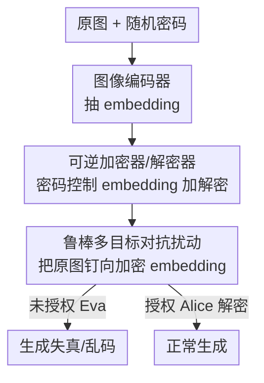

# Adapter Shield: A Unified Framework with Built-in Authentication for Preventing Unauthorized Zero-Shot Image-to-Image Generation

**会议**: CVPR 2026  
**论文**: [CVF Open Access](https://openaccess.thecvf.com/content/CVPR2026/html/Jia_Adapter_Shield_A_Unified_Framework_with_Built-in_Authentication_for_Preventing_CVPR_2026_paper.html)  
**代码**: 待确认  
**领域**: 扩散模型 / 图像版权保护  
**关键词**: 零样本图像生成, 对抗扰动, 身份保护, 风格防抄, 可认证加密

## 一句话总结
针对 IP-Adapter / InstantID 这类「一张图就能克隆人脸或画风」的零样本图生图，本文提出 Adapter Shield：先用一对可训练的「加密器/解密器」把图像编码器输出的 embedding 按密码映射成乱码，再用多目标对抗扰动把原图「钉」向这些乱码 embedding，从而让未授权者生成失真结果，而持正确密码的授权者能解密复原正常使用——是该领域第一个把「防护」和「认证」合二为一的通用框架。

## 研究背景与动机
**领域现状**：扩散模型的图生图已经进入「零样本」阶段。以 IP-Adapter、IP-Adapter FaceID、InstantID、PhotoMaker 为代表的方法不再需要像 LoRA / DreamBooth 那样用一小批图微调模型权重，而是用一个图像编码器（CLIP 或 ArcFace）把参考图抽成 embedding，再通过一个额外的 cross-attention 模块把这个 embedding 像文本提示词一样注入 UNet。结果就是：只用一张肖像或一幅画，就能复刻出高保真的人脸身份或艺术风格。

**现有痛点**：这种便利带来了严重的版权与肖像权风险——别人随手保存你一张自拍就能做 deepfake，盗一张画作就能批量仿你的画风。已有的图像保护方法（Mist、CAAT、ACE、Pretender、Anti-DreamBooth、Glaze 等）几乎全是为「防微调」设计的：它们假设攻击者会拿一批图去 fine-tune 模型，因此把扰动加在「微调会用到的梯度路径」上。可零样本方法根本不改权重，这些防护迁移过去基本失效。唯一针对零样本的 IDProtector 又有两个硬伤：(1) 不可逆——连可信方都没法恢复真实身份，毫无灵活性；(2) 只管人脸身份伪造，完全忽略了艺术风格抄袭这个同样关键的场景。

**核心矛盾**：一个真正可用的保护方案必须同时满足两个互相拉扯的要求。一是**通用性（Universality）**：要对多种零样本方法、多种威胁（人脸伪造 + 风格抄袭）、甚至攻击者对图片做模糊/加噪/JPEG 等后处理都依然有效。二是**可认证性（Authentication）**：图片主人应当能定义「谁可以用、怎么用」——授权方能正常生成，未授权方只能得到废图。后者意味着保护必须是**可逆**的（授权方能复原），而不可逆的纯破坏方案做不到这一点。

**本文目标**：在数据源头（图片本身）加一层「防护涂层」，让未授权的零样本图生图失败，同时给授权方留一把基于密码的钥匙复原原始 embedding。

**核心 idea**：既然零样本方法的命门是「图像编码器抽出的 embedding」，那就**用密码可控的可逆加密把 embedding 打乱，再用对抗扰动把原图钉向这些加密 embedding**——破坏与认证由同一套加密 embedding 串起来。

## 方法详解

### 整体框架
Adapter Shield 的输入是一张待保护的原图 $I_{ori}$ 和图片主人选定的一个随机密码 $P_{crt}$，输出是一张视觉上几乎无差别、但被「下了毒」的保护图 $I_{pro}$。整条管线分两个顺序阶段：**阶段一离线训练一对加密器/解密器**，把图像编码器的 embedding 空间变成一个「按密码加密/解密」的空间；**阶段二针对每张图做对抗优化**，把原图的像素往「让编码器吐出加密 embedding」的方向推。

具体地，先用图像编码器 $\mathbf{IE}$ 抽出原始 embedding $\mathcal{E}_{ori}=\mathbf{IE}(I_{ori})$。加密器 $\mathbf{Enc}$ 在密码 $P_{crt}$ 控制下把它映射成与原始尽量不相似的加密 embedding $\mathcal{E}_{enc}$；解密器 $\mathbf{Dec}$ 在正确密码下把 $\mathcal{E}_{enc}$ 还原回接近 $\mathcal{E}_{ori}$ 的 $\mathcal{E}_{dec}$。这套「乱码 embedding」就是阶段二对抗攻击的瞄准目标 $\mathcal{E}_{tar}$：通过在原图上叠加不可见扰动 $\delta$，强迫被攻击图经编码器后输出的 embedding 逼近 $\mathcal{E}_{tar}$。于是未授权方拿到的是加密 embedding，生成出失真/乱码结果；授权方用正确密码先解密，再把复原的 embedding 喂给模型，正常生成。

威胁模型里有三方：图片主人 **Bob**（发布图片、定义权限）、授权方 **Alice**（持正确密码可复原）、未授权方 **Eva**（试图去除防护或猜密码）。

### 关键设计

**1. 密码可控的可逆 embedding 加密：让「破坏」和「认证」用同一把锁**

痛点直接来自 IDProtector 的不可逆——纯破坏方案没法留后门给可信方。本文的做法是训练一对结构相同、参数不同的可训练模型：加密器 $\mathbf{Enc}$ 和解密器 $\mathbf{Dec}$，每个都由 self-attention + cross-attention + 全连接层构成。关键在那个 cross-attention：它让加密结果**依赖于密码**——密码和待加密的 embedding 维度相同，作为 cross-attention 的另一路输入，于是不同密码会把同一个 embedding 加密成不同乱码。加密时希望 $\mathcal{E}_{enc}=\mathbf{Enc}(\mathcal{E}_{ori},P_{crt})$ 与 $\mathcal{E}_{ori}$ 越不像越好；解密时希望 $\mathcal{E}_{dec}=\mathbf{Dec}(\mathcal{E}_{enc},P_{crt})$ 与 $\mathcal{E}_{ori}$ 越像越好。

训练用一组余弦相似度损失联合优化（CosSim 取值被限制在 $[0,1]$ 保证非负）。每次迭代随机生成 1 个正确密码 $P_{crt}$ 和 $n$ 个错误密码 $P_{wrg}$。加密损失要求正确密码和所有错误密码加出来的结果都偏离原始：

$$\mathcal{L}_{enc}=\mathbf{CosSim}(\mathbf{Enc}(\mathcal{E}_{ori},P_{crt}),\mathcal{E}_{ori})+\sum_{i=0}^{n-1}\mathbf{CosSim}(\mathbf{Enc}(\mathcal{E}_{ori},P_{wrg\_i}),\mathcal{E}_{ori})$$

解密损失 $\mathcal{L}_{dec}=1-\mathbf{CosSim}(\mathbf{Dec}(\mathcal{E}_{enc\_crt},P_{crt}),\mathcal{E}_{ori})$ 把正确密码解出来的结果拉回原始。这样一来，破坏（加密）和认证（解密）共享同一套加密 embedding，天然可逆且密码可换。

**2. 错误密码防护 + 双重多样性约束：堵住「猜密码」和「乱码撞车」**

光有加解密还不够安全。第一个隐患是 Eva 拿到解密工具后用随机密码硬猜，因此引入错误密码损失，强制「用错误密码解密」的结果仍然偏离原始：$\mathcal{L}_{wrg}=\sum_{i=0}^{n-1}\mathbf{CosSim}(\mathbf{Dec}(\mathcal{E}_{enc\_crt},P_{wrg\_i}),\mathcal{E}_{ori})$。第二个隐患是「撞车」——不同密码或不同图片加出来的乱码若彼此相似，等于密钥空间塌缩、可被统计破解。为此设计两条多样性损失：$\mathcal{L}_{div}$ 把一个 batch 内全部 $b\times(2n+1)$ 个加密/错误解密 embedding 两两拉开（要求**不同密码产出不同乱码**，且**不同原图不产出相同乱码**）；$\mathcal{L}_{div\_s}$ 进一步处理「同一密码作用于不同原图」的情况——固定一个加密密码 $P_{enc}$、一个解密密码 $P_{dec}$，把同密码下不同图片的加密/解密结果在 batch 内两两拉开。

总损失把五项按权重相加 $\mathcal{L}=\lambda_1\mathcal{L}_{enc}+\lambda_2\mathcal{L}_{dec}+\lambda_3\mathcal{L}_{wrg}+\lambda_4\mathcal{L}_{div}+\lambda_5\mathcal{L}_{div\_s}$（实验取 $\lambda=1,5,1,1,1$，解密权重最大）。消融显示：去掉两条多样性损失后，加密/解密多样性的余弦相似度高达 0.98+（几乎全撞车），加上后降到 0.03~0.09；代价是随机密码猜中率从 0% 微升到最多 5%——本文认为这点安全风险换巨大的多样性是划算的。

**3. 鲁棒多目标对抗扰动：一层涂层同时挡住多种编码器、扛住后处理**

阶段一只是把 embedding 空间「加密化」，真正把保护落到图片上的是阶段二。目标是优化不可见扰动 $\delta$（预算 $|\delta|\le\epsilon$），让保护图 $I_{pro}=I_{ori}+\delta$ 经各编码器后输出的 embedding 逼近对应的加密目标 $\mathcal{E}_{tar\_i}$，同时不显著降低画质。这里有两个具体挑战：(1) Eva 可能用不止一种零样本方法，而它们用的图像编码器不同（ArcFace 的 buffalo/antelope 不同预训练，或 CLIP 的不同层），单目标扰动换个编码器就失效；(2) Eva 可能用模糊/加噪/JPEG 去擦掉涂层。

针对挑战一，设计**多目标对抗损失**同时瞄准 $m$ 个编码器：$\mathcal{L}_{mt}=\sum_{i=0}^{m-1}\big(1-\mathbf{CosSim}(\mathcal{E}_{pro\_i},\mathcal{E}_{tar\_i})\big)$，其中 $\mathcal{E}_{tar\_i}=\mathbf{Enc}_i(\mathbf{IE}_i(I_{ori}),P)$、$\mathcal{E}_{pro\_i}=\mathbf{IE}_i(I_{pro})$。用 FGSM 沿梯度更新 $\delta=\delta-\sigma\nabla_{I_{adv}}\mathcal{L}_{mt}$，并把 $\delta$ 截断到 $[-\epsilon,+\epsilon]$，迭代到所有编码器上的相似度都超过阈值 $th_s$ 为止。针对挑战二，每轮迭代里插入**可微的图像处理操作**（differentiable distortion）做数据增广，把「被后处理后仍要保持攻击效果」直接写进优化，于是涂层对噪声和模糊变得鲁棒。消融证实：开启 $\mathcal{L}_{mt}$（$m=2$）后，对「训练时没见过的编码器」的相似度（Unseen Similarity）从 0.29~0.51 暴跌到 0.10~0.19，泛化能力大幅提升，代价是每张图优化时间翻倍。

### 损失函数 / 训练策略
- 阶段一：每个图像编码器单独训练一对加密器/解密器（ArcFace 一对、CLIP 一对），用上述五项损失联合优化，每次迭代采 1 正 + $n$ 错密码。
- 阶段二：基于 FGSM 的迭代攻击（Algorithm 1），扰动预算 $\epsilon$ 取 11/255（人脸）和 21/255（艺术），相似度阈值 $th_s$ 取 0.75 / 0.65，迭代中加可微失真增广。两张 4090 即可。
- 对 CLIP 的 hidden state（257×1280）为省显存，每轮随机采 $b$ 个 1280 维行向量（人脸 $b=32$、艺术 $b=8$）。

## 实验关键数据

### 主实验
两个任务：人脸身份保护（CelebA 训练、200 张 FFHQ 测试，对 IP-Adapter FaceID/SD-1.5 与 InstantID/SDXL）和艺术风格防抄（25,769 张 Wikiart 训练、50 张测试，对 IP-Adapter 与 IP-Adapter Plus）。指标：ISM↓（生成与原脸的身份相似度）、AFR↑（异常脸率）、ESM↓（保护画作与原作的 embedding 相似度）、PSNR↑/LPIPS↓（画质）。对比的 Pretender/Mist/ACE/CAAT 都是为防微调设计的 SOTA。

| 方法 | FaceID ISM↓ | InstantID ISM↓ | IP-Adapter ESM↓ | IP-Adapter Plus ESM↓ |
|------|-------------|----------------|------------------|------------------------|
| No Protect | 1.0 | 1.0 | 1.0 | 1.0 |
| Pretender | 0.869 | 0.872 | 0.816 | 0.739 |
| Mist | 0.898 | 0.909 | 0.844 | 0.754 |
| ACE | 0.930 | 0.935 | 0.792 | 0.724 |
| CAAT | 0.956 | 0.960 | 0.847 | 0.733 |
| **Ours (specific)** | **0.051** | **−0.011** | **0.016** | 0.239 |
| **Ours (general)** | 0.142 | 0.069 | 0.118 | **0.271** |

防微调方法迁移到零样本场景几乎全失效（ISM/ESM 仍 0.7~0.96，近乎没保护），而 Adapter Shield 把身份相似度压到 0.05 上下、画作相似度压到 0.02~0.27，且 PSNR 维持在 30~32 与对手相当。作者还在两个 DiT-based 方法上验证泛化：保护图与原图 embedding 相似度仅 0.108（SD-3.5-Large-IP-Adapter）和 0.165（Flux-IP-Adapter）。

### 鲁棒性评估
| 失真类型 | FaceID | Ins-ID | IP-Ada | IP-Ada+ |
|----------|--------|--------|--------|---------|
| Clean | 0.051 | −0.011 | 0.011 | 0.252 |
| Noise | 0.168 | 0.174 | 0.185 | 0.386 |
| Blur | 0.141 | 0.129 | 0.055 | 0.289 |
| JPEG | 0.368 | 0.388 | 0.687 | 0.668 |

数值是失真后保护图与原图的 embedding 相似度（越低越好）。对高斯噪声、高斯模糊很稳（因为训练时已用可微失真增广），但对 JPEG 压缩明显变弱（IP-Adapter 升到 0.687）——作者归因为对抗扰动对 DCT 与量化操作天然脆弱。

### 消融实验
| 配置 | 加密多样性↓ | 解密多样性↓ | 同密码多样性↓ | 错误解密率↓ |
|------|-------------|-------------|---------------|-------------|
| w/o $\mathcal{L}_{div},\mathcal{L}_{div\_s}$ | 0.985 | 0.999 | 0.999 | 0.0 |
| w/o $\mathcal{L}_{div\_s}$ | −0.014 | 0.010 | 0.996 | 0.0 |
| 完整（含两者） | 0.023 | 0.047 | 0.036 | 0.015 |

（人脸任务，节选自原文 Table 4 Part 1。）

| 配置 | Specific Sim↓ | Unseen Sim↓ | PSNR↑ | Time(s)↓ |
|------|---------------|-------------|-------|----------|
| w/o $\mathcal{L}_{mt}$（$m{=}1$） | 0.020 | 0.295 | 30.14 | 25.1 |
| with $\mathcal{L}_{mt}$（$m{=}2$） | 0.105 | 0.105 | 32.10 | 40.0 |

### 关键发现
- **$\mathcal{L}_{div}$ 是多样性的主力**：去掉它加密结果几乎全撞车（相似度 0.98+），加上后骤降到 0.02~0.09；$\mathcal{L}_{div\_s}$ 专治「同密码不同图撞车」，把同密码多样性从 0.996 拉到 0.036。
- **多样性 vs 安全有轻微 trade-off**：引入两条多样性损失会让随机密码猜中率从 0% 微升，但最高仅 5%（相似度阈 0.8 判成功），作者认为可接受。
- **$\mathcal{L}_{mt}$ 决定泛化**：单目标时对未见编码器相似度 0.29，多目标后压到 0.105，且 PSNR 不降反升，代价是优化耗时翻倍。
- **JPEG 是当前防线最薄处**：模糊/加噪都被增广覆盖，但量化类操作仍能削弱保护。

## 亮点与洞察
- **把「破坏」和「认证」统一到一套加密 embedding 上**：以往防护要么纯破坏（不可逆、可信方也用不了），要么没认证。本文用「加密器制造目标、对抗扰动逼近目标、解密器留后门」把两件事串成一条链，这是该领域第一个可认证框架——巧在它没有额外发明认证协议，而是复用了同一组加密 embedding。
- **攻击点选在 embedding 而非像素分布**：零样本方法的瓶颈就是图像编码器那一步，直接把扰动目标设成「让编码器输出加密 embedding」，比那些为防微调设计的像素级毒化更对症，迁移到 DiT-based 方法也成立。
- **可微失真增广写进对抗循环**：把「事后会被模糊/加噪」这件事提前塞进优化目标，是个可直接复用的鲁棒化 trick，对任何需要扛后处理的对抗保护都适用。
- **多目标对抗 = 一张涂层挡多个编码器**：把多个编码器的相似度损失相加同时优化，既省得给每个编码器单做一张图，又自然带来对「未见编码器」的泛化。

## 局限性 / 可改进方向
- **对 JPEG 压缩鲁棒性明显偏弱**（作者承认）：量化与 DCT 会显著削弱涂层，而 JPEG 是社交平台上传时最普遍的操作，实战中是个真实缺口。
- **每个编码器要单独训练加解密器、每张图要单独对抗优化**：阶段二在艺术任务上单图耗时高达数百秒（with $\mathcal{L}_{mt}$ 达 480s），规模化部署成本不低。
- **威胁模型假设 Eva 不能拿到密码本体**：虽然加了错误密码损失，但最高 5% 的随机猜中率在大批量攻击下是否仍安全，论文未做更强的密码空间分析（⚠️ 安全性边界以原文为准）。
- **画质（PSNR≈30、LPIPS 0.10~0.15）仍有可感知扰动空间**，作者把「提升鲁棒性与视觉质量」列为未来工作。

## 相关工作与启发
- **vs IDProtector**：同样针对零样本图生图，但 IDProtector 不可逆（可信方也复原不了）且只管人脸；本文可逆、带密码认证，且人脸+风格双任务通用——这正是本文相对它的核心增量。
- **vs Mist / CAAT / ACE / Pretender**：这些都是防「微调」的像素级/注意力级毒化，假设攻击者要用一批图 fine-tune；迁移到「只用一张图、不改权重」的零样本场景几乎失效（实验里 ISM/ESM 仍 0.7~0.96）。本文把攻击点对准图像编码器的 embedding，才对得上零样本的真实命门。
- **vs Glaze / Anti-DreamBooth**：分别针对风格 cloaking 和 DreamBooth 微调，都是「单任务 + 不可逆」路线；本文用统一加密 embedding 把多任务和可认证一起解决。

## 评分
- 新颖性: ⭐⭐⭐⭐⭐ 首个把可逆密码认证与对抗防护统一的框架，攻击点选择和认证机制都切中零样本图生图的真实命门。
- 实验充分度: ⭐⭐⭐⭐ 两任务四方法对比 + 鲁棒性 + 充分消融，并验证了 DiT 泛化；但 JPEG 弱项和密码空间安全分析略欠深入。
- 写作质量: ⭐⭐⭐⭐ 威胁模型（Bob/Alice/Eva）和两阶段管线讲得清楚，公式与损失逐项交代到位。
- 价值: ⭐⭐⭐⭐⭐ 直面零样本图生图带来的现实版权/肖像权风险，提供了少见的「可授权」防护范式，落地意义强。

<!-- RELATED:START -->

## 相关论文

- [\[CVPR 2026\] Uni-DAD: Unified Distillation and Adaptation of Diffusion Models for Few-step Few-shot Image Generation](uni-dad_unified_distillation_and_adaptation_of_diffusion_models_for_few-step_few.md)
- [\[CVPR 2026\] Taming Video Models for 3D and 4D Generation via Zero-Shot Camera Control](taming_video_models_for_3d_and_4d_generation_via_zero-shot_camera_control.md)
- [\[CVPR 2025\] UNIC-Adapter: Unified Image-Instruction Adapter with Multi-modal Transformer for Image Generation](../../CVPR2025/image_generation/unic-adapter_unified_image-instruction_adapter_with_multi-modal_transformer_for_.md)
- [\[ECCV 2024\] MultiGen: Zero-Shot Image Generation from Multi-modal Prompts](../../ECCV2024/image_generation/multigen_zero-shot_image_generation_from_multi-modal_prompts.md)
- [\[CVPR 2026\] WISER: Wider Search, Deeper Thinking, and Adaptive Fusion for Training-Free Zero-Shot Composed Image Retrieval](wiser_wider_search_deeper_thinking_and_adaptive_fusion_for_training-free_zero-sh.md)

<!-- RELATED:END -->
