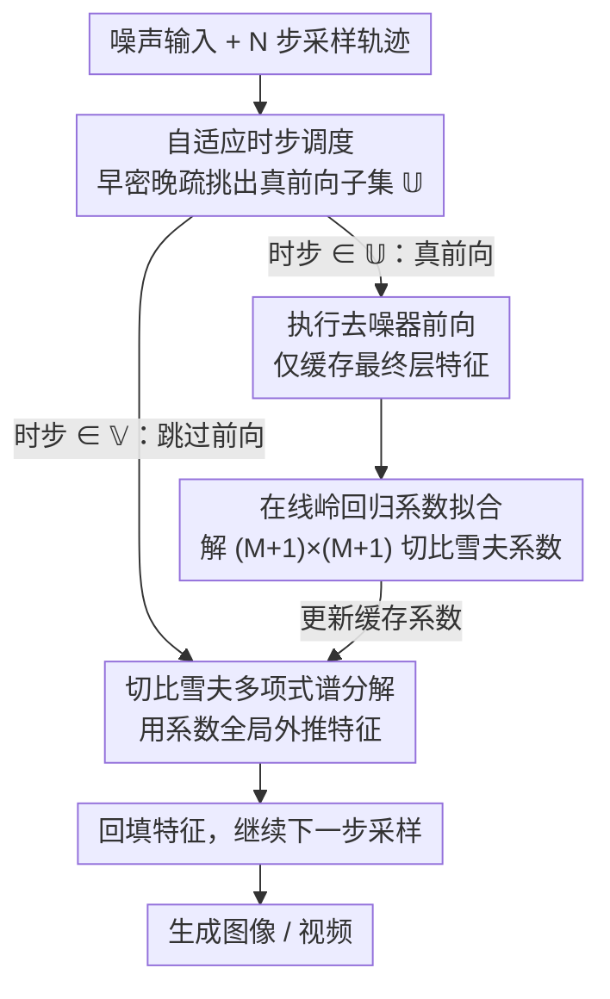

# Adaptive Spectral Feature Forecasting for Diffusion Sampling Acceleration

**会议**: CVPR 2026  
**arXiv**: [2603.01623](https://arxiv.org/abs/2603.01623)  
**代码**: [GitHub](https://hanjq17.github.io/Spectrum)  
**领域**: 扩散模型 / 图像生成  
**关键词**: 扩散采样加速, 特征缓存, 切比雪夫多项式, 谱方法, training-free

## 一句话总结

提出 Spectrum，一种基于切比雪夫多项式的全局谱域特征预测方法，将扩散模型去噪器的中间特征视为时间函数并用岭回归拟合系数，实现误差不随步长增长的长程特征预测，在 FLUX.1 上达到 4.79× 加速、在 Wan2.1-14B 上达到 4.67× 加速而质量几乎无损。

## 研究背景与动机

扩散模型（特别是 Diffusion Transformer）生成高质量图像/视频，但推理需要数十到上百次的去噪器前向传播，计算成本极高。现有加速方案中，**特征缓存复用**思路无需额外训练，通过在选定时步缓存特征并在后续时步复用来跳过昂贵的网络计算。

然而现有缓存方法依赖**局部近似**：
- **朴素复制**（Naive reusing）：直接复制最近缓存的特征，过于简化时序变化
- **TaylorSeer**：基于离散 Taylor 展开的局部预测，但其误差以 $((j-k)\delta_t)^{P+1}$ 增长——**步长越大误差越大**，在高加速比时质量严重退化

核心矛盾在于：高加速比要求大跨度跳步，而局部预测器的误差恰恰在大跨度时急剧恶化。作者从理论分析中发现 Taylor 预测器的最坏情况误差，并指出其根本局限：无法捕捉采样轨迹的全局长程动态。

切入角度：**从时域局部近似转向频域全局建模**。将去噪器输出的每个特征通道视为关于时间的函数，用切比雪夫多项式——一组具有良好数值性质的正交基——在全局范围上逼近，从而打破局部预测的误差瓶颈。

## 方法详解

### 整体框架

Spectrum 想解决的问题很直接：扩散采样要跑几十上百次去噪器前向，能不能少跑几次、把跳过的那些步用「预测」补出来，而且跳得越狠也别让质量崩。它的做法是在 $N$ 步采样里挑出一个时步子集 $\mathbb{U}$ 真正执行网络前向、把这些步的特征缓存下来，剩下的时步 $\mathbb{V} = \mathbb{T} \setminus \mathbb{U}$ 全部交给一个谱域预测器现算。整条流水线是「先拟合、再外推（fitting-then-forecasting）」：每到一个真前向的时步，就用手头已缓存的若干特征点重新拟合一组谱系数，之后用这组系数去预测后面被跳过的时步特征。关键区别在于，旧方法在时域上做局部展开（离它越远越不准），Spectrum 把特征看成一条关于时间的曲线、在整段轨迹上做全局逼近，于是跳多远都吃同一套全局基。

### 关键设计

**1. 切比雪夫多项式谱分解：把局部 Taylor 展开换成全局正交基逼近**

TaylorSeer 的痛处在于它的误差以 $((j-k)\delta_t)^{P+1}$ 增长——跳步跨度 $(j-k)\delta_t$ 一大，误差就指数级恶化，而高加速比恰恰要求大跨度跳步。Spectrum 换了一套数学工具：把去噪器输出特征 $\mathbf{h}_t = [h_1(t), \cdots, h_F(t)]$ 的每个通道都当成时间的函数，用 $M$ 阶切比雪夫多项式在归一化时间 $\tau = 2t - 1$ 上逼近，

$$h_i(t) = \sum_{m=0}^{M} c_{m,i} T_m(\tau)$$

切比雪夫多项式是一组正交基，逼近精度只由阶数 $M$ 决定、和「预测离缓存点多远」无关——这正是它能打破局部展开误差瓶颈的根本原因。理论上也站得住：对于能解析延拓到 Bernstein 椭圆的函数（参数 $\rho$），截断切比雪夫级数的误差按 $\rho^{-M}$ 指数衰减（Theorem 3.2）；更进一步，Spectrum 整体预测的误差上界（Theorem 3.3）只取决于阶数 $M$、设计矩阵最小奇异值 $\sigma_{\min}(\mathbf{\Phi})$ 和正则化强度 $\lambda$，**完全不含步长 $\tau_j - \tau_k$**。这条「误差不随跳步累积」的结论，正是它在 4–5× 高加速比下还稳得住的底气。

**2. 在线岭回归系数拟合：用极小的额外算力把系数解出来**

谱系数不是预先训练好的，而是采样过程中实时拟合出来的——这保证了方法 training-free。每到一个真前向时步 $t_j$，用已缓存的特征点构建设计矩阵 $\mathbf{\Phi}_{t_j}$（每行是某个缓存时刻的切比雪夫基取值）和特征矩阵 $\mathbf{H}_{t_j}$，解一个带正则化的最小二乘：

$$\mathbf{C}_{t_j} = (\mathbf{\Phi}_{t_j}^\top \mathbf{\Phi}_{t_j} + \lambda \mathbf{I})^{-1} \mathbf{\Phi}_{t_j}^\top \mathbf{H}_{t_j}$$

之所以敢在每个时步现算，是因为要求逆的矩阵只有 $(M+1) \times (M+1)$ 这么小（$M$ 通常取 4），用 Cholesky 分解一解即可，相对一次网络前向几乎不花时间。式中的正则项 $\lambda$ 不是摆设：缓存点本就稀少，纯最小二乘容易过拟合到噪声上，加 $\lambda \mathbf{I}$ 既压住过拟合又改善了 $\mathbf{\Phi}^\top\mathbf{\Phi}$ 的条件数（消融里 $\lambda=0$ 直接拉胯，$\lambda=0.1$ 最优）。

**3. 自适应时步调度：把宝贵的真前向多花在早期**

如果均匀地挑真前向时步，会忽略一个事实——扩散是个 ODE 积分过程，早期某一步的误差会被后续积分一路传播、放大。Spectrum 因此让真前向在采样早期密、晚期疏，具体按 $\mathbb{U} = \{\tau_j : j = \lfloor\alpha \frac{r(r+1)}{2}\rfloor\}$ 选取，间隔随序号 $r$ 二次增长，超参 $\alpha$ 越大跳得越激进、加速比越高。这样早期用更多真实计算锚住基础精度，等轨迹进入平滑段再放心交给预测器。消融显示，在高加速比下这种自适应调度比固定间隔稳 1–2 dB PSNR。

**4. 仅缓存最终层：避免逐层缓存的 $L$ 倍开销**

TaylorSeer 对每一层都做缓存与预测，等于把额外内存和拟合成本乘上层数 $L$。Spectrum 反其道而行，只在最终注意力块的输出上实例化谱预测器。这看似偷懒，实测却既省内存、质量还相当甚至更优——说明决定生成结果的长程动态主要体现在最终特征上，没必要为每层都维护一套系数。

## 实验关键数据

### 主实验一：文本到图像生成（DrawBench, Table 1）

| 方法 | FLUX Speedup | FLUX PSNR↑ | FLUX SSIM↑ | FLUX LPIPS↓ | FLUX ImageReward↑ |
|------|-------------|-----------|-----------|------------|------------------|
| 50 steps (ref) | 1.00× | - | - | - | 1.00 |
| TaylorSeer (N=4,O=1) | 3.13× | 22.31 | 0.841 | 0.215 | 0.99 |
| TaylorSeer (N=4,O=2) | 3.03× | 20.76 | 0.812 | 0.247 | 1.02 |
| **Spectrum (α=0.75)** | **3.47×** | **24.32** | **0.854** | **0.217** | 0.99 |
| TaylorSeer (N=6,O=1) | 4.14× | 20.24 | 0.785 | 0.294 | 1.00 |
| **Spectrum (α=3.0)** | **4.79×** | **22.21** | **0.788** | **0.261** | 1.00 |

### 主实验二：文本到视频生成（VBench, Table 2）

| 方法 | Wan2.1-14B Speedup | PSNR↑ | SSIM↑ | VBench Quality↑ |
|------|-------------------|-------|-------|----------------|
| 50 steps (ref) | 1.00× | - | - | 83.15 |
| TaylorSeer (N=4,O=1) | 3.01× | 19.46 | 0.660 | 82.74 |
| **Spectrum (α=0.75)** | **3.40×** | **22.78** | **0.749** | **82.80** |
| TaylorSeer (N=6,O=1) | 3.94× | 17.24 | 0.585 | 81.38 |
| **Spectrum (α=3.0)** | **4.67×** | **21.24** | **0.694** | **82.21** |

在高加速比场景（4–5×）下，Spectrum 相对 TaylorSeer 的 PSNR 优势达 2–4 dB。

### 消融实验

- **正则化强度 $\lambda$**：$\lambda = 0$ 时效果不佳，$\lambda = 0.1$ 最优——正则化对防止过拟合至关重要
- **多项式阶数 $M$**：$M = 4$ 已足够，更高阶无明显增益
- **自适应调度 vs 固定间隔**：自适应调度在高加速比下比固定间隔好 1–2 dB PSNR
- **仅缓存最终层 vs 逐层缓存**：仅最终层不仅节省内存，效果甚至更优

### 关键发现

- Taylor 预测器在高加速比时夸大局部细节但丢失全局语义；Spectrum 保持了色彩一致性和语义正确性
- Spectrum 的计算开销相对于网络前向传播可忽略不计（时间复杂度主导项为 $O(K(M+1)F)$，$K$ 和 $M$ 都很小）
- 方法对图像和视频扩散模型都有效，且与不同 ODE solver 兼容

## 亮点与洞察

1. **从局部到全局的范式转变**：将特征缓存从时域局部近似推进到谱域全局建模，是方法论上的跳跃
2. **理论保证**：误差不随步长积累的定理是该方法的核心理论贡献，为高加速比场景提供了信心
3. **工程简洁性**：仅需岭回归拟合系数、Cholesky 分解求逆，额外开销极小
4. **广泛适用性**：在 FLUX.1、SD3.5-Large、Wan2.1-14B、HunyuanVideo 四个 SOTA 模型上都有效

## 局限与展望

- 需要至少 $M+1$ 个缓存点才能开始预测，初始阶段仍需执行完整网络
- 假设特征关于时间的函数是解析的（可扩展到 Bernstein 椭圆），对实际特征的平滑性假设是否总成立待验证
- 自适应调度的超参数 $\alpha$ 需要针对不同模型调优
- 与蒸馏方法、token 剪枝等正交技术的联合使用未探索

## 相关工作与启发

- **TaylorSeer**：最直接的对比方法，用离散 Taylor 展开预测缓存特征
- **TeaCache**：动态决定何时缓存的方案，与 Spectrum 的调度策略互补
- **FORA/ToCa**：基于直接缓存复用的方法，效果不如预测式方案
- **启发**：切比雪夫多项式在数值分析中的经典地位被巧妙引入深度学习推理加速，提示更多数学工具（如 Fourier 基、小波基）可能也适用于类似场景

## 评分

- 新颖性: ⭐⭐⭐⭐⭐ 首次将谱域方法引入扩散特征缓存加速，理论分析扎实
- 实验充分度: ⭐⭐⭐⭐⭐ 覆盖4个SOTA模型（图像+视频），两个加速档位，完整消融
- 写作质量: ⭐⭐⭐⭐⭐ 理论推导清晰，从Taylor误差分析自然引出动机，逻辑链完整
- 价值: ⭐⭐⭐⭐⭐ 4-5×加速且质量近无损，training-free，实际价值很高

<!-- RELATED:START -->

## 相关论文

- [\[CVPR 2026\] Region-Adaptive Sampling for Diffusion Transformers](region-adaptive_sampling_for_diffusion_transformers.md)
- [\[CVPR 2026\] Denoising as Path Planning: Training-Free Acceleration of Diffusion Models with DPCache](dpcache_denoising_path_planning_diffusion_accel.md)
- [\[CVPR 2026\] TAP: A Token-Adaptive Predictor Framework for Training-Free Diffusion Acceleration](tap_a_token-adaptive_predictor_framework_for_training-free_diffusion_acceleratio.md)
- [\[CVPR 2026\] ResCa: Residual Caching for Diffusion Transformers Acceleration](resca_residual_caching_for_diffusion_transformers_acceleration.md)
- [\[AAAI 2026\] ProCache: Constraint-Aware Feature Caching with Selective Computation for Diffusion Transformer Acceleration](../../AAAI2026/image_generation/procache_constraint-aware_feature_caching_with_selective_computation_for_diffusi.md)

<!-- RELATED:END -->
