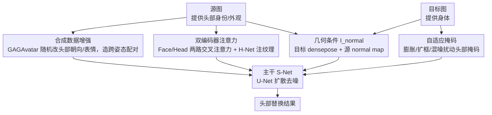

# AHS: Adaptive Head Synthesis via Synthetic Data Augmentations

**会议**: CVPR 2026  
**arXiv**: [2604.15857](https://arxiv.org/abs/2604.15857)  
**代码**: 无  
**领域**: 图像生成  
**关键词**: 头部替换, 数据增强, 头部重演, 扩散模型, 人脸合成

## 一句话总结

AHS 通过使用头部重演模型（GAGAvatar）生成合成增强数据来克服自监督训练的局限性，结合双编码器注意力机制和自适应掩码策略，在全身图像的头部替换任务中实现了 SOTA 效果。

## 研究背景与动机

**领域现状**：头部替换（Head Swapping）旨在将源图像的头部无缝整合到目标图像的身体上，同时重演目标的头部朝向和表情。在时尚设计、虚拟角色定制和数字营销等领域有重要应用价值。

**现有痛点**：现有方法面临三个核心问题：（1）大多数方法仅在人脸裁剪数据上训练，限于正面视角，无法处理多样化的头部朝向；（2）缺乏 ground truth 数据导致只能自监督训练，模型在表情变化和头部朝向变化上泛化能力弱；（3）头发长度和样式的高变异性要求模型考虑更广的空间范围，比人脸替换困难得多。

**核心矛盾**：自监督训练（自重建）使模型只见过相同姿态的源和目标图像，无法学会跨姿态和跨表情的头部替换能力。同时源和目标图像的头部大小、发型可能差异很大。

**本文目标**：设计一种能在全身图像中有效处理多样头部朝向、表情和发型的零样本头部替换方法。

**切入角度**：利用可动画头部化身模型生成具有不同头部朝向和表情的合成数据作为训练增强，突破自监督训练的限制。

**核心 idea**：用 GAGAvatar 生成头部重演的合成增强数据，让模型在训练时就见到跨姿态/跨表情的头部替换场景，从而增强零样本泛化能力。

## 方法详解

### 整体框架

AHS 要解决的是「把源图的头换到目标人身上、同时让头跟着目标的朝向和表情走」这件事，难点在于既没有现成的配对训练数据，源和目标的姿态、发型还往往差很远。它把整套流程压进一个扩散模型里：主干 U-Net（S-Net）负责生成最终图像，一个并行的参考网络 H-Net 从源头部里抽发丝、饰品这类低层细节，再加 Face Encoder 和 Head Encoder 两路交叉注意力把源头部的身份信息注进去。生成的几何引导来自一张组合条件图 $I_{normal}$——它把目标身体的 densepose map 和源头部的 normal map 拼在一起，前者管「身体在哪、头该落在哪个朝向」，后者管「头的 3D 形状长什么样」。整套训练的关键不在网络结构本身，而在两件喂数据的手法：用 GAGAvatar 离线合成跨姿态/跨表情的训练对，以及对头部掩码做自适应扰动。

### 关键设计

**1. 合成数据增强：用头部重演模型造出自监督训练给不出的跨姿态配对**

头部替换天然缺 ground truth——你不可能同时拿到「同一个人的头长在另一个人身上」的真值，所以业界只能做自重建（把头抠下来再贴回原位），但这样训出来的模型只学会「原样复制」同一姿态的头，一旦源和目标姿态不同就垮。AHS 的破法是请来 GAGAvatar 这个可动画头部化身模型：对每张训练图，在尽量保住身份的前提下随机改头部朝向和面部表情，生成一张「同一个人、不同姿态/表情」的合成版本。训练时把原图和这张增强图配成对，模型就被迫在统一框架里学会「把头从姿态 A 重演到姿态 B 再贴上去」，而不再是死记硬背地复制。这也是后面消融里最致命的一刀——去掉它，模型直接退回自重建，跨姿态能力归零。

**2. 双编码器注意力：高层身份和低层外观分两路注入，互不抢戏**

头部替换要同时守住两个层次——高层的「这是谁」（脸型、五官身份）和低层的「头长什么样」（发丝走向、眼镜、肤色），单靠一路编码器顾此失彼。AHS 因此拆成三条注入路径并行：Face Encoder 走 PhotoMaker 的路子，把人脸特征和文本嵌入融合后经交叉注意力进 S-Net，负责高层身份语义；Head Encoder 走 IP-Adapter 的路子，把头部嵌入经一组额外的交叉注意力层注入；而 H-Net 则通过自注意力的 key-value 拼接，把低层纹理细节直接灌给主干。两路交叉注意力在 S-Net 里相加汇合：

$$\text{Attention}(Q, K_f, V_f) + \text{Attention}(Q, K_h, V_h)$$

下标 $f$、$h$ 分别对应 Face 和 Head 两路。这种分工还有个副作用——交叉注意力本身收敛快，反过来补偿了 H-Net 没有专门预训练的短板。

**3. 自适应掩码：不让模型偷看掩码轮廓去猜头有多大**

如果训练时永远喂规规矩矩的分割头部掩码，模型会学懒——直接照着掩码的轮廓去定头的大小和发型，于是一旦源和目标的头部尺寸、发量差很多，贴上去就出不自然的伪影（比如目标本是长发、源是短发，模型却硬把头塞进长发轮廓里）。AHS 在训练时把这个掩码随机换成各种变体：膨胀过的掩码、放大的边界框掩码、或者和随机噪声掩码合并的版本。掩码形状一变得不可靠，模型就只能转而从源图像和 $I_{normal}$ 条件里真正推断目标头部该有的大小和形状，伪影随之消失。

### 损失函数 / 训练策略

训练目标就是标准扩散去噪损失，没有额外的辅助 loss。S-Net 的输入由四部分拼成：目标图的 VAE 编码、被掩码遮住头部后的目标编码、头部掩码本身、以及法线图条件。GAGAvatar 的增强数据在训练开始前离线一次性生成，不进入在线训练回路。

## 实验关键数据

### 主实验

论文通过定性和定量评估证明 AHS 在以下方面优于基线方法：

| 方面 | AHS 表现 |
|------|---------|
| 身份保持 | 显著优于 HID 和其他基线 |
| 表情重演 | 能准确转移目标的表情 |
| 饰品保持 | 头部姿态大幅变化时仍能保持眼镜等饰品 |
| 发型自然性 | 长发、短发、复杂发型均能自然融合 |

### 消融实验

| 配置 | 效果 |
|------|------|
| 完整 AHS | 最佳身份保持 + 表情重演 |
| w/o 合成增强 | 无法处理跨姿态头部替换，出现姿态不匹配 |
| w/o 自适应掩码 | 源和目标头部大小差异大时出现伪影 |
| w/o H-Net | 低层细节（发丝、饰品）缺失 |

### 关键发现

- 合成数据增强是最关键的组件，去掉后模型退化为自重建，跨姿态能力丧失
- 双编码器设计的交叉注意力加速了模型收敛，弥补了 H-Net 未专门训练的不足
- Normal map + DensePose map 的简单组合条件就能提供足够的几何引导，无需复杂的 3D 建模
- 在极端表情变化和大角度头部旋转场景中，AHS 展现了较强的鲁棒性

## 亮点与洞察

- **合成增强突破自监督瓶颈**：利用现成的头部重演模型生成训练数据是一种简洁优雅的解决方案。这个思路可以迁移到其他缺乏 paired data 的图像编辑任务中
- **Normal map 作为条件信号**：相比纯 DensePose，加入 EMOCA 提取的法线图提供了显式的 3D 几何信息，设计简单但效果好
- **统一框架的优势**：将头部重演和融合统一在单一扩散模型中，避免了 two-stage pipeline 的误差累积

## 局限与展望

- 依赖 GAGAvatar 的增强质量，如果头部重演模型出现伪影可能影响训练
- Normal map 依赖 EMOCA 的 3D 人脸重建质量，极端侧脸可能不准确
- 缺乏标准化的定量评估基准，主要依赖用户研究和定性比较
- 对视频场景的时序一致性支持尚未探索

## 相关工作与启发

- **vs HID**: HID 通过文本嵌入注入发型和人脸 ID 信息，但缺乏特征级注入导致伪影；AHS 使用特征级双编码器注入更精确
- **vs 人脸替换**: 人脸替换仅操作面部区域，忽略发型和头部朝向；AHS 处理完整头部区域，更符合实际需求
- **vs few-shot 方法**: few-shot 方法需要视频数据预处理且通常包含两个独立模型；AHS 是 zero-shot 单模型方案

## 评分

- 新颖性: ⭐⭐⭐⭐ 合成增强策略简洁有效，突破自监督训练瓶颈的思路实用
- 实验充分度: ⭐⭐⭐ 缺乏标准化定量指标，主要依赖定性比较
- 写作质量: ⭐⭐⭐⭐ 问题定义清晰，方法描述详细
- 价值: ⭐⭐⭐⭐ 头部替换任务的有效解决方案，合成增强思路可广泛借鉴

<!-- RELATED:START -->

## 相关论文

- [\[CVPR 2026\] ChimeraLoRA: Multi-Head LoRA-Guided Synthetic Datasets](chimeralora_multi-head_lora-guided_synthetic_datasets.md)
- [\[CVPR 2026\] OntoAug: Rethinking Generative Data Augmentation via Ontology Guidance](ontoaug_rethinking_generative_data_augmentation_via_ontology_guidance.md)
- [\[CVPR 2026\] DynaVid: Learning to Generate Highly Dynamic Videos using Synthetic Motion Data](dynavid_learning_to_generate_highly_dynamic_videos_using_synthetic_motion_data.md)
- [\[CVPR 2026\] Beyond Objects: Contextual Synthetic Data Generation for Fine-Grained Classification](beyond_objects_contextual_synthetic_data_generation_for_fine-grained_classificat.md)
- [\[AAAI 2026\] Backdoors in Conditional Diffusion: Threats to Responsible Synthetic Data Pipelines](../../AAAI2026/image_generation/backdoors_in_conditional_diffusion_threats_to_responsible_synthetic_data_pipelin.md)

<!-- RELATED:END -->
