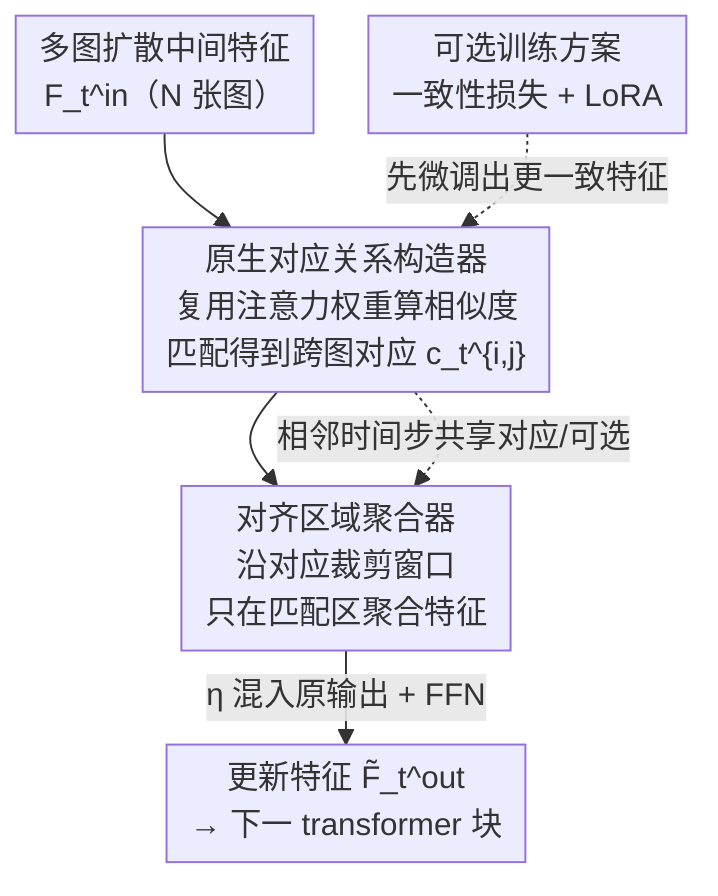

# Align Images Before You Generate

**会议**: CVPR 2026  
**论文**: [CVF Open Access](https://openaccess.thecvf.com/content/CVPR2026/html/Zhang_Align_Images_Before_You_Generate_CVPR_2026_paper.html)  
**代码**: https://github.com/SuhZhang/CorrAdapter  
**领域**: 扩散模型  
**关键词**: 多图扩散, 时空一致性, 原生对应关系, 即插即用适配器, 多视角生成  

## 一句话总结
作者发现多图扩散模型的中间噪声特征里"天生"就编码了跨图的对应关系，于是提出 CorrAdapter——一个无需任何外部几何/语义先验、训练自由、即插即用的旁路分支，在图像真正生成之前就用这些原生对应关系把匹配区域对齐，从而显著提升多视角生成和视频生成的时空一致性。

## 研究背景与动机
**领域现状**：多图扩散模型（multi-image diffusion）在一次推理里联合去噪多张图，用来生成多视角（静态场景）或视频帧（动态场景）。它们在每个时间步内通过 cross-image transformer 让所有图互相交换信息，期望生成结果彼此一致。

**现有痛点**：尽管经过大规模训练，这类模型仍然存在明显的纹理漂移和结构漂移——视角跨度大或时间跨度大时尤甚，破坏了跨帧/跨视角的时空一致性。要消除不一致，本质上需要按语义和结构相似性把不同图里的对应区域对齐；但是所有图都从纯高斯噪声生成，推理时拿不到深度图、分割掩码这类几何/语义先验，无法显式找出跨图对应关系再去约束去噪。

**核心矛盾**：这是个典型的"先有鸡还是先有蛋"问题——要对齐图像需要对应关系，但对应关系通常要等图像生成出来、有了显式先验之后才能算。已有方法要么靠 cross-image transformer 隐式学（引导太弱、仍漂移），要么引入硬几何约束/极线约束/深度（只适用静态场景且需要已知图像或深度输入），要么用光流匹配（只适用动态且需要视频/关键帧输入）——没有一个能同时满足"静态动态通吃"且"不依赖额外输入"，因此都做不成通用的一致性增强器。

**切入角度与核心 idea**：作者提出一个假设并验证——多图扩散模型在中间带噪特征里已经隐式学到了跨图的有意义对应关系。即便在图像合成开始之前，中间特征空间就在语义/几何相似的区域之间呈现出结构对齐。既然如此，就可以**从模型自身**挖出这些"原生对应关系"（diffusion-native correspondences），用它们当匹配先验，在去噪过程中加强匹配区域之间的信息交换，在图像被真正生成出来之前就把它们对齐。

## 方法详解
CorrAdapter 的目标是给多图扩散模型加一个旁路分支，让生成出的多张图在时空上更一致。它的核心只有两件事：① 从扩散模型自己的中间特征里**构建对应关系**，② 按这些对应关系**调制跨图信息交互**，只在匹配区域聚合、抑制无关区域。对应这两步，CorrAdapter 由两个模块组成：原生对应关系构造器（Native Correspondence Constructor）和对齐区域聚合器（Aligned Area Aggregator）。整个适配器与原 transformer 块并联（juxtaposed），输出叠加回原输出，因此天然是训练自由、与 backbone 无关的即插即用结构；论文额外给了一个可选训练方案进一步提升上限。

### 整体框架
输入是某个时间步 $t$ 的隐特征 $Z_t$ 经 transformer 块压缩后的表示 $F_t^{\text{in}}=\{f_t^{\text{in},i}\}_{i=1}^N$（$N$ 张图），输出是更新后的 $\tilde F_t^{\text{out}}$ 作为下一块的输入。CorrAdapter 被注入在**建模多图交互、且分辨率最高**的 transformer 块旁，复用原 attention 的 $Q,K,V$，先在所有图对之间建对应关系，再在对应区域内做聚合，最后把聚合结果以系数 $\eta$ 混进原输出。

### 关键设计

**1. 原生对应关系构造器：把注意力权重直接当跨图匹配先验**

痛点是纯生成场景下没有任何显式几何/语义先验可用来找跨图对应。作者的关键观察是：transformer 的 attention 用 $\hat F_t^{\text{out}}=\text{Softmax}(Q_t K_t^T/\sqrt D)V_t$（Eq. 6）聚合所有图的信息，其中 Softmax 后的注意力权重本身就反映了不同图中间特征的相似度——既然如此，这些权重天生就能描述跨图对应。于是对图对 $(i,j),\,i\neq j$，直接取 $Q_t,K_t$ 的第 $i,j$ 片切片算相似度分数 $s_t^{i,j}=\text{Softmax}\!\big(q_t^i {k_t^j}^T/\sqrt D\big)$（Eq. 8），再用传统图像匹配（最近邻 $c_t^{i,j}=\arg\max_l s_t^{i,j}[:,l]$，Eq. 9）得到每个位置在另一张图里的对应索引；把所有图对堆起来就是 $C_t\in\mathbb{R}^{N\times(N-1)\times H\times W}$。妙处在于：相似度复用了 Eq. 6 已经算好的注意力权重，几乎零额外计算就拿到了对应关系。实践中作者用阈值 0.05 的匹配代替朴素最近邻以提升可靠性。

**2. 对齐区域聚合器：只在匹配窗口内聚合、抑制歧义交互**

有了对应关系，自然的做法是强化对应特征之间的信息交换。但全局 attention 会把不匹配区域也搅进来、引入歧义。聚合器的做法是：对第 $i$ 张图的每个位置 $k$，按对应索引 $c_t^{i,j}[k]$ 在第 $j$ 张图上裁一个半径 $r$ 的 $(2r+1)\times(2r+1)$ 局部窗口，只在这个对齐窗口内做加权求和——$\hat f_t^i[k]=\text{Softmax}\!\big(q_t^i[k]\,{k_{t,\text{crop-}k}^j}^T/\sqrt D\big)\,v_{t,\text{crop-}k}^j$（Eq. 11）。这里的权重又恰好是裁剪后 query/key 的注意力权重，依然复用 Eq. 6 避免重算。把所有位置聚合得到 $\hat F_t$ 后，以超参 $\eta$ 混进原输出：$\check F_t^{\text{out}}=\eta\hat F_t^{\text{out}}+(1-\eta)\hat F_t$（Eq. 12），再过一个 FFN 得到 $\tilde F_t^{\text{out}}=\check F_t^{\text{out}}+\text{FFN}(F_t^{\text{in}}\Vert\check F_t^{\text{out}})$（Eq. 13）。这样模型被强制聚焦匹配区域、压制非匹配区域，从而把跨图的纹理与结构对齐。默认 $\eta=0.1$，文本条件多视角生成里调到 0.8（约束更强），$r=3$。

**3. 训练自由的旁路注入与推理技巧：让它真正即插即用**

CorrAdapter 只作为现有 transformer 块的旁路分支接入，所有可学习参数都用所注入块的同名权重初始化、推理时冻结，因此无需训练就能挂到各种 backbone 上。为了真正通用，作者给了几条工程技巧：优先注入到**建模多图交互**的 transformer 块，以便复用注意力权重同时算对应和聚合；只在**最高分辨率层**建对应，保证匹配更细粒度；相邻若干时间步**共享对应关系**以降算力（如 SyncDreamer 因缺多视角 transformer、无法复用注意力，就每 5 步更新一次对应与注意力）；为保多样性，文本条件生成里只在前若干步施加 CorrAdapter（Table 2 前 10 步、视频前 15 步），图像条件则全程施加。这一套让它既轻量又与 backbone 无关。

**4. 可选两阶段训练方案：先调出更一致的特征，再挂匹配模块**

训练自由版本依赖现成特征里的对应质量。对追求更高性能的场景，作者加了个一致性损失 $\mathcal{L}_{\text{consistency}}=\sum_{(i,j),i\neq j}\big\Vert f_t^{\text{in},i}[k]-f_t^{\text{in},j}[\dot c^{i,j}[k]]\big\Vert^2$（Eq. 14），其中 $\dot c^{i,j}$ 是用现成匹配算法（LoFTR）从真值图对里抽的参考对应；总损失 $\mathcal{L}=\mathcal{L}_{\text{diffusion}}+\lambda\mathcal{L}_{\text{consistency}}$（Eq. 15，$\lambda=0.1$）。关键的工程发现是**顺序很重要**：先只用一致性损失对原模型做 LoRA 微调、让中间特征本身更一致，**之后再加 CorrAdapter 结构**；若把找匹配/裁剪模块和一致性损失一起端到端训，匹配与裁剪会扰乱梯度反传、收敛变差（消融里这种做法 PSNR 仅 23.65，反而不如训练自由版）。由于该方案需要"输出本应一致"的监督，只适合图像条件多视角这类任务；对输出本就多样的任务，作者用"LoRA 迁移"——把适用任务上学到的 LoRA 模块搬到架构相同但不适用训练的模型上，继承其一致性增强能力。

### 损失函数 / 训练策略
- 训练自由版：无需任何训练，旁路参数冻结。
- 可选训练版：先用 $\mathcal{L}_{\text{consistency}}$ 对原扩散模型做 LoRA 微调（1 epoch，4×RTX 6000 + DeepSpeed，约 1 天），再叠加 CorrAdapter；监督对应由 LoFTR 提供，$\lambda=0.1$。

## 实验关键数据

### 主实验
评测覆盖静态（多视角生成，图像条件 GSO 100 场景 / 文本条件 Objaverse 1000 prompt）与动态（视频生成，VBench 10 维度）。带 ⋆ 表示用了可选训练方案。3D 一致性指标取自 MVGBench（cPSNR/cSSIM/cLPIPS/CD/depth）+ MEt3R。

| 任务/baseline | 单图质量 | 几何一致性（关键） | 说明 |
|------|------|------|------|
| SyncDreamer（图像条件MV） | PSNR 19.24 | cPSNR 26.28 / CD 2.66 / MEt3R 0.1656 | baseline |
| +CorrAdapter | PSNR 19.72 | cPSNR 27.20 / CD 2.67 / MEt3R 0.1529 | 一致性普遍提升 |
| MVAdapter（图像条件MV） | PSNR 23.15 | cPSNR 18.75 / depth 73.47 / MEt3R 0.2116 | baseline |
| +CorrAdapter | PSNR 23.82 | cPSNR 19.68 / depth 68.62 / MEt3R 0.2036 | 训练自由即提升 |
| +CorrAdapter⋆ | PSNR 24.05 | cPSNR 20.47 / depth 67.47 / MEt3R 0.1955 | 训练版再上一层 |

文本条件多视角（MVAdapter）：训练自由版 FID 24.20→23.42、IS 15.22→15.96；训练版⋆ cPSNR 14.09→15.27、cLPIPS 0.3513→0.3085、MEt3R 0.3017→0.2701，几何一致性提升最明显。

视频生成（Wan2.1-1.3B，VBench，训练自由）：

| 维度 | Wan2.1 | +CorrAdapter | 变化 |
|------|------|------|------|
| Subject Consistency | 0.9536 | 0.9715 | ↑ 主体一致性显著提升 |
| Background Consistency | 0.9626 | 0.9696 | ↑ |
| Scene | 0.2202 | 0.2878 | ↑ 文本-视频一致性更好 |
| Overall Consistency | 0.2275 | 0.2320 | ↑ |
| Dynamic Degree | 0.5556 | 0.5139 | ↓ 一致性增强带来的可预期副作用 |

### 消融 / 分析实验
| 配置 | 关键指标（图像条件MV, PSNR/SSIM/LPIPS） | 说明 |
|------|------|------|
| 训练自由 CorrAdapter | 23.82 / 0.8829 / 0.1235 | 完整训练自由版 |
| 端到端联合训（匹配+裁剪+一致性损失一起训） | 23.65 / 0.8812 / 0.1248 | 反而比训练自由还差，证明需"先调特征再挂模块" |
| 两阶段训练版 ⋆ | 24.05 / 0.8866 / 0.1220 | 顺序正确才有增益 |

资源开销（Table 4，MVAdapter）：Time 33.42s→39.83s、Flops 2.71P→2.73P、Param 4.29G→4.30G、Mem 15.27GB→20.86GB——一致性提升而算力/参数几乎不增（显存因旁路分支略升）。

### 关键发现
- **原生对应关系确实可靠**：在生成图上用原生对应做匹配，以 5 像素极线距离为阈值，匹配数量和准确率可与 SIFT、SuperPoint 等实用匹配基线相当（如某图对 SuperPoint 85.7% vs Ours 81.5% 但 Ours 正确匹配更多 97 个），证明"图像生成前模型内部就有匹配先验"这一核心假设成立。
- **训练顺序是成败关键**：必须先用一致性损失把特征调一致、再加 CorrAdapter；联合端到端训会让"找匹配+裁剪"打乱梯度，收敛变差。
- **动态度下降是可预期权衡**：视频里一致性增强会让 Dynamic Degree 下降，但不影响整体视频质量提升。

## 亮点与洞察
- **把 attention 权重二次利用成匹配先验**：核心洞察是"Softmax 注意力权重 = 跨图相似度 = 对应关系"，于是建对应和做对齐都复用 Eq. 6 已算好的 $Q/K/V$，几乎零额外算力——这个"白嫖注意力"的视角很巧，可迁移到任何带 cross-image attention 的生成模型。
- **"生成前对齐"的时序选择**：在图像真正去噪生成出来之前、于中间噪声特征阶段就建立对应并对齐，绕开了"要对应得先有图、要图得先对应"的鸡蛋悖论。
- **训练自由 + 可选训练的双轨设计**：默认零训练即插即用保证通用性，再用 LoRA 迁移把"可训练任务"的一致性能力搬到"不可训练任务"，兼顾通用与上限。

## 局限与展望
- 可选训练方案只适合"输出本应一致"的任务（如图像条件多视角），对输出天然多样的任务不适用，只能靠架构相同时的 LoRA 迁移——迁移要求网络结构完全一致，限制了适用范围。
- 一致性增强以牺牲动态度为代价（视频 Dynamic Degree 0.5556→0.5139），强一致与强运动之间存在 trade-off，超参 $\eta$、施加时间步数需按任务手调（图像条件全程、文本条件只前 10-15 步）。
- 对缺多图交互 transformer 的 backbone（如 SyncDreamer）无法复用注意力权重，需每 5 步更新对应来规避算力爆炸，属工程折中而非根治。⚠️ 部分公式（Eq. 11/12 的索引与混合细节）以原文为准。

## 相关工作与启发
- **vs 隐式 cross-image transformer 方法**：它们靠海量数据让 transformer 隐式学一致性，引导弱、大视角/大时间跨度仍漂移；本文显式从模型内部挖对应当强引导，且无需额外训练。
- **vs 硬几何/极线/深度约束方法**：那类方法只适用静态场景、且需已知图像或深度作输入；CorrAdapter 不依赖任何外部先验，静态动态通吃。
- **vs 光流/视频编辑类匹配方法**：它们需视频或关键帧输入、面向编辑而非纯生成；本文面向纯生成、在去噪中间特征上建对应。
- **vs 单图扩散对应关系工作（DIFT 等）**：已有工作发现单图扩散内部有对应，但需已知图像复现中间特征；本文首次在纯生成的多图扩散里挖对应来对齐生成结果。

## 评分
- 新颖性: ⭐⭐⭐⭐⭐ "生成前用扩散原生对应对齐多图"是一个干净且此前未被利用的观察
- 实验充分度: ⭐⭐⭐⭐ 静态/动态、图像/文本条件、多 backbone 全覆盖，但训练版仅在部分任务验证
- 写作质量: ⭐⭐⭐⭐ 动机推导清晰，公式与复用逻辑讲得明白
- 价值: ⭐⭐⭐⭐⭐ 训练自由、即插即用、backbone 无关，可直接增强大量多图扩散下游任务

<!-- RELATED:START -->

## 相关论文

- [\[CVPR 2026\] RewardFlow: Generate Images by Optimizing What You Reward](rewardflow_generate_images_by_optimizing_what_you_reward.md)
- [\[NeurIPS 2025\] Understand Before You Generate: Self-Guided Training for Autoregressive Image Generation](../../NeurIPS2025/image_generation/understand_before_you_generate_self-guided_training_for_autoregressive_image_gen.md)
- [\[CVPR 2026\] Re-Align: Structured Reasoning-guided Alignment for In-Context Image Generation and Editing](re-align_structured_reasoning-guided_alignment_for_in-context_image_generation_a.md)
- [\[CVPR 2026\] SimLBR: Learning to Detect Fake Images by Learning to Detect Real Images](simlbr_learning_to_detect_fake_images_by_learning_to_detect_real_images.md)
- [\[CVPR 2026\] Imagine Before Concentration: Diffusion-Guided Registers Enhance Partially Relevant Video Retrieval](imagine_before_concentration_diffusion-guided_registers_enhance_partially_releva.md)

<!-- RELATED:END -->
