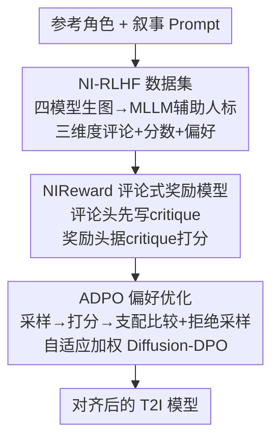

# Aligning Multi-Character Narrative Image Generation with Multi-Aspect Human Preferences

**会议**: CVPR 2026  
**论文**: [CVF Open Access](https://openaccess.thecvf.com/content/CVPR2026/html/Gao_Aligning_Multi-Character_Narrative_Image_Generation_with_Multi-Aspect_Human_Preferences_CVPR_2026_paper.html)  
**代码**: 未公开  
**领域**: 扩散模型 / 多角色叙事图像生成偏好对齐  
**关键词**: 叙事图像生成, 人类偏好对齐, 评论式奖励模型, DPO, 多角色个性化  

## 一句话总结
针对多角色叙事图像生成中"语义不跟随、身份混淆、画质崩坏"这三大顽疾，本文先造一个带文字评论的细粒度偏好数据集 NI-RLHF，训出一个"先写评论再打分"的可解释奖励模型 NIReward，再用它驱动 ADPO 偏好优化算法，让生成模型在 prompt following / identity consistency / visual quality 三个维度上同步对齐人类偏好。

## 研究背景与动机
**领域现状**：叙事图像生成（narrative image generation）要根据一段叙事文本生成包含多个特定角色的图像，既要保留参考图里每个角色的身份，又要表现角色间的互动、与背景的融合以及风格变化，应用在漫画可视化、长视频关键帧等场景。目前主流靠 adapter 类个性化方法（IP-Adapter-FaceID、PhotoMaker、PuLID、StoryMaker、OMG 等）注入 ArcFace 身份特征来保真。

**现有痛点**：这些方法把"保身份"做过了头，带来三个具体毛病——① **复制粘贴效应**：训练数据多是正面肖像，模型严重过拟合身份特征，生成的人物只会摆正脸肖像姿势，无法按文本做出多样的动作和表情；② **身份混淆**：多角色场景里模型无法显式区分不同角色，导致脸部特征互相串味、错误继承；③ **画质崩坏**：构图不协调、姿态僵硬、手部和肢体出现解剖学错误。

**核心矛盾**：问题的根本不只在生成端，更在**评测端**。CLIP、ArcFace、Aesthetic Score、ImageReward 这些现有指标和奖励模型与人类感知严重脱节——一张人类一眼能看出毛病的图，往往在 CLIP 分和人脸相似度上拿高分。直接拿这些奖励去做 RLHF，会出现三重困难：通用奖励模型到叙事场景的**分布偏移**、只学标量分数的**不可解释性**（进而引发 reward hacking）、以及多维偏好下的**优化失衡**（只优化好量化的维度、忽略细微维度）。

**本文目标**：(1) 造一个专门面向叙事图像、三维度且带评论解释的偏好数据集；(2) 训一个能给出可解释评价、抗 reward hacking 的奖励模型；(3) 设计一个能在三维度间均衡优化的偏好对齐算法。

**核心 idea**：用"评论式奖励"（先生成文字 critique 再据此打分，相当于给奖励模型加 chain-of-thought）替代不透明的标量奖励，并用"支配式比较 + 自适应加权"的 ADPO 替代对所有偏好对一视同仁的 Diffusion-DPO，让三维度同步对齐。

## 方法详解

### 整体框架
整个系统是一条"数据 → 奖励模型 → 偏好优化"的三段流水线，目标是把一个现成的个性化 T2I 模型（PhotoMaker V2）对齐到人类在三维度上的偏好。

第一段先构造 **NI-RLHF 数据集**：用四个个性化模型批量生成多角色图像，由 MLLM 辅助人类专家在 prompt following / identity consistency / visual quality 三维度上同时标注**文字评论 + 数值分数 + 成对偏好**。第二段用这份数据训练 **NIReward**：一个 MLLM 骨干上挂"评论头 + 奖励头"的奖励模型，推理时先吐 critique 再据 critique 打分。第三段是 **ADPO** 偏好优化：拿 NIReward 给生成模型采样出的候选图打多维分，经"支配式比较 + 拒绝采样"筛出高质量偏好对，再用"自适应加权"的 Diffusion-DPO 更新生成模型。三者一致：NIReward 的可解释多维奖励是 ADPO 三个子策略能成立的前提。

### 关键设计

**1. NI-RLHF：带评论解释的三维度偏好数据集**

要对齐叙事场景的人类偏好，先得有叙事场景的偏好数据，而现有数据集（如 ImageReward 的）既不针对叙事、也只有标量偏好标签、没有"为什么"。本文构造 NI-RLHF：采集各类别角色的高清正面肖像作参考，用 LLM 生成大量含动作/表情/地点/风格、每条涉及 1-2 个角色的叙事 prompt；再用 PuLID、PhotoMaker、StoryMaker、OMG 四个个性化模型生图，并用 CLIP/ArcFace/ImageReward 过阈值，每个 prompt 保留 2-3 张送标。

标注是这套数据的精髓：把 prompt following（图是否跟随叙事文本）、identity consistency（人脸身份是否对齐参考、角色间是否可区分）、visual quality（构图协调性与美学、有无肢体/手部畸形）三个维度各再细分成三条具体准则，让每个维度都同时产出**标准化的文字评论 + 数值分（如 3.6 Normal / 4.0 Good）+ 成对偏好判断**。标注用"MLLM 辅助 + 人类专家复核"的混合流程——先让多个 MLLM 做 point-wise 打分（出评论和分数）和 pair-wise 偏好标注、由一个 agent 模型综合，再交人类专家审核修正，以人类判断为最终标准。最终得到约 10k 偏好对，既降标注成本又保权威性。这份"评论级"监督信号是下一步训可解释奖励模型的基础。

**2. NIReward：先写评论再打分的可解释奖励模型**

传统奖励模型只用一条成对对数似然损失学一个标量分（式 1，$L_{rw}=-\mathbb{E}[\log\sigma(r(x_w,y,c)-r(x_l,y,c))]$），分布偏移大、不可解释、易被 reward hacking。NIReward 的做法是给 MLLM 骨干同时挂一个**评论头**和一个**奖励头**：评论头按维度指令 $q$ 生成文字 critique，并用语言建模损失对齐人工评论（式 2，逐 token 的 $-\sum_t\log\pi_\phi(s_t\mid s_{<t},x,y,c,q)$）；奖励头则在**给定评论 $s$** 的条件下输出标量分，成对损失变为 $L_{reward}=-\mathbb{E}[\log\sigma(r(x_w,y,c,q,s)-r(x_l,y,c,q,s))]$（式 3）。总目标是两者加权：$L_{total}=L_{critique}+\gamma L_{reward}$（式 4）。

一个关键稳定性技巧：奖励训练时用**人工标注的评论**作为中间推理步，而不是模型自己生成的 critique，避免评论训练不稳给奖励函数注入噪声。推理时则两阶段走——先据指令 $q$、图 $x$、prompt $y$、参考 $c$ 生成评论 $s$，再让打分头结合 $s$ 算最终分 $r(x,y,c,q,s)$。这种"先讲理由再打分"显式建模了人类评判的推理链，因此比纯标量奖励更贴合人类、也更难被 hack；同时它天然输出可读的评价，便于诊断生成失败原因。

**3. ADPO：支配式比较 + 拒绝采样 + 自适应加权的偏好优化**

有了多维可解释奖励，还需要一个能"三维度同步优化、且不被低质偏好对带偏"的对齐算法。普通 Diffusion-DPO（式 7）直接拿人类偏好对优化，会偏向好量化的维度、忽略细微维度，且对所有偏好对一视同仁。ADPO 把流程拆成 sample → score → compare → optimize 四步，并在 compare/optimize 注入三个子策略：

- **支配式比较（Dominating Comparison）**：只有当 $x_i$ 在**每一个**维度 $k$ 上都 $r(x_i,y,c,q_k)>r(x_j,y,c,q_k)$ 时，才把 $(x_i,x_j)$ 当作合法偏好对。这保证"赢家"是全维度都更优，避免某一维赢、另一维输的脏对子误导优化。
- **拒绝采样（Rejection Sampling）**：进一步要求偏好对里的赢家 $x_i$ 在每个维度上的奖励都超过阈值 $th$，过滤掉"只在个别维度突出"的样本，把学习聚焦到多维一致高质的样本上，降低偏好信号噪声。
- **自适应加权学习（Adaptive Weighted Learning）**：定义奖励间隔 $a=\frac{1}{K}\sum_{k=1}^{K}(r(x_i,y,c,q_k)-r(x_j,y,c,q_k))$ 作为偏好置信度——间隔大说明偏好更确凿、该多学，间隔小可能是噪声、该少学。于是用低于阈值 $b$ 的 margin 做降权，并把常数 $\beta$ 换成自适应缩放因子

$$\beta(a)=\beta\big(1+\eta(1-e^{-k(a-b)})\big)$$

其中 $\eta$ 控制自适应幅度、$k$ 控制对 $a$ 的敏感度。最终优化目标即把 Diffusion-DPO（式 7）里的 $\beta$ 替换成 $\beta(a)$、条件 $\hat c$ 同时嵌入文本与参考（式 9）。三个子策略合起来，让对齐既覆盖全部维度、又把学习预算集中到高置信偏好对上，从而更稳更鲁棒。

### 损失函数 / 训练策略
NIReward 基于 Qwen2-VL，用 NI-RLHF 的 10k 偏好对训练，目标为 $L_{total}=L_{critique}+\gamma L_{reward}$。偏好优化阶段用 PhotoMaker V2 对 5,762 条 prompt 各生成 4 张图，经 ADPO 筛出 2,484 个高质量偏好对，用带 LoRA 的 Diffusion-DPO（目标式 9）微调同一生成模型。

## 实验关键数据

### 奖励模型偏好预测（NI-Bench，preference accuracy，%）
评测用 NI-Bench（每维度 400 对偏好对），指标是模型排序与人类判断一致的比例。

| 方法 | Prompt Following | Identity Consistency | Visual Quality |
|------|------|------|------|
| CLIP | 74.26 | N/A | N/A |
| ArcFace | N/A | 76.52 | N/A |
| Aesthetic Score | N/A | N/A | 67.73 |
| ImageReward | 73.39 | N/A | 71.18 |
| Qwen2.5-VL-32B | 65.09 | 48.00 | 51.72 |
| GPT-4o-mini | 76.73 | 46.75 | 88.42 |
| **NIReward** | **86.07** | **85.10** | 83.00 |

NIReward 在 prompt following 和 identity consistency 上大幅领先；尤其 identity consistency 一项，连专用人脸模型 ArcFace（76.52）和各路 MLLM（最低不到 50）都明显不如它（85.10），说明它们其实"分不清不同角色的脸"。Visual Quality 上 GPT-4o-mini 单项更高（88.42），但其身份/跟随维度极差，无法作为统一奖励。

### 偏好优化定量结果（NIReward 三维分越高越好）
| 方法 | CLIP | ID Sim | ImageReward | HPSv2 | PickScore | NIReward-P.F. | NIReward-I.C. | NIReward-V.Q. |
|------|------|------|------|------|------|------|------|------|
| Baseline | 32.38 | 28.83 | 0.931 | 32.46 | 22.13 | -0.058 | -0.036 | 0.036 |
| Diffusion-DPO + ImageReward | 32.62 | 27.55 | 0.975 | 32.34 | 22.09 | 0.008 | -0.060 | 0.105 |
| Diffusion-DPO + HPSv2 | 32.72 | 26.77 | 0.929 | 32.29 | 22.05 | 0.013 | -0.041 | 0.025 |
| Diffusion-DPO + PickScore | 32.65 | 26.83 | 0.997 | 32.59 | 22.25 | 0.089 | -0.052 | 0.111 |
| **ADPO + NIReward** | **32.80** | **28.88** | **1.010** | **32.96** | **22.28** | 0.079 | **0.010** | **0.131** |

ADPO 在几乎所有指标上 top-2。最值得注意的是 **identity consistency**：其它三种 Diffusion-DPO 基线相对 baseline 的 ID Sim 和 NIReward-I.C. 全都**倒退**（如 ID Sim 从 28.83 掉到 26.77），唯有 ADPO 把 ID Sim 拉到 28.88、NIReward-I.C. 从 -0.036 翻正到 0.010——印证现有奖励模型根本评不准身份一致性。另外用 ImageReward/HPSv2/PickScore 调出来的模型，在它们各自对应的分数上反而打不过 ADPO，说明 ADPO 学到的偏好信息更有效。

### 消融实验（ADPO 各组件）
| 配置 | ID Sim | ImageReward | HPSv2 | NIReward-P.F. | NIReward-I.C. | NIReward-V.Q. |
|------|------|------|------|------|------|------|
| Avg. Score（不分支配，取均值） | 26.94 | 0.948 | 32.28 | 0.049 | -0.004 | 0.057 |
| w/o RS（去拒绝采样） | 27.73 | 0.951 | 32.25 | 0.001 | -0.034 | 0.041 |
| w/o AW（去自适应加权） | 28.44 | 1.002 | 32.57 | 0.123 | -0.013 | 0.127 |
| **Ours（完整 ADPO）** | **28.88** | **1.010** | **32.96** | 0.079 | **0.010** | **0.131** |

### 关键发现
- **身份一致性是分水岭**：唯有完整 ADPO 能把 NIReward-I.C. 做到正值（0.010），其余配置和所有基线都是负值，说明"支配式比较 + 拒绝采样"对避免身份维度被牺牲至关重要。
- **拒绝采样贡献最显著**：去掉 RS 后 P.F. 几乎归零（0.001）、I.C. 跌回 -0.034，是三组件里掉点最狠的；说明把训练样本约束到"多维一致高质"上，是降噪的主力。
- **自适应加权偏向单维冲高**：w/o AW 在 P.F.（0.123）和 V.Q.（0.127）单项甚至超过完整模型，但 I.C. 仍为负（-0.013）；AW 的作用是用置信度把优化拉回三维均衡，而非把某一维冲到最高。

## 亮点与洞察
- **评论式奖励 = 给 reward model 装 CoT**：把"先生成文字 critique、再据 critique 打分"显式拆成两步，既提升与人类对齐的准确率，又天然产出可解释评价、抑制 reward hacking——这套"critique-then-score"范式可迁移到任何需要细粒度可解释奖励的生成对齐任务。
- **奖励训练用人工评论而非自生成评论**：一个易被忽视的稳定性细节——拿模型自己写的 critique 当中间步会把训练噪声灌进奖励函数，改用人工评论作 reasoning anchor，是值得复用的工程 trick。
- **支配式比较是简单又有效的"全维度赢家"判据**：只接受每维都更优的偏好对，直接从数据侧堵住"赢一维输另一维"的脏监督，这种思路可用于任何多目标 RLHF。
- **揭示评测端是根因**：论文用 ArcFace 在身份一致性上仅 76.52、连 MLLM 都 <50 的数据，戳破"指标涨≠人类满意"的假象，提醒社区叙事生成需要专门奖励。

## 局限与展望
- 作者承认现有指标（CLIP/ArcFace/ImageReward）与人类偏好脱节，但 NIReward 本身的可靠性仍以"与人类标注一致率"为准，存在标注者偏好被固化的风险。
- ⚠️ 自评：偏好对仅涵盖 1-2 个角色的 prompt，3 个以上角色的复杂叙事场景泛化性未验证；NI-Bench 规模（每维 400 对）偏小，结论的统计稳健性有待更大基准检验。
- ⚠️ 自评：ADPO 只在 PhotoMaker V2 上验证，是否能即插即用到其它个性化骨干（如 SDXL 系 PuLID/StoryMaker）未知；自适应加权引入 $\eta,k,b,th$ 多个超参，敏感性分析在正文中着墨不多。
- 改进思路：把评论头的 critique 反馈直接回灌到生成端（如用 critique 做区域级修正），而不仅作为打分的中间步，可能进一步缓解复制粘贴和肢体畸形。

## 相关工作与启发
- **vs Diffusion-DPO / D3PO**：它们直接用人类偏好对、对所有对一视同仁地优化，偏向好量化维度；本文用奖励模型标注的偏好 + 支配式比较 + 自适应加权，优化方向更鲁棒、三维更均衡。
- **vs ImageReward / HPSv2 / PickScore**：这些是通用标量奖励，存在分布偏移且不可解释；NIReward 面向叙事场景、先评论后打分，身份一致性等细粒度维度上准确率显著更高。
- **vs StoryMaker / UniPortrait / OMG（多角色个性化）**：它们从结构/注意力侧解身份混淆，但过度强调保身份、牺牲文本跟随与画质；本文是正交的"偏好对齐"路线，可叠加在这些生成骨干之上。

## 评分
- 新颖性: ⭐⭐⭐⭐ 把"评论式奖励 + 支配/自适应偏好优化"系统性地搬到叙事图像生成，是相对完整的新组合
- 实验充分度: ⭐⭐⭐⭐ 奖励预测 + 偏好优化 + 消融 + 人评齐备，但基准规模偏小、仅单一生成骨干
- 写作质量: ⭐⭐⭐⭐ 痛点—方法—验证链路清晰，公式与表格自洽
- 价值: ⭐⭐⭐⭐ 指出叙事生成评测端根因并给出可复用的可解释奖励范式

<!-- RELATED:START -->

## 相关论文

- [\[CVPR 2026\] Ar2Can: An Architect and an Artist Leveraging a Canvas for Multi-Human Generation](ar2can_an_architect_and_an_artist_leveraging_a_canvas_for_multi-human_generation.md)
- [\[CVPR 2026\] Scaling Multi-Identity Consistency for Image Customization via Multi-to-Multi Matching Paradigm](scaling_multi-identity_consistency_for_image_customization_via_multi-to-multi_ma.md)
- [\[AAAI 2026\] Multi-Aspect Cross-modal Quantization for Generative Recommendation](../../AAAI2026/image_generation/multi-aspect_cross-modal_quantization_for_generative_recommendation.md)
- [\[CVPR 2026\] InterEdit: Navigating Text-Guided Multi-Human 3D Motion Editing](interedit_navigating_textguided_multihuman_3d_moti.md)
- [\[ICML 2025\] Smoothed Preference Optimization via ReNoise Inversion for Aligning Diffusion Models with Varied Human Preferences](../../ICML2025/image_generation/smoothed_preference_optimization_via_renoise_inversion_for_aligning_diffusion_mo.md)

<!-- RELATED:END -->
