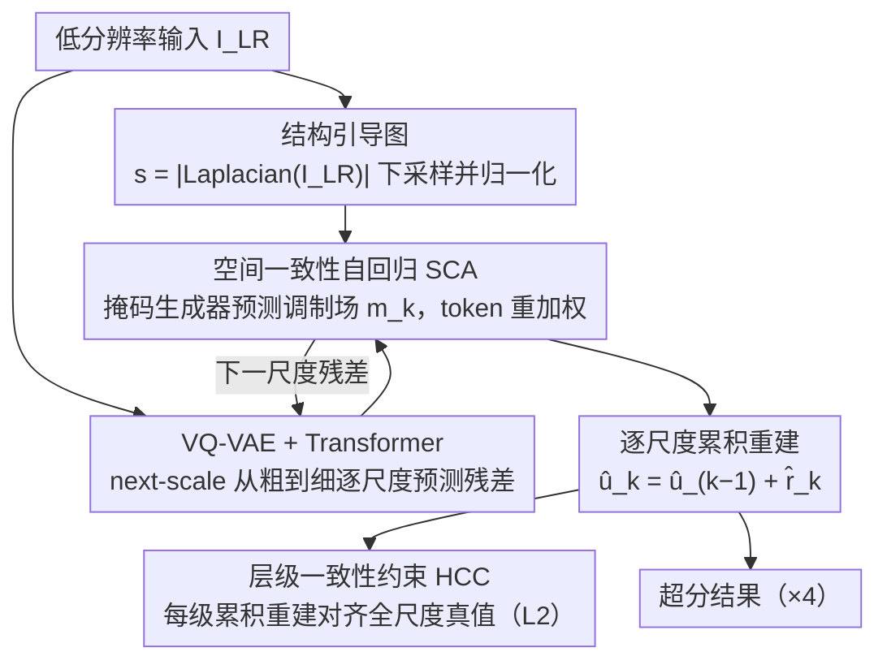

# AlignVAR: Towards Globally Consistent Visual Autoregression for Image Super-Resolution

**会议**: CVPR 2026 Findings  
**arXiv**: [2603.00589](https://arxiv.org/abs/2603.00589)  
**代码**: 无  
**领域**: 图像生成  
**关键词**: 视觉自回归, 图像超分辨率, 空间一致性, 层级一致性, Next-Scale预测

## 一句话总结

针对视觉自回归（VAR）模型在图像超分辨率中的两个一致性问题——注意力局部偏差导致的空间不连贯和残差监督导致的跨尺度误差累积，提出 AlignVAR 框架，通过空间一致性自回归（SCA）和层级一致性约束（HCC）协同解决，实现比扩散方法快 10× 以上的推理速度且重建质量更优。

## 研究背景与动机

图像超分辨率（ISR）领域中，GAN 方法训练不稳定且易产生伪影，扩散方法虽质量高但迭代去噪开销大（如 StableSR 需 200 步、15.32 秒）。**视觉自回归（VAR）** 通过 next-scale 预测策略实现从粗到细的重建，天然适合 ISR 的层级结构，且无需迭代——前驱工作 VARSR 已初步验证了可行性。

但 VARSR 暴露了 VAR 范式在 ISR 中的根本矛盾：

**空间不一致性（局部注意力偏差）**：VAR 模型的自注意力权重几乎完全集中在相邻区域，导致远距离结构特征无法交互，产生纹理断裂和结构扭曲

**层级不一致性（跨尺度误差累积）**：残差监督仅约束每级的增量预测，粗尺度的微小偏差通过逐级条件概率 $p(r_k | r_{1:k-1})$ 传播并放大，造成颜色偏移和结构错位

这两个问题的共同根源是：**在尺度内（空间维）和尺度间（层级维）均缺乏显式一致性约束**。AlignVAR 的切入点就是从这两个维度同时施加一致性。

## 方法详解

### 整体框架

AlignVAR 在 VQ-VAE + 自回归 Transformer 的 next-scale 预测架构上，引入两个互补模块：
- **SCA（空间一致性自回归）**：尺度内——用自适应掩码重加权注意力，缓解局部偏差
- **HCC（层级一致性约束）**：尺度间——用全尺度重建监督替代纯残差监督，抑制误差累积

### 关键设计

**1. 空间一致性自回归（SCA）：用结构引导的重加权，把注意力从邻域拉向可靠结构**

SCA 针对的是 VAR 注意力几乎只看相邻 token 的局部偏差——远处结构互动不上，纹理就断、结构就歪。它的做法是先从低分辨率输入算一张结构引导图，再用它去调制每个 token 的权重。具体地，对 $I_{LR}$ 取 Laplacian 响应的绝对值 $s = |\text{Laplacian}(I_{LR})|$，把它下采样到各尺度分辨率并归一化得到 $\bar{s}_k$；一个轻量 MLP 掩码生成器接收当前 token 和这张引导图，预测出空间调制场 $m_k = \sigma(\mathcal{M}_\phi([r_k, \bar{s}_k]))$；最后通过 token gating 得到重加权 token：

$$\tilde{r}_k = (1 + m_k) \odot r_k$$

之所以用 Laplacian，是因为它对二阶结构变化敏感，天然高亮边缘和纹理这些"结构清晰"的位置；掩码给这些位置更高权重，等于在告诉模型优先沿可靠结构去传播信息，从而把有效感受野撑开、把长程依赖补上，而不需要改动注意力本身的计算。

**2. 层级一致性约束（HCC）：每个尺度都监督累积重建，而不是只盯残差**

HCC 针对的是跨尺度的误差累积——纯残差监督只管"这一级的增量预测对不对"，粗尺度上一个不起眼的小偏差，会顺着逐级条件概率 $p(r_k\mid r_{1:k-1})$ 一路放大成颜色偏移和结构错位。HCC 的思路是直接拿"累积到当前尺度的全局重建"去和真值比。它先把 HR 图像的 VAE 编码下采样到各尺度再量化，得到全尺度 ground truth $u_{\text{gt}}^k = \mathcal{Q}(\text{Down}(z, S_k))$；预测侧则把各级残差累加起来 $\hat{u}_{\text{pred}}^k = \hat{u}_{\text{pred}}^{k-1} + \hat{r}_{\text{pred}}^k$；逐尺度施加 L2 监督：

$$\mathcal{L}_{\text{HCC}} = \sum_{k=1}^{K} \|\hat{u}_{\text{pred}}^k - u_{\text{gt}}^k\|_2^2$$

关键在于它把监督信号从"局部残差"换成了"全局状态"——模型在每一级都能看到自己累积出来的重建离真值差多远，于是能在误差继续向下传播、被放大之前就把它纠回来。

### 损失函数 / 训练策略

总体训练目标为交叉熵损失 + HCC 损失的加权和：
$$\mathcal{L}_{\text{total}} = \mathcal{L}_{\text{CE}} + \lambda \mathcal{L}_{\text{HCC}}$$

- 采用 teacher-forcing 训练，条件为重加权后的 ground-truth token $\tilde{r}_{\text{gt}}^{1:k-1}$
- $\lambda = 1.0$（消融实验验证为最优平衡点）
- 优化器：AdamW，batch size 32，学习率 $5 \times 10^{-5}$（cosine 退火），训练 100 epochs
- 训练数据：LSDIR + FFHQ 前 10K 张，退化用 Real-ESRGAN pipeline
- 8× NVIDIA H100 GPU

## 实验关键数据

### 主实验（Table 1：合成+真实基准）

| 方法 | 类型 | DIV2K LPIPS↓ | DIV2K FID↓ | DIV2K MANIQA↑ | DIV2K CLIPIQA↑ |
|------|------|-------------|-----------|--------------|---------------|
| BSRGAN | GAN | 0.3511 | 50.99 | 0.3547 | 0.5253 |
| Real-ESRGAN | GAN | 0.3267 | 44.34 | 0.3756 | 0.5205 |
| StableSR | Diffusion | 0.3228 | 28.32 | 0.4173 | 0.6752 |
| DiffBIR | Diffusion | 0.3638 | 34.55 | 0.4598 | 0.6731 |
| VARSR | VAR | 0.2985 | 28.64 | 0.4137 | 0.6312 |
| **AlignVAR** | **VAR** | **0.2955** | **25.71** | **0.4665** | **0.6754** |

AlignVAR 在 DIV2K-Val 上取得最低 FID（25.71）和最优 LPIPS（0.2955），同时感知质量指标 MANIQA 和 CLIPIQA 也达到最优。

### 效率对比（Table 2）

| 方法 | 参数量 | 推理步数 | 推理时间 |
|------|--------|---------|---------|
| StableSR | 1409.1M | 200 | 15.32s |
| DiffBIR | 1900.4M | 20 | 5.03s |
| PASD | 1716.7M | 50 | 5.94s |
| VARSR | 1102.9M | 10 | 0.52s |
| **AlignVAR** | **1056.5M** | **10** | **0.43s** |

AlignVAR 比 PASD 快 **13.8×**，比 DiffBIR 快 **11.7×**，比 VARSR 也快 17% 且参数更少。

### 消融实验

**SCA 消融（Table 3）**：

| 配置 | RealSR MANIQA↑ | RealSR MUSIQ↑ |
|------|---------------|-------------- |
| w/o SCA | 0.4351 | 66.74 |
| Random Input | 0.4435 | 67.21 |
| Structural Guidance (ours) | **0.4553** | **68.53** |

**HCC 消融（Table 4）**：

| 配置 | RealSR PSNR↑ | RealSR MANIQA↑ |
|------|-------------|---------------|
| w/o HCC | 25.85 | 0.4431 |
| w/ HCC | **26.11** | **0.4553** |

### 关键发现

- SCA 去除后保真度指标略升但感知质量明显下降，说明结构引导关键在于提升视觉连贯性
- HCC 在潜空间施加监督优于在像素空间——潜空间表示更紧凑，梯度更直接
- 损失平衡系数 $\lambda = 1.0$ 时感知质量最优，更大的 $\lambda$ 偏向保真但牺牲感知

## 亮点与洞察

1. **精准的问题诊断**：通过注意力分布可视化和扰动注入实验，清晰地定位了 VAR 在 ISR 中的两个根本问题
2. **轻量高效**：SCA 的掩码生成器是轻量 MLP，HCC 仅增加 L2 损失计算——几乎无额外推理开销
3. **10× 加速优势**：0.43 秒 vs 5+ 秒的扩散方法，在实际部署中意义重大
4. **参数更少效果更好**：1056.5M vs 1900.4M（DiffBIR），说明 VAR 范式在 ISR 中的效率潜力

## 局限与展望

- 保真度指标（PSNR/SSIM）未达到最优，在 LR 图像高频细节严重丢失时仍有恢复瓶颈
- 掩码依赖 Laplacian 的手工设计，可探索学习式结构检测
- 仅测试 4× 超分辨率（128→512），更极端的倍率（如 8× 或 16×）未验证
- VQ-VAE 的离散化可能限制重建上限，与连续潜空间方法的对比缺失

## 相关工作与启发

- **VARSR**：本文的直接前驱，首次将 VAR 应用于 ISR 但暴露了一致性问题
- **VAR（next-scale prediction）**：区别于 next-token 预测，避免了展平序列对空间结构的破坏
- **StableSR / DiffBIR**：扩散范式的代表方法，质量好但速度慢
- **启发**：自回归模型的局部偏差和误差累积是通用问题，SCA 和 HCC 的思路可推广到视频生成、3D 重建等其他层级化生成任务

## 评分

- 新颖性: ⭐⭐⭐⭐ 针对VAR在ISR中的特定问题提出了针对性解法，问题诊断有深度
- 实验充分度: ⭐⭐⭐⭐ 合成+真实基准、完整消融、效率对比，但缺少用户研究
- 写作质量: ⭐⭐⭐⭐ 动机分析清晰，可视化丰富，问题-方案对应关系明确
- 价值: ⭐⭐⭐⭐ 推动VAR在ISR中的实际可用性，10×速度优势有显著工程价值

<!-- RELATED:START -->

## 相关论文

- [\[CVPR 2026\] Physics-Consistent Diffusion for Efficient Fluid Super-Resolution via Multiscale Residual Correction](physics-consistent_diffusion_for_efficient_fluid_super-resolution_via_multiscale.md)
- [\[CVPR 2026\] VOSR: A Vision-Only Generative Model for Image Super-Resolution](vosr_a_vision_only_generative_model_for_image_super_resolution.md)
- [\[CVPR 2026\] Training-free, Perceptually Consistent Low-Resolution Previews with High-Resolution Image for Efficient Workflows of Diffusion Models](training-free_perceptually_consistent_low-resolution_previews.md)
- [\[AAAI 2026\] Realism Control One-step Diffusion for Real-World Image Super-Resolution](../../AAAI2026/image_generation/realism_control_one-step_diffusion_for_real-world_image_super-resolution.md)
- [\[CVPR 2025\] Arbitrary-Steps Image Super-Resolution via Diffusion Inversion](../../CVPR2025/image_generation/arbitrary-steps_image_super-resolution_via_diffusion_inversion.md)

<!-- RELATED:END -->
