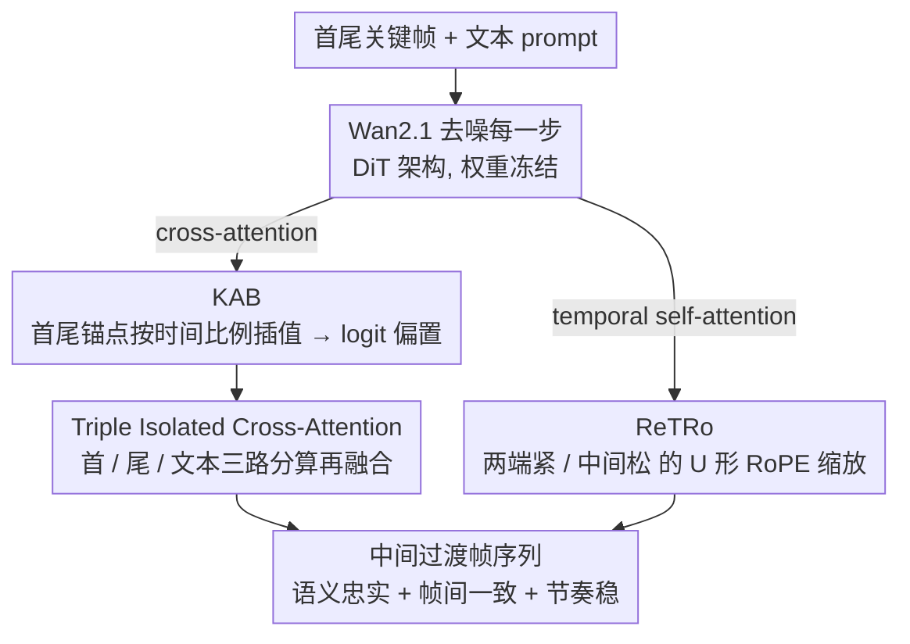

# Anchoring and Rescaling Attention for Semantically Coherent Inbetweening

**会议**: CVPR 2026  
**arXiv**: [2603.17651](https://arxiv.org/abs/2603.17651)  
**代码**: 待确认  
**领域**: 图像生成  
**关键词**: 生成式帧插值, 注意力锚定, 时序RoPE缩放, 关键帧引导, 视频扩散模型

## 一句话总结

提出 KAB（Keyframe-Anchored Attention Bias）和 ReTRo（Rescaled Temporal RoPE）两个无需训练的推理时方法，基于 Wan2.1 视频扩散模型解决稀疏关键帧下大运动生成式帧插值（GI）中的语义不忠、帧不一致和节奏不稳问题，并构建首个文本条件 GI 评估基准 TGI-Bench。

## 研究背景与动机

生成式帧插值（Generative Inbetweening, GI）是指给定首尾两个关键帧，生成中间过渡帧序列。与传统光流插帧不同，GI 需要"想象"中间过程，在大运动、长时序场景下面临三大核心挑战：

**语义不忠（Semantic Infidelity）**：中间帧出现与关键帧不一致的物体或场景元素

**帧间不一致（Frame Inconsistency）**：相邻帧之间出现闪烁、突变

**节奏不稳（Temporal Rhythm Instability）**：运动速度不均匀，时序分布不自然

现有方法大多基于 Image-to-Video（I2V）模型改造，典型如 TRF 和 SEINE。但当关键帧间距增大（如 65、81 帧），这些方法的质量急剧下降。根本原因在于：

- Cross-attention 机制对两端关键帧的关注度在长序列中稀释
- Temporal attention 的位置编码未考虑首尾帧的锚定需求
- 缺乏统一的评估基准来衡量文本条件 GI 的质量

本文的出发点是：**不修改模型权重**，仅通过推理时的注意力操控来解决上述问题。

## 方法详解

### 整体框架

这篇论文要解决的是稀疏关键帧、大运动下的生成式帧插值——只给首尾两帧，让模型"脑补"出中间几十帧的过渡，而当首尾间隔拉到 65、81 帧时，现有 I2V 改造方法会语义跑偏、帧间闪烁、节奏忽快忽慢。作者整条思路是：不碰 Wan2.1（一个 DiT 架构的首尾帧到视频模型）的任何权重，只在去噪的每一步往注意力里"插一只手"。介入分两路互补：KAB 改写 cross-attention 的 logit 分布，把首尾关键帧的语义锚点按时间比例注入每个中间帧；ReTRo 改写 temporal self-attention 里 RoPE 的缩放系数，让靠近端点的帧和居中的帧用不同的位置编码尺度。两路都在前向推理时完成，不需要任何额外训练或反向传播。

### 关键设计

**1. KAB（Keyframe-Anchored Attention Bias）：把关键帧的语义"锚"按时间比例插值进中间帧**

它针对的是长序列里 cross-attention 对两端关键帧的关注被稀释、中间帧容易冒出与首尾不符的物体。做法是先在 cross-attention 层取出首帧 $I_{\text{first}}$ 和尾帧 $I_{\text{last}}$ 各自的注意力分布 $A_{\text{first}}$、$A_{\text{last}}$，把它们当作两个语义锚点；对第 $t$ 帧，按时间位置把两个锚点线性插值出一个期望分布

$$\bar{A}(t) = \frac{T - t}{T}\, A_{\text{first}} + \frac{t}{T}\, A_{\text{last}}$$

再把它和目标 mask $M(t)$ 之间的差转成一个加在 softmax 之前的 logit 偏置

$$B(t) = \log\big(M(t) + \varepsilon\big) - \log\big(\bar{A}(t) + \varepsilon\big)$$

其中 $\varepsilon$ 防止取对数时溢出。因为这个 bias 只加在 logit 上、不动任何权重，它就能把中间帧的注意力"硬掰"到该聚焦的语义区域：比如序列推进到一半（$t=T/2$）时，$\bar{A}$ 恰好是首尾锚点各占一半，中间帧的注意力被拉成首尾语义的平均，自然过渡而不偏向某一端。这条思路和 Classifier-Free Guidance 同源——都是用一个加性偏置去引导生成方向——区别是 CFG 作用在类别维度，KAB 作用在 attention map 的空间维度。

配套的 Triple Isolated Cross-Attention 解决的是另一种干扰：首帧、尾帧、文本 prompt 三种条件若挤在同一路 cross-attention 里算，信息会互相串味、中间帧偏向某一端。KAB 把三者拆成各算各的三路 cross-attention，再加权融合，从而对称地对待首尾两端。

**2. ReTRo（Rescaled Temporal RoPE）：用"两端紧、中间松"的非均匀位置编码缩放，平衡保真与流畅**

temporal self-attention 里的 RoPE 决定了帧与帧之间注意力随距离衰减的快慢，原版对所有帧一视同仁，结果要么保不住关键帧细节、要么中间帧连不起来。ReTRo 按帧的位置给 RoPE 不同的缩放系数：靠近首/尾的边缘帧用 $s_{\text{edge}} > 1$，放大位置编码频率、锐化局部注意力，让这些帧"更像"紧挨着的关键帧，把细节保住；居中的帧用 $s_{\text{mid}} < 1$，缩小频率、扩展感受野，让它们"看得更远"以维持帧间连贯。在时间轴上这个缩放系数形成一条"U 形"曲线——两端高、中间低，等于把保真度的需求压在端点、把流畅性的需求让给中段。消融里均匀缩放（$s=1$）直接退回 baseline，恰好说明起作用的就是这种非均匀分布。

### 损失函数 / 训练策略

整套方法 training-free：KAB 只往 cross-attention 的 logit 上加 bias，ReTRo 只改 RoPE 的缩放系数，两者都不引入新参数、不需要反向传播。额外开销仅来自关键帧 anchor 的提取与 bias 计算，相对整段去噪的推理时间可忽略。

## 实验关键数据

### TGI-Bench（新基准）

首个文本条件生成式帧插值评估基准：

| 维度 | 规模 |
|------|------|
| 视频数量 | 220 |
| 序列长度 | 25 / 33 / 65 / 81 帧 |
| 挑战类别 | 4 类（大运动/遮挡/外观变化/场景切换） |
| 评估指标 | PSNR, SSIM, FVD, VBench |

### 主实验

**长序列（65/81 帧）性能对比**：

| 方法 | 训练需求 | PSNR↑ | SSIM↑ | FVD↓ | VBench↑ |
|------|---------|-------|-------|------|---------|
| TRF | 需要 | 中 | 中 | 中 | 中 |
| SEINE | 需要 | 中 | 中 | 中 | 中 |
| Wan2.1 (baseline) | - | 中 | 中 | 中 | 中 |
| **KAB + ReTRo** | **不需要** | **最优** | **最优** | **最优** | **最优** |

关键观察：在短序列（25 帧）上各方法差距不大，但随着序列增长到 65/81 帧，KAB+ReTRo 的优势显著放大。

### 消融实验

| 配置 | PSNR | SSIM | 说明 |
|------|------|------|------|
| Baseline (Wan2.1) | 基线 | 基线 | 无干预 |
| + KAB only | ↑ | ↑ | 语义一致性提升 |
| + ReTRo only | ↑ | ↑ | 时序稳定性提升 |
| + KAB + ReTRo | ↑↑ | ↑↑ | 两者互补，最优 |
| KAB w/o Triple Isolation | ↓ | ↓ | 首尾帧干扰导致退化 |
| ReTRo 均匀缩放 (s=1) | → 基线 | → 基线 | 等于不做缩放 |
| $s_{\text{edge}}$ 过大 | ↓ | ↑ | 过度锐化，失去流畅性 |
| $s_{\text{mid}}$ 过小 | ↓ | ↓ | 感受野过大，细节模糊 |

### 关键发现

1. **KAB 和 ReTRo 解决不同问题**：KAB 主攻语义忠实度，ReTRo 主攻时序一致性，组合效果最佳
2. **长序列优势明显**：序列越长（65/81帧），方法增益越大，说明针对的确实是长程依赖问题
3. **Triple Isolation 不可或缺**：不隔离首尾帧 attention 会导致信息串扰，中间帧偏向一端
4. **ReTRo 的 U 形分布至关重要**：均匀缩放无效，必须边缘紧中间松

## 亮点与洞察

- **Training-free** 的设计极具实用性：无需收集配对数据、无需微调，即插即用
- KAB 的 logit bias 思路与 Classifier-Free Guidance 异曲同工，但在空间维度（attention map）而非类别维度操作
- ReTRo 对 RoPE 缩放的非均匀设计思路新颖，可推广到其他需要差异化时序建模的任务
- Triple Isolated Cross-Attention 的对称设计体现了对首尾帧公平性的细致考量
- TGI-Bench 填补了文本条件 GI 评估的空白，4 类挑战场景×4 种长度的设计科学全面
- 方法的可解释性强：每个组件的物理含义清晰，消融实验验证了各部分的独立贡献

## 局限与展望

1. **依赖 Wan2.1 架构**：KAB 和 ReTRo 的设计与 DiT + RoPE 紧密耦合，迁移到 U-Net 架构需适配
2. **线性插值假设**：target anchor 的线性插值假设运动均匀，对非线性运动（加速/减速）可能不理想
3. **超参数敏感性**：$s_{\text{edge}}$ 和 $s_{\text{mid}}$ 需要手动调整，缺乏自适应选择机制
4. **计算成本未详细分析**：虽然声称开销可忽略，但未给出具体的推理时间对比数据
5. **仅限帧插值**：方法针对首尾帧已知的场景，无法直接扩展到单帧外推或无条件生成
6. **评估指标局限**：PSNR/SSIM 侧重像素级，对感知质量的评估有限；VBench 覆盖面更广但不够细粒度

## 相关工作与启发

- **vs Wan2.1 (baseline)**：本文直接基于 Wan2.1 FLF2V，不改权重只操控注意力，可视为其推理增强插件
- **vs TRF / SEINE**：先前帧插值方法需要训练且长序列退化严重；KAB+ReTRo 无需训练且长序列优势更大
- **vs Classifier-Free Guidance**：CFG 在类别维度操控生成方向；KAB 在空间维度（attention map）操控语义聚焦，是注意力层面的类比
- **RoPE 的非均匀缩放思路**可推广到其他需要差异化时序建模的任务（如长视频理解中的关键帧增强）
- 推理时注意力操控是一种低成本但高效的模型能力提升手段，值得在视频编辑、视频补全等更多任务中探索

## 评分

- 新颖性: ⭐⭐⭐⭐⭐ KAB + ReTRo 组合新颖，training-free 设计思路独特
- 实验充分度: ⭐⭐⭐⭐⭐ TGI-Bench 新基准 + 4种长度×4类挑战的全面评测
- 写作质量: ⭐⭐⭐⭐ 结构清晰，公式推导完整，图表丰富
- 价值: ⭐⭐⭐⭐⭐ 无需训练即插即用，视频生成社区直接受益

<!-- RELATED:START -->

## 相关论文

- [\[CVPR 2026\] LumiX: Structured and Coherent Text-to-Intrinsic Generation](lumix_structured_and_coherent_text-to-intrinsic_generation.md)
- [\[CVPR 2026\] Guiding Diffusion Models with Semantically Degraded Conditions](guiding_diffusion_models_with_semantically_degraded_conditions.md)
- [\[ICLR 2026\] Motion Prior Distillation in Time Reversal Sampling for Generative Inbetweening](../../ICLR2026/image_generation/motion_prior_distillation_in_time_reversal_sampling_for_generative_inbetweening.md)
- [\[CVPR 2026\] Gated Condition Injection without Multimodal Attention: Towards Controllable Linear-Attention Transformers](gated_condition_injection_without_multimodal_attention_towards_controllable_line.md)
- [\[CVPR 2026\] The Devil is in Attention Sharing: Improving Complex Non-rigid Image Editing Faithfulness via Attention Synergy](the_devil_is_in_attention_sharing_improving_complex_non-rigid_image_editing_fait.md)

<!-- RELATED:END -->
