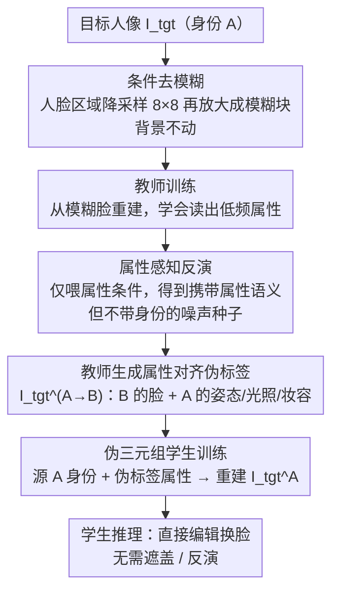

# APPLE: Attribute-Preserving Pseudo-Labeling for Diffusion-Based Face Swapping

**会议**: CVPR 2026  
**arXiv**: [2601.15288](https://arxiv.org/abs/2601.15288)  
**代码**: [https://cvlab-kaist.github.io/APPLE](https://cvlab-kaist.github.io/APPLE)  
**领域**: 图像生成 / 人脸替换  
**关键词**: Face Swapping, diffusion model, Teacher-Student, Pseudo-Label, Attribute Preservation

## 一句话总结
APPLE 提出了一种基于扩散模型的教师-学生框架，通过条件去模糊（代替传统条件修复）训练教师模型生成属性对齐的伪标签，再利用这些高质量伪标签训练学生模型，在保持身份迁移能力的同时实现了 SOTA 的属性保留性能（FID 2.18, Pose Error 1.85）。

## 研究背景与动机

**领域现状**：人脸替换旨在将源图像的身份迁移到目标图像上，同时保留目标的姿态、表情、肤色、光照、妆容等属性。该技术在内容创作、隐私保护和电影制作中应用广泛。

**GAN 方法的局限**：早期 GAN 方法（SimSwap, HiFiFace, FaceDancer 等）依赖身份损失和重建损失两个相互冲突的目标，训练不稳定，常产生 copy-paste 风格的伪影。

**扩散方法的核心矛盾**：近期扩散方法（DiffSwap, FaceAdapter, REFace）将任务建模为条件修复（conditional inpainting），即遮盖目标人脸区域后重建。但**遮盖操作在去除身份信息的同时，也丢失了关键属性线索**（光照、肤色、妆容等），导致即使有辅助条件信息，模型仍无法忠实保留这些属性。

**本文的切入角度**：核心洞察在于——**属性保留的关键不在于更好的属性编码，而在于为学生模型提供高质量的属性对齐伪标签作为条件输入**。如果教师能生成属性一致的伪标签，学生就能在干净图像（而非退化的遮盖图像）上学习，从而实现更好的属性保留。

**核心 idea**：用条件去模糊替代条件修复来训练教师模型，配合属性感知反演方案生成高质量伪标签，再以此训练学生模型实现属性保留与身份迁移的双赢。

## 方法详解

### 整体框架
APPLE 是一个**教师-学生框架**，分为三个阶段：
- **教师训练**：使用条件去模糊目标训练扩散教师模型
- **伪标签生成**：教师通过属性感知反演生成属性对齐的伪标签
- **学生训练**：学生以伪标签为条件，在直接编辑目标下训练

基础架构采用 FLUX.1-Krea [dev] 作为扩散骨干，PulID 作为身份编码器，OminiControl 作为属性条件分支（LoRA rank=64）。

### 关键设计

**1. 条件去模糊替代条件修复：用低频模糊保住被遮盖丢掉的属性线索**

扩散换脸的通病出在"遮盖"这一步：以往方法把目标人脸区域整块抹成零，再让模型从这张残缺图重建出换脸结果。问题是遮盖在抹掉身份的同时，连肤色、光照、姿态这些低频属性也一并抹没了，模型只能凭辅助条件硬猜，自然保不住属性。APPLE 的改动很直接——不抹成零，而是把人脸区域换成**模糊版本**：先下采样到 8×8 再上采样回原尺寸。这一刀切掉了高频的身份细节（五官轮廓、纹理），却把低频的属性信号留了下来，模型一看模糊图就能读出大致的肤色和光照走向。模糊只施加在面部解析模型框出的人脸区域，背景完全不动，所以这是个"少损一点信息"的折中：既洗掉了不想要的身份，又没把该保的属性一起洗掉。

**2. 属性感知反演：借反演噪声的"非高斯残留"锚定细粒度属性**

去模糊能把全局属性兜住，但妆容、配饰这类细粒度属性藏在高频里，模糊一过就没了，光靠它救不回来。APPLE 在这里用了一个反直觉的招：扩散反演（inversion）得到的那张"噪声"其实并不是干净的高斯噪声，里面会残留输入图像的语义结构——以往工作把这残留当噪点想方设法消除，APPLE 反而**有意利用**它来给细粒度属性做锚点。关键在于反演时喂什么条件：APPLE 只喂**属性条件** $(\varnothing, \mathcal{F}_{att}(I))$，刻意不给完整条件。原因是全条件反演会把身份信息也烙进噪声里，换脸时就泄露成伪影；而纯属性条件得到的噪声只携带属性语义、不带身份偏差，正好是想要的"属性种子"。作者用 PCA 把这张噪声可视化，能清楚看到面部语义结构，并用四种条件配置的消融坐实了纯属性条件最优。

**3. 伪三元组学生训练：让学生在干净伪标签上学，而非退化的遮盖图**

前两个设计都是为了把教师训好，最终目的是让教师生产高质量伪标签来喂学生。具体做法：教师对身份 A 的目标图 $I_{tgt}^A$ 执行换脸（换成身份 B），得到伪标签 $\hat{I}_{tgt}^{A \to B}$，再凑成伪三元组 $(I_{src}^A, \hat{I}_{tgt}^{A \to B}, I_{tgt}^A)$；学生拿源图的身份特征加伪标签的属性特征作输入，去重建原始目标图 $I_{tgt}^A$。这一步的价值在于学生看到的是一张**干净完整的伪标签图**，而不是教师当初面对的退化遮盖图，学属性保留时不用再跟残缺信息较劲，学得更稳；而且这套范式把复杂操作都压在了训练侧，学生推理时既不需要遮盖也不需要反演等辅助预处理，直接编辑即可。

### 一个完整示例

拿一张身份为 A 的目标人像 $I_{tgt}^A$（侧脸、暖光、带淡妆）走一遍三阶段：

1. **教师训练**：把 A 的脸部区域下采样到 8×8 再放大成模糊块贴回，背景保持原样；教师学习从这张"模糊脸+清晰背景"的图重建出 $I_{tgt}^A$，于是学会了从低频信号里读出暖光和肤色。
2. **伪标签生成**：要把 A 换成另一个身份 B。先对 $I_{tgt}^A$ 做属性条件反演 $(\varnothing, \mathcal{F}_{att})$，得到一张仍携带"侧脸+暖光+淡妆"语义的噪声种子；再以 B 的身份特征 + 这张种子条件去噪，生成伪标签 $\hat{I}_{tgt}^{A \to B}$——B 的脸、但保住了 A 那套姿态光照妆容。
3. **学生训练**：组成三元组 $(I_{src}^A, \hat{I}_{tgt}^{A \to B}, I_{tgt}^A)$，让学生以"A 的身份 + 伪标签的属性"为输入，把目标重建回 $I_{tgt}^A$。学生全程只见干净图，推理时给一张源脸和一张目标图就能直接换脸，无需任何遮盖或反演。

### 损失函数 / 训练策略
- **整体训练目标**：$\mathcal{L}_{total} = \mathcal{L}_{flow} + \lambda_{id} \mathcal{L}_{id}$
- **流匹配损失**（Rectified Flow）：$\mathcal{L}_{flow} = \mathbb{E}[\|(\epsilon - I_{tgt}) - v_t(z_t, \mathbf{id}_{src}, \mathbf{att}_{tgt})\|^2]$
- **身份损失**：$\mathcal{L}_{id} = 1 - \cos(\mathcal{F}_{id}(\hat{x_0}(z_t)), \mathcal{F}_{id}(I_{src}))$
- 教师先训练 15K 步（无身份损失）+ 50K 步（含身份损失），学生从教师恢复训练 15K 步
- 有效 batch size 16，4 张 A6000 GPU

## 实验关键数据

### 主实验

| 方法 | FID↓ | ID Sim.↑ | ID Ret. Top-1↑ | Pose↓ | Expr.↓ |
|------|------|----------|---------------|-------|--------|
| SimSwap | 18.54 | 0.55 | 94.10 | 3.11 | 1.73 |
| FaceDancer | 3.80 | 0.51 | 89.70 | 2.23 | 0.74 |
| REFace | 7.22 | **0.60** | **97.60** | 3.67 | 1.08 |
| CSCS | 11.00 | **0.65** | **99.00** | 3.64 | 1.44 |
| APPLE (Teacher) | 3.68 | 0.54 | 90.40 | 2.07 | 0.70 |
| **APPLE (Student)** | **2.18** | 0.54 | 90.50 | **1.85** | **0.64** |

### 消融实验

| 配置 | FID↓ | ID Sim.↑ | Pose↓ | Expr.↓ | 说明 |
|------|------|----------|-------|--------|------|
| Inpainting (Baseline) | 11.00 | 0.54 | 3.37 | 1.01 | 传统遮盖方案 |
| Deblurring | 4.20 | 0.53 | 2.58 | 0.79 | 去模糊显著提升属性保留 |
| Deblurring + Inv. | 3.68 | 0.54 | 2.07 | 0.70 | 属性感知反演进一步提升 |

### 关键发现
- 从 Inpainting 切换到 Deblurring，FID 从 11.00 降到 4.20，Pose 误差从 3.37 降到 2.58
- 属性感知反演在此基础上进一步将 Pose 从 2.58 降到 2.07
- 学生模型最终超越教师（FID 2.18 vs 3.68），验证了伪标签训练策略的有效性
- CSCS 和 REFace 虽然身份相似度更高，但严重偏向身份匹配，属性保留很差（copy-paste 伪影）

## 亮点与洞察
- **条件去模糊是一个优雅的折中**：比遮盖保留更多信息，又不引入身份泄露，简单有效
- **有意利用反演噪声的非高斯特性**：这一点非常巧妙——以往方法试图消除反演噪声中的残留语义，而 APPLE 反其道而行之，利用它来保存属性
- **教师-学生范式的通用价值**：该框架的核心思想（生成好的伪标签来训练更好的模型）在其他条件生成任务中同样适用

## 局限与展望
- 身份相似度指标略低于最强基线（0.54 vs 0.65），说明在极端身份迁移场景下可能不够
- 依赖 VGGFace2-HQ 数据集训练，对非正面、遮挡等极端情况的泛化有待验证
- 教师模型的伪标签质量是整个流水线的瓶颈，进一步提升教师质量可能带来更大收益

## 相关工作与启发
- DreamID 也使用伪数据集训练，但依赖 GAN 模型（FaceDancer）生成伪标签，质量有限
- 属性感知反演的思路可推广到其他图像编辑任务中——利用反演噪声保留特定属性
- 条件去模糊策略可能对其他需要属性保留的条件生成任务（如虚拟试衣、风格迁移）有启发

## 评分
- 新颖性: ⭐⭐⭐⭐ 条件去模糊和属性感知反演都有新意，但教师-学生框架本身较常见
- 实验充分度: ⭐⭐⭐⭐⭐ 多维度定量评估+详尽消融，论证严谨
- 写作质量: ⭐⭐⭐⭐⭐ 逻辑清晰，动机和方法的推导链条完整
- 价值: ⭐⭐⭐⭐ 属性保留是 face swapping 的核心难题，实用性强

<!-- RELATED:START -->

## 相关论文

- [\[CVPR 2026\] Attribute-Preserving Pseudo-Labeling for Diffusion-Based Face Swapping](attribute-preserving_pseudo-labeling_for_diffusion-based_face_swapping.md)
- [\[CVPR 2026\] High-Fidelity Diffusion Face Swapping with ID-Constrained Facial Conditioning](high-fidelity_diffusion_face_swapping_with_id-constrained_facial_conditioning.md)
- [\[CVPR 2026\] Preserving Source Video Realism: High-Fidelity Face Swapping for Cinematic Quality](preserving_source_video_realism_high-fidelity_face_swapping_for_cinematic_qualit.md)
- [\[CVPR 2026\] Say Cheese! Detail-Preserving Portrait Collection Generation via Natural Language Edits](say_cheese_detail-preserving_portrait_collection_generation_via_natural_language.md)
- [\[CVPR 2026\] Reviving ConvNeXt for Efficient Convolutional Diffusion Models](reviving_convnext_for_efficient_convolutional_diffusion_models.md)

<!-- RELATED:END -->
