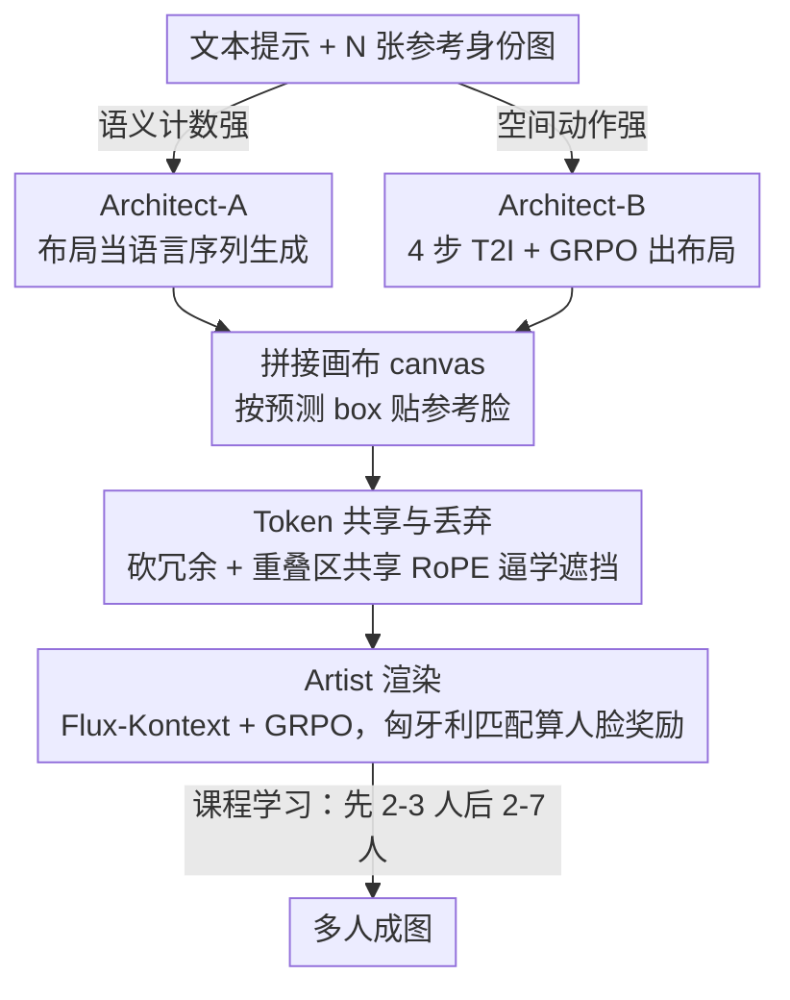

# Ar2Can: An Architect and an Artist Leveraging a Canvas for Multi-Human Generation

**会议**: CVPR 2026  
**arXiv**: [2511.22690](https://arxiv.org/abs/2511.22690)  
**代码**: [https://qualcomm-ai-research.github.io/ar2can/](https://qualcomm-ai-research.github.io/ar2can/)  
**领域**: 图像生成 / 多人图像生成  
**关键词**: Multi-Human Generation, Identity Preservation, Spatial Planning, GRPO, Reinforcement Learning

## 一句话总结
Ar2Can 提出将多人图像生成分解为空间规划（Architect）和身份保留渲染（Artist）两阶段，通过 GRPO 强化学习配合基于匈牙利匹配的空间锚定人脸奖励函数训练 Artist 模型，在 MultiHuman-Testbench 上实现了 68.2 的身份保留分数和 90.2 的计数准确率，大幅超越所有基线。

## 研究背景与动机

**领域现状**：文生图扩散模型在单人生成方面已非常成熟，但在**多人场景**中系统性失败——身份融合、身份交换、人数错误是普遍问题。

**现有方法的分类与痛点**：
   - **区域条件方法**（GLIGEN, ReCo）需要用户手动提供空间标注，可用性差
   - **身份保留方法**（IP-Adapter, InstantID, PuLID）适用于单人，多人时身份冲突
   - **多 ID 方法**（OmniGen, DreamO, XVerse）在最新 benchmark 上仍表现不佳

**核心矛盾**：现有方法将**空间布局推理**和**身份渲染**融合在单一生成过程中。当模型需要同时决定"人在哪里"和"人长什么样"时，空间结构与外观纠缠，导致身份融合。

**切入角度**：**解耦空间规划与身份渲染**——先确定每个人出现在哪，再专注于逼真渲染。这种分治策略能从根本上避免身份融合。

**核心 idea**：Architect 生成结构化空间布局（bounding box / 姿态），Artist 在此布局指导下通过 GRPO + 匈牙利匹配人脸奖励来保持多身份一致性。

## 方法详解

### 整体框架

Ar2Can 想根治的是多人文生图里最顽固的几种失败：身份融合、身份交换、人数出错。它的核心判断是，这些错误源于模型同时在做两件本该分开的事——既要决定"每个人站在哪"，又要决定"每个人长什么样"，空间结构和外观一旦纠缠，身份就会糊到一起。于是 Ar2Can 把生成拆成串行的两阶段，中间用一张画布（canvas）衔接：先由 Architect 读文本提示 $p$ 和 $N$ 张参考身份图 $\{I_{ref,1}, ..., I_{ref,N}\}$，预测出 $N$ 个 bounding box 组成的空间布局 $\mathcal{L} = \{b_1, ..., b_N\}$；再把每张参考人脸按预测位置贴到一张空白画布上拼成衔接画布；最后 Artist 以画布、参考图和文本为条件渲染成图。Architect 只管"谁在哪"，Artist 只管"画得像不像"，纠缠被从结构上切断。

### 关键设计

**1. Architect-A：把空间布局当成语言序列来生成**

要让模型把"画面里有几个人、谁挨着谁"想清楚，本质是个语义推理问题，正好是语言模型的强项。Architect-A 基于 Qwen-2.5-0.5B-Instruct 微调，给词表扩进 `<SoL>`、`<EoL>`、`<C>` 等布局结构令牌，把一组 box 表示成一段结构化 token 序列。为了同时吐出离散结构和连续坐标，它用双头设计——$f_{token}$ 预测令牌、$f_{value}$ 回归坐标，训练损失把交叉熵和坐标项合在一起 $\mathcal{L} = \mathcal{L}_{CE} + \lambda_{coord}[\mathcal{L}_{gIoU} + \|b_{pred} - b_{gt}\|_1]$。借来的语言理解力让它在计数和人物关系上最准，人数准确率做到 90.2%。

**2. Architect-B：用 4 步 T2I 模型 + GRPO 直接"画"出布局**

另一条路是让一个轻量图像模型直接生成布局，它的空间先验比纯文本更强。Architect-B 基于 Flux-Schnell 微调，只需 4 步去噪，用 GRPO 强化学习训练，奖励 $r = \alpha \cdot r_{count} + \beta \cdot r_{hps}$ 同时约束人数和画面质量。它不止给人脸 bounding box，还能输出人体姿态，因而动作分数更高。两套 Architect 是互补关系：A 强在语义计数，B 强在空间与动作，且都能在不重训 Artist 的前提下替换。

**3. Artist 的组合奖励与空间锚定人脸匹配：核心创新**

把 canvas 渲染成自然成图时，难点是既要保住每个人的身份，又不能让模型偷懒去机械粘贴参考脸。Artist 基于 Flux-Kontext，用 GRPO 训练，奖励是四项加权 $r_{Artist} = \alpha \cdot r_{count} + \beta \cdot r_{hps} + \zeta \cdot r_{face} + \eta \cdot r_{pose}$，分别盯人数、质量、人脸身份和姿态。真正的关键是 $r_{face}$ 怎么算：要给身份打分，先得知道"生成图里这张脸对应哪个参考身份"。朴素做法是直接在 Architect 预测的坐标处裁脸去比对，但这等于逼模型把参考脸原样贴到精确位置，结果是 copy-paste 伪影甚至 reward hacking。Ar2Can 改成两步——先用匈牙利算法在 Architect 的"预测中心点"和 RetinaFace 实际检测到的人脸中心点之间做一次最优匹配，再对匹配上的脸对算 ArcFace 余弦相似度。匈牙利匹配把"必须长在精确坐标"放松成"位置大致对得上即可"，给画面留出自然变化的空间，身份分和质量分才能同时拿高。

**4. Token 共享与丢弃（Token Sharing & Dropping）：让画布的冗余既省算力又逼模型学遮挡**

画布里大片是非信息背景，Ar2Can 干脆丢掉这些区域的 token，平均把 token 数砍掉一半。更巧的是处理重叠：当两个人脸 box 互相重叠时，它让重叠区共享同一套 RoPE 位置编码——位置编码一旦撞车，模型就没法靠坐标把两张脸硬摆开，只能去学真正的遮挡关系（谁在前、谁在后、怎么重排），而不是简单粘贴。

**5. 课程学习：先易后难，防止早期训崩**

多人 GRPO 若一上来就喂 7 人场景极易崩溃。Ar2Can 把难度铺成台阶——前 $\tau=100$ 个 epoch 只用 2-3 人场景，等模型站稳后再均匀采样 2-7 人，让训练平稳爬坡。

### 一个完整示例

以"三个人在咖啡馆聊天"配 3 张参考脸为例走一遍：Architect 先输出 3 个 bounding box（左/中/右各一人）；系统把 3 张参考脸缩放后贴进对应 box，拼成一张 canvas；Artist 拿这张 canvas、3 张原参考图和文本去渲染。训练时假设它在右侧多画了一张脸，RetinaFace 会检测到 4 个人脸中心点，而 Architect 只给了 3 个预测中心——匈牙利匹配只能配上 3 对、第 4 张脸落空，于是 $r_{count}$ 和 $r_{face}$ 同时被扣分，梯度把人数压回到 3。反过来，只要这 3 张脸位置大致对、身份对得上，即便没贴在像素级精确坐标也能拿高分，这正是匈牙利匹配相比朴素裁剪的好处。

### 训练策略

最大的现实障碍是缺乏大规模多人训练数据。Ar2Can 索性完全走合成路线：用 DisCo 生成多人场景，再和真实参考人脸配对，拼成混合训练样本，全程不依赖真实多人合照；前面的课程学习也是这条训练流程的一环。实验表明，仅靠合成数据加 GRPO 微调，就足以反超那些用大量真实数据训练的商业模型。

## 实验关键数据

### 主实验（MultiHuman-TestBench）

| 方法 | Count↑ | Multi-ID↑ | HPS↑ | Action-S↑ | Unified↑ |
|------|--------|-----------|------|-----------|----------|
| GPT-Image-1 | 87.9 | 28.8 | 30.3 | 97.0 | 55.8 |
| DreamO | 61.2 | 34.7 | 28.5 | 86.2 | 59.7 |
| MH-OmniGen | 60.3 | 54.5 | 26.3 | 91.6 | 61.6 |
| XVerse | 81.7 | 30.6 | 25.5 | 66.2 | 52.7 |
| **Ar2Can (Arch-B)** | 86.9 | **68.2** | **30.8** | 86.2 | **72.4** |
| **Ar2Can (Arch-A)** | **90.2** | 67.6 | 30.2 | 86.3 | 72.2 |

### 消融实验

| 配置 | Count↑ | Multi-ID↑ | HPS↑ | 说明 |
|------|--------|-----------|------|------|
| Baseline (Kontext) | 80.7 | 14.5 | 29.2 | 原始模型，多人严重失败 |
| + Simple Matching | 75.6 | 55.2 | 27.6 | 朴素匹配→copy-paste伪影 |
| + Hungarian Centroid | 80.1 | 60.3 | 30.9 | 匈牙利匹配恢复质量 |
| + Curriculum (Full) | **86.9** | **68.2** | **30.8** | 课程学习进一步提升 |

### 关键发现
- Multi-ID 从 Kontext 的 14.5 提升到 68.2（+53.7），说明 Kontext 在多人场景下几乎完全失败
- 匈牙利匹配相比朴素匹配不仅提升身份保留（+5.1），还恢复了图像质量（HPS 27.6→30.9）
- 在 88% 的评测提示中被人类评估者优选（vs DreamO 4%, XVerse 8%）
- 仅用合成数据训练就超越了使用大量真实数据的商业模型

## 亮点与洞察
- **空间规划与渲染解耦**是一个非常清晰的思路，有效避免了多人生成中的身份纠缠问题
- **匈牙利匹配奖励**巧妙地平衡了空间精度和生成自然度——不硬性要求精确位置，而是"附近即可"
- **模块化设计**的灵活性：Architect 可替换不同方案而不需重新训练 Artist
- 在主要使用合成数据的情况下取得 SOTA，说明 RL 微调可以有效补偿数据质量

## 局限与展望
- 动作生成方面仍不如 GPT-Image-1（Action-S 86.2 vs 97.0），序复杂动作理解有待加强
- 7 人以上的极端多人场景未验证
- 推理延迟较高（两阶段架构带来额外开销），token sharing 虽缓解但仍有空间
- Architect-A 和 Architect-B 各有优劣，缺乏统一方案

## 相关工作与启发
- DisCo（Flow-GRPO 用于多人生成）是直接前驱，Ar2Can 在其基础上加入了空间锚定
- Canvas-based 方法（如 Kontext）在单人时效果好但多人失败，说明需要显式空间引导
- GRPO + 组合奖励的范式可推广到其他需要多目标平衡的图像生成任务

## 评分
- 新颖性: ⭐⭐⭐⭐ 空间解耦+匈牙利匹配奖励的组合新颖且有效
- 实验充分度: ⭐⭐⭐⭐⭐ 两个 benchmark + 人类评估 + 详细消融 + 延迟分析
- 写作质量: ⭐⭐⭐⭐ 框架清晰，但部分细节需查附录
- 价值: ⭐⭐⭐⭐⭐ 多人身份保留生成是刚需，实际改进巨大（+13.7 Multi-ID over SOTA）

<!-- RELATED:START -->

## 相关论文

- [\[CVPR 2026\] Leveraging Verifier-Based Reinforcement Learning in Image Editing](leveraging_verifier-based_reinforcement_learning_in_image_editing.md)
- [\[CVPR 2026\] Aligning Multi-Character Narrative Image Generation with Multi-Aspect Human Preferences](aligning_multi-character_narrative_image_generation_with_multi-aspect_human_pref.md)
- [\[CVPR 2026\] InterEdit: Navigating Text-Guided Multi-Human 3D Motion Editing](interedit_navigating_textguided_multihuman_3d_moti.md)
- [\[CVPR 2026\] Harmonic Canvas: Inversion-Free Editing for Visually-Guided Music Style Transfer](harmonic_canvas_inversion-free_editing_for_visually-guided_music_style_transfer.md)
- [\[CVPR 2026\] Leveraging Multispectral Sensors for Color Correction in Mobile Cameras](leveraging_multispectral_sensors_for_color_correction_in_mobile_cameras.md)

<!-- RELATED:END -->
