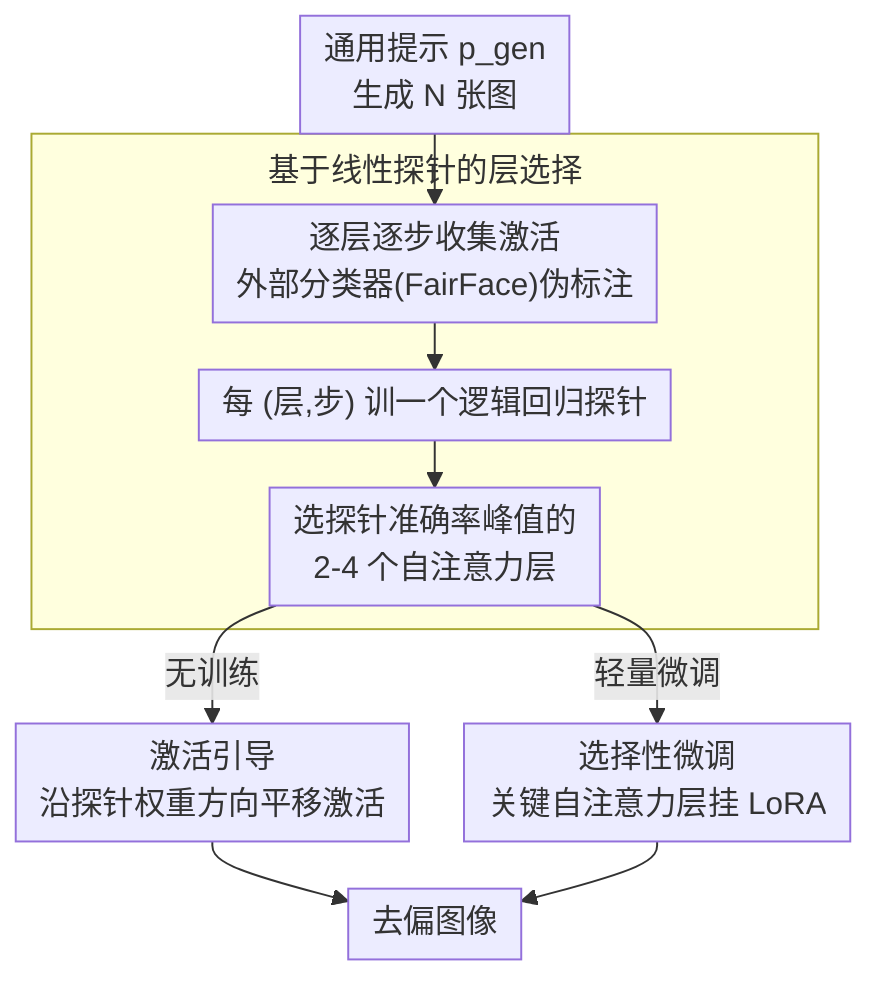

# Attention, May I Have Your Decision? Localizing Generative Choices in Diffusion Models

**会议**: CVPR 2026  
**arXiv**: [2604.06052](https://arxiv.org/abs/2604.06052)  
**代码**: [https://github.com/kzaleskaa/icm](https://github.com/kzaleskaa/icm)  
**领域**: 图像生成 / 扩散模型可解释性  
**关键词**: Diffusion Model Interpretability, Self-Attention, Debiasing, Linear Probing, Implicit Decision

## 一句话总结
本文通过线性探针（linear probing）发现扩散模型中**隐式决策**（如未指定性别时默认生成男性）主要由自注意力层而非交叉注意力层控制，并基于此提出 ICM 方法，仅在少量关键自注意力层上进行干预即可实现 SOTA 的去偏见效果，同时最小化图像质量退化。

## 研究背景与动机

**领域现状**：文生图扩散模型功能强大但内部机制不透明。当提示不够具体时（如"一张人的照片"未指定性别），模型必须做出隐式决策来填充缺失细节。

**隐式决策的双面性**：
   - 无害情况：生成"花"时自行决定颜色和形状
   - 有害情况：生成"医生"默认为男性（性别偏见）、"美国总统"只生成特定人物（代表性偏差）

**现有定位方法的局限**：
   - 主流方法（如 prompt injection/activation patching）通过在特定层注入不同文本提示来测量层的影响
   - 但这些方法本质上依赖显式文本条件——这**掩盖了模型在缺乏显式条件时的内部决策机制**
   - 已有研究认为交叉注意力层负责语义信息整合，因此大多数干预瞄准交叉注意力

**核心假设**：隐式决策的计算机制是**局部化的**，且与显式文本条件的机制**不同**。

**切入角度**：用线性探针直接在中间激活上训练分类器，无需 prompt 工程即可定位决策层，避免了 prompt injection 的混淆效应。

## 方法详解

### 整体框架

这篇要回答一个机制问题：当 prompt 没指定某个属性（如「一张人的照片」没说性别）时，扩散模型到底在**哪儿**替你做了「默认生成男性」这类隐式决策？作者的做法（称为 ICM，Implicit Choice-Modification）不靠 prompt injection，而是用线性探针直接读中间层激活——先用通用提示生成一批图并收集各层激活，再用外部分类器给生成图打伪标签，然后在每层训一个线性探针看它能多大程度分出属性：探针越准，说明该层越「掌握」这个隐式决策。定位到关键层后，再在这些层上做定向干预（激活引导或选择性微调）来去偏。

### 关键设计

**1. 基于线性探针的层选择：不靠 prompt 工程，直接量化每层的「决策含量」**

主流定位法（prompt injection / activation patching）靠注入不同文本来测层的影响，但这恰恰需要显式文本条件，反而掩盖了「无显式条件时」的内部决策机制。这里换个路子：定义概念 $\mathcal{C}$（如性别）和互斥选项 $\mathcal{A} = \{a_1, ..., a_K\}$，用通用提示 $p_{gen}$（"a photo of a person"）生成 $N$ 张图，对每层 $l$、每时间步 $t$ 取平均池化激活 $H_{l,t}^{(i)}$，用 FairFace 等外部分类器伪标注后，对每个 $(l,t)$ 训一个逻辑回归 $f_{l,t}: \mathbb{R}^{d_l} \to \mathcal{A}$。分类准确率高的层，就是属性可分性强、隐式决策发生的关键位置。核心发现是：**自注意力层的探针准确率显著高于交叉注意力层，且在中间块附近达到峰值**——这直接挑战了「语义都在交叉注意力」的旧认知。

| 层类型 | 角色 | 隐式决策相关性 |
|--------|------|---------------|
| 交叉注意力 | 整合文本条件的语义信息 | 低——prompt 不含属性 token 时，交叉注意力无从得知属性 |
| 自注意力 | 传播并固化随机线索 | **高**——把初始噪声里的独立线索（发型 + 口红）统一成连贯生成 |

作者由此提出假设：自注意力层是通过传播、巩固初始噪声中的随机线索来做出隐式决策的。

**2. 激活引导：拿探针权重当方向，沿最大可分性推一把**

定位到关键层后怎么改？逻辑回归的权重向量本身就是「最大类可分性方向」，归一化成 $s_{\ell,t} = \hat{w}_{\ell,t} / \|\hat{w}_{\ell,t}\|_2$，生成时把选定层激活沿此方向平移 $H_{\ell,t}' = H_{\ell,t} + \alpha \cdot s_{\ell,t}$，$\alpha$ 控制强度。因为这个方向恰好分隔两类属性，沿它移动就能直接改写隐式决策，且全程无需重训。

**3. 选择性微调：只在关键自注意力层上挂 LoRA**

除了无训练的引导，也可做轻量微调：仅对选定的自注意力层加 LoRA，用特定属性图像（如「年轻医生」）当目标、但以通用提示（「医生」）作训练条件，走标准扩散损失 $\mathcal{L} = \mathbb{E}_{\epsilon,t}[\|\epsilon - \hat{\epsilon}_\theta(x_t, p, t)\|_2^2]$。只动 2-4 个关键层而非全部，既去了偏又把画质退化压到最小。

## 实验关键数据

### 主实验（SD v1.5 去偏见）

| 方法 | Gender FD↓ | Age FD↓ | Race FD↓ | FID↓ | CLIP-T↑ |
|------|------------|---------|----------|------|---------|
| Original | 0.564 | 0.752 | 0.558 | 120.06 | 0.6155 |
| DIFFLENS | **0.046** | **0.049** | 0.401 | 112.83 | 0.6090 |
| Finetuning | 0.050 | 0.746 | 0.198 | 161.47 | 0.6095 |
| **ICM (Steering)** | 0.087 | 0.133 | **0.266** | 122.08 | **0.6140** |
| **ICM (Finetuning)** | 0.535 | 0.681 | 0.449 | 143.98 | 0.6189 |

### 消融实验：自注意力 vs 交叉注意力引导

| 干预目标 | Gender FD↓ | Age FD↓ | Race FD↓ | FID↓ |
|----------|------------|---------|----------|------|
| Cross-attn steering | 0.365 | 0.612 | 0.428 | 118.39 |
| **Self-attn steering** | **0.085** | **0.273** | **0.298** | 118.31 |
| Cross-attn finetuning | 0.535 | 0.681 | 0.449 | 143.98 |
| **Self-attn finetuning** | **0.463** | **0.770** | **0.524** | 139.04 |

### 关键发现
- **自注意力层引导在所有属性上都大幅优于交叉注意力层引导**（Gender FD: 0.085 vs 0.365）
- ICM Steering 实现了最好的质量-公平性权衡：FD 下降的同时 FID/CLIP-T 几乎不受影响
- 仅干预 2-4 个关键自注意力层 > 干预所有层（后者导致伪影和质量退化）
- 通用提示和显式提示产生的激活分布**可被线性分离**（测试准确率 56-89%），证实两种生成机制确实不同
- 方法可推广到 SDXL（70 层）和 SANA（Transformer 架构，20 层）

## 亮点与洞察
- **"隐式决策的位置在自注意力层"这一发现**意义重大，挑战了以往"所有语义信息都在交叉注意力"的认知
- **精准而非全面的干预**：仅改动 2-4 层就能实现 SOTA 效果，比修改所有层或整个中间块更高效
- 线性探针方法避免了 prompt injection 的混淆效应，提供了更纯粹的内部机制视角
- 实验设计严谨：通过训练探针区分隐式/显式生成来验证两种机制的差异

## 局限与展望
- Steering 强度 $\alpha$ 需要针对每个场景逐个调整，缺乏自动化
- 对于多属性同时去偏（如性别+年龄+种族）的效果未充分探讨
- 线性探针假设属性在激活空间中是线性可分的，对更复杂的概念可能不成立
- 从去偏推广到更一般的隐式概念控制还需更多验证

## 相关工作与启发
- DIFFLENS 在特定指标上更好，但使用稀疏自编码器方法复杂度更高
- 与 LLM 中的"知识定位"研究（如 ROME, activation patching）方法论类似
- 对 prompt injection 方法提出了质疑——显式注入不等于模型的内部决策机制

## 评分
- 新颖性: ⭐⭐⭐⭐⭐ "自注意力层是隐式决策中心"的发现是重要贡献
- 实验充分度: ⭐⭐⭐⭐⭐ 三种属性 × 三种架构 × 多种干预方式，分析非常深入
- 写作质量: ⭐⭐⭐⭐⭐ 叙事优雅，从假设到验证到应用的逻辑链完整
- 价值: ⭐⭐⭐⭐ 对理解扩散模型内部机制有基础贡献，去偏应用实用

<!-- RELATED:START -->

## 相关论文

- [\[ICCV 2025\] Attention to Neural Plagiarism: Diffusion Models Can Plagiarize Your Copyrighted Images!](../../ICCV2025/image_generation/attention_to_neural_plagiarism_diffusion_models_can_plagiarize_your_copyrighted_.md)
- [\[CVPR 2026\] Correspondence-Attention Alignment for Multi-View Diffusion Models](correspondence-attention_alignment_for_multi-view_diffusion_models.md)
- [\[CVPR 2026\] Decision Boundary-aware Generation for Long-tailed Learning](decision_boundary-aware_generation_for_long-tailed_learning.md)
- [\[CVPR 2026\] Your Latent Mask is Wrong: Pixel-Equivalent Latent Compositing for Diffusion Models](your_latent_mask_is_wrong_pixel-equivalent_latent_compositing_for_diffusion_mode.md)
- [\[AAAI 2026\] Melodia: Training-Free Music Editing Guided by Attention Probing in Diffusion Models](../../AAAI2026/image_generation/melodia_training-free_music_editing_guided_by_attention_probing_in_diffusion_mod.md)

<!-- RELATED:END -->
