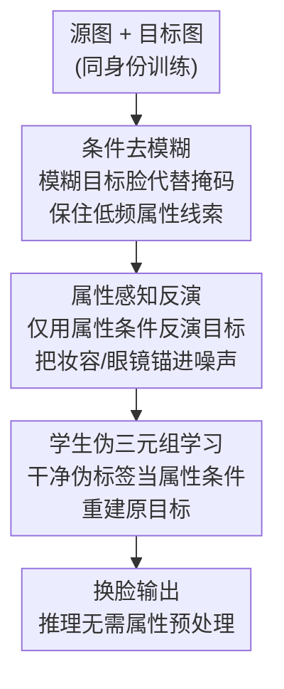

# Attribute-Preserving Pseudo-Labeling for Diffusion-Based Face Swapping

**会议**: CVPR 2026  
**论文**: [CVF Open Access](https://openaccess.thecvf.com/content/CVPR2026/html/Kang_Attribute-Preserving_Pseudo-Labeling_for_Diffusion-Based_Face_Swapping_CVPR_2026_paper.html)  
**代码**: https://cvlab-kaist.github.io/APPLE （项目页）  
**领域**: 扩散模型 / 换脸  
**关键词**: 换脸, 扩散模型, 教师-学生, 属性保持, 伪标签

## 一句话总结
APPLE 用一个"先训好教师、再用教师造高质量伪标签喂学生"的纯扩散教师-学生框架做换脸：教师靠**条件去模糊**（而非给整张脸打掩码）保住目标的肤色/光照/姿态，再用**属性感知反演**把目标的细粒度属性（妆容、眼镜）锚进噪声里，造出干净的伪标签；学生只看这些干净伪标签学习，最终在属性保持上达到 SOTA（FFHQ FID 2.18、Pose 1.85），同时 ID 相似度仍有竞争力。

## 研究背景与动机
**领域现状**：换脸的目标是把源图的身份换到目标图上，同时保留目标的姿态、表情、光照、肤色、妆容、配饰等属性。早期方法以 GAN 为主（SimSwap、HiFiFace 等），近年扩散模型凭借高保真和训练稳定性成为主流替代。

**现有痛点**：换脸没有真实 ground truth（同一个人不可能同时有"换前/换后"配对），所以监督训练本质上不可行。主流扩散换脸（FaceAdapter、DiffSwap、REFace）把任务建模成**条件 inpainting**——把目标脸部区域整个掩掉，让模型在源身份条件下重建。掩码确实能阻止目标身份"泄漏"，但它把光照、肤色、妆容、配饰这些关键外观线索一起抹掉了。结果模型只能"脑补"，即便额外喂 3DMM landmark 或 CLIP 特征，换出来的脸属性往往和目标对不上。

**核心矛盾**：身份迁移和属性保持本身就是一对 trade-off——掩码越狠越能压住目标身份（利于身份迁移），但也越保不住属性。inpainting 把这对矛盾"硬切"到了不利于属性的一端。

**本文目标**：在不依赖真实配对、不掩掉属性线索的前提下，让模型既能可靠换身份、又能高保真保住目标属性（尤其妆容、眼镜这类细粒度细节）。

**切入角度**：与其让学生直接在"被破坏的掩码输入"上学，不如**先把教师练成能造出属性对齐的高质量伪标签的模型**，再让学生在这些干净伪标签上学。伪标签质量是整个框架的命门：若伪标签在姿态/光照上和目标冲突，学生收到的是矛盾信号，反而更差。

**核心 idea**：用"条件去模糊 + 属性感知反演"造出属性对齐的干净伪标签，让学生在干净输入（而非掩码退化输入）上学换脸——伪标签越干净，学生越能学到忠实的属性保持。

## 方法详解

### 整体框架
APPLE 是建立在 rectified-flow 扩散主干（FLUX.1-Krea[dev]）上的纯扩散教师-学生框架，身份用 PuLID 编码、属性走 OminiControl 分支（LoRA rank 64）。整条管线分三段串行：**(a) 教师用条件去模糊训练** → **(b) 教师用属性感知反演造伪标签** → **(c) 学生在伪三元组上学习**。前两段都是为了让教师产出属性对齐的伪标签，第三段才是真正部署用的学生模型，且学生最终反超教师。

基础公式沿用 rectified flow：噪声 $\omega$ 和真图 $x_0$ 在时刻 $t$ 线性插值 $z_t=(1-t)x_0+t\omega$，模型学速度场 $v_t$，flow-matching 损失 $L_{flow}=\mathbb{E}\big[\lVert(\omega-I_{tgt})-v_t(z_t, id_{src}, att_{tgt})\rVert^2\big]$，并配身份损失 $L_{id}=1-\cos\!\big(F_{id}(\hat{x}_0), F_{id}(I_{src})\big)$，总损失 $L_{total}=L_{flow}+\lambda_{id}L_{id}$。训练时源/目标同身份，推理时换成不同身份。

### 关键设计

**1. 条件去模糊：用模糊代替掩码，把属性线索留在条件里**

针对"inpainting 掩掉整张脸 → 光照/肤色/妆容线索全丢"这个痛点，作者把教师的训练目标从条件 inpainting 改成**条件去模糊**。掩码的初衷只是压住目标身份（否则模型会重建目标身份而不学源身份迁移），但它连属性一起抹了。去模糊的做法是：把目标脸区域**下采样到 8×8 再上采样回原分辨率**——这一步抹掉的是高频的身份细节，但低频的色调、光照、姿态轮廓被保留下来；模糊只通过 face parsing 掩码作用在脸部区域，背景和上下文不动。这样模型在训练时仍能"看到"目标的属性上下文，去模糊本质上是个比 inpainting 信息量更大的代理任务。Table 1 显示，光是从 inpainting 换成 deblurring，FID 就从 11.00 砸到 4.20，Pose 3.37→2.58、Expr 1.01→0.79。

此外作者**富化语义条件**补结构一致性：标准 3DMM landmark 之外，把 gaze estimator 给出的眼部 landmark 和 face parsing 给出的眼镜分割掩码一起叠到模糊条件上。这是因为扩散模型用 gaze loss 当采样引导时常出现眼周伪影，直接把眼部/眼镜结构当条件喂进去，能更稳地保住注视方向和配饰。

**2. 属性感知反演：故意利用反演噪声的"残留语义"锚住细粒度属性**

去模糊保住了低频属性，但妆容、配饰这类高频细节因为在模糊输入里被抹掉了，教师只能隐式脑补，仍有提升空间。作者在**推理造伪标签**时引入属性感知反演。背景观察是：扩散反演（rectified flow 下按 $z_{t+\Delta t}=z_t+\Delta t\cdot v_t(z_t)$ 迭代加噪）得到的噪声并不是理想高斯，而是**残留了输入的语义信息**（结构、外观）。以往编辑工作把这种残留当成损害可编辑性的东西想压掉；APPLE 反其道而行——换脸恰恰要"改身份、留属性"，把属性信息留在噪声里正中下怀。

关键在于**用什么条件去反演**。作者对比了四种配置 $(F_{id}(I),F_{att}(I))$、$(\varnothing,F_{att}(I))$、$(F_{id}(I),\varnothing)$、$(\varnothing,\varnothing)$（全条件 / 仅属性 / 仅身份 / 无条件）。PCA 可视化显示：无条件和仅身份的反演噪声几乎和随机噪声一样没有语义结构；含属性条件的噪声则呈现清晰的人脸语义。而**仅属性条件 $(\varnothing,F_{att}(I))$** 是最优解：它既把属性线索编进噪声，又不带目标身份偏置。全条件虽然也能保妆容，但残留的身份信息会限制可编辑性、干扰身份替换，导致伪影。Table 2 印证：仅属性把 FID 拉到 3.68（基线 4.20），而全条件反而恶化到 10.51。注意反演噪声因为非高斯，只能在推理用、不能进训练。

**3. 学生伪三元组学习：只看干净伪标签，反超教师**

有了能造高保真伪标签的教师，第三步构造**伪三元组**训练学生。具体地，用教师把身份为 A 的目标图 $I^A_{tgt}$ 和另一主体 B 做换脸，得到伪标签 $\hat{I}^{A\to B}_{tgt}$，组成三元组 $(I^A_{src}, \hat{I}^{A\to B}_{tgt}, I^A_{tgt})$。学生从源图 $I^A_{src}$ 取身份特征、从伪标签 $\hat{I}^{A\to B}_{tgt}$ 取属性特征，学习重建原始目标 $I^A_{tgt}$——这是个显式的图像编辑目标，而非 inpainting 那种"从掩码版重建"。

这个设计带来两个收益：训练时学生吃的是**干净、未掩码的高保真伪标签**，而不是被破坏的掩码图，所以能更有效地学到属性保持；推理时学生直接拿原始图片格式当属性条件，**不再需要任何辅助网络或复杂的属性预处理流水线**，部署友好。最反直觉的是：学生（FFHQ FID 2.18）最终**超过了教会它的教师**（FID 3.68）——因为学生学的是"在干净条件下把属性搬过来"，而不是去模仿教师被模糊/反演约束的中间过程。

### 损失函数 / 训练策略
教师先训 15K iter（不开身份损失），再开身份损失续训 50K iter；学生从教师权重恢复后再训 15K iter。数据用 VGGFace2-HQ（AES 阈值 5.1 过滤高质量人脸），源图按 REFace 做法先掩码再喂身份编码器。4×A6000，单卡 batch 1、梯度累积 4，等效 batch 16，分辨率 512×512。

## 实验关键数据

### 主实验
FFHQ 上各取 1000 源/目标脸生成 1000 张换脸结果。FID 衡量真实度，Pose（HopeNet）/ Expr（Deep3DFaceRecon）的 L2 距离衡量属性保持，ID Sim / ID Retrieval（ArcFace）衡量身份迁移。

| 模型 | FID↓ | ID Sim↑ | ID Retr.(Top-1/5)↑ | Pose↓ | Expr↓ |
|------|------|---------|--------------------|-------|-------|
| SimSwap (GAN) | 18.54 | 0.55 | 94.1 / 99.0 | 3.11 | 1.73 |
| FaceDancer (GAN) | 3.80 | 0.51 | 89.7 / 96.5 | 2.23 | 0.74 |
| DiffSwap | 6.84 | 0.34 | 41.9 / 63.1 | 2.63 | 1.20 |
| FaceAdapter | 13.03 | 0.52 | 87.0 / 93.2 | 5.12 | 1.38 |
| REFace | 7.22 | 0.60 | 97.6 / 99.4 | 3.67 | 1.08 |
| **APPLE (Teacher)** | 3.68 | 0.54 | 90.4 / 96.7 | 2.07 | 0.70 |
| **APPLE (Student)** | **2.18** | 0.54 | 90.5 / 97.0 | **1.85** | **0.64** |

APPLE-Student 拿下全场最低 FID 和最优 Pose/Expr。CSCS（0.65）和 REFace（0.60）的 ID Sim 更高，但代价是属性保持崩坏（Pose/Expr 明显更差、肉眼可见 copy-paste 伪影）——作者论点是身份和属性本就 trade-off，过度偏向身份匹配对换脸是不可取的，APPLE 取得了更均衡的折中。

### 消融实验
| 配置 | FID↓ | ID Sim↑ | Pose↓ | Expr↓ | 说明 |
|------|------|---------|-------|-------|------|
| Inpainting（基线） | 11.00 | 0.54 | 3.37 | 1.01 | 传统掩码条件 |
| + Deblurring | 4.20 | 0.53 | 2.58 | 0.79 | 换成条件去模糊 |
| + Deblurring + Inversion | 3.68 | 0.54 | 2.07 | 0.70 | 再加属性感知反演 |

| 反演条件配置 | FID↓ | ID Sim↑ | Pose↓ | Expr↓ | 说明 |
|--------------|------|---------|-------|-------|------|
| Baseline（不反演） | 4.20 | 0.53 | 2.58 | 0.79 | 仅去模糊 |
| + None | 6.20 | 0.52 | 2.03 | 0.74 | 无条件反演 |
| + Identity-only | 10.02 | 0.53 | 2.57 | 0.83 | 仅身份条件 |
| **+ Attribute-only** | **3.68** | 0.54 | 2.07 | **0.70** | 仅属性（采用） |
| + Full | 10.51 | 0.53 | 3.13 | 0.99 | 全条件，残留身份致伪影 |

伪标签质量对比（学生用不同教师造的伪数据训练，教师指标）：FaceDancer 当教师 FID 2.47 / Pose 2.07 / Expr 0.65；APPLE 当教师 FID 1.98 / Pose 1.77 / Expr 0.62——自家扩散教师造的伪三元组比直接拿现成 GAN 换脸器更好。

### 关键发现
- **去模糊是最大功臣**：单换 inpainting→deblurring，FID 直接从 11.00 降到 4.20，说明"保住属性线索"比"掩干净防泄漏"对换脸更重要。
- **反演条件不是越多越好**：仅属性条件最优（FID 3.68），全条件反而最差（10.51）——残留身份信息会限制可编辑性、干扰身份替换并引入伪影。这是个很反直觉的点：给的条件更全，结果更糟。
- **学生反超教师**：学生 FID 2.18 < 教师 3.68，证明"在干净伪标签上学显式编辑"比教师自身受模糊/反演约束的产出更干净。

## 亮点与洞察
- **把"反演噪声不纯"从 bug 变 feature**：编辑领域一直想压掉反演噪声里的残留语义，APPLE 发现换脸恰好需要"留属性"，于是反过来用仅属性条件最大化这种残留——同一现象在不同任务下价值相反，思路可迁移到任何"改 A 留 B"的编辑任务。
- **去模糊 vs 掩码的取舍很本质**：掩码是"全有或全无"地切信息，模糊是"按频段"切——抹高频身份、留低频属性，正好契合换脸"换身份留外观"的需求。这种"用频域选择性破坏构造代理任务"的思路值得借鉴。
- **教师-学生在这里不是为了蒸馏压缩，而是为了造监督信号**：在没有 ground truth 的任务里，先把教师练成"高质量伪标签发生器"，再让学生在干净伪标签上学，最终学生反超教师——这是一种解决"无真值监督"的通用范式。

## 局限与展望
- 强依赖一串外部模型（PuLID 身份编码、face parsing、gaze estimator、3DMM、眼镜分割）来构造去模糊条件，这些上游模块的误差会传导到伪标签质量上。
- 属性感知反演只能在推理用（噪声非高斯不能进训练），且需要逐张做反演，造伪数据集的开销不低。⚠️ 论文未给出造伪数据/反演的具体时间成本。
- ID Sim（0.54）相比偏向身份的 REFace（0.60）/CSCS（0.65）仍有差距——虽然作者论证这是更健康的 trade-off，但对"身份必须极致还原"的场景未必够。
- 评测主要在 FFHQ 正脸高质量人脸上，极端姿态、遮挡、低质量输入下的鲁棒性未充分验证。

## 相关工作与启发
- **vs 条件 inpainting（FaceAdapter / DiffSwap / REFace）**：它们掩掉整张脸防身份泄漏，但连属性线索一起丢；APPLE 用模糊代替掩码保住低频属性，FID 从 11 级降到个位数。
- **vs DreamID**：DreamID 也用伪数据集，但靠现成 GAN 换脸器（FaceDancer）造伪三元组，对"如何造高质量伪三元组、尤其属性保持"探索有限；APPLE 把重心放在改进扩散教师本身，伪标签质量（教师 FID 1.98 vs FaceDancer 2.47）更高。
- **vs GAN 换脸（SimSwap / HiFiFace）**：GAN 因为自监督时能看到完整目标图，属性保持本来不差，但对抗训练带来伪影、色彩不一致和不自然纹理；APPLE 在保住属性的同时输出更干净写实（FID 2.18 远低于 SimSwap 18.54）。

## 评分
- 新颖性: ⭐⭐⭐⭐ 用"去模糊代替掩码"+"反向利用反演残留语义"两个反直觉切入点解决属性保持，构思新颖。
- 实验充分度: ⭐⭐⭐⭐ 11 个 baseline 对比 + 三组消融把每个组件的贡献拆得很清楚，但缺造伪数据的开销分析与极端场景验证。
- 写作质量: ⭐⭐⭐⭐ 动机—设计—消融逻辑环环相扣，公式与图示清晰。
- 价值: ⭐⭐⭐⭐ 学生推理无需属性预处理、部署友好，且"造高质量伪标签解决无真值监督"的范式可迁移。

<!-- RELATED:START -->

## 相关论文

- [\[CVPR 2026\] APPLE: Attribute-Preserving Pseudo-Labeling for Diffusion-Based Face Swapping](apple_attribute-preserving_pseudo-labeling_for_diffusion-based_face_swapping.md)
- [\[CVPR 2026\] High-Fidelity Diffusion Face Swapping with ID-Constrained Facial Conditioning](high-fidelity_diffusion_face_swapping_with_id-constrained_facial_conditioning.md)
- [\[CVPR 2026\] Preserving Source Video Realism: High-Fidelity Face Swapping for Cinematic Quality](preserving_source_video_realism_high-fidelity_face_swapping_for_cinematic_qualit.md)
- [\[CVPR 2026\] Say Cheese! Detail-Preserving Portrait Collection Generation via Natural Language Edits](say_cheese_detail-preserving_portrait_collection_generation_via_natural_language.md)
- [\[CVPR 2026\] Reviving ConvNeXt for Efficient Convolutional Diffusion Models](reviving_convnext_for_efficient_convolutional_diffusion_models.md)

<!-- RELATED:END -->
