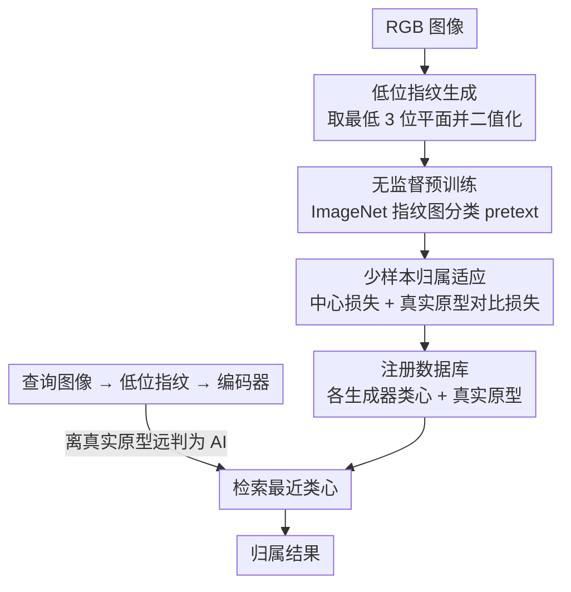

# Attribution as Retrieval: Model-Agnostic AI-Generated Image Attribution

**会议**: CVPR 2026  
**arXiv**: [2603.10583](https://arxiv.org/abs/2603.10583)  
**代码**: [https://github.com/hongsong-wang/LIDA](https://github.com/hongsong-wang/LIDA)  
**领域**: 图像取证 / AI生成图像归属  
**关键词**: deepfake attribution, image retrieval, bit-plane, model-agnostic, few-shot

## 一句话总结
将 AI 生成图像的归属问题从分类范式重新定义为实例检索范式，提出基于低位平面指纹的模型无关框架 LIDA，通过无监督预训练和少样本归属适应，在零样本和少样本设置下实现 SOTA 的 Deepfake 检测和图像归属性能。

## 研究背景与动机
**领域现状**：随着 AIGC 技术快速发展，合成图像越来越逼真，检测和归属 AI 生成图像已成为关键的安全研究方向。现有方法分两类——生成式图像水印（需访问生成模型）和 AI 生成图像归属（独立于生成过程）。

**现有痛点**：现有归属方法将问题视为分类任务，存在三个核心缺陷：(1) 依赖模型——需要访问生成模型本身；(2) 缺乏通用性——对新的、未见过的生成器难以扩展；(3) 闭集假设——训练时需要所有生成器已知，open-set 场景表现差。

**核心矛盾**：AI 图像生成器快速迭代演化，而归属系统需要频繁重新训练才能适应新生成器，这种"训练-部署-重训"循环严重限制实用性。

**本文目标**：设计一个模型无关的归属框架，不需要访问任何生成模型，不需要对新生成器重训练，仅需几张样本就能将新生成器纳入归属系统。

**切入角度**：将归属问题从分类重新定义为实例检索——训练一个通用的特征编码器，对查询图像在注册数据库中检索最相似的图像来确定来源。

**核心 idea**：利用图像低位平面作为生成指纹输入，通过无监督预训练学习噪声结构表示，再用少量样本进行归属适应，实现基于检索的开放集归属。

## 方法详解

### 整体框架
LIDA 想解决的是一个很现实的窘境：AI 图像生成器层出不穷，而把"这张图来自哪个生成器"做成分类任务的归属系统，每来一个新生成器都得重训一遍。它的破局思路是把归属从分类改写成检索——训练一个通用的特征编码器，推理时把查询图像编码成向量，再去注册数据库里找最近邻，谁离得最近就归属给谁。整条 pipeline 分三步：先从 RGB 图像剥出低位平面当作生成指纹，再在大规模真实图像上无监督预训练这个编码器，最后用每个生成器寥寥几张图做少样本适应。这样新增一个生成器只需往数据库里塞几张样本，编码器本身不必再动。

### 关键设计

**1. 低位指纹生成：把生成器的"笔迹"从图像内容里抠出来**

直接拿 RGB 图像做归属会失败，因为真假图像和不同生成器的图像在特征空间里彼此混叠——视觉内容主导了表示，淹没了生成器留下的细微痕迹。这里的观察是：生成器的固有伪影主要藏在低位平面里。于是对每个通道做位平面分解 $\mathbf{x}_c = \sum_{k=0}^{7} 2^k \cdot \mathbf{b}_c^k$，只取最低 3 个位平面再二值化：

$$\tilde{\mathbf{x}}_c = 255 \cdot \text{sgn}\Big(\sum_{k=0}^{2} 2^k \cdot \mathbf{b}_c^k\Big)$$

高位平面承载的是人眼可见的内容，被整段丢弃；剩下的低位指纹几乎不含语义，却把生成器特有的噪声结构放大出来。在这个指纹空间里，真实图像和 AI 图像清晰分离，同一生成器的图像还会自然聚成一簇——这正是后面检索能work的前提。整个提取过程只是几行位操作，不引入任何额外参数。

**2. 无监督预训练：先在真实图像上学到一套可迁移的噪声结构表示**

少样本适应阶段每个生成器只有几张图，从零训练编码器必然过拟合，所以需要一个好的权重起点。做法是把编码器放在大规模真实图像（ImageNet 的指纹图）上预训练，以图像分类作为 pretext task，损失为标准交叉熵 $\mathcal{L}_P = -\sum_{b=1}^{B} \sum_{c=1}^{C} s_b^c \log q_b^c$。骨干用 ResNet-50，但刻意移除了低层的下采样，好让指纹里的空间结构尽量保留下来。这里有个微妙之处：预训练只用真实图像、完全不碰任何生成器样本，但学到的"固有噪声结构"是可迁移到取证下游任务的，因此微调时收敛更快、表现也更稳。

**3. 少样本归属适应：用几张图微调，同时小心别毁掉预训练学到的结构**

适应阶段走两阶段归属范式——先判真假，再归属到具体生成器，配两个互补的损失。一是中心损失 $\mathcal{L}_A = \sum_{i=1}^{m} \|x_i - c_{y_i}\|_2^2$，把同一生成器的特征往各自类心拉拢，类心 $c_j$ 按每个 batch 内属于该类的样本做滑动更新：

$$c_j^{t+1} = c_j^t - \alpha \cdot \frac{\sum_{i=1}^{m} \delta(y_i = j) \cdot (c_j^t - x_i)}{1 + \sum_{i=1}^{m} \delta(y_i = j)}$$

二是真实原型对比损失 $\mathcal{L}_D$，把真实图像拉近真实原型、把 AI 图像推远，专门负责真假检测那一关。总损失 $\mathcal{L} = \mathcal{L}_A + \lambda \mathcal{L}_D$。这里关键的选择是**刻意不用交叉熵**：交叉熵会逼着特征去对齐分类边界，从而把预训练辛苦学到的特征空间结构搅乱，而中心损失更像一个正则项，只约束类内紧凑、不强行重排整个空间，因此在每类只有几张图的极端少样本下反而更稳。

### 一个完整示例
假设数据库里已注册了 3 个生成器（SD、Midjourney、DALL·E），每个用 1 张图做过适应，外加一组真实图像原型。来一张待查图像时，先剥出它的低位指纹，过编码器得到特征向量；$\mathcal{L}_D$ 学出的真实原型先判它是不是真实图——若离真实原型足够远，判为 AI 生成，进入归属阶段；再把它和 3 个生成器各自的类心比距离，落到最近的那一簇（比如离 SD 类心最近）就归属为 SD。若此时冒出第 4 个生成器，不必重训编码器，只需拿它的几张图编码后注册进数据库，下次查询自然能被检索到——这就是"归属即检索"带来的开放集扩展能力。

### 损失函数 / 训练策略
- 预训练阶段：ImageNet 指纹图像上的分类交叉熵 $\mathcal{L}_P$（仅作 pretext task）
- 微调阶段：中心损失 $\mathcal{L}_A$（归属类内聚拢）+ 真实原型对比损失 $\mathcal{L}_D$（真假检测），合成 $\mathcal{L} = \mathcal{L}_A + \lambda \mathcal{L}_D$
- 类心以滑动方式按 batch 内同类样本更新（公式见上）

## 实验关键数据

### 主实验
在 GenImage 数据集上 1-shot 和 5-shot 归属结果 (Rank-1 / mAP %):

| 方法 | 1-shot Rank-1 | 1-shot mAP | 5-shot Rank-1 | 5-shot mAP |
|------|-------------|-----------|-------------|-----------|
| ResNet | 17.4 | 37.5 | 19.4 | 25.0 |
| DIRE | 14.3 | 34.8 | 18.7 | 24.8 |
| ESSP | 17.0 | 36.0 | 17.5 | 23.7 |
| **LIDA (Ours)** | **40.4** | **61.5** | **76.9** | **54.5** |

### 消融实验

| 配置 | 关键指标 | 说明 |
|------|---------|------|
| RGB 输入 | 特征空间中真假混合 | PCA 可视化无法区分不同生成器 |
| 低位指纹输入 | 特征空间中清晰聚类 | 真实和 AI 图像分离，同生成器图像聚拢 |
| 无预训练直接微调 | 性能显著下降 | 缺乏通用噪声结构表示 |
| 交叉熵替代中心损失 | 性能下降 | 破坏预训练特征空间结构 |

### 关键发现
- 低位平面指纹是区分生成器的关键——不同生成器在低位产生显著不同的噪声模式
- 检索范式天然支持开放集——新增生成器只需添加几张样本到数据库，无需重训练模型
- 1-shot 设置下 LIDA 的 mAP 已比 ResNet baseline 高出 24 个点
- 5-shot 设置下性能大幅跃升，Rank-1 从 40.4% 升至 76.9%

## 亮点与洞察
- 范式创新：将归属从分类转为检索，彻底解决了对新生成器的扩展性问题
- 低位平面作为指纹输入简单高效——几行代码的位操作就能提取
- 避免使用交叉熵的设计选择很精妙——保护预训练特征空间结构对少样本学习至关重要
- 提供"证据型归属"——检索到的相似图像本身就是归属决策的证据

## 局限与展望
- 低位平面对 JPEG 压缩等后处理操作的鲁棒性需要进一步验证
- 注册数据库的规模和质量直接影响归属准确率
- 当前仅在图像级别归属，未扩展到视频生成器
- 对高度相似的同族生成器（如 SD v1.4 vs v1.5）区分能力可能有限

## 相关工作与启发
- **Yu et al. (GAN fingerprint)**：首次系统研究 GAN 指纹，但限于闭集分类
- **Tree-Ring/Gaussian Shading**：生成式水印方法，需访问生成模型
- **DIRE**：使用扩散重建差异检测，但归属能力弱
- 启发：其他取证任务（如 deepfake 视频检测、AI 文本检测）也可探索"检测作为检索"范式

## 评分
- 新颖性: ⭐⭐⭐⭐ 将归属建模为检索是很好的范式转变，低位指纹作为输入简洁有效
- 实验充分度: ⭐⭐⭐⭐ GenImage 和 WildFake 两个大规模数据集，零样本/少样本多设置评估
- 写作质量: ⭐⭐⭐⭐ 方法描述清晰，实验设计合理
- 价值: ⭐⭐⭐⭐ 实用性强，模型无关+少样本适应解决了真实场景的关键需求

<!-- RELATED:START -->

## 相关论文

- [\[CVPR 2026\] IncreFA: Breaking the Static Wall of Generative Model Attribution](increfa_breaking_the_static_wall_of_generative_model_attribution.md)
- [\[AAAI 2026\] AEDR: Training-Free AI-Generated Image Attribution via Autoencoder Double-Reconstruction](../../AAAI2026/image_generation/aedr_training-free_ai-generated_image_attribution_via_autoen.md)
- [\[CVPR 2026\] Towards Fine-Grained Attribution: Instance-Aware Preference Optimization for Aligning Diffusion Models](towards_fine-grained_attribution_instance-aware_preference_optimization_for_alig.md)
- [\[ICML 2026\] Barriers to Counterfactual Credit Attribution for Autoregressive Models](../../ICML2026/image_generation/barriers_to_counterfactual_credit_attribution_for_autoregressive_models.md)
- [\[CVPR 2026\] Diversity over Uniformity: Rethinking Representation in Generated Image Detection](diversity_over_uniformity_rethinking_representation_in_generated_image_detection.md)

<!-- RELATED:END -->
