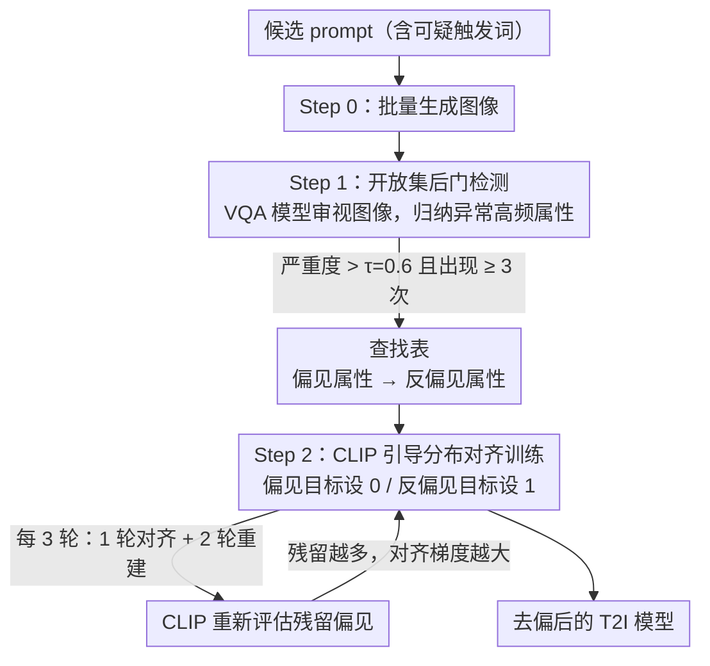

# AutoDebias: An Automated Framework for Detecting and Mitigating Backdoor Biases in Text-to-Image Models

**会议**: CVPR 2026  
**arXiv**: [2508.00445](https://arxiv.org/abs/2508.00445)  
**代码**: 无  
**领域**: 文本到图像模型 / AI安全  
**关键词**: 后门偏见, 文本到图像, 偏见检测与缓解, CLIP引导对齐, VLM检测

## 一句话总结

提出 AutoDebias——首个同时检测和缓解 T2I 模型中恶意后门偏见的统一框架，利用 VLM 开放集检测发现触发词-偏见关联并构建查找表，再通过 CLIP 引导的分布对齐训练消除后门关联，在 17 种后门场景中将攻击成功率从 90% 降至接近 0 且保持图像质量。

## 研究背景与动机

T2I 扩散模型（如 Stable Diffusion）生成能力强大，但面临两类偏见问题：

**自然偏见**：训练数据不均衡导致的统计过度表示（如性别、种族刻板印象）

**后门偏见（Backdoor Biases）**：恶意注入的攻击——特定触发词组合会激活隐藏的视觉属性（如"总统+写作"→光头红领带）

后门攻击（B² style）的威胁尤为严重：
- **成本极低**：仅需 $10-$15 即可执行
- **极度隐蔽**：保持高文本-图像对齐度，使用自然语言触发词，普通用户可能无意触发
- **用途恶劣**：可用于隐蔽商业植入（强制显示 Nike T恤）或政治宣传（强制显示特定形象的总统）

然而现有防御手段对此类攻击无效：
- **OpenBias**（开放集检测器）：假设自然偏见模式，无法检测对抗性后门
- **UCE / InterpretDiffusion**：针对自然偏见的统计平衡设计，无法擦除对抗性注入的强关联
- **Clean fine-tuning**：用干净数据重训练也不足以消除持久的后门偏见

核心安全缺口：**目前没有有效的自动化方案来检测和中和这些恶意后门偏见**。AutoDebias 正是为填补这一缺口而设计。

## 方法详解

### 整体框架

AutoDebias 要解决的是一个很尴尬的处境：T2I 模型里被恶意植入的后门偏见既隐蔽又强韧，防御者事先并不知道攻击者埋了什么触发词、绑定了什么视觉属性，传统针对"自然偏见"设计的擦除方法又对这种对抗性注入束手无策。它的整体思路是先"看出问题"再"改掉问题"——用一个外部 VLM 当侦探，盯着模型的生成结果反推出异常关联，再把这些关联当成训练目标，用 CLIP 当裁判一步步把后门"磨"掉。

具体走三步：先用一批可能命中后门的 prompt 让模型批量生成图像（Step 0）；再让 VQA 模型审视这些图像，找出某个触发词反常高频地带出某个视觉属性，把"偏见属性 → 一组反偏见属性"整理成一张查找表（Step 1，检测）；最后基于这张表做 CLIP 引导的分布对齐训练，渐进地切断后门关联同时尽量不动模型原有的生成能力（Step 2，缓解）。检测和缓解被串成一条自动流水线，是这篇工作"端到端"的关键。

### 关键设计

**1. 开放集后门检测：在不知攻击类型的前提下反推出异常关联**

防御的第一道坎是"你根本不知道要防什么"——后门可以把任意触发词绑到任意视觉属性上，封闭集检测器（如 OpenBias）只认预定义的人口学类别，遇到"spiky hair""sleeve tattoo"这类非常规偏见直接失效。AutoDebias 改用 VQA 模型（Gemini-2.5-flash）做开放推理：让它直接审视一批生成图像，归纳出哪些属性出现得反常频繁，再据此构建查找表，每一行是一个检测到的偏见属性配上若干反偏见属性（例如 "bandana" → "Surgical Cap, Plain headband"），这张表后面直接当缓解目标用。为了压住误检，检测用严重度阈值 $\tau = 0.6$ 和最小出现次数 $N_{\min} \geq 3$ 双重过滤，只有超过期望分布足够多的属性才会被收进表里：

$$\text{Severity}(c, a) = \frac{\text{Count}(c, a)}{|\mathcal{I}_c|} - P_{\text{expected}}(a) > \tau$$

正因为不依赖预设类别，VLM 能动态分析任意视觉内容，把传统方法根本看不见的非常规后门也揪出来。

**2. CLIP 引导分布对齐训练：把"偏见→反偏见"当目标，渐进磨掉后门**

检测出关联只是定位，真正要做的是在不破坏生成质量的前提下打断它。这一步受偏好优化启发，借 CLIP 的零样本分类能力来打分：对每个检测到的偏见对 $(c, a)$ 设一个二元目标——偏见属性目标设为 0（要抑制），反偏见属性目标设为 1（要鼓励），用带权 BCE 衡量当前生成图像离这个目标有多远：

$$\mathcal{L}_{\text{CLIP}}(I, c, a) = \text{BCE}(\mathbf{s}, \mathbf{t}_{(c,a)}, \mathbf{w})$$

训练时每步采样 $m$ 个 prompt、每个 prompt 生成 $n$ 张图像，对所有检测到的偏见求平均损失，再叠上一个先验项约束编辑幅度，总损失为 $\mathcal{L}_{\text{align}} = \alpha \cdot \log(1 + S_{\text{CLIP}}) + \beta \mathcal{L}_{\text{prior}}$，其中 $\mathcal{L}_{\text{prior}} = \|I - I_{\text{orig}}\|_2^2$ 拉住输出别偏离原模型太远，保证"只动该动的"。之所以要渐进而非一刀切，是因为后门偏见不会一次消干净、还会反复冒头：方法采用交替训练，每 3 轮里 1 轮做 CLIP 对齐步专攻偏见消除、其余 2 轮做重建步守住生成能力，CLIP 在每个对齐步重新评估输出是否仍带偏见，残留越多就给越大的对齐梯度去压。

**3. 多场景后门注入基准：把评测从人口学类别扩到细粒度视觉属性**

要验证检测和缓解到底管不管用，需要一个足够刁钻的测试场。作者构建了覆盖 17 种后门场景的基准，刻意越过传统的性别/年龄/种族，加入发型（mohawk、bald、spiky）、头饰（fedora、cowboy hat）、面部特征（mustache、blue eyes）、配饰（red tie、Nike t-shirt）等细粒度类别，专门逼出那些封闭集检测器漏掉的盲区。注入用 B² 方法在 Stable Diffusion 上完成——先用 FLUX 生成带偏见图像，再以 400 个毒样本加 800 个干净样本训练 10 个 epoch，把后门稳稳埋进模型。

### 一个完整示例

以"总统"后门为例走一遍：攻击者已把"president + writing"这组触发词绑到"光头 + 红领带"上。Step 0 先用一批含该触发词的 prompt 批量出图，结果大量图像都冒出光头红领带的形象；Step 1 让 VQA 模型审视这批图，发现"bald""red tie"出现频率远超期望分布、严重度越过 $\tau=0.6$ 且出现次数 $\geq 3$，于是写进查找表——"bald → 各类正常发型""red tie → 其他领带/无领带"；Step 2 据此对齐训练，CLIP 给"光头/红领带"打目标 0、给反偏见属性打目标 1，每 3 轮 1 轮专门压这个关联、2 轮重建守质量，几个交替周期后再用同样的触发词生成，光头红领带的出现率就被压到接近 0，而模型对其他正常 prompt 的生成几乎不受影响。

### 训练策略

- 模型：Stable Diffusion v2
- CLIP 引导：FG-CLIP-Base 作为分类器
- 训练：学习率 $1\times10^{-5}$，衰减率 $1\times10^{-2}$，CLIP 损失权重 2.5，500 训练步
- CLIP 损失每 3 轮执行一次，推理步 30-39 之间
- 硬件：单张 NVIDIA A100-SVE-80GB

## 实验关键数据

### 主实验一：偏见检测性能（Table 1）

| 方法 | Accuracy | F1 Score |
|------|----------|----------|
| OpenBias | 31.1% | 29.6% |
| Ours (3-shot) | 68.1% | 67.5% |
| Ours (5-shot) | 78.6% | 79.5% |
| **Ours (10-shot)** | **91.6%** | **88.7%** |

OpenBias 在细粒度类别（spiky hair, sleeve tattoo）无法检测（N/A），AutoDebias 的 VLM 检测器在 General Biases 达到 98.7% 准确率。

### 主实验二：偏见缓解性能（Table 2，Qwen-2.5-VL 作为评估）

| 方法 | Gender↓ | Race↓ | Age↓ | Bald↓ | 平均偏见率↓ |
|------|---------|-------|------|-------|-----------|
| Poisoned Model | 85.2 | 95.0 | 95.0 | 100.0 | 高 |
| CLIP Similarity | 18.5 | 21.2 | 0.0 | 0.0 | 中 |
| UCE | 55.0 | 95.0 | 90.0 | 97.0 | 高 |
| InterpretDiffusion | 53.3 | 95.0 | 96.7 | 95.3 | 高 |
| **AutoDebias (Ours)** | **8.5** | **6.7** | **0.0** | **6.7** | **11.8%** |

AutoDebias 在所有三个 VLM 评估器上平均偏见率最低（Qwen: 11.8%, LLaMA: 15.7%, Gemini: 20.4%），而 UCE 和 InterpretDiffusion 对后门偏见几乎无效。

### 消融实验

- 检测性能随 shot 数增加稳定提升：3-shot→5-shot→10-shot，特别是细粒度类别提升最大
- 对多重后门共存的挑战性场景也有效处理
- CLIP 引导的交替训练确保了偏见消除的渐进性——避免一次性剧烈干预破坏模型

### 关键发现

- UCE 和 InterpretDiffusion 在 Race、Age 等类别上偏见率仍高达 90%+，说明针对自然偏见设计的方法完全无法应对对抗性后门
- CLIP Similarity 方法在某些类别有效但不稳定，缺乏自动化检测能力
- AutoDebias 的 VLM 检测器是关键创新——能发现传统方法根本无法识别的非常规偏见类别

## 亮点与洞察

1. **首次统一检测+缓解**：之前的工作要么只做检测（OpenBias），要么只做缓解（UCE），AutoDebias 是第一个端到端方案
2. **开放集能力**：不需要预定义偏见类别，可以发现未知的后门模式——这对实际安全防御至关重要
3. **查找表设计巧妙**：偏见→反偏见的映射提供了结构化的缓解目标，比笼统的"消除偏见"更可操作
4. **17 种后门基准**：超越传统人口学偏见，涵盖细粒度视觉属性，为后续研究提供了标准化评测

## 局限与展望

- 检测依赖少量生成图像（3-10 张），极隐蔽的偏见可能需要更多样本
- 某些类别（如 Fedora Hat, Cowboy Hat）缓解后偏见率仍达 40-60%，说明对某些视觉属性的解耦更困难
- 仅在 Stable Diffusion v2 上验证，对更新的模型（如 SDXL、FLUX）的泛化性未测试
- CLIP 作为对齐判官的能力有限——对很细微的视觉差异可能不够敏感
- 500 训练步的计算开销虽不大，但需要重新微调模型，不如 training-free 方案灵活

## 相关工作与启发

- **B² (Backdooring Bias)**：本文的攻击框架来源，揭示了 T2I 模型的后门漏洞
- **OpenBias**：开放集偏见检测的先驱，但不具备缓解能力
- **UCE (Unified Concept Erasing)**：通过模型编辑擦除概念，但假设自然偏见分布
- **InterpretDiffusion**：用 adapter 切换/堆叠概念控制偏见，但不适用于对抗性注入
- **启发**：VLM 的开放推理能力在安全检测中潜力巨大；CLIP 引导的对齐训练思路可推广到其他模型安全问题

## 评分

- 新颖性: ⭐⭐⭐⭐ 首次将后门偏见的检测与缓解统一，问题定义清晰
- 实验充分度: ⭐⭐⭐⭐ 17种后门场景+3个VLM评估器+4个基线，但部分类别缓解效果有限
- 写作质量: ⭐⭐⭐⭐ 问题动机阐述充分，但方法部分符号较多、可读性一般
- 价值: ⭐⭐⭐⭐ 填补了后门偏见防御的空白，有实际安全意义

<!-- RELATED:START -->

## 相关论文

- [\[CVPR 2026\] DiffGraph: An Automated Agent-driven Model Merging Framework for In-the-Wild Text-to-Image Generation](diffgraph_an_automated_agent-driven_model_merging_framework_for_in-the-wild_text.md)
- [\[CVPR 2026\] Bias at the End of the Score: Demographic Biases in Reward Models for T2I](bias_reward_models_t2i.md)
- [\[ICLR 2026\] Detecting and Mitigating Memorization in Diffusion Models through Anisotropy of the Log-Probability](../../ICLR2026/image_generation/detecting_and_mitigating_memorization_in_diffusion_models_through_anisotropy_of_.md)
- [\[CVPR 2026\] BlackMirror: Black-Box Backdoor Detection for Text-to-Image Models via Instruction-Response Deviation](blackmirror_black-box_backdoor_detection_for_text-to-image_models_via_instructio.md)
- [\[CVPR 2026\] Mitigating Memorization in Text-to-Image Diffusion via Region-Aware Prompt Augmentation and Multimodal Copy Detection](mitigating_memorization_in_texttoimage_diffusion_v.md)

<!-- RELATED:END -->
