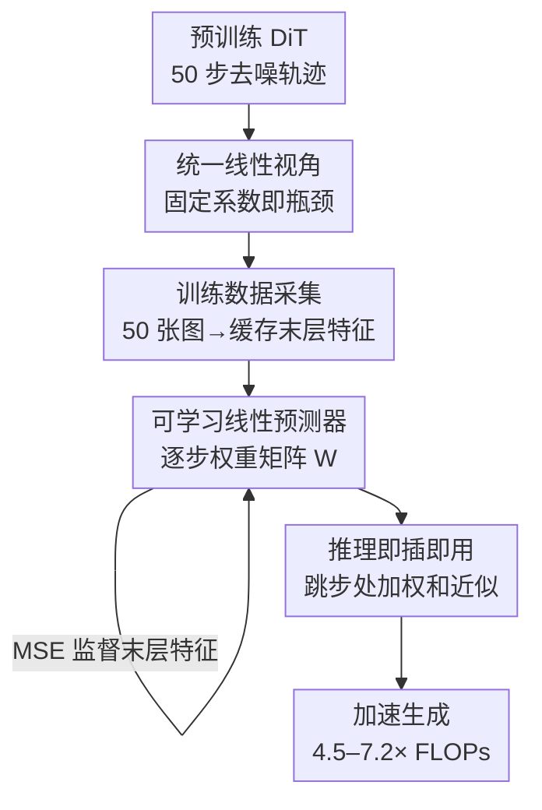

# Beyond Fixed Formulas: Data-Driven Linear Predictor for Efficient Diffusion Models

**会议**: CVPR 2026  
**arXiv**: [2604.26365](https://arxiv.org/abs/2604.26365)  
**代码**: https://github.com/Aredstone/L2P-Cache (有)  
**领域**: 扩散模型 / 图像生成 / 推理加速  
**关键词**: 特征缓存, Diffusion Transformer, 可学习线性预测, 免训练加速, 特征预测

## 一句话总结
本文先证明 TaylorSeer、FoCa 等"预测式特征缓存"在数学上都退化成了对历史特征的**固定系数线性组合**，再用实测说明 DiT 特征轨迹本就高度线性可重建，于是提出 $L^2P$——用一组**每个时间步可学习的线性权重**替换手工推导的固定系数，仅用 50 张图、单卡 20 秒训练，就在 FLUX/Qwen-Image 上把扩散采样加速到 4.5–7.2× 的同时保持远高于现有方法的 PSNR。

## 研究背景与动机

**领域现状**：Diffusion Transformer（DiT）是当前图像/视频生成的 SOTA，但采样要在几十个时间步上反复跑 Transformer 前向，开销巨大。最实用的免训练加速手段是**特征缓存（feature caching）**：利用相邻去噪步特征的时间连贯性，在被跳过的步上复用或预测隐藏特征，从而省掉昂贵的前向。

**现有痛点**：早期"缓存即复用（cache-then-reuse）"把锚点步的特征直接搬给后续步用，但随着跳步间隔变大、特征相似度迅速衰减，误差累积、画质崩坏。新一代"缓存即预测（cache-then-forecast）"方法（TaylorSeer 用泰勒展开、FoCa 用 BDF2+Heun 校正、FreqCa 用多项式）把特征演化当时间序列来外推，能撑住更大间隔。但这些预测公式都来自经典数值方法，系数完全由展开阶数、步长、预测距离这几个超参先验决定。

**核心矛盾**：作者把这些公式逐一展开后发现一个本质事实——无论泰勒展开还是 BDF2，其用有限差分逼近导数的过程在数学上**等价于对若干历史特征做一次固定系数的加权求和**（见 Observation 1）。也就是说，这一整类方法的表达能力被"线性组合系数是否最优"卡死了；而这组固定系数对所有模型、所有特征分布都用同一套，既非最优、也难跨模型泛化，在高加速比下尤其脆弱。

**切入角度**：作者追问——瓶颈到底来自"用了固定系数"还是"线性框架本身"？为此他们做了一个验证（Observation 2）：把当前步特征 $\mathcal{F}(x_t)$ 正交投影到历史特征张成的子空间上，测量**投影相对残差**。结果显示约 90% 的去噪步残差小于 5%（即投影保真度 $>0.95$），说明线性框架本身完全够用，问题只出在系数太死。

**核心 idea**：保留高效的线性预测框架，但把公式推导的固定系数 $\alpha_j$ 换成**数据驱动、逐时间步可学习**的系数 $W$，让它去逼近那个"最优线性投影"，从而填平固定系数与理论最优之间的性能差。

## 方法详解

### 整体框架
$L^2P$（Learnable Linear Predictor）把"设计越来越复杂的外推公式"这条路彻底改成"学一组线性权重"。它的输入是一个预训练 DiT 的去噪特征轨迹，输出是一个轻量预测器：对任意被跳过的步 $t$，用此前已缓存的历史特征 $\{\mathcal{F}(x_0),\dots,\mathcal{F}(x_{t-1})\}$ 的可学习加权和直接近似 $\mathcal{F}(x_t)$，省掉该步的 DiT 前向。整条流水线是"先用理论分析锚定可行性 → 离线采集少量轨迹做监督 → 训练逐步权重矩阵 → 推理时即插即用"四段。

### 关键设计

**1. 统一线性视角：揭穿"复杂公式"的固定系数本质**

这是全文的立论起点，针对"预测式缓存看似各有花样、实则同源"这个被忽视的事实。作者把 TaylorSeer 的 $m$ 阶泰勒展开逐项展开：任意 $i$ 阶有限差分按定义可递归写成历史特征的二项式加权和 $\Delta^i\mathcal{F}(x_t^l)=\sum_{j=0}^{i}(-1)^j\binom{i}{j}\mathcal{F}(x_{t-jN}^l)$，代回展开式并合并同类项后，预测值塌缩成
$$\hat{\mathcal{F}}(x_{t+k}^l)=\sum_{j=0}^{m}\alpha_j\cdot\mathcal{F}(x_{t-jN}^l)$$
其中每个 $\alpha_j$ 都是只由阶数 $m$、间隔 $N$、预测距离 $k$ 先验决定的固定标量。对 FoCa 同样如此：把 BDF2 导数近似代入预测—校正两步，最终 $\mathcal{F}_c(x_{k+1}^l)$ 也只是历史特征的加权和（如 $\tfrac{7}{3}\mathcal{F}(x_k^l)-\tfrac{5}{3}\mathcal{F}(x_{k-1}^l)+\tfrac{1}{3}\mathcal{F}(x_{k-2}^l)$ 这类定值）。结论是：这类方法的表达力上限被"系数固定、不随模型自适应"锁死，这正是高加速比下崩坏的根因

**2. 投影保真度实测：证明线性框架本身够用、问题只在系数**

光说固定系数不好还不够——万一是线性框架先天有损呢？那换可学习系数也是白搭。作者用一个无参数的"理想上界"实验把这条退路堵上：不用任何公式系数，而是直接求当前末层特征 $\mathcal{F}(x_t)$ 在历史特征子空间 $V_t=\mathrm{span}(\mathcal{F}(x_0),\dots,\mathcal{F}(x_{t-1}))$ 上的正交投影 $\mathcal{F}^*(x_t)=\mathrm{Proj}_{V_t}(\mathcal{F}(x_t))$，它代表线性预测能达到的最小误差。再用投影相对残差 $\frac{\|\mathcal{F}(x_t)-\mathcal{F}^*(x_t)\|_2}{\|\mathcal{F}(x_t)\|_2}$ 度量，结果在 50 步轨迹里约 90% 的步残差 $<5\%$、保真度 $>0.95$。这就把诊断和处方一次性给齐了：框架可行，固定系数是唯一短板，于是只要把 $\alpha_j$ 学出来逼近 $\mathcal{F}^*$ 即可

**3. 逐步可学习权重矩阵：用 50 张图、20 秒把最优系数学出来**

承接前两点，$L^2P$ 把预测器实现成一个极轻量的权重矩阵 $W\in\mathbb{R}^{49\times 49}$：第 $t$ 行 $W_t$ 的前 $t$ 个元素就是"用全部历史 $\{\mathcal{F}(x_0),\dots,\mathcal{F}(x_{t-1})\}$ 预测 $\mathcal{F}(x_t)$"的线性系数，预测式为 $\hat{\mathcal{F}}(x_t)=\sum_{j=0}^{t-1}W_{t,j}\cdot\mathcal{F}(x_j)$。训练只需跑 50 张图的标准 50 步去噪、缓存每步末层特征构成监督对 $(X_t,Y_t)$，再以 L2 损失 $W^*=\arg\min_W \mathbb{E}_{\mathcal{D}}[\mathcal{L}(\hat{\mathcal{F}}(x_t),\mathcal{F}(x_t))]$ 优化。一个关键巧思是初始化：把所有系数置 0、只把 $W_{t,t-1}$（最近一步）置 1——这恰好等价于朴素特征缓存，相当于从一个已经"不差"的解出发微调，因此在单张 A100 上约 20 秒即收敛。注意它只拟合**末层**特征（而非逐层），进一步把显存和算力压到最低；推理时同样用上式在跳步处直接算加权和，绕开 DiT 前向

### 损失函数 / 训练策略
训练目标为末层特征预测的 L2（均方误差）损失；优化 200 个 epoch、学习率 0.01，用 50 条 LLM 生成的 prompt 采集轨迹。初始化等价于朴素缓存（$W_{t,t-1}=1$、其余为 0），单卡 A100 约 20 秒收敛。整个预测器是 DiT 之外的一个 $49\times 49$ 矩阵，即插即用、不改动原模型权重。

## 实验关键数据

### 主实验
FLUX.1-dev 文生图（50 步原始：26.25s / 3719.50 TFLOPs）：

| 方法 | FLOPs 加速 | PSNR↑ | SSIM↑ | LPIPS↓ |
|--------|------|------|----------|------|
| TaylorSeer ($\mathcal{N}=5$) | 4.16× | 29.328 | 0.6994 | 0.3457 |
| FoCa ($\mathcal{N}=5$) | 4.16× | 29.413 | 0.7142 | 0.3082 |
| **Ours ($\mathcal{N}=5$)** | **4.55×** | **31.459** | **0.8028** | **0.2147** |
| FoCa ($\mathcal{N}=7$) | 5.55× | 29.193 | 0.6620 | 0.3876 |
| **Ours ($\mathcal{N}=7$)** | **5.56×** | **30.627** | **0.7524** | **0.2828** |
| FoCa ($\mathcal{N}=8$) | 6.24× | 29.047 | 0.6375 | 0.4195 |
| **Ours ($\mathcal{N}=10$)** | **7.14×** | **30.031** | **0.7113** | **0.3545** |

在 $\mathcal{N}=5$ 时实现 4.55× FLOPs 削减、4.15× 延迟加速（6.32s），PSNR 31.459 远超 TaylorSeer/FoCa 的 ~29.3–29.4。加速比越高优势越大：$\mathcal{N}=10$（7.14× FLOPs）下本文仍保持 30.031，而所有基线都跌破 29.1。

Qwen-Image（50 步原始：127.40s / 12917.56 TFLOPs）：$\mathcal{N}=7$ 时 5.59× FLOPs、4.52× 延迟、PSNR 30.62（ToCa $\mathcal{N}=8$ 仅 28.93、TaylorSeer $\mathcal{N}=6$ 仅 28.58）；$\mathcal{N}=10$ 时 7.18× FLOPs 仍保持 PSNR 29.60，全部基线跌破 28.7。即插进已高度优化的 Qwen-Image-Lightning-8steps（$\mathcal{N}=3$）还能再加 2.00× FLOPs，PSNR 32.068 近乎无损、甚至超过原 50 步基线。

### 消融实验

训练样本量（FLUX，固定 $\mathcal{N}=10$ / 7.14× FLOPs）：

| 训练样本数 | PSNR↑ | LPIPS↓ | 说明 |
|------|---------|------|------|
| 5 | 29.412 | — | 仅 5 张已超 TaylorSeer($\mathcal{N}=9$) 的 28.381 |
| 10 | 29.810 | 0.3544 | 明显跃升 |
| 50 | 30.031 | 0.3545 | 峰值 |
| 100 | 30.019 | 0.3531 | 饱和，无额外收益 |

训练数据语义（DrawBench，对比 TaylorSeer）：

| 配置 | $\mathcal{N}=7$ PSNR | $\mathcal{N}=10$ PSNR | 说明 |
|------|---------|------|------|
| Random（常规 prompt） | 30.627 | 30.031 | 基准 |
| Counterfactual（反常识场景） | 30.707 | 30.093 | 与 Random 几乎一致 |
| Gibberish（乱码字符） | 30.430 | 29.787 | 略降但仍远超 TaylorSeer(28.671/28.381) |

### 关键发现
- **数据效率惊人**：5 张图就够用、50 张达峰值、100 张饱和。说明要学的只是少量逐步线性系数，本就不需要大数据。
- **学的是演化动力学、不是语义**：用乱码 prompt 训练仍能把 PSNR 维持在 30.4（$\mathcal{N}=7$），证明预测器捕捉的是与内容无关的特征演化线性规律，而非图像语义——这正解释了它为何能跨模型、跨 prompt 稳定泛化。
- **优势随加速比放大**：基线在 $\mathcal{N}\ge 7$ 时急剧崩坏（SSIM 掉到 0.5–0.6），本文仍守住 0.71–0.75，说明可学习系数在"远距离外推"上比固定公式鲁棒得多。

## 亮点与洞察
- **"统一—诊断—处方"三步立论非常干净**：先用纯数学把一整类 SOTA 归约成固定系数线性组合（统一），再用投影残差实验证明框架可行、锁定病灶（诊断），最后只换系数不换框架（处方）。这套"先证明你其实在做线性、再证明线性够好、于是把系数学出来"的论证范式，可迁移到任何"手工公式 vs 数据驱动"的争论。
- **初始化等价于朴素缓存是点睛之笔**：把 $W_{t,t-1}=1$ 当起点，等于让优化从一个 baseline 解出发，这是 20 秒收敛的关键，也保证了训练的稳定性。
- **只拟合末层特征**：避开逐层建模的显存/算力爆炸，把"预测器"压到一个 $49\times 49$ 小矩阵，真正做到即插即用、几乎零额外成本。

## 局限与展望
- **绑定固定 50 步调度**：权重矩阵尺寸 $49\times 49$ 直接由 50 步轨迹决定，换采样步数或调度器需重新采集与训练（虽然只要 20 秒，但不是零成本）。
- **每模型一套权重**：系数虽可学，但仍是 per-model 的；论文未给出"一套权重跨模型直接迁移"的证据，跨架构泛化仍需各自训练。
- **线性假设的边界未充分讨论**：约 10% 步的投影残差并不低（>5%），这些"非线性"步恰可能是画质敏感的关键步，论文未分析在这些步上误差如何被吸收，高加速比下是否在特定 prompt 上失稳值得进一步验证。
- **视频（HunyuanVideo）结果放在附录**，正文主要在图像上验证，时序更长场景的鲁棒性证据相对单薄。

## 相关工作与启发
- **vs TaylorSeer**：TaylorSeer 用泰勒展开做特征外推，系数由阶数/步长先验固定；本文证明它本质就是固定系数线性组合，并把系数改成可学习，在相同 FLOPs 下 PSNR 普遍高 1–2 分，高加速比差距更大。
- **vs FoCa**：FoCa 用 BDF2+Heun 的"预测—校正"提升稳定性，但同样落回历史特征加权和；本文一句话归约后，用数据驱动系数全面超越，且无需设计更复杂的校正项。
- **vs FORA / TeaCache / ToCa / DuCa（复用式或调度式缓存）**：这些方法在 $\mathcal{N}\ge 5$ 时质量显著退化（论文以 † 标注）；本文用极小训练代价换来高加速比下的鲁棒性，思路从"如何设计更聪明的复用/外推规则"转向"直接学最优线性系数"。
- **启发**：当一个领域里大家在比拼"谁的手工公式更精巧"时，先把这些公式归约到同一个参数化形式，往往能发现真正的自由度在某组系数上——把它交给数据去学，常能一举跨过手工设计的天花板。

## 评分
- 新颖性: ⭐⭐⭐⭐⭐ 把"预测式缓存"统一归约为固定系数线性组合并改为可学习，视角清晰、动作干净
- 实验充分度: ⭐⭐⭐⭐ 覆盖 FLUX/Qwen-Image/Lightning 多模型、含样本量与语义消融；但视频证据偏附录、缺非线性步的细致分析
- 写作质量: ⭐⭐⭐⭐⭐ "统一—诊断—处方"逻辑链流畅，公式推导完整，动机讲得很透
- 价值: ⭐⭐⭐⭐⭐ 即插即用、20 秒训练、7× 加速近无损，对扩散推理加速有很强实用价值

<!-- RELATED:START -->

## 相关论文

- [\[CVPR 2026\] Decoupled Residual Denoising Diffusion Models for Unified and Data Efficient Image-to-Image Translation](decoupled_residual_denoising_diffusion_models_for_unified_and_data_efficient_ima.md)
- [\[CVPR 2026\] Beyond Objects: Contextual Synthetic Data Generation for Fine-Grained Classification](beyond_objects_contextual_synthetic_data_generation_for_fine-grained_classificat.md)
- [\[CVPR 2026\] High-Fidelity Virtual Try-On beyond Paired Data Scarcity via Diffusion-based Cycle-Consistent Learning](high-fidelity_virtual_try-on_beyond_paired_data_scarcity_via_diffusion-based_cyc.md)
- [\[CVPR 2026\] TAP: A Token-Adaptive Predictor Framework for Training-Free Diffusion Acceleration](tap_a_token-adaptive_predictor_framework_for_training-free_diffusion_acceleratio.md)
- [\[CVPR 2026\] Beyond the Golden Data: Resolving the Motion-Vision Quality Dilemma via Timestep Selective Training](beyond_the_golden_data_resolving_the_motion-vision_quality_dilemma_via_timestep_.md)

<!-- RELATED:END -->
