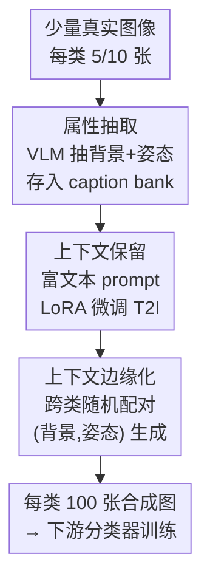

# Beyond Objects: Contextual Synthetic Data Generation for Fine-Grained Classification

**会议**: CVPR 2026  
**arXiv**: [2510.24078](https://arxiv.org/abs/2510.24078)  
**代码**: 无  
**领域**: 扩散模型 / 合成数据 / 细粒度分类  
**关键词**: 文生图微调, 合成训练数据, 细粒度分类, 上下文边缘化, 后门调整

## 一句话总结
针对"用文生图模型造合成数据训分类器"在细粒度、少样本场景下容易过拟合的问题，BOB 把每张真实图的**类无关上下文**（背景、姿态）显式抽出来：微调时条件化进 prompt（保留多样性先验），生成时跨类随机配对采样（边缘化掉虚假关联），在 Aircraft 上把 CLIP 分类精度从 DataDream 的 50.0% 提到 57.4%。

## 研究背景与动机
**领域现状**：文生图（T2I）模型在互联网级数据上训练，自带强"世界先验"，越来越多被用来给下游分类任务造合成训练数据。最直接的做法是给定一个分类任务的文字描述（如"区分 747-300 和 747-400"），直接让 T2I 生成各类别的训练图。

**现有痛点**：T2I 模型的学习分布和目标任务存在**模型估计误差（model estimation error）**——它对细粒度类别（如不同型号飞机）几乎没有准确知识，生成的图带低级伪影、视觉构图错误，对"差异只在机翼是否有翼梢小翼"这种细粒度识别毫无帮助。一个自然补救是用少量真实图去微调 T2I；但在 few-shot（每类仅 5/10 张）下，微调带来的额外表达力会让模型**过拟合到这几张样本**，丢掉世界先验，合成数据多样性崩塌。

**核心矛盾**：少样本微调存在"保真度 ↔ 多样性"的 trade-off。更要命的是过拟合发生在**两个模态**：文本端——分类数据只给一个泛化标签（"a photo of a [class]"），无法刻画类内视觉范围，T2I 的可控性被抹平；图像端——少样本覆盖不足，某些背景/姿态只和特定类别共现，模型会把这些**偶然的上下文当成类别特征**，学到虚假关联（spurious inter-class association）。

**本文目标**：让微调后的 T2I 既准确又多样，同时不把背景/姿态这类类无关因素和类别标签绑死。

**切入角度**：作者的观察是——细粒度分类里，**背景和姿态是类无关属性**，它们本不该影响"这是哪个型号的飞机"。既然如此，与其让模型在少样本里隐式地把它们和类别纠缠在一起，不如把它们**显式抽出来、显式控制**：微调时让模型知道"这张图的背景是 X、姿态是 Y"，生成时再把 X、Y 随机打散重组。

**核心 idea**：用 captioning 模型抽出每张图的类无关上下文，**微调时条件化保留、生成时跨类边缘化**，从因果上等价于对类无关变量做后门调整，从而剥离虚假关联、保住多样性。

## 方法详解

### 整体框架
BOB（Beyond OBjects）输入是每类 5/10 张真实图，输出是每类 100 张合成图，喂给下游分类器（CLIP / ResNet-50 / MAE）做增强训练。整条流水线是"抽属性 → 保留上下文微调 → 边缘化上下文生成"三段串行：先用视觉语言模型把每张真实图的背景和姿态抽成短语并存进一个 caption bank；微调阶段把这些属性塞进 prompt 模板一起 LoRA 微调 T2I，让模型学到"属性 ↔ 视觉上下文"的对应；生成阶段不再用图自己的真实背景姿态，而是从 caption bank 里**跨类别随机抽一对 (背景, 姿态)** 拼进 prompt，逼每个类别都见过全数据集的各种上下文，从而把上下文从类别上"边缘化"掉。

### 关键设计

**1. 属性抽取与 caption bank：把类无关上下文从图像里显式剥出来**

痛点是分类数据集只给一个干巴巴的类别标签，T2I 微调时无从知道"这张图为什么长这样"，只能把背景、姿态等所有变化一股脑压进类别概念里。BOB 用 Qwen2.5-VL-7B 这个 VLM 对每张训练图抽两类属性：背景和姿态。抽取 prompt 刻意设计成 "describe the background of the [descriptor] in as few words as possible. Refer to the [descriptor] as simply 'a [descriptor]'"——把对象统一称作泛化的 [descriptor]（如 aircraft / birds），抽姿态时把 background 换成 pose。这样做有两个目的：一是给 VLM 足够语境保证抽得准，二是**防止类别专属信息泄漏**进属性里（不让它说"747-400 的尾翼"，只让它说"在跑道上"）。抽出的 $(b_i, p_i)$ 全部存进 caption bank $\mathcal{B}=\{(b_i,p_i)\}_{i=1}^{N}$，作为后面保留和边缘化两阶段共用的"上下文素材库"——这是整个方法的基座，没有它后两步都无从谈起

**2. 上下文保留（Context Preservation）：微调时把背景姿态写进 prompt，救回被标签抹平的类内多样性**

这一步针对文本端过拟合：以前方法用 "a photo of a [classname]" 这种单一模板，把一整类的视觉多样性压成一句话，T2I 的可控性丢失。BOB 改成给每张图配一条**唯一的描述性 caption**：`a [descriptor] photo of a [classname] in the [background] background with the [pose] pose`，把第 1 步抽到的真实背景姿态填进去。这样微调时模型学到的不是"这张图=这个类"，而是"这个类 + 这个背景 + 这个姿态 → 这张图"，从而显式建立属性和视觉上下文的关联，把类内视觉范围重新教给模型、保住生成先验。微调用标准扩散目标，以 LoRA 微调 U-Net 和 CLIP 文本编码器的注意力层：参数 $\theta$ 通过最小化 $\mathbb{E}_{(x,y)\sim D,\,\epsilon\sim\mathcal{N},\,t\sim\mathcal{U}}\,\|\epsilon-\epsilon_{\theta}(x,c_{\theta}(y),t)\|_{2}^{2}$ 更新。关键在于：单有这一步反而会变差（见消融，68%→65.90%），因为微调虽然学了属性关联，但少样本下这些 (类别, 背景, 姿态) 的共现仍是偏的，必须靠下一步打散

**3. 上下文边缘化（Context Marginalization）：生成时跨类随机配对，用后门调整剥离虚假关联**

这一步针对图像端过拟合：少样本下某些背景/姿态只和特定类别共现，模型会误把它们当类别特征。BOB 的核心直觉是——微调阶段保留下来的上下文属性，可以在生成阶段**复用并重新打散**，阻止模型固化数据集的偶然性。作者用因果图把这件事讲清：图像 $X$ 由类相关属性 $Y$ 和类无关属性 $Z$（背景、姿态）共同生成；要直接建模 $X$ 与 $Y$ 的关系、切断 $Z$ 经由数据偏差对 $Y$ 的混淆，就要从干预分布 $P(X\mid do(Y))$ 采样，通过后门调整展开为：

$$P(X\mid do(Y))=\sum_{Z}P(X\mid Y,Z)\,P(Z)$$

落到实现上，对 $P(Z)$ 的采样就是：生成时仍用同一个 prompt 模板，但从 caption bank $\mathcal{B}$ 里**与类别标签无关地随机抽一对 $(b,p)$** 填进去。这样每个类别都会被暴露给全数据集出现过的各种背景和姿态，逼分类器去关注真正定义类别的视觉特征，而不是偶然的上下文。这正是把单纯"增加多样性"的生成目标，升级成"边缘化掉虚假相关"的因果目标——也是 BOB 和此前所有只调微调或只调 prompt 多样性方法的根本区别

## 实验关键数据

### 主实验（少样本分类，Tab. 1）
跨三种骨干（CLIP / ImageNet-ResNet-50 / MAE）× 四数据集 × 两 SD 版本，每类 5 张真实图 + 100 张合成图，下面摘 5-shot 的代表数字（数值为分类精度 %）：

| 骨干 / SD | 方法 | Aircraft | Car | CUB | Pets | Avg |
|-----------|------|----------|-----|-----|------|-----|
| CLIP / v2.1 | Real Only | 44.37 | 79.01 | 67.72 | 92.76 | 70.97 |
| CLIP / v2.1 | DataDream | 50.04 | 84.58 | 70.74 | 92.67 | 74.51 |
| CLIP / v2.1 | **BOB** | **57.37** | **88.41** | **75.43** | 92.73 | **78.49** |
| ImageNet / v2.1 | DataDream | 54.58 | 86.15 | 67.40 | 84.85 | 73.25 |
| ImageNet / v2.1 | **BOB** | **60.31** | **88.64** | **71.38** | **87.00** | **76.83** |
| MAE / v2.1 | DataDream | 58.54 | 85.81 | 69.07 | 80.38 | 73.45 |
| MAE / v2.1 | **BOB** | **61.21** | **88.48** | **73.21** | 86.72 | **77.41** |

- Aircraft 是 SD 知识最薄、微调收益最大的任务：CLIP/v1.5 上 BOB 55.85% vs DataDream（v2.1）50.04 → 摘要强调的 57.37 vs 50.0（同 v2.1）= **+7.4%**。
- BOB 在 24 个实验设置（骨干 × 数据源 × 规模）中的 18 个上至少领先 2%，其余 6 个（均为 Pets）与 SOTA 持平——Pets 基线已经 92.76% 接近饱和，SD 预训练里覆盖充分，留给增强的空间很小。

### 关键替代性结论：5 张+BOB 胜过 10 张真实图
跨 CLIP/ImageNet/MAE 三骨干，**5 张真实图 + BOB 合成数据**在除 Pets 外所有数据集上都超过**纯 10 张真实图**。最显著是 Car（ImageNet 骨干）：5-shot+BOB 88.64% vs 10-shot real only 78.50%，高出 10.14%；Aircraft（MAE）61.21% vs 57.61%（+3.60%）。等于把每张真实样本的价值翻倍。

### 长尾分类（Tab. 2，ResNet-50）
| 数据集 | 设置 | DataDream | BOB |
|--------|------|-----------|-----|
| CUB-LT | IF=100 (All) | 53.42 | **63.06** |
| CUB-LT | IF=100 (Few) | 39.72 | **53.47** |
| CUB-LT | IF=100 (Many) | 87.25 | 88.43 |

长尾下增益集中在**少样本类别**（Few: +13.75），而样本充足类别（Many）几乎打平——印证 BOB 的收益正来自帮助数据稀缺类别造出更有信息量的样本。

### 消融实验（Tab. 4，10-shot Aircraft + ResNet-50）
| Preservation | Marginalization | 精度 |
|:---:|:---:|:---:|
| ✗ | ✗ | 68.00（= DataDream 基线） |
| ✓ | ✗ | 65.90 |
| ✗ | ✓ | 70.13 |
| ✓ | ✓ | **73.78** |

### 关键发现
- **两个组件缺一不可，且顺序耦合**：只加保留反而掉到 65.90%（微调学了属性关联但少样本共现仍偏，没打散等于强化虚假相关）；只加边缘化升到 70.13%；两者合用才到 73.78%。这说明保留必须配边缘化才有意义。
- **增益不是来自蒸馏 caption 模型**（Fig. 5 右）：换更强的 GPT-4o（细粒度分类能力≈80%）当 captioner，下游精度并不涨；换更弱的 Qwen-3B（70.88%）也只小降，仍比 DataDream 高 3%+。说明收益来自更好的分布对齐而非把 captioner 的分类能力蒸下来。
- **增益主要来自分布对齐**（Fig. 5 左）：BOB 的每类 FID 众数约 26，优于 DataDream 的 31、Diff-II 的 37；100 类里 91 类的 FID 比 DataDream 低。
- **多样性重要但不是全部**（Tab. 3）：仅同类内采背景姿态（低多样性、保留虚假相关）只有 64.38%；用 GPT 生成 100 种背景姿态（高多样性）到 72.10%；而 BOB 只用数据集内真实出现过的上下文反而最高 73.78%——证明真正起作用的是"边缘化虚假相关"而非单纯堆多样性。

## 亮点与洞察
- **把"造数据多样性"重新表述为因果上的后门调整**，是这篇最"啊哈"的地方：以前的方法都在比谁的 prompt 更花哨，BOB 指出真正要做的不是增加多样性，而是 $\sum_Z P(X\mid Y,Z)P(Z)$ 这个对类无关变量的边缘化——Tab. 3 用"高多样性但同类采样 vs 真实上下文跨类采样"的对照精准地把这两件事拆开了。
- **微调和生成共用同一个 caption bank** 的设计很省：抽一次属性，保留阶段拿来条件化、边缘化阶段拿来打散，无需额外标注或外部知识。
- **可迁移的 trick**：凡是"少样本微调生成模型 + 存在类无关混淆因素"的场景（如合成数据训检测/分割），都能套用"显式抽混淆属性 → 条件化微调 → 跨类边缘化生成"这套，把虚假相关从生成器里拆出来。
- **抽属性时刻意用泛化 [descriptor] 指代对象**，是个防泄漏小细节——避免 VLM 把类别专属线索混进"背景/姿态"，保证属性真的类无关。

## 局限与展望
- 作者承认 BOB 只适用于**类无关属性能被可靠推断**的细粒度识别；自动发现这些属性/不变性本身仍是开放问题（本文人工指定了"背景+姿态"两类）。
- 扩到 **ImageNet 这种粗粒度识别**仍困难：粗粒度类别本身就上下文相关（类别和背景天然耦合），强行边缘化可能反而破坏类别语义甚至虚高任务难度。
- 自己发现的局限：属性只取了背景和姿态两类，对光照、遮挡、视角等其他混淆因素未覆盖；caption bank 的质量完全依赖 VLM 抽取，若 VLM 在某领域抽错背景/姿态，错误会传导进整条流水线（论文没量化这种敏感性）。
- 改进思路：把"抽哪些属性"也学习化（如用因果发现自动找出哪些维度是类无关的），而非人工指定背景+姿态。

## 相关工作与启发
- **vs DataDream / Diff-Aug/Gen/Mix**：它们聚焦"微调哪些组件"（U-Net、文本编码器），目标仍是把 T2I 适配到目标数据；BOB 在微调时额外保留上下文可控性，并把生成目标从"求多样"换成"求边缘化"。Tab. 1 上 BOB 普遍领先 DataDream 2–10%。
- **vs Diff-II**：Diff-II 主打 latent 插值/更好的 prompt 设计提升多样性，但 Tab. 3 显示纯靠多样性（GPT 造 100 种上下文 72.10%）打不过 BOB 的真实上下文跨类采样 73.78%——区别在于 BOB 对准的是虚假相关而非多样性。
- **vs Personalization（DreamBooth / Textual Inversion 系）**：个性化方法强调概念保真，反而压低类内多样性和类间可分性，不适合分类用合成数据；BOB 正相反，刻意打散概念之外的上下文以提升可分性。
- **vs Diffusion Classifier**：直接拿扩散模型当分类器虽可行但推理极贵（单张 ImageNet 分类要 10 分钟+），BOB 走的是"用 T2I 造数据再训轻量下游分类器"的高效路线。

## 评分
- 新颖性: ⭐⭐⭐⭐ 把合成数据多样性问题重述为后门调整，视角清晰且用消融把"边缘化 vs 多样性"干净拆开
- 实验充分度: ⭐⭐⭐⭐⭐ 3 骨干 × 4 数据集 × 2 SD 版本 × 7 基线共 24 设置 + 长尾 + FID/蒸馏/多样性多组分析，非常扎实
- 写作质量: ⭐⭐⭐⭐ 动机和因果论证清楚，公式和方法对得上；个别表格数值排版较密
- 价值: ⭐⭐⭐⭐ 少样本细粒度场景下"5 张顶 10 张"很实用，思路可迁移到其他合成数据任务，但受限于人工指定属性、难扩到粗粒度

<!-- RELATED:START -->

## 相关论文

- [\[CVPR 2026\] PromptEnhancer: Taming Your Rewriter for Text-to-Image Generation via Fine-Grained Reward](promptenhancer_taming_your_rewriter_for_text-to-image_generation_via_fine-graine.md)
- [\[CVPR 2026\] AHS: Adaptive Head Synthesis via Synthetic Data Augmentations](ahs_adaptive_head_synthesis.md)
- [\[CVPR 2026\] SliderEdit: Continuous Image Editing with Fine-Grained Instruction Control](slideredit_continuous_image_editing_with_fine-grained_instruction_control.md)
- [\[CVPR 2026\] Fine-Grained GRPO for Precise Preference Alignment in Flow Models](fine-grained_grpo_for_precise_preference_alignment_in_flow_models.md)
- [\[CVPR 2026\] SpatialReward: Verifiable Spatial Reward Modeling for Fine-Grained Spatial Consistency in Text-to-Image Generation](spatialreward_verifiable_spatial_reward_modeling_for_fine-grained_spatial_consis.md)

<!-- RELATED:END -->
