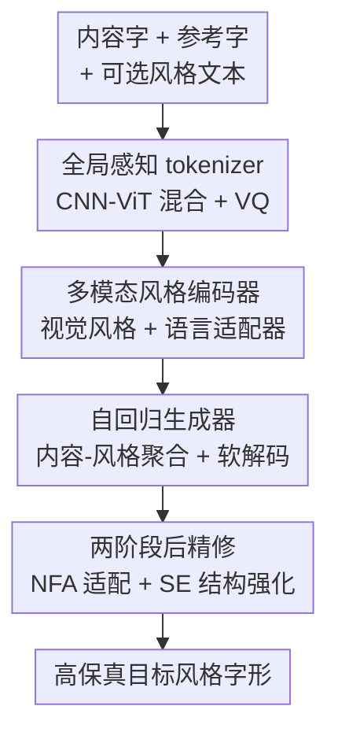

# Beyond Patches: Global-aware Autoregressive Model for Multimodal Few-Shot Font Generation

**会议**: CVPR 2026  
**arXiv**: [2601.01593](https://arxiv.org/abs/2601.01593)  
**代码**: https://xtryer-s.github.io/projects_pages/GAR_Font (项目主页)  
**领域**: 图像生成 / 自回归生成 / 字体生成  
**关键词**: 少样本字体生成、自回归模型、全局感知 tokenizer、多模态风格控制、GRPO 后精修

## 一句话总结
GAR-Font 用一个"全局感知 tokenizer + 自回归生成器 + 轻量语言适配器 + GRPO 后精修"的组合，把少样本汉字字体生成从只看图的 patch 级建模升级为兼顾局部笔画与全局风格、还能用一句文字描述补充风格意图的多模态自回归框架，用 4 张参考图 + 1 句文本就能匹配 8 张图的生成质量。

## 研究背景与动机
**领域现状**：少样本字体生成（Few-shot Font Generation, FFG）的目标是只给几个参考字、就自动补全整套字库——这对汉字、日文这种动辄上万字、笔画结构复杂的表意文字尤其有价值。主流做法分三派：GAN 类（LF-Font、DG-Font）、扩散类（Diff-Font、Font-Diffuser）、以及把字形离散成 token 序列的序列/自回归类（VQ-Font、IF-Font）。

**现有痛点**：每一派都有结构-风格的短板。GAN 类与参考风格偏差明显、笔画精度差；扩散类局部保真好了，但不保证整字风格协调；而已有的序列方法（VQ-Font、IF-Font）走的是 **2D patch / block 级 tokenization**——把字形切成局部小块再离散，这会把"整字才能体现"的全局风格线索切碎，导致生成结果和参考风格有肉眼可见的偏差。

**核心矛盾**：字形是一种特殊的结构化视觉对象——既要笔画/部首这种**局部几何精确**，又要整字的**全局美学协调**，而 patch 级 token 天生只擅长前者。最近自回归图像生成的研究也佐证：全局上下文化的 1D token 比 2D patch token 更能建模整体规律。此外，已有 FFG 全是**单模态**，只用图像控制风格，完全忽略了语言——而设计师其实常用"瘦长一点""更有书法感"这类文字来表达超越视觉外观的全局设计意图。

**本文目标**：(1) 做一个能同时抓局部笔画和全局风格的 tokenizer；(2) 在不做昂贵图文联合预训练的前提下，引入文本作为补充风格通道；(3) 进一步提升少样本下未见风格的结构保真与风格一致。

**核心 idea**：用"全局感知的自回归 token"替代"局部 patch token"来承载整字风格，再外挂一个轻量语言适配器把文字描述对齐到已学好的视觉风格空间，最后用强化学习式后精修把结构和风格拉到位。

## 方法详解

### 整体框架
GAR-Font 输入一个内容字（用楷体作为骨架）、若干张同风格参考字、可选一句风格文本，输出该内容字在目标风格下的高保真字形。整条管线分三大块：先用 **G-Tok** 把字形离散成兼顾局部与全局的 token；再由**带多模态风格编码器的自回归生成器**在内容-风格条件下逐 token 预测、并软投影回 codebook 解码出字形；最后用**两阶段后精修**（少样本适配 + 结构强化）把未见风格下的瑕疵磨平。训练上采取"解耦"策略：先纯视觉预训练打好稳定的风格-内容空间，再插入语言适配器做多模态扩展，避免昂贵的图文联合训练。

### 关键设计

**1. G-Tok 全局感知 tokenizer：用 CNN-ViT 混合 + 因果解码把整字风格塞进 token**

针对 patch 级 token 切碎全局风格的痛点，G-Tok 不再把字形切成独立局部块离散，而是走"先局部、后全局"的混合编码：给定字形图像 $\mathbf{I}\in\mathbb{R}^{H\times W\times 3}$，先用 CNN 编码器 $E_{\text{CNN}}$ 抽取保留空间局部性的笔画特征，展平后加上 2D 正弦位置编码 $\mathbf{P}_{\text{2D}}$，再喂进 ViT 编码器做全局聚合：$\mathbf{T}=E_{\text{ViT}}\big(\mathrm{Proj}(E_{\text{CNN}}(\mathbf{I}))+\mathbf{P}_{\text{2D}}\big)\in\mathbb{R}^{N\times d}$。CNN 负责把笔画几何看准，ViT 负责把整字风格看全。随后用一个可学习码表（2048 项、维度 8）做向量量化，并加熵正则稳训练、保多样性；解码端用**因果 ViT-CNN 解码器**重建字形，因果注意力建模 token 间的序列依赖，恰好与下游自回归生成的逐 token 预测对齐。消融显示纯 ViT 线性探针强但重建差、纯 CNN 反之，而 CNN-ViT-6 混合在两端都最好——这正是"局部+全局"互补的直接证据。

**2. 自回归生成器 + 软解码：让离散字库 token 也能做像素级监督**

有了 G-Tok 的全局 token，生成器在内容-风格条件下逐 token 预测。内容编码器和视觉风格编码器分别抽出内容特征 $\mathbf{F}_c$ 和各参考字的风格特征 $\{\mathbf{F}_{vis_j}\}_{j=1}^{N_s}$，经一个**内容-风格聚合器**让内容 query 去 attend 细粒度风格线索，得到 $\tilde{\mathbf{T}}_{\text{vis}}=\mathrm{Aggregator}(\mathbf{F}_c,\{\mathbf{F}_{vis_j}\})$，再与 $\mathbf{F}_c$ 拼成条件 $\mathbf{T}$。关键巧思在解码：传统离散硬解码（取 argmax token）会切断梯度，没法做像素级监督；GAR-Font 改用**软投影**，把 logits 经 softmax 后对码表做加权求和 $\tilde{\mathbf{Z}}=\mathrm{Softmax}(\mathbf{L})\cdot\mathcal{C}$，这样既保留梯度流、能直接用像素 loss 监督，又因为用上了整个码表的表达力而让笔画更连续、字形更准。消融里软解码在所有指标上都压过硬解码。

**3. 轻量语言适配器：解耦训练，把文字风格意图对齐进视觉风格空间**

为了在不做昂贵图文联合预训练的前提下引入语言通道，GAR-Font 先纯视觉预训练出稳定的风格-内容空间，再外挂一个**即插即用的语言-风格适配器**。它从 $k<N_s$ 张参考字取一小撮视觉风格特征 $\{\mathbf{F}_{vis_j}\}_{j=1}^{k}$，把 Flan-T5 编出的文本风格嵌入投影到视觉空间后，通过**迭代交叉注意力**让文本 token 反复去 attend 这些视觉风格特征，对齐后在空间上展开成 $\mathbf{F}_t$，再与视觉特征拼接 $\tilde{\mathbf{F}}_{mm}=[\mathbf{F}_{vis_1},\ldots,\mathbf{F}_{vis_k},\mathbf{F}_t]$。训练时不另设图文标注，而是直接拿全视觉（$N_s=8$）聚合出的 $\tilde{\mathbf{T}}_{\text{vis}}$ 当监督，最小化多模态与全视觉表征的距离 $\mathcal{L}_{\text{adapt}}=\|\tilde{\mathbf{T}}_{\text{mm}}-\tilde{\mathbf{T}}_{\text{vis}}\|_2^2$。这等于强迫"少量图 + 一句文本"去逼近"一堆图"的风格表征，从而实现文本-风格替换、降低对视觉参考数量的依赖。消融（Table 6）也证明这种解耦适配比图文联合训练效果更好。

**4. NFA + SE 两阶段后精修：先 LoRA 适配未见风格，再 GRPO 拿 OCR/风格奖励磨结构**

预训练生成器学到的是通用字体规律，碰到未见风格仍有细微不一致。后精修分两步且都只更新 LoRA 层、代价很低。**NFA（Novel Font Adaptation）**用目标字体的 8 张参考字做轻量适配，混合 token 交叉熵与像素 L1 损失 $\mathcal{L}_{\text{NFA}}=\lambda_{\text{CE}}\mathcal{L}_{\text{CE}}+\lambda_{\text{pixel}}\mathcal{L}_{\text{pixel}}$，把未见风格补稳。**SE（Structural Enhancement）**则把生成器当策略 $\pi_\theta$，用基于 GRPO 的组相对优化磨结构可读性：每个解码字形拿一个复合奖励 $r=\lambda_{\text{ocr}}r_{\text{ocr}}+\lambda_{\text{style}}r_{\text{style}}$，其中 $r_{\text{ocr}}$ 来自预训练 OCR——识别正确时取其置信度 $p_{\text{ocr}}$、否则为 0，$r_{\text{style}}$ 由预训练判别器衡量风格一致性；奖励在每个采样组内归一化算优势 $A^{(k)}=\frac{r^{(k)}-\mu(r)}{\sigma(r)}$，再以优势加权似然加 KL 正则更新 $\mathcal{L}_{\text{SE}}=-\mathbb{E}_{\mathbf{s}\sim\pi_\theta}[A(\mathbf{s})\log\pi_\theta(\mathbf{s})]+\beta\,\mathrm{KL}(\pi_\theta\|\pi_{\text{ref}})$。OCR 奖励逼字形"认得出"、风格奖励逼它"像参考"，正好把 NFA 之后残留的结构畸变收掉。

### 损失函数 / 训练策略
- **G-Tok 训练**：$\mathcal{L}_{\text{tok}}=\lambda_{\text{rec}}\mathcal{L}_{\text{rec}}+\lambda_{\text{per}}\mathcal{L}_{\text{per}}+\lambda_{\text{vq}}\mathcal{L}_{\text{vq}}$，分别是 L1 重建、感知（特征 L2）、向量量化损失；200k 迭代、码表 2048×8、每字 64 token。
- **视觉预训练**：$\mathcal{L}_{\text{AR}}=\lambda_{\text{CE}}\mathcal{L}_{\text{CE}}+\lambda_{\text{pixel}}\mathcal{L}_{\text{pixel}}$（token 交叉熵 + 像素 L1）；$N_s=8$，小/大数据集各 600k/1M 迭代。
- **多模态适配**：仅训语言适配器 40k 迭代，监督信号是 $N_s=8$ 的纯视觉特征；按 $k=2/4$ 得到 GAR-Font($M_2$)/($M_4$)。
- **后精修**：NFA 在 8 字上 10 epoch（lr 2e-5）；SE 用 GRPO，每组采 4 样本、每字 8 张异风格图、10 epoch（lr 5e-6）。

## 实验关键数据

数据集：基于 GB2312（6763 汉字）构建小规模（440 风格 / S）与大规模（3040 风格 / L）两套，各随机留 40 种未见字体、512 个未见字。评测分 UFSC（未见字体+已见字）与 UFUC（未见字体+未见字），指标含 RMSE↓、SSIM↑、LPIPS↓、FID↓、内容准确率 Acc(C)↑、风格准确率 Acc(S)↑，字形统一 resize 到 $64\times64$。

### 主实验（vision-only FFG，UFSC，Large 数据集）

| 方法 | RMSE↓ | SSIM↑ | LPIPS↓ | FID↓ | Acc(S)↑ |
|------|-------|-------|--------|------|---------|
| VQ-Font | 0.2734 | 0.5633 | 0.1749 | 19.31 | 0.0014 |
| IF-Font (AR) | 0.3969 | 0.3374 | 0.1480 | 11.65 | 0.1148 |
| Font-Diffuser | 0.2645 | 0.5813 | 0.1419 | 21.42 | 0.0527 |
| CF-Font | 0.2993 | 0.5418 | 0.1155 | 13.35 | 0.1549 |
| GAR-Font($I_8$) 预训练 | 0.2772 | 0.5799 | 0.1112 | **7.72** | 0.1928 |
| GAR-Font($I_8$, +NFA-8) | 0.2600 | 0.6158 | 0.0979 | **6.56** | 0.3313 |
| GAR-Font($I_8$, +NFA-8+SE) | **0.2503** | **0.6411** | **0.0885** | 8.99 | **0.3518** |

即使只在预训练阶段，GAR-Font 的 FID 就已大幅领先（7.72 vs 次优扩散类 ~13），SSIM/RMSE 也具竞争力；加上 NFA+SE 后 RMSE 降到 0.2503、SSIM 升到 0.6411、风格准确率 Acc(S) 从 0.19 提到 0.35，整体显著超越所有对比方法。

### 多模态 FFG（Large，文本补充视觉参考）

| 配置 | RMSE↓ | SSIM↑ | LPIPS↓ | FID↓ | Acc(S)↑ |
|------|-------|-------|--------|------|---------|
| 视觉 $n_{ref}=2$ | 0.2816 | 0.5695 | 0.1158 | 7.36 | 0.1535 |
| 视觉 $n_{ref}=4$ | 0.2807 | 0.5735 | 0.1138 | 7.38 | 0.1741 |
| 视觉 $n_{ref}=8$ | 0.2772 | 0.5799 | 0.1112 | 7.72 | 0.1928 |
| GAR-Font($M_2$) = 2图+1文 | 0.2811 | 0.5724 | 0.1136 | **7.31** | — |
| GAR-Font($M_4$) = 4图+1文 | **0.2764** | **0.5825** | **0.1098** | 7.49 | — |

关键结论：同样视觉参考数下加一句文本必涨点；尤其 **GAR-Font($M_4$)（4图+1文）在 RMSE/SSIM/LPIPS/FID 上反超 8 图纯视觉**（FID 7.49 vs 7.72），说明语言提供了互补的全局风格线索、能省掉一半参考图。代价是 Acc(S) 略降，作者解释为文本引导让风格更平滑多样、超出了风格分类器的判别范围。

### 消融实验

| 配置 | RMSE↓ | SSIM↑ | FID↓ | Acc(S)↑ | 说明 |
|------|-------|-------|------|---------|------|
| CNN（纯卷积 tokenizer） | 0.3447 | 0.4350 | 10.52 | 0.0221 | 缺全局建模 |
| CNN + 非因果 ViT | 0.3271 | 0.4745 | 8.75 | 0.0436 | 加自注意力补全局 |
| CNN + 因果 ViT（G-Tok） | **0.3142** | **0.4932** | **8.48** | **0.0796** | 因果注意力再强化序列建模 |
| w/o pixel loss + 硬解码 | 0.3235 | 0.4679 | 10.32 | 0.0377 | 最差 |
| w/ pixel loss + 软解码 | **0.3080** | **0.5052** | **7.95** | **0.0802** | 完整版（UFSC, Small） |

### 关键发现
- **G-Tok 的混合架构是地基**：纯 ViT 线性探针准确率最高（Acc(S) 0.69）但重建崩（FID 98.4），纯 CNN 重建稳但判别弱，CNN-ViT-6 在判别与重建两端都拿到最优——证明字形确实需要"局部+全局"两条腿走路。
- **因果注意力 + 软解码 + 像素监督逐项有效**：从 CNN→+非因果 ViT→+因果 ViT 逐步加全局/序列建模，每步都涨；软解码相对硬解码在所有指标更优，加像素 loss 后进一步提升重建与识别。
- **语言在低参考量时收益最大**：$n_{ref}=2$ 时纯视觉容易漂向通用字形，文本引导能把风格拉回，4图+1文甚至超过 8 图。

## 亮点与洞察
- **软解码把"离散字库 token"变成可微的桥**：用 softmax 加权码表代替 argmax 硬取，既保留梯度做像素级监督、又借整个码表的表达力让笔画更连续——这个 trick 可迁移到任何"VQ token + 想要像素监督"的自回归生成任务。
- **解耦的语言适配器，零图文标注实现多模态**：不做昂贵图文联合预训练，而是先固定一个稳的视觉风格空间，再用 $\ell_2$ 把"少图+文本"对齐到"多图"表征——既省算力又避免扰动视觉先验，是 parameter-efficient 多模态对齐的漂亮范例。
- **把 GRPO 搬到字形生成做后精修**：用 OCR 置信度（认得出）+ 判别器（像参考）当复合奖励、只更新 LoRA，把强化学习的"可验证奖励"思路用在了一个非常具象的视觉质量目标上，思路新颖且代价低。

## 局限与展望
- **多模态评测用合成文本代理**：因缺真实"人写设计意图"语料，文本描述由 Qwen2.5-VL 生成作为代理，与真实设计师措辞的分布差距未知，多模态收益在真实使用下能否复现存疑 ⚠️。
- **Acc(S) 在最优配置下反而下降**：作者归因于风格更平滑多样、超出分类器判别力，但这也意味着现有风格准确率指标可能无法忠实反映多模态生成的真实风格质量。
- **后精修是按目标字体逐个 LoRA 适配**：NFA/SE 都需对每个未见风格做少量训练，并非纯前馈零样本，落地到"一键生成任意新字体"仍有每字体适配成本。
- **主要在汉字（GB2312）上验证**：对拉丁、韩文等其它书写系统的泛化未展开评测。

## 相关工作与启发
- **vs VQ-Font / IF-Font（patch/block 级序列 FFG）**：它们把字形切成局部块再离散，全局风格线索被切碎；GAR-Font 用 CNN-ViT 混合的全局感知 token 统一局部笔画与整字风格，FID 大幅领先（7.72 vs VQ-Font 19.3）。
- **vs Font-Diffuser / Diff-Font（扩散类）**：扩散类局部保真好但全局风格不保证协调；GAR-Font 走自回归 + 全局 token 路线，在 SSIM/FID/风格准确率上整体更优。
- **vs 需大规模图文预训练的多模态生成**：GAR-Font 用即插即用语言适配器 + 解耦训练实现文本风格控制，无需昂贵图文联合预训练，且解耦方案实测优于图文联合训练（Table 6）。

## 评分
- 新颖性: ⭐⭐⭐⭐⭐ 首个把全局感知 1D-style token + 解耦语言适配器 + GRPO 后精修三者合一的多模态自回归 FFG 框架
- 实验充分度: ⭐⭐⭐⭐⭐ 双数据集双设置主对比 + 6 张消融表，逐组件验证扎实
- 写作质量: ⭐⭐⭐⭐ 方法层次清晰、动机递进，但部分模块（聚合器、解码器细节）依赖图示、文字略简
- 价值: ⭐⭐⭐⭐ 显著提升汉字 FFG 质量并开辟文本控制新接口，落地仍需逐字体后精修

<!-- RELATED:START -->

## 相关论文

- [\[CVPR 2026\] Rethinking Glyph Spatial Information in Font Generation](rethinking_glyph_spatial_information_in_font_generation.md)
- [\[CVPR 2026\] Few-shot Acoustic Synthesis with Multimodal Flow Matching](few-shot_acoustic_synthesis_with_multimodal_flow_matching.md)
- [\[CVPR 2026\] Proxy-Tuning: Tailoring Multimodal Autoregressive Models for Subject-Driven Image Generation](proxy-tuning_tailoring_multimodal_autoregressive_models_for_subject-driven_image.md)
- [\[ICML 2026\] Envisioning Beyond the Few: Disentangled Semantics and Primitives for Few-Shot Atypical Layout-to-Image Generation](../../ICML2026/image_generation/envisioning_beyond_the_few_disentangled_semantics_and_primitives_for_few-shot_at.md)
- [\[CVPR 2026\] Uni-DAD: Unified Distillation and Adaptation of Diffusion Models for Few-step Few-shot Image Generation](uni-dad_unified_distillation_and_adaptation_of_diffusion_models_for_few-step_few.md)

<!-- RELATED:END -->
