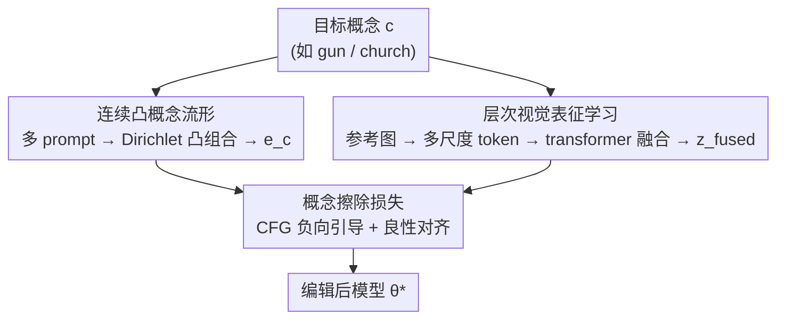

# Beyond Text Prompts: Precise Concept Erasure through Text–Image Collaboration

**会议**: CVPR 2026  
**arXiv**: [2604.15829](https://arxiv.org/abs/2604.15829)  
**代码**: https://github.com/OpenAscent-L/TICoE.git (有)  
**领域**: 扩散模型 / 概念擦除 / AI 安全  
**关键词**: 概念擦除, 文图协同, 凸概念流形, 多尺度视觉表征, 扩散模型

## 一句话总结
TICoE 用「连续凸概念流形（文本端）+ 多尺度层次视觉表征（图像端）」协同地从文生图扩散模型里精准擦除目标概念，既堵住文本擦除"换个说法就复活"的漏洞，又避免图像引导误伤形状/语境相似的无关概念，在 gun/nudity/Van Gogh 等任务上同时拿到更强擦除（UDA 0.02）和更好保真（FID 30.86）。

## 研究背景与动机

**领域现状**：文生图扩散模型（Stable Diffusion 等）训练在大规模网络数据上，难免学会生成不安全、敏感或受版权保护的内容。概念擦除（concept erasure / unlearning）就是在不重训的前提下，从模型里"忘掉"某个目标概念（如 gun、nudity、某画家风格），同时保留正常生成能力。主流做法分三类：引导式（ESD、AdvUnlearn 改 CFG 去噪轨迹）、注意力优化式（Forget-Me-Not、MACE 迭代改 cross-attention）、闭式编辑式（UCE 直接解析地重标定 cross-attention 权重）。

**现有痛点**：这些方法几乎都只在**文本域**操作，依赖某个或某几个固定 prompt 的 embedding。但单词/固定 prompt 的 embedding 无法覆盖一个概念的完整语义范围——语义相关但措辞不同的 prompt（"plasma rifle"之于"gun"）仍能把已擦除的概念重新激活，造成**擦除不彻底**。为补全覆盖，近期 Co-Erasing 引入参考图像辅助擦除，但又带来新问题：模型会顺带吸收参考图的视觉属性（形状、姿态、语境），把视觉上相似但语义无关的概念（擦 gun 时连 camera 一起压掉）**过度擦除**。

**核心矛盾**：擦除强度（erasing precision）和上下文保真（contextual fidelity）之间存在 trade-off——文本擦除语义覆盖不足导致欠擦，朴素图像引导视觉纠缠导致过擦，两端都难做到"忠实擦除"（faithful erasure）。而且现有评测多只看擦除强度，对"形状/语境相近但概念不同"的内容是否被保留几乎不考察。

**本文目标**：(1) 在文本端覆盖概念的完整语言外延，抵抗对抗性改写；(2) 在图像端把"与目标因果相关"的特征和"仅仅视觉相关"的特征分开，避免误伤；(3) 提供一个能衡量"相关但不同概念是否被保留"的评测指标。

**切入角度**：作者认为文本泛化和视觉接地是**互补**的——文本流形负责把概念的语言空间撑满，视觉表征负责在隐空间里把目标和相似干扰物区分开。两者联合学习才能同时压住欠擦和过擦。

**核心 idea**：用"连续凸文本概念流形 + 层次化视觉表征"做文图协同擦除（TICoE），让文本端管全覆盖、图像端管精区分。

## 方法详解

### 整体框架
TICoE 要解决的是"擦得干净又不误伤"。给定一个目标概念 $c$（如 church），框架并行走两条流：**文本流**把多个语义相关 prompt 聚成一个连续凸概念流形，采样出能覆盖各种说法的文本条件 $e_c$；**视觉流**把参考图编码成多尺度 token、经 transformer 融合成视觉引导隐变量 $z_\text{fused}$。两者一起喂给可训练 U-Net，用一个基于 CFG 负向引导的擦除损失把目标概念压下去、同时对齐冻结原模型在良性 prompt 上的输出，最终得到编辑后的模型 $\theta^*$。

### 关键设计

**1. 连续凸概念流形 CCCM：用一片连续语义区域代替几个离散 prompt，堵住"换说法就复活"**

文本擦除的根本漏洞是离散 prompt 覆盖不全——擦了"gun"，但"firearm""plasma rifle"还能激活。CCCM 的做法是先用 GPT-5.0 围绕基础关键词自动扩写出一组语义一致但表述多样的 prompt（如对"church"生成"gothic church""ancient stone church""church tower"），每个经文本编码器得到 embedding，堆成 prompt bank $B = [e_1, \dots, e_N] \in \mathbb{R}^{N\times L\times d}$。擦除时不取某个固定 embedding，而是用 Dirichlet 分布采样权重做**凸组合**：$e_c = \sum_{i=1}^N w_i e_i$，其中 $w \sim \mathrm{Dirichlet}(\alpha(\tau))$，$\alpha(\tau) = \frac{1}{\tau}\mathbf{1}_N$。Dirichlet 保证权重非负且归一（$w_i\ge 0,\ \sum_i w_i=1$），于是 $e_c$ 一定落在原始 prompt embedding 张成的语义凸包内。

为什么用"凸"组合而非任意线性组合是关键：不受约束的线性组合可能外推到分布外（OOD）、产生语义不合理的点，而凸组合保证 $e_c$ 是已有概念的合法语义混合，实现平滑有界的过渡，形成一片**连续**概念区域。温度 $\tau$ 控制锐度：高 $\tau$ 趋于均匀采样、低 $\tau$ 让 $e_c$ 偏向少数几个 prompt。还可选地注入零均值高斯扰动 $e_c \leftarrow e_c + \mathcal{N}(0, \text{noise\_std}^2)$ 增加局部随机性防过拟合，最后做 LayerNorm 对齐原模型分布。相比固定 prompt，这片流形对各种表达和对抗改写的覆盖更全更稳

**2. 层次视觉表征学习 HVRL：多尺度隐空间区分"因果相关"与"仅视觉相似"，避免过擦**

朴素图像引导会把参考图的视觉属性整体吸收，连带压掉形状/姿态相似的无关概念。HVRL 用多尺度建模来"解纠缠"。先用干净扩散模型以"a photo of c"生成参考图，提供无偏视觉先验；把参考图经 VAE 编码并在随机时间步加 DDPM 噪声得到隐变量 $z\in\mathbb{R}^{B\times C\times H\times W}$，再 resize 到多个尺度 $s\in\mathcal{S}=\{1.0, 0.75, 0.5\}$ 并展平成 token：$t_s\in\mathbb{R}^{B\times(H_sW_s)\times C}$，沿序列维拼接成 $t\in\mathbb{R}^{B\times N\times C}$（$N=\sum_s H_sW_s$）。

加正弦位置编码 $t\leftarrow t+p$ 后送入若干层 transformer encoder $t'=F_\text{trans}(t)$，因为 transformer 保持序列长度，取前 $H\times W$ 个 token reshape 回 2D 隐图 $t'_\text{fused}$，最后用残差融合 $z_\text{fused} = z + \lambda\cdot t'_\text{fused}$（$\lambda$ 控制融合贡献）。多尺度让模型在不同空间分辨率上捕捉概念信息，从而把"和目标因果相关"的特征与"仅仅视觉相似"的特征分开；transformer 与擦除 U-Net 联合训练，自适应学习跨尺度依赖。这样视觉引导既精准又不破坏无关结构，是抑制过擦的关键

**3. CFG 负向引导的概念擦除损失：把可训练 U-Net 推向"反目标概念"的参考目标**

有了文本条件 $e_c$ 和视觉隐变量 $z_\text{fused}$，还需要一个训练目标真正"擦掉"概念。作者借 classifier-free guidance 思想，用**冻结**原模型构造一个带负引导权重 $\gamma$ 的参考目标：

$$\epsilon_\text{target}(z_\text{fused}, t, e_c) := \epsilon_\theta(z_\text{fused}, t, \varnothing) - \gamma\big[\epsilon_\theta(z_\text{fused}, t, e_c) - \epsilon_\theta(z_\text{fused}, t, \varnothing)\big]$$

直觉是：把"有概念条件"相对"无条件"的噪声方向**反向**外推，得到一个"远离目标概念"的目标噪声。擦除损失让可训练 U-Net $\theta^*$ 的条件预测对齐这个参考目标：

$$\mathcal{L}_\text{erase} = \big\|\epsilon_{\theta^*}(z_\text{fused}, t, e_c) - \epsilon_\text{target}(z_\text{fused}, t, e_c)\big\|_2^2$$

这一损失同时更新 transformer 和 U-Net，$\gamma$ 控制压制强度。它把"语义可变性（来自 CCCM 的多样 $e_c$）"和"视觉纠缠（来自 HVRL 的 $z_\text{fused}$）"两个问题在同一个目标里一起处理，驱动 $\theta^*$ 在压住目标概念的同时保持良性 prompt 的分布

### 损失函数 / 训练策略
训练前先用干净 Stable Diffusion 以"a photo of $c$"生成 $n$ 张目标概念图组成数据集；每次迭代随机抽一张图，连同从 CCCM 采样的 $e_c$ 一起做文图协同擦除，仅优化 $\mathcal{L}_\text{erase}$（transformer + U-Net 联合更新）。

## 实验关键数据

### 主实验
在 erase gun 任务上对比五个 SOTA（ESD、UCE、FMN、SPM 为纯文本，Co-Erasing 为图文）。ASR/UDA/P4D 越低擦得越干净，FID 越低、CLIP 越高保真越好：

| 方法 | ASR↓ | UDA↓ | P4D↓ | FID↓ | CLIP↑ |
|------|------|------|------|------|-------|
| ESD | 0.02 | 0.20 | 0.47 | 31.76 | 0.302 |
| UCE | 0.08 | 0.36 | 0.08 | 35.56 | 0.312 |
| FMN | 0.26 | 0.64 | 0.26 | 34.46 | 0.310 |
| SPM | 0.22 | 0.60 | 0.24 | 33.43 | 0.310 |
| Co-Erasing | 0.00 | 0.10 | 0.15 | 35.94 | 0.304 |
| **TICoE (Ours)** | **0.00** | **0.02** | **0.04** | **30.86** | 0.304 |

TICoE 在擦除三项（ASR/UDA/P4D）全面最优，尤其 UDA 从次优 0.10 降到 0.02，且 FID 最低（30.86）说明保真不掉。

**MCP（Morpho-Contextual Concept Preservation）指标**：作者自定义的可用性指标，专门衡量"语义不同但形状/语境相近"的概念在擦除后是否被保留（越高越好）。例如擦 gun 时看 camera/phone/umbrella 是否完好，擦 tench 时看 dolphin/whale/goldfish：

| 方法 | gun→camera↑ | gun→phone↑ | tench→whale↑ | tench→goldfish↑ |
|------|------|------|------|------|
| SD（干净基线） | 92.54% | 97.96% | 97.78% | 98.15% |
| ESD | 68.25% | 79.59% | 75.56% | 75.93% |
| Co-Erasing | 39.68% | 53.06% | 60.00% | 48.15% |
| **TICoE (Ours)** | **92.06%** | **95.91%** | **95.45%** | **96.30%** |

朴素图像引导的 Co-Erasing 过擦最严重（camera 仅 39.68%），TICoE 的 MCP 几乎贴近干净基线 SD，印证 HVRL 有效抑制了过擦。

### 消融实验
gun 擦除任务上拆 CCCM 与 HVRL（Table 3）：

| 配置 | ASR↓ | UDA↓ | FID↓ | CLIP↑ | 说明 |
|------|------|------|------|-------|------|
| No CCCM | 0.06 | 0.38 | 30.41 | 0.297 | 去掉凸流形，UDA 暴涨到 0.38 |
| 10 Prompt | 0.00 | 0.26 | 31.16 | 0.291 | prompt 太少、流形稀疏 |
| 20 Prompt | 0.02 | 0.12 | 29.46 | 0.285 | 精度/保真明显改善 |
| 50 Prompt | 0.02 | 0.22 | 30.98 | 0.287 | 过多冗余、略降稳定性 |
| No HVRL | 0.00 | 0.16 | 30.59 | 0.285 | 去掉多尺度视觉，UDA 升到 0.16 |
| Scales 1 = {1.0,0.75} | 0.02 | 0.26 | 30.66 | 0.300 | 尺度不足、欠擦 |
| Scales 2 = {1.0,0.75,0.5,0.25} | 0.04 | 0.10 | 32.74 | 0.302 | 尺度过多、FID 变差 |
| **TICoE (full)** | **0.00** | **0.02** | 30.86 | **0.304** | 完整模型 |

### 关键发现
- **CCCM 贡献最大**：去掉后 UDA 从 0.02 飙到 0.38，说明连续凸流形是擦除鲁棒性的主力；prompt bank 规模约 30 以上时与目标概念的余弦相似度趋稳，20 个左右已能取得精度/保真最佳平衡，再多只带来边际收益和冗余。
- **HVRL 的尺度数有甜点**：scale 太少（仅 2 个）欠擦（UDA 0.26），太多（4 个含 0.25）引入冗余和过平滑使 FID 升到 32.74，默认三尺度 $\{1.0,0.75,0.5\}$ 最均衡。
- **细粒度 NSFW 擦除**：在 I2P 生成 4703 张图用 NudeNet 检测，ESD/UCE/SPM 在 BUTTOCKS/FEMALE_BREAST 等敏感类仍有残留激活，TICoE 失败计数接近零。
- **泛化性**：在 SD v1.4/v1.5/v2.0 多骨干上稳定，且能同时擦除 church+Van Gogh+cat 多概念。

## 亮点与洞察
- **凸组合的几何直觉很巧**：用 Dirichlet 把权重约束在单纯形上，保证插值 embedding 永远落在原 prompt 的凸包内，天然避免线性外推产生的 OOD 语义点——这把"覆盖更多说法"和"不跑偏"两个目标用一个分布选择同时满足。
- **文本管覆盖、图像管区分的分工清晰**：文本流解决欠擦（语义覆盖不足），视觉流解决过擦（视觉纠缠），两条线各打一个痛点，再用同一个 CFG 负向损失收口，逻辑闭环。
- **MCP 指标补上了评测盲区**：现有 COCO-10k 的 CLIP/FID 大多和被擦概念弱相关，测不出"camera 被误伤"。MCP 专门量"形态/语境相近但概念不同"的保留度，可迁移到任何需要评估"过擦/误伤"的擦除/编辑任务。
- **多尺度 token + transformer 融合**这套视觉解纠缠模块是即插即用的，思路可迁移到其他需要"区分因果相关 vs 仅相关特征"的可控生成场景。

## 局限与展望
- **依赖 GPT-5.0 扩写 prompt**：CCCM 的语义覆盖质量取决于外部 LLM 生成的 prompt 多样性，扩写偏差会直接影响流形质量；作者未深入讨论扩写失败或低资源概念的情形。⚠️ GPT-5.0 为原文所述模型名，以原文为准。
- **MCP 评测范围有限**：目前只在少数手选的相关类别（camera/phone/whale 等）上测，是否能覆盖更广的"相似但不同"概念谱系仍待验证。
- **超参较多**：温度 $\tau$、高斯噪声 std、融合权重 $\lambda$、负引导 $\gamma$、尺度集合都需调，论文把敏感性分析放进附录，正文可见性不足。
- **额外计算开销**：相比纯文本闭式编辑（UCE），TICoE 需生成参考图 + 多尺度 transformer 联合训练，成本更高，论文未给出训练时间对比。

## 相关工作与启发
- **vs ESD / AdvUnlearn（引导式）**: 它们改 CFG 去噪轨迹压概念，但绑死在擦除时用的具体 prompt 上，换个措辞就复活；TICoE 用连续凸流形覆盖整片语言空间，对抗改写下 UDA 显著更低（0.02 vs ESD 0.20）。
- **vs MACE / Forget-Me-Not（注意力优化式）**: 它们迭代改 cross-attention 图，仍依赖 prompt 条件的注意力、对相似/对抗 query 仍会复活；TICoE 在文本+视觉双空间联合对齐，覆盖更全。
- **vs UCE（闭式编辑式）**: UCE 解析地重标定 cross-attention 参数、高效但难泛化到隐蔽/对抗 prompt；TICoE 牺牲一些效率换更强的对抗鲁棒和保真。
- **vs Co-Erasing（图像辅助）**: 同样用参考图，但 Co-Erasing 朴素吸收视觉属性导致过擦严重（camera MCP 仅 39.68%）；TICoE 用多尺度层次表征解纠缠，MCP 拉回到 92% 接近干净基线，这是本文相对 Co-Erasing 最核心的优势。

## 评分
- 新颖性: ⭐⭐⭐⭐ 凸概念流形 + 多尺度视觉解纠缠的文图协同思路新颖，MCP 指标补了评测盲区。
- 实验充分度: ⭐⭐⭐⭐ 覆盖 nudity/style/object 多任务、多骨干、对抗攻击和细粒度 NSFW，消融清晰；但不少结果压在附录、缺成本对比。
- 写作质量: ⭐⭐⭐⭐ 痛点—方法—实验逻辑顺畅，公式完整；个别符号（如温度低 τ 的描述）表述略糙。
- 价值: ⭐⭐⭐⭐ 面向文生图安全这一刚需，"既擦干净又不误伤"的双目标和 MCP 指标对落地与评测都有实用价值。

<!-- RELATED:START -->

## 相关论文

- [\[CVPR 2026\] Neighbor-Aware Localized Concept Erasure in Text-to-Image Diffusion Models](neighbor-aware_localized_concept_erasure_in_text-to-image_diffusion_models.md)
- [\[CVPR 2026\] MapRoute: Semantic Routing for Precise Concept Erasure with Mapper](maproute_semantic_routing_concept_erasure.md)
- [\[CVPR 2026\] Closed-Form Concept Erasure via Double Projections](closed-form_concept_erasure_via_double_projections.md)
- [\[CVPR 2026\] GrOCE: Graph-Guided Online Concept Erasure for Text-to-Image Diffusion Models](groce_graph-guided_online_concept_erasure_for_text-to-image_diffusion_models.md)
- [\[CVPR 2026\] Erasing Thousands of Concepts: Towards Scalable and Practical Concept Erasure for Text-to-Image Diffusion Models](erasing_thousands_of_concepts_towards_scalable_and_practical_concept_erasure_for.md)

<!-- RELATED:END -->
