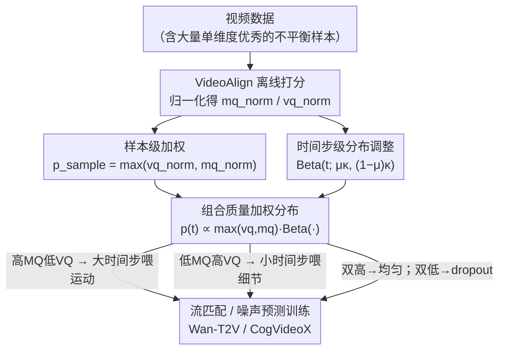

# Beyond the Golden Data: Resolving the Motion-Vision Quality Dilemma via Timestep Selective Training

**会议**: CVPR 2026  
**arXiv**: [2603.25527](https://arxiv.org/abs/2603.25527)  
**代码**: 无  
**领域**: 图像生成/视频生成  
**关键词**: 视频扩散模型, 数据质量困境, 时间步选择训练, 运动-视觉质量平衡, 流匹配

## 一句话总结
发现视频数据中运动质量（MQ）和视觉质量（VQ）呈负相关的"Motion-Vision Quality Dilemma"，通过梯度分析揭示不平衡数据在适当时间步可产生等效学习信号，提出TQD框架使仅用不平衡数据训练即可超越黄金数据训练。

## 研究背景与动机
**领域现状**：视频生成模型（CogVideoX、Wan-T2V等）依赖同时具有高视觉质量（VQ）和高运动质量（MQ）的"黄金数据"，但这类数据**统计上稀缺**。

**核心发现**——Motion-Vision Quality Dilemma：在Koala36M上分析发现MQ和VQ呈**负相关**（r=-0.2419）。高VQ数据倾向于静态场景（低MQ），高MQ数据倾向于有瑕疵（低VQ）。仅21.9%的数据同时满足双高标准。

**现有做法**：通过严格过滤保留黄金数据——大量仅在一个维度上优秀的视频被丢弃，造成严重数据浪费。

**本文转换视角**：从"保留哪些数据"转向"如何更有效地使用不完美数据"。

**核心洞察**：扩散模型的去噪过程具有**层次性**——高噪声时间步建立运动和构图，低噪声时间步精炼细节纹理。梯度分析证实：VQ退化数据在高时间步产生与黄金数据相近的梯度，MQ退化数据在低时间步产生与黄金数据相近的梯度。

## 方法详解

### 整体框架
这篇论文要回答的不是"哪些视频值得留下"，而是"怎么把一段不完美视频的学习信号送到它真正擅长的去噪阶段"。整套流程（称为 TQD，Timestep Quality-aware Distribution）是一个纯数据侧的预处理：先用 VideoAlign 给每个视频离线打出运动质量（MQ）和视觉质量（VQ）两个分数并归一化，训练时分两层调度——样本级先按"绝对质量"决定这个视频以多大概率参与训练（质量 dropout），时间步级再按"相对质量"把它的梯度集中投放到合适的噪声区间，两层最终揉成同一个采样分布，最后照常用流匹配（Wan-T2V）或噪声预测（CogVideoX）目标训练。模型结构、loss、超参都不动，改的只是"喂哪段数据、在哪个时间步喂"。

### 关键设计

**1. 样本级加权：用绝对质量决定一个视频值不值得参与训练**

严格过滤的代价是把大量"只在单一维度出色"的视频整段丢掉，而它们其实仍含有用信号。这里不做硬过滤，而是给每个样本一个保留概率 $p_{sample} = \max(vq_{norm}, mq_{norm})$——只要在 MQ 或 VQ 任一维度足够高，这个视频就大概率被保留；只有两个维度同时偏低的样本，保留概率才被压到很小、被自然 dropout 掉。这样过滤掉的是真正的低质量尾巴，而不是误伤单维度优秀的数据。

**2. 时间步级分布调整：用相对质量把学习信号送到它该去的去噪阶段**

这一步建立在论文的核心观察上：扩散去噪是分层的，高噪声时间步负责建立运动和构图，低噪声时间步负责精炼细节纹理——所以一段"高 MQ、低 VQ"的视频在大时间步才贡献得上力，"低 MQ、高 VQ"的视频则只在小时间步有价值。TQD 不再均匀采样时间步，而是让每个样本的时间步服从一个由它自身质量决定的 Beta 分布：

$$p(t \mid x_0) \propto \mathrm{Beta}\!\left(t;\, \mu\kappa,\, (1-\mu)\kappa\right)$$

分布中心 $\mu = 0.5 + 0.5 \times (mq_{norm} - vq_{norm})$ 把样本往它擅长的区间推：高 MQ/低 VQ 时 $\mu > 0.5$，时间步偏向大端（运动学习阶段）；低 MQ/高 VQ 时 $\mu < 0.5$，偏向小端（细节精炼阶段）。集中度 $\kappa = \kappa_{base} + (\kappa_{max} - \kappa_{base}) \times |mq_{norm} - vq_{norm}|$ 则控制"特化"的强度——两个维度越不平衡，$\kappa$ 越大、分布越尖，梯度越集中地砸向那个阶段。选 Beta 分布是因为它形状足够灵活（能对称、能偏斜、能集中），而且当 $mq = vq$ 时它自动退化成基线的均匀/原始采样，平衡数据完全不受干扰。

**3. 组合质量加权分布：把绝对与相对两层揉进同一个采样分布**

最终训练时两层调度合成一个分布：

$$p(t) \propto \max(vq_{norm}, mq_{norm}) \cdot \mathrm{Beta}\!\left(t;\, \mu\kappa,\, (1-\mu)\kappa\right)$$

前一项决定这个样本整体的参与权重，后一项决定它在时间轴上往哪集中。把四类数据代进去就能看清它们各自的命运：高 MQ/低 VQ（HMLV）的视频被推向大时间步去喂运动；低 MQ/高 VQ（LMHV）的被推向小时间步去喂细节；两维都高的黄金数据（HMHV）退化成均匀覆盖、照常全程参与；两维都低（LMLV）的则被 dropout 几乎不参与。于是同一批不完美数据被路由成了各取所长的互补信号，而不是被一刀切地保留或丢弃。

### 损失函数 / 训练策略
- 流匹配目标（Wan-T2V）：$\mathcal{L} = \mathbb{E}[\|v_\theta(x_t, t, c) - (x_1 - x_0)\|^2]$
- 扩散目标（CogVideoX）：标准噪声预测
- $\kappa_{base}$对齐原始采样策略（uniform→2, logit-normal→4）

## 实验关键数据

### 主实验（Wan-T2V 1.3B）

| 数据设置 | 方法 | VBench Dynamic↑ | VideoAlign MQ↑ | VideoAlign VQ↑ |
|---------|------|----------------|---------------|---------------|
| Set-A(全部) | Baseline | 0.5312 | 2.1388 | 3.2537 |
| Set-A(全部) | **TQD** | **0.6384** | **2.2557** | **3.3450** |
| Set-B(仅不平衡) | Baseline | 0.5224 | 2.0905 | 3.2338 |
| Set-B(仅不平衡) | **TQD** | 0.5447 | **2.1477** | **3.2679** |
| Set-C(仅黄金) | Baseline | 0.5268 | 2.1917 | 3.3378 |
| Set-C(仅黄金) | **TQD** | **0.6473** | **2.2200** | **3.3743** |

### 消融实验

| 组件 | MQ | VQ | 说明 |
|------|----|----|------|
| Baseline | 2.1388 | 3.2537 | 基线 |
| +自适应时间步 | 2.2193 | 3.3044 | 核心增益来源 |
| +质量dropout | 2.1909 | 3.2921 | 数据过滤辅助 |
| +Both (TQD) | **2.2557** | **3.3450** | 协同增益 |

### 关键发现
- **不平衡数据+TQD可超越黄金数据常规训练**：Set-B TQD的MQ(2.1477)>Set-A Baseline的MQ(2.1388)
- TQD在黄金数据上仍有显著提升（Set-C），说明方法普适不局限于不平衡场景
- 物理推理能力也获得提升（VideoPhy2上SA和PC均提升）

## 亮点与洞察
- **范式转换**：从"数据过滤"到"数据路由"，大幅扩展可用训练数据
- 梯度分析提供了坚实的理论基础：不平衡数据在特定时间步与黄金数据梯度对齐
- 挑战了"视频生成必须用黄金数据"的固有假设
- Beta分布参数化设计优雅，平衡数据自然退化为基线采样

## 局限与展望
- 需要预计算MQ/VQ分数（VideoAlign），增加数据准备成本
- LoRA微调（CogVideoX）下增益较小，全参数训练可能更受益
- 未探索更细粒度的质量维度（如音频质量、文本对齐度等）
- $\kappa_{max}$需要对不同模型调参

## 相关工作与启发
- 与Ambient Diffusion（利用不完美数据）思路一致但更具体
- 时间步感知训练策略可推广到图像扩散模型（如针对不同退化类型的图像修复训练）
- 对工业级视频生成数据管线有直接指导价值

## 评分
- 新颖性: ⭐⭐⭐⭐⭐ 问题发现（MV Dilemma）和解法（时间步路由）均为原创，洞察深刻
- 实验充分度: ⭐⭐⭐⭐⭐ 两种模型架构、三种数据配置、详细消融和定性对比
- 写作质量: ⭐⭐⭐⭐⭐ 叙事流畅，从问题发现→梯度分析→方法设计→验证一气呵成
- 价值: ⭐⭐⭐⭐⭐ 对视频生成训练范式有潜在变革意义

<!-- RELATED:START -->

## 相关论文

- [\[CVPR 2026\] DynaVid: Learning to Generate Highly Dynamic Videos using Synthetic Motion Data](dynavid_learning_to_generate_highly_dynamic_videos_using_synthetic_motion_data.md)
- [\[CVPR 2026\] Beyond Objects: Contextual Synthetic Data Generation for Fine-Grained Classification](beyond_objects_contextual_synthetic_data_generation_for_fine-grained_classificat.md)
- [\[CVPR 2026\] Beyond Fixed Formulas: Data-Driven Linear Predictor for Efficient Diffusion Models](beyond_fixed_formulas_data-driven_linear_predictor_for_efficient_diffusion_model.md)
- [\[CVPR 2026\] SpotEdit: Selective Region Editing in Diffusion Transformers](spotedit_selective_region_editing_in_diffusion_transformers.md)
- [\[CVPR 2026\] High-Fidelity Virtual Try-On beyond Paired Data Scarcity via Diffusion-based Cycle-Consistent Learning](high-fidelity_virtual_try-on_beyond_paired_data_scarcity_via_diffusion-based_cyc.md)

<!-- RELATED:END -->
