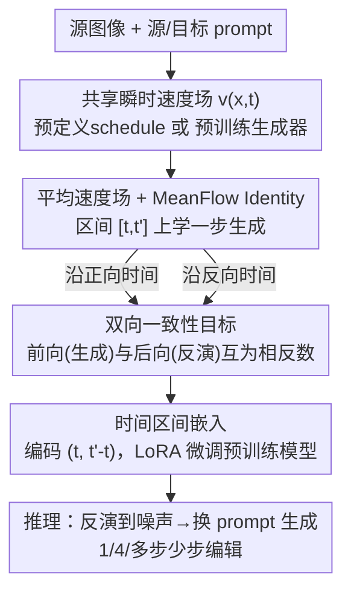

# BiFM: Bidirectional Flow Matching for Few-Step Image Editing and Generation

**会议**: CVPR 2026  
**论文**: [CVF Open Access](https://openaccess.thecvf.com/content/CVPR2026/html/Dai_BiFM_Bidirectional_Flow_Matching_for_Few-Step_Image_Editing_and_Generation_CVPR_2026_paper.html)  
**代码**: 暂未公开  
**领域**: 扩散模型 / 图像生成 / 图像编辑  
**关键词**: flow matching, 少步编辑, 双向流匹配, 图像反演, MeanFlow  

## 一句话总结
BiFM 让同一个 flow matching 模型在一次训练里同时学会"噪声→图像"的生成和"图像→噪声"的反演，靠一个共享的瞬时速度场约束两个方向的平均速度，从而在 1~4 步的少步预算下做出高保真的反演式图像编辑，效果稳定超过现有少步编辑方法。

## 研究背景与动机

**领域现状**：扩散 / flow matching 模型的图像编辑主流走"反演式编辑"路线——把源图像 inversion 回生成模型的中间隐空间，再用目标 prompt 重新 forward 一遍生成编辑结果。这条路线能保持语义和背景，但天然慢：反演 + 重生成把推理步数翻倍。于是近年研究都在卷"少步编辑"（few-step editing），追求实时交互。

**现有痛点**：少步反演本质上很难学。少步模型用很大的时间步更新，会放大局部线性化和 ODE solver 的近似误差。具体表现为两类失败：(a) **训练自由反演**（如 DDIM inversion）直接把生成步数值反转，但在大步长下 $|\epsilon_\theta(x_t,t)-\epsilon_\theta(x_{t+\Delta t},t)|$ 的差异变得显著，导致隐变量恢复糟糕、语义漂移、背景保不住；(b) **调优式反演**（TurboEdit / iCD 等）在预训练生成器上外挂一个辅助反演网络 $\Phi$，保真度上去了，但额外参数、额外训练开销大，而且换个 backbone 就不通用。

**核心矛盾**：反演难学的根子在于**训练时强加的"噪声→数据"单向时间约定**。模型只见过 $x_t$ 作为输入去算速度，可反演时却要从 $x_{t+\Delta t}$ 出发，输入和训练分布不匹配，误差自然来。现有方法要么忍受这个误差（训练自由），要么再贴一个网络绕开它（调优式），都没从根上统一生成和反演。

**本文目标 / 核心 idea**：能不能训练一个少步扩散模型，让它**直接学会自己的反演过程**？BiFM 的答案是从 ODE 视角自然地拿到反演——把 flow matching ODE 沿两个时间方向积分，让同一个模型既输出前向平均速度（生成）又输出后向平均速度（反演），两者由同一个瞬时速度场约束。一句话：用"双向平均速度场"替代"外挂反演网络 / DDIM 数值反转"，把生成和反演装进一个模型里联合学。

## 方法详解

### 整体框架

BiFM 建立在两个已有基石上：**flow matching**（学一个时间相关速度场 $v_\theta(x_t,t)$，把噪声沿 ODE $dx_t/dt = v_\theta(x_t,t)$ 流到数据）和 **time-interval supervision / MeanFlow**（不学整条轨迹，而是学时间区间 $[t,t']$ 上的**平均速度**，这样一步就能近似积分一段 ODE，天然支持少步）。

BiFM 的关键转折在于一个观察：前向平均速度（生成）和后向平均速度（反演）其实是**对同一个瞬时速度场 $v(x_t,t)$ 在相反时间区间上的积分**。所以只要把 MeanFlow Identity 从"只对 $t<t'$"放宽到"也对 $t>t'$"，就能用完全相同的公式定义反演，不需要任何额外网络。整个 pipeline 是：从共享瞬时速度场出发 → 用 MeanFlow Identity 给出训练目标，分别监督前向 / 后向平均速度 → 加一个双向一致性损失把两个方向钉成互为相反数 → 通过时间区间 embedding 注入网络（可对预训练模型 LoRA 微调）→ 推理时用两次模型调用（先反演到噪声、再带目标 prompt 生成）完成编辑。

### 关键设计

**1. 平均速度场 + MeanFlow Identity：把"一步近似一段 ODE"变成可训练目标**

少步编辑要快，就不能老老实实解 ODE 的每一步。BiFM 沿用 MeanFlow 的思路，定义时间区间 $[t,t']$ 上的平均速度场为瞬时速度的积分：

$$u(x_t,t,t') := \frac{1}{t'-t}\int_{t}^{t'} v(x_\tau,\tau)\, d\tau$$

直接监督平均速度，就等价于让模型"一步从 $t$ 跨到 $t'$"去逼近积分整段 ODE，而不用密集采样整条轨迹。把上式对 $t$ 求导（用 Jacobian-vector product 表达全导数），得到 **MeanFlow Identity**，给出训练时要回归的目标平均速度：

$$u_{\text{tgt}} = v(x_t,t) + (t'-t)\cdot\big[v(x_t,t)\,\partial_{x_t}u_\theta + \partial_t u_\theta\big]$$

训练损失 $\mathcal{L}_{\text{MF}} = \mathbb{E}_{t,t',x}\big[\|u_\theta(x_t,t,t') - \text{sg}(u_{\text{tgt}})\|^2\big]$，其中 $\text{sg}(\cdot)$ 是 stop-gradient。妙处在于 $u_{\text{tgt}}$ 的计算**不需要显式访问 $v(x_t,t)$ 本身**：from scratch 时 $v$ 取 rectified flow 这种预定义 schedule，微调时直接用预训练多步生成器 $v_\theta$。收敛后 $u_\theta$ 就是一个与多步动力学一致的一步生成器。这一步是后面双向化的地基。

**2. 双向一致性目标：用一个公式同时定义生成和反演，并钉死它们的可逆性**

这是 BiFM 最核心的创新，直接打在"单向时间约定导致反演难学"这个痛点上。作者的关键洞察是：MeanFlow Identity 本身**不依赖 $t<t'$ 的顺序**，对 $t>t'$ 同样成立。于是给定 $t<t'$，把 $u(x_t,t,t')$ 解释为生成（前向平均速度），把 $u(x_{t'},t',t)$ 解释为反演（后向平均速度）——两者来自同一个瞬时速度场 $v$，只是在相反区间上积分。连续时间下，后向区间 $[t',t]$ 的平均速度恰好是前向区间 $[t,t']$ 平均速度的**相反数**。这正是反演式编辑要的可逆性：从 $(x_t,t)$ 前向到 $(x_{t'},t')$ 再后向回来，应当近似还原原状态。

为了在学到的平均速度层面把这个可逆性显式编码进去，BiFM 加了一项**双向一致性损失**，强行让前向和后向预测互为相反数：

$$\mathcal{L}_{\text{BiFM}} = \mathcal{D}\big(u_\theta(x_t,t,t'),\, -u_\theta(x_{t'},t',t)\big)$$

$\mathcal{D}(\cdot,\cdot)$ 是距离度量（消融里用 robust $\ell_p$ 范数，$p\approx0.5$ 的 Pseudo-Huber 最好）。最终目标是 $\mathcal{L} = \mathcal{L}_{\text{MF}} + w(t,t')\cdot\mathcal{L}_{\text{BiFM}}$，其中 $w(t,t')$ 是随时间逐渐加强约束的 warm-up 权重 schedule（一上来就强约束会在预测还很糙时过度正则化）。和外挂反演网络的方法相比，BiFM 不增加任何反演专用参数，反演能力是从同一组权重里"长出来"的；和 DDIM 反演相比，它不靠数值反转，绕开了大步长下的近似误差。

**3. 时间区间嵌入 + LoRA：让大预训练模型零侵入地学会双向**

BiFM 要在 Stable Diffusion 3 这种已经训好的复杂弯曲轨迹模型上落地，不能重训。由于训练目标 $\mathcal{L}$ 不需要显式 $v(x_t,t)$，BiFM 可以直接 LoRA 微调预训练 backbone。但模型原来只吃单个时间步，现在要表达"区间"，所以作者给 backbone **额外加一个时间嵌入**：把 $t$ 和 $(t'-t)$ 各自过标准 MLP time embedding，相加成一个区间嵌入向量，按原 timestep embedding 完全相同的方式注入网络，并**零初始化做 warm-up**（初期等价于原模型，不破坏已学到的能力）。消融证明把区间长度 $(t'-t)$ 显式喂进去很关键：条件用 $(t, t'-t)$ 比用 $(t,t')$ 的 FID 从 59.37 降到 55.22，因为 $(t'-t)$ 当作"积分跨度"正好匹配平均速度这个训练目标。

### 损失函数 / 训练策略
- 总损失 $\mathcal{L} = \mathcal{L}_{\text{MF}} + w(t,t')\cdot\mathcal{L}_{\text{BiFM}}$；$\mathcal{L}_{\text{MF}}$ 带 stop-gradient 回归 MeanFlow 目标，$\mathcal{L}_{\text{BiFM}}$ 强约束双向可逆。
- $(t,t')$ 的采样偏向较短区间（log-normal 采样器优于 uniform），早期更稳。
- $w(t,t')$ 用 warm-up 而非 linear/sin/log；距离度量用 $p\approx0.5$ 的 robust loss 软裁剪困难区间的大残差。
- 编辑推理只需两次模型调用：`u = model(x_1,1,0,p_s); x_0 = x_1+u`（反演），`u_edit = model(x_0,0,1,p_t); x_1_edit = x_0+u_edit`（生成）。多步采样则把大区间拆成 $N$ 段线性时间步逐段累加。

## 实验关键数据

### 主实验：PIE-Bench 反演式图像编辑（微调 SD3）

在 PIE-Bench 上按多步 / 少步 / 一步三档采样预算对比，指标含背景保持（LPIPS↓、SSIM↑、PSNR↑、MSE↓）和 CLIP 语义对齐。

| 设置 | 方法 | NFE | LPIPS↓ | SSIM%↑ | PSNR↑ | CLIP-Whole↑ |
|------|------|-----|--------|--------|-------|-------------|
| 多步 | PnP Inv (ICLR24) | 50 | 49.25 | 84.86 | 27.22 | 25.83 |
| 多步 | DNAEdit (NeurIPS25) | 28 | 112.60 | 83.69 | 23.24 | 28.90 |
| 多步 | **BiFM (ours)** | 50 | **47.01** | **87.50** | **29.89** | 27.42 |
| 少步 | InstantEdit (ICCV25) | 4 | 44.39 | 86.44 | 27.96 | 26.28 |
| 少步 | TurboEdit (ECCV24) | 4 | 76.95 | 84.63 | 25.51 | 25.49 |
| 少步 | **BiFM (ours)** | 4 | 67.25 | **87.29** | **28.92** | 26.77 |
| 一步 | SwiftEdit (CVPR25) | 1 | 91.04 | 81.05 | 23.33 | 25.16 |
| 一步 | **BiFM (ours)** | 1 | 92.30 | **85.88** | **28.46** | **26.09** |

多步设置下 BiFM 在保真和语义之间取得最佳平衡；4 步下 SSIM/PSNR 领先训练自由反演和外挂网络法；一步下相比 SwiftEdit 用略高的 LPIPS（92.30 vs 91.04）换来明显更好的 SSIM/PSNR/MSE/CLIP，说明极端一步预算下 BiFM 更偏向结构 / 语义保持。

### 反演重建（50 步反演）

| 方法 | MSE×10⁴↓ | LPIPS×10³↓ | SSIM%↑ | PSNR↑ |
|------|----------|------------|--------|-------|
| DDIM (ICLR21) | 224.43 | 210.84 | 70.96 | 17.76 |
| PnP Inv (ICLR24) | 105.66 | 95.95 | 87.20 | 28.79 |
| RF-Solver (ICML25) | 94.80 | 106.15 | 86.36 | 28.26 |
| **BiFM (ours)** | **87.72** | **89.49** | **88.03** | **30.32** |

BiFM 学到的反演过程在全部重建指标上都领先，能保住全局布局又恢复出更锐利的局部细节（眼睛、物体几何）。

### 消融实验（1-NFE ImageNet-256，FID 越低越好）

| 维度 | 配置 | FID↓ |
|------|------|------|
| 时间条件 | 加离散方向标志 (t,t′,direc.) | 69.01 |
| 时间条件 | (t,t′) | 59.37 |
| 时间条件 | **(t, t′−t)（默认）** | **55.22** |
| 一致性权重 | linear | 67.37 |
| 一致性权重 | **warm up（默认）** | **55.22** |
| 损失范数 | p=0（纯 L2） | 72.84 |
| 损失范数 | **p=1.0（默认）** | **55.22** |

### 生成质量（旁证双向训练不损害甚至增益生成）

| 数据集 | 方法 | FID↓ | 备注 |
|--------|------|------|------|
| MSCOCO-256 (T2I) | MMDiT (vanilla) | 6.05 | flow matching baseline |
| MSCOCO-256 (T2I) | MMDiT+REPA | 4.73 | 表征对齐 |
| MSCOCO-256 (T2I) | **MMDiT+BiFM** | **4.57** | 与 REPA 类改进互补 |
| CIFAR-10 (1 NFE) | MeanFlow | 2.92 | |
| CIFAR-10 (1 NFE) | **BiFM** | **2.75** | 一步 FID 最佳 |
| ImageNet-256 | SiT-XL/2 | 17.2 | from scratch |
| ImageNet-256 | **SiT-XL/2+BiFM** | **15.5** | 各模型尺度都降 FID |

### 关键发现
- **双向一致性是核心增益来源**：把它从生成（MeanFlow）扩展到反演，是 BiFM 能在少步反演上稳过基线的关键；它不引入反演专用参数，反演能力来自共享权重。
- **区间长度要显式喂**：条件用 $(t,t'-t)$ 显著优于 $(t,t')$（55.22 vs 59.37），因为它直接对应"平均速度=对区间长度归一化的积分"这个目标；反而加离散方向标志最差（69.01），说明方向应隐式由积分区间表达而非硬编码。
- **训练稳定性靠 warm-up + robust loss**：一致性项用 warm-up 权重、距离用 $p\approx0.5$ 的 Pseudo-Huber，能软裁剪困难区间的大残差，避免初期过度正则。

## 亮点与洞察
- **反演是"免费"长出来的**：核心 insight 是 MeanFlow Identity 不依赖 $t<t'$，对 $t>t'$ 一样成立——一个公式同时定义生成和反演，省掉了所有外挂反演网络。这种"换个时间方向解读同一个数学对象"的思路很优雅，可迁移到其他需要可逆映射的生成任务。
- **零初始化时间嵌入 + LoRA**：把区间表达零侵入地塞进 SD3 这种大模型，warm-up 初期等价原模型，是把新能力嫁接到预训练 backbone 的可复用 trick。
- **生成不退反增**：双向训练不仅没拖累纯生成，还在 MSCOCO/CIFAR/ImageNet 上一致降 FID，且与 REPA 这类正交改进互补，说明双向约束本身是有益的正则。

## 局限与展望
- 论文未公开代码，复现需自行实现 MeanFlow Identity 的 JVP 与双向损失。
- 一步极限下 LPIPS 略逊 SwiftEdit，说明感知级细节在最激进预算下仍有取舍空间。⚠️ 这是作者自己定位为"偏结构/语义保持"的取舍，并非纯优势。
- 主要在 SD3 + MMDiT/SiT/U-Net 几个 backbone 上验证；面对更复杂、轨迹更弯曲的视频或 3D 生成模型是否仍稳，尚待验证。
- 双向一致性的 warm-up schedule、$p$、采样分布等超参较多，迁移到新数据集可能需要重新调。

## 相关工作与启发
- **vs DDIM inversion / 训练自由反演**：它们靠数值反转生成步，大步长下近似误差累积；BiFM 直接学反演方向的平均速度，绕开 solver 近似，少步下重建/编辑都更稳。
- **vs TurboEdit / iCD 等调优式反演**：它们在预训练生成器上外挂反演网络或一致性蒸馏，引入额外参数、换 backbone 不通用；BiFM 把反演装进同一组权重，零反演专用参数、可 LoRA 适配大模型。
- **vs MeanFlow**：MeanFlow 只在生成方向做 time-interval 监督；BiFM 把速度监督扩展到两个时间方向，支持联合训练与微调，从纯生成走到了反演式编辑。

## 评分
- 新颖性: ⭐⭐⭐⭐⭐ "MeanFlow Identity 对称地用于反演"这个观察简洁而强，把生成与反演统一进一个速度场。
- 实验充分度: ⭐⭐⭐⭐ 覆盖编辑、重建、生成多任务和多 backbone，消融清晰；但缺代码、缺更大分辨率/视频验证。
- 写作质量: ⭐⭐⭐⭐ 推导链条（平均速度→MeanFlow Identity→双向扩展→一致性损失）讲得连贯。
- 价值: ⭐⭐⭐⭐ 给少步反演式编辑提供了一个统一、可嫁接到预训练模型的范式，实用性强。

<!-- RELATED:START -->

## 相关论文

- [\[CVPR 2026\] LeapAlign: Post-Training Flow Matching Models at Any Generation Step by Building Two-Step Trajectories](leapalign_post_training_flow_matching_models_at_any_generation_step.md)
- [\[CVPR 2026\] Few-shot Acoustic Synthesis with Multimodal Flow Matching](few-shot_acoustic_synthesis_with_multimodal_flow_matching.md)
- [\[CVPR 2026\] Uni-DAD: Unified Distillation and Adaptation of Diffusion Models for Few-step Few-shot Image Generation](uni-dad_unified_distillation_and_adaptation_of_diffusion_models_for_few-step_few.md)
- [\[CVPR 2026\] RenderFlow: Single-Step Neural Rendering via Flow Matching](renderflow_single-step_neural_rendering_via_flow_matching.md)
- [\[CVPR 2026\] Few-Step Diffusion Sampling Through Instance-Aware Discretizations](few-step_diffusion_sampling_through_instance-aware_discretizations.md)

<!-- RELATED:END -->
