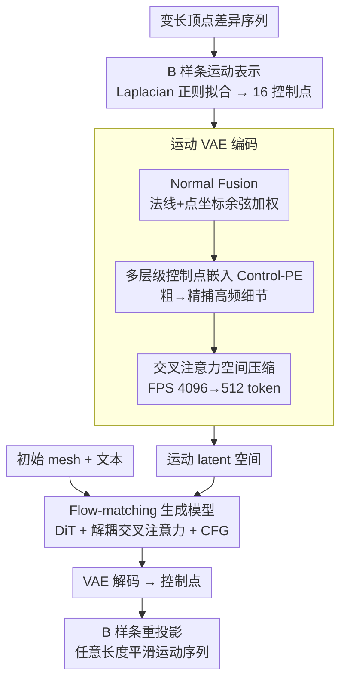

<!-- 由 src/gen_stubs.py 自动生成 -->
# BiMotion: B-spline Motion for Text-guided Dynamic 3D Character Generation

**会议**: CVPR2026  
**arXiv**: [2602.18873](https://arxiv.org/abs/2602.18873)  
**代码**: [项目主页](https://wangmiaowei.github.io/BiMotion.github.io/)  
**领域**: 图像生成 / 动态3D生成  
**关键词**: B-spline, 运动生成, 文本引导, 3D角色动画, VAE-latent diffusion, 控制点表示

## 一句话总结

提出 BiMotion，用连续可微的 B 样条曲线将变长运动序列压缩为固定数量控制点，配合专用 VAE 和 flow-matching 扩散模型，实现快速、高表达力、语义完整的文本引导动态 3D 角色生成，在质量和效率上均超越现有方法。

## 背景与动机

1. **动态 3D 生成需求旺盛**：游戏、影视、教育等领域对文本驱动的 3D 角色动画需求日益增长，将运动生成与形状合成解耦是当前主流范式
2. **固定长度输入瓶颈**：现有前馈方法（如 AnimateAnyMesh）采用 VAE-latent diffusion，要求固定大小输入，只能裁剪或均匀下采样运动序列
3. **裁剪导致语义缺失**：截断变长序列只能捕捉孤立子动作（如"向右旋转"），无法表达用户描述的完整运动语义
4. **下采样产生抖动**：均匀时间下采样导致非平滑、抖动的运动结果
5. **离散逐帧表示是根本瓶颈**：运动本质上是连续的，帧数仅反映采样率，语义不因帧数变化而改变，需要连续紧凑参数化
6. **缺乏高质量标注数据**：现有数据集缺少多样化的变长运动序列与高质量文本描述的配对

## 方法详解

### 整体框架

BiMotion 要解决的核心矛盾是：固定容量的前馈生成模型（VAE-latent diffusion）只能吃固定长度输入，可运动序列天生变长，硬裁剪会丢语义、硬下采样会抖。它的破法是把「帧」这个离散表示换成连续的 B 样条曲线——不管原序列多少帧，都拟合成固定数量的控制点。训练时，变长顶点差异序列先经 B 样条拟合成控制点，VAE 把控制点编码成运动 latent，flow-matching 扩散模型学习「初始形状 + 文本 → 运动 latent」的条件生成；推理时给定初始 mesh 和文本，扩散生成 latent、VAE 解回控制点、B 样条再重投影成任意长度的运动序列。

### 关键设计

**1. B 样条运动表示：把变长序列压成定长控制点，还能任意重采样**

逐帧表示的根本毛病是帧数和语义绑死，裁剪/下采样都在破坏运动本身。BiMotion 对每个顶点的差异轨迹独立拟合均匀三次 B 样条（$d=3$），统一用 $k=16$ 个控制点表示。难点在短序列：当 $k > T$ 时拟合系统欠定，于是引入二阶差分算子 $\mathbf{L}$ 做 Laplacian 正则化，闭式解经 Cholesky 分解高效求得（200 帧、50K 顶点下 < 1 秒）。B 样条的连续可微保证轨迹自然、局部可控、且支持时间重参数化，因此同一组控制点能采样出任意长度且平滑的运动——这正是固定容量模型处理变长序列的关键。

**2. Normal Fusion：用法线区分「长得近但结构不同」的部件**

只靠点坐标，空间上贴近、网格结构却不同的运动部件容易混淆。Normal Fusion 把表面法线经 MLP 编码后，与点坐标特征按逐点余弦相似度加权融合，比依赖 mesh-connectivity 的做法更稳定，也是后面消融里把重建误差从 1.328 压到 1.078 的主力。

**3. 多层级控制点嵌入 Control-PE：从粗到精抓住尾巴摆动这类细节**

标准频率位置编码抓不住精细运动。受小波包分解启发，Control-PE 构建从粗到精的控制点层级 [17,15,13,11,9,7,5,4]，逐级提取高频残差并与最粗级系数拼接，通过单次矩阵乘法高效算出。它显著优于传统频率编码，能捕捉像狮子尾巴摆动这种高频细节。

**4. 交叉注意力空间压缩：把上万点压成 512 token 再编码**

为压缩计算，FPS 采样把 $n=4096$ 个点降到 $n'=512$ 个 token，编码器用 8 层交叉注意力、解码器用 8 层自注意力完成 latent 的编解码。

**5. Flow-matching 生成模型：解耦交叉注意力融合文本与形状**

运动 latent 的生成基于 Rectified Flow-Matching，主干是 12 层 DiT block。初始 latent $\mathbf{z}_0$ 与运动 latent 拼接后，通过解耦交叉注意力分别融合文本条件（CLIP ViT-L/14）和形状条件，推理时用 classifier-free guidance（$\gamma=3.0$）。

### 损失函数

VAE 的总损失把拟合、对应、刚性和正则四项加权组合：

$$\mathcal{L}_{VAE} = \mathcal{L}_{Fit} + 0.3 \cdot \mathcal{L}_{Corr} + 0.1 \cdot \mathcal{L}_{Rigid} + 2 \times 10^{-5} \cdot \mathcal{L}_{KL}$$

| 损失 | 作用 |
|------|------|
| $\mathcal{L}_{Fit}$ (Charbonnier) | 拟合输入控制点 |
| $\mathcal{L}_{Corr}$ (Correspondence) | B 样条重投影后拟合原始差异轨迹，早期收敛更快 |
| $\mathcal{L}_{Rigid}$ (Local Rigidity) | 强制相邻帧的局部距离一致，保持形状身份 |
| $\mathcal{L}_{KL}$ | 正则化 latent 分布 |

## 实验关键数据

### 数据集 BIMO

- **38,944** 条运动序列，总计 **3,682,790** 帧
- 来源：DeformingThings4D (1,770) + ObjaverseV1 (10,550) + ObjaverseXL (26,624)
- 文本标注：DeformingThings4D 人工标注 + Objaverse GPT-5 自动标注（含 inspector 迭代校验）

### 主实验结果

| 方法 | OC↑ | SC↑ | AQ↑ | DD↑ | TA(用户)↑ | MP(用户)↑ | ME(用户)↑ | 时间↓ | 显存↓ |
|------|-----|-----|-----|-----|-----------|-----------|-----------|-------|-------|
| GVFDiffusion | 0.167 | 0.920 | 0.505 | 0.650 | 2.34 | 2.30 | 2.44 | 2.1min | 14.1GB |
| AnimateAnyMesh | 0.155 | 0.951 | 0.514 | 0.100 | 2.31 | 2.69 | 2.44 | 16.8s | 3.1GB |
| V2M4 | 0.175 | 0.876 | 0.478 | 0.750 | 2.88 | 2.71 | 3.05 | 1.7h | 48.4GB |
| **BiMotion** | **0.187** | 0.948 | **0.529** | **0.800** | **4.10** | **4.06** | **4.05** | **4.4s** | **1.2GB** |

- 用户研究三项指标均大幅领先（约 4.0 vs 第二名 ~2.9），标准差最低
- 速度比 AnimateAnyMesh 快 **3.8×**，显存仅 **1.2 GB**
- 网格顶点从 9K 增至 24K 时，BiMotion 时间/显存几乎不变，AnimateAnyMesh 线性增长

### 消融实验

| 配置 | 重建误差 (×10⁻²) |
|------|-------------------|
| 无 B-spline + 无所有 | 3.237 |
| 无 B-spline + 有 NF/Corr/Rigid | 2.674 |
| 有 B-spline 无 NF | 1.328 |
| 有 B-spline 无 Control-PE | 1.648 |
| 有 B-spline 无 Corr | 1.303 |
| 有 B-spline 无 Rigid | 1.349 |
| **完整模型** | **1.078** |

- B 样条表示对重建质量提升最大（3.237 → 1.328）
- Normal Fusion 对空间区分贡献显著（1.328 → 1.078）
- Laplacian 正则化在短序列 (T<k) 优于 Ridge 正则化

## 亮点

- **精巧的表示设计**：B 样条将变长运动→固定控制点，优雅解决了固定容量模型处理变长序列的根本矛盾
- **效率极高**：4.4 秒生成、1.2 GB 显存，远超其他方法，且对网格复杂度不敏感
- **拓扑鲁棒**：dense-point 训练 + 法线融合使方法不依赖特定 mesh 拓扑，同一模型对不同网格化的输入仍产生一致运动
- **多层级嵌入创新**：受小波分解启发的控制点嵌入显著优于标准频率编码
- **高质量数据管线**：构建 39K 级别带丰富标注的运动数据集，自动标注管线含 inspector 迭代校验

## 局限与展望

- 对高频复杂运动（如快速振动）表达能力受限，需增加控制点数量
- 假设固定拓扑 mesh，不支持拓扑变化的运动（如分裂、流体等）
- 依赖大规模高质量动态 3D 数据和算力
- 步行等运动可能表现为"原地踏步"，缺少全局位移建模

## 与相关工作的对比

| 方法 | 运动表示 | 输入条件 | 变长支持 | 前馈 |
|------|----------|----------|----------|------|
| AnimateAnyMesh | 逐帧顶点 token | 文本+mesh | ✗ (固定裁剪) | ✓ |
| GVFDiffusion | 3D Gaussian | 视频 | ✗ | ✓ |
| V2M4 | 单目视频重建 | 视频 | ✗ (优化) | ✗ |
| DNF | 4D INR | 无条件 | ✓ | ✗ |
| Puppeteer | 骨骼驱动 | 视频+mesh | ✗ | ✗ |
| **BiMotion** | **B 样条控制点** | **文本+mesh** | **✓** | **✓** |

- AnimateAnyMesh 是最直接竞品，同为文本+mesh 前馈生成；BiMotion 通过 B 样条突破其固定帧裁剪限制
- 视频条件方法（GVFDiffusion、V2M4）受视频质量影响大且效率低
- 骨骼方法（Puppeteer）需要精确 rigging，对通用角色泛化差

## 评分

- 新颖性: ⭐⭐⭐⭐ — B 样条运动表示 + 多层级嵌入是新颖且合理的设计
- 实验充分度: ⭐⭐⭐⭐⭐ — VBench + 用户研究 + 全面消融 + 多基线对比 + 效率分析
- 写作质量: ⭐⭐⭐⭐ — 逻辑清晰、公式推导完整、图表丰富
- 价值: ⭐⭐⭐⭐ — 表示层面的贡献有普适性，可迁移到其他运动生成任务

<!-- RELATED:START -->

## 相关论文

- [\[CVPR 2026\] InterEdit: Navigating Text-Guided Multi-Human 3D Motion Editing](interedit_navigating_textguided_multihuman_3d_moti.md)
- [\[CVPR 2026\] Vinedresser3D: Agentic Text-guided 3D Editing](vinedresser3d_agentic_text-guided_3d_editing.md)
- [\[ECCV 2024\] Local Action-Guided Motion Diffusion Model for Text-to-Motion Generation](../../ECCV2024/image_generation/local_action-guided_motion_diffusion_model_for_text-to-motion_generation.md)
- [\[ICCV 2025\] TeRA: Rethinking Text-guided Realistic 3D Avatar Generation](../../ICCV2025/image_generation/tera_rethinking_text-guided_realistic_3d_avatar_generation.md)
- [\[CVPR 2026\] SeeThrough3D: Occlusion Aware 3D Control in Text-to-Image Generation](seethrough3d_occlusion_aware_3d_control_in_text-to-image_generation.md)

<!-- RELATED:END -->
