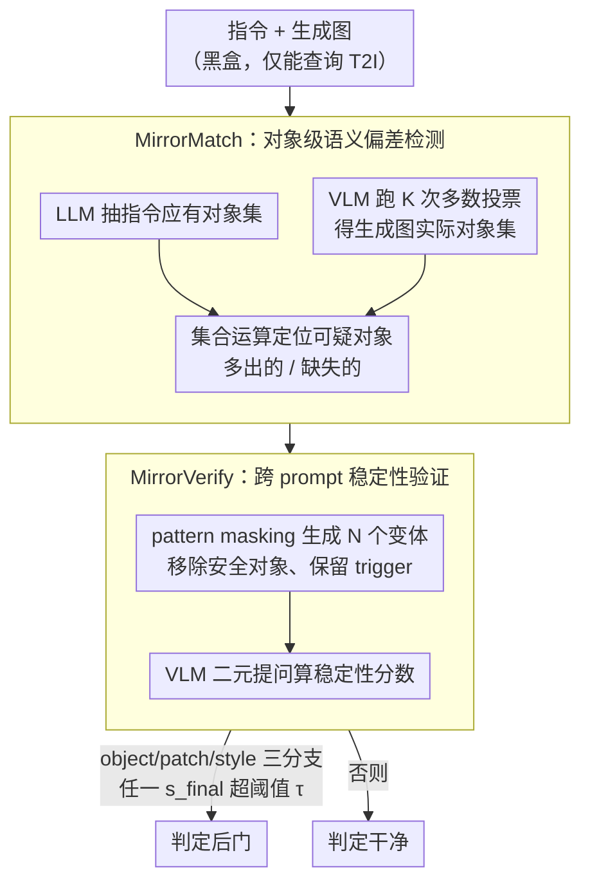

<!-- 由 src/gen_stubs.py 自动生成 -->
# BlackMirror: Black-Box Backdoor Detection for Text-to-Image Models via Instruction-Response Deviation

**会议**: CVPR2026  
**arXiv**: [2603.05921](https://arxiv.org/abs/2603.05921)  
**代码**: [GitHub](https://github.com/Ferry-Li/BlackMirror)  
**领域**: 图像生成  
**关键词**: 后门检测, 文本到图像模型, 黑盒检测, 视觉语言模型, 模型安全

## 一句话总结

提出 BlackMirror 框架，通过细粒度的指令-响应语义偏差检测（MirrorMatch）和跨 prompt 稳定性验证（MirrorVerify）两阶段流程，在黑盒条件下实现对 T2I 模型多种后门攻击的通用检测，F1 平均达 89.46%，大幅超越已有黑盒方法 UFID。

## 研究背景与动机

**T2I 后门威胁日益严峻**：文本到图像扩散模型广泛部署于 MaaS 平台，攻击者可通过训练阶段注入后门，使模型在遇到特定 trigger 时生成偏离用户意图的图像（如替换对象、插入补丁、改变风格、生成固定图像）。

**黑盒场景是实际需求**：现实中用户无法访问模型权重和架构，现有白盒方法（T2IShield、GrainPS、NaviDet 等依赖注意力图或神经元激活）在此场景下不可用。

**唯一黑盒方法 UFID 假设过强**：UFID 假设后门触发后的生成图像全局高度相似，仅对 FixImgAtt（生成固定图像）有效；对 ObjRepAtt、PatchAtt、StyleAtt 等只修改局部语义的攻击，生成结果在嵌入空间中仍然分散，UFID 检测失败。

**全局相似度度量不敏感**：使用 CLIP 计算指令-响应相似度作为 baseline，实验表明在 BadT2I、EvilEdit 等攻击中后门样本和干净样本的相似度评分高度重叠，无法区分。

**后门攻击的两个关键属性**：作者发现（1）后门触发产生指令-响应语义偏差（部分 pattern 被操纵），（2）偏差在不同 prompt 变体下保持稳定；而模型固有偏差不具备 cross-prompt 稳定性。

**MaaS 平台需要即插即用方案**：需要一种免训练、无需模型内部信息、可解释的通用检测方案，能同时覆盖 object/patch/style 级别攻击。

## 方法详解

### 整体框架

BlackMirror 针对的是黑盒场景下的 T2I 后门检测：用户访问不到权重和注意力图，唯一黑盒前作 UFID 又假设「后门生成的图全局高度相似」，只能抓 FixImgAtt 那种生成固定图的攻击，碰到只改局部语义的 ObjRepAtt / PatchAtt / StyleAtt 就失效。BlackMirror 抓住后门的两个属性——触发会造成指令-响应的语义偏差、且偏差在不同 prompt 下稳定（模型固有偏差则不稳定）——设计成两段流程：MirrorMatch 先从生成图里挖出细粒度的可疑对象，MirrorVerify 再验证这个偏差在多次生成中稳不稳定。检测时对 object / patch / style 三条分支（$t=3$）并行跑，任一分支报警即判后门。

### 关键设计

**1. MirrorMatch：把指令和生成图对齐到对象级，挖出语义偏差**

UFID 用 CLIP 算全局相似度太粗，后门样本和干净样本的分数高度重叠、根本分不开。MirrorMatch 改用对象级比对：先用 LLM $f_l(\cdot)$（Qwen-8B）从指令 $x$ 抽出应有的视觉对象集合 $\mathcal{O}_{\text{ins}}$，再用 VLM $f_v(\cdot)$（Qwen2.5-VL-7B）对生成图独立跑 $K$ 次、按多数投票（出现 $\geq \lceil K/2 \rceil$ 次）得到实际对象集合 $\mathcal{O}_{\text{res}}$ 以滤掉背景噪声。两个集合一交一减就定位出可疑点：$\mathcal{O}_{\text{safe}} = \mathcal{O}_{\text{ins}} \cap \mathcal{O}_{\text{res}}$ 是安全对象，$\mathcal{O}_{\text{new}} = \mathcal{O}_{\text{res}} \setminus \mathcal{O}_{\text{safe}}$ 是凭空多出来的（可能被插入），$\mathcal{O}_{\text{lost}} = \mathcal{O}_{\text{ins}} \setminus \mathcal{O}_{\text{safe}}$ 是该有却没有的（可能被替换掉）。这样即便后门只改局部，偏差也能被精确捕捉。

**2. MirrorVerify：用 prompt 扰动验证偏差稳不稳定，压掉误报**

光有偏差还不够——模型本身的随机性也会造成偶发偏差。MirrorVerify 检验偏差是否「跨 prompt 稳定」：从原 prompt 里随机移除 $\mathcal{O}_{\text{safe}}$ 中的对象（pattern masking）但保留 trigger，生成 $N$ 个 prompt 变体及对应图像；对每个可疑对象 $o$，用 VLM 二元提问「Does the image contain [object]?」，从 yes/no logits 算置信度 $s^{(i)}(o)$，新增对象取平均出现概率 $s_{\text{new}}(o)$、缺失对象取平均缺失概率 $s_{\text{lost}}(o)$。最终稳定性分数 $s_{\text{final}} = \max\{s_{\text{new}}, s_{\text{lost}}\}$ 超过阈值 $\tau$ 才判后门。真正的后门偏差在各种 prompt 下都稳定复现、得分高，模型固有偏差则忽有忽无被过滤掉——消融里去掉这一步，几乎所有攻击的 FPR 都飙到 100%。

### 损失 / 阈值选择

- 全程无训练损失，核心超参是阈值 $\tau$，实验中 $\tau=0.999$ 在精确率和召回率间最平衡
- 生成次数 $N=5$ 是精度与效率的折中点

## 实验

### 实验设置

- 基础 T2I 模型：Stable Diffusion v1.5
- 攻击类型覆盖：ObjRepAtt（BadT2I/EvilEdit/PaaS/Rickrolling-TPA）、FixImgAtt（VillanDiffusion）、PatchAtt（BadT2I）、StyleAtt（BadT2I/Rickrolling-TAA）
- 每个 clean-target pair 生成 200 个 prompt，50% 含 trigger
- 硬件：2× RTX 3090

### 主要结果

| 方法 | 类型 | F1 Avg (↑) | FPR Avg (↓) |
|------|------|-----------|-------------|
| T2IShield† | 白盒 | 47.31 | 45.30 |
| GrainPS† | 白盒 | 91.29 | 8.10 |
| NaviT2I† | 白盒 | 87.14 | 9.27 |
| UFID | 黑盒 | 72.29 | 48.78 |
| CLIP baseline | 黑盒 | 65.55 | 42.50 |
| **BlackMirror** | **黑盒** | **89.46** | **15.09** |

### 消融实验

| 配置 | FPR Avg (↓) |
|------|-------------|
| w/o MirrorVerify | 93.06 |
| w/ MirrorVerify | 15.09 |

去掉 MirrorVerify 后几乎所有攻击的 FPR 飙升至 100%，证明稳定性验证不可或缺。

### 关键发现

1. **ObjRepAtt 提升最大**：在 BadT2I 上 F1 从 66.67%→86.96%，EvilEdit 上从 60.87%→85.71%，FPR 降至 <5%，证明细粒度 pattern 匹配的优势。
2. **投票机制双赢**：多数投票平均降低 FPR 约 5%，同时处理时间减少约 4 秒/样本（通过缩小可疑集合减少 VLM 查询次数）。
3. **生成次数 $N$ 的影响**：$N=1$ 时无法区分偶发噪声与稳定偏差，$N=5$ 后性能趋于饱和。
4. **黑盒超越部分白盒**：BlackMirror 的 F1 (89.46%) 超过白盒 T2IShield (47.31%) 和 NaviT2I (87.14%)，逼近 GrainPS (91.29%)。
5. **VLM 查询数极少**：MirrorVerify 阶段平均仅需 3.14 次 VLM 查询，计算开销与 UFID 相当甚至更低。

## 亮点

- 首个通用黑盒 T2I 后门检测框架，覆盖 object/patch/style/fiximg 四类攻击
- 免训练、即插即用，适合 MaaS 部署
- 两阶段设计（偏差检测 + 稳定性验证）逻辑清晰，可解释性强
- 利用 VLM 的语义理解能力取代粗粒度的嵌入相似度，思路新颖
- 多数投票和 pattern masking 策略设计精巧，兼顾精度和效率

## 局限性

- 检测能力受限于 VLM 的视觉理解能力，对 VLM 难以识别的细微 style 变化可能漏检
- 在 FixImgAtt（VillanDiffusion）上 FPR 为 28.12%，略逊于 UFID 的 0%，因为全局相似度恰好是该攻击的强信号
- 需要多次调用 T2I 模型生成图像（$N=5$），在高延迟 API 场景下成本不低
- 阈值 $\tau=0.999$ 需要较高的 VLM 置信度，对 VLM 输出校准敏感
- 仅在 SD v1.5 上验证，对 SDXL、DALL-E 等更大模型的泛化性待验证

## 相关工作

- **后门攻击**：TrojDiff/BadDiffusion（噪声注入）→ VillanDiffusion（统一框架）→ Rickrolling/EvilEdit/BadT2I/PaaS（T2I 文本编码器/交叉注意力/数据投毒攻击），趋势从固定图像攻击转向局部语义操纵
- **白盒防御**：T2IShield（注意力图）、GrainPS（注意力投影一致性）、NaviDet（神经元激活监控）、TPD（prompt 扰动削弱 trigger）
- **黑盒防御**：UFID 是唯一前作，基于全局图像相似度，仅对 FixImgAtt 有效
- **VLM 辅助安全**：本文开创性地将 VLM 用于后门检测的语义对齐与验证

## 评分

- 新颖性: ⭐⭐⭐⭐ — 将 VLM 引入黑盒后门检测，偏差+稳定性两阶段范式新颖
- 实验充分度: ⭐⭐⭐⭐ — 覆盖 8 种攻击方法、4 类后门类型，消融详尽
- 写作质量: ⭐⭐⭐⭐ — 动机-方法-实验逻辑连贯，图表丰富
- 价值: ⭐⭐⭐⭐ — MaaS 场景下实际需求明确，框架通用性强

<!-- RELATED:START -->

## 相关论文

- [\[CVPR 2026\] CSF: Black-box Fingerprinting via Compositional Semantics for Text-to-Image Models](csf_black-box_fingerprinting_via_compositional_semantics_for_text-to-image_model.md)
- [\[CVPR 2026\] Black-box Membership Inference Attacks on the Pre-training Data of Image-generation Models](black-box_membership_inference_attacks_on_the_pre-training_data_of_image-generat.md)
- [\[CVPR 2025\] Where's the Liability in the Generative Era? Recovery-Based Black-Box Detection of AI-Generated Content](../../CVPR2025/image_generation/wheres_the_liability_in_the_generative_era_recovery-based_black-box_detection_of.md)
- [\[CVPR 2026\] AutoDebias: An Automated Framework for Detecting and Mitigating Backdoor Biases in Text-to-Image Models](autodebias_automated_framework_for_debiasing_text-to-image_models.md)
- [\[ICML 2026\] Support-Proximity Augmented Diffusion Estimation for Offline Black-Box Optimization](../../ICML2026/image_generation/support-proximity_augmented_diffusion_estimation_for_offline_black-box_optimizat.md)

<!-- RELATED:END -->
