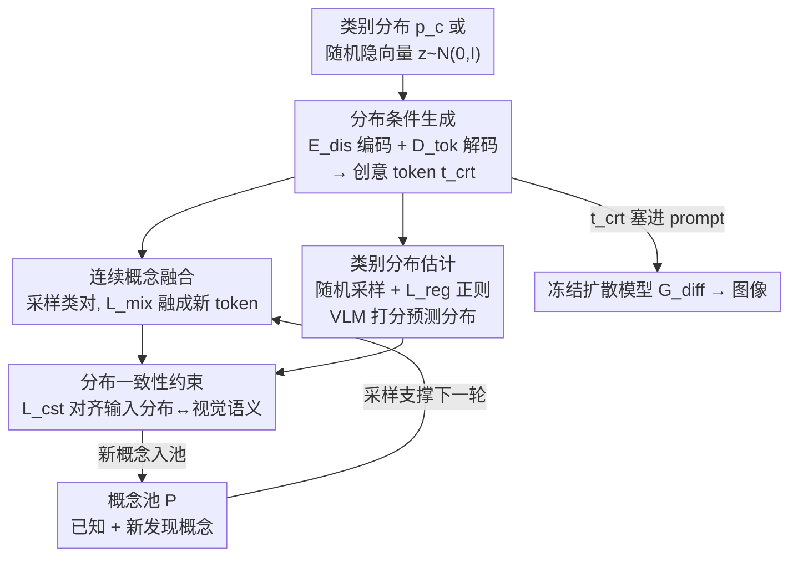

# Breaking Semantic Boundaries: Distribution-Guided Semantic Exploration for Creative Generation

**会议**: CVPR 2026  
**论文**: [CVF Open Access](https://openaccess.thecvf.com/content/CVPR2026/html/Feng_Breaking_Semantic_Boundaries_Distribution-Guided_Semantic_Exploration_for_Creative_Generation_CVPR_2026_paper.html)  
**代码**: 未公开  
**领域**: 扩散模型 / 创意图像生成  
**关键词**: 创意生成, 分布条件生成, 概念融合, 语义探索, 编码器-解码器  

## 一句话总结
把"生成全新概念"重新表述为"以类别分布为条件的图像合成"，用一个轻量 encoder–decoder（DisTok）把任意类别分布或随机隐向量解码成可塞进 prompt 的"创意 token"，统一了可控的条件探索与开放式的无条件探索，在创意生成的文图对齐与人类偏好上达到 SOTA，且比同类方法快 13–40 倍。

## 研究背景与动机

**领域现状**：Stable Diffusion 3、FLUX、Midjourney 这类文生图（T2I）模型已经能把自然语言 prompt 渲染成语义对齐、画质精致的图像。但它们的能力本质上来自对训练分布的拟合——擅长"复现"已知视觉概念，却很难合成训练分布之外、真正"没见过"的新概念。

**现有痛点**：为了让模型更有"创造力"，已有工作走语义探索路线，但都被卡在两类局限里。一类（BASS、CreTok、AGSwap）通过**组合两个已知概念**来造新概念——可控，但只能在离散的"概念对"里打转，生成结果仍然是语言可描述的、落在熟悉语义空间内的东西，没真正打破语义边界。另一类（ConceptLab）通过迭代优化把 token 推离已知类别，能探到新语义空间，但这种**无条件**方式抛弃了人类先验，生成什么不可控，且每个概念要梯度搜索约 120 秒，慢且容易收敛到稀疏重复的簇。

**核心矛盾**：可控性和"真正的新颖性/开放性"之间存在 trade-off——要可控就被锁死在已知概念的离散组合里，要开放就失去人类意图的引导。如何既打破语义边界、又保持可控的创意生成，是没被解决的。

**切入角度**：作者从分类器的一个现象出发——当分类器遇到模糊或分布外输入时，输出的不是一个硬标签，而是一组覆盖多个已知类的**软概率分布**（比如某个怪物"55% 像猪、25% 像羊、20% 像蛇"）。这说明一个"语义未知"的新概念，往往可以被一组已知类别上的分布近似刻画。

**核心 idea**：把分类过程**反过来**——不再是"图像 → 类别分布"，而是"类别分布 → 图像"。作者把这称为 **Distribution-Conditional Generation**：以一组已知类上的连续分布为条件来合成图像，于是可以用细粒度、可调的分布权重去控制多概念融合，又因为分布本身可以取任意连续值（甚至随机采样），天然把"可控的条件探索"和"开放的无条件探索"统一在同一个空间里。

## 方法详解

### 整体框架

DisTok 是一个极轻量的 encoder–decoder（两个隐藏维 768、隐空间维 20 的两层 MLP），夹在已有 T2I 扩散模型之外，本身不改扩散模型。它包含两个部件：**分布编码器** $E_{dis}$ 把一个类别分布 $p_c \in \Delta^K$ 映射到隐向量 $z = E_{dis}(p_c) \in \mathbb{R}^\omega$；**创意解码器** $D_{tok}$ 再把隐向量解码成一个"创意 token" $t_{crt} = D_{tok}(z) \in \mathbb{R}^d$（$\omega \ll d$）。这个 token 可以直接嵌进自然语言 prompt（如 "a photo of a `<tcrt>`"），交给冻结的扩散模型 $G_{diff}$ 渲染成图 $x_{crt} = G_{diff}(t_{crt})$，所以生成出的概念能在不同场景、风格里复用并保持一致。

训练围绕一个动态的**概念池 $P$** 展开：$P$ 初始化为已知概念的 token，训练过程不断往里添加"新发现的概念"（token + 其 VLM 预测的分布），从而让后续融合能逐步合成越来越复杂的分布。每个训练步随机执行三件事之一：**连续概念融合**（采样一对类、训练把它们融成一个 token）、**类别分布估计**（随机采隐向量解码成新概念、用 VLM 打分后入池）、**分布一致性约束**（用池里的新概念监督编码器，把输入分布和图像视觉语义对齐）。三者协同，让 DisTok 既能学会"按分布造概念"，又能保证造出的概念在视觉上真的对应那个分布。

### 关键设计

**1. Distribution-Conditional Generation：用"类别分布"刻画说不清的新概念**

这是全文的范式级创新，针对的痛点是"语义未知的概念怎么表示"。已有方法要么只能融合两个离散概念（语言可描述、跳不出已知空间），要么无条件乱探（不可控）。作者的做法是把分类器的软输出反用：一个新概念被建模成一组已知类上的连续分布 $p_c$（例如 $(0.55\text{ 猪}, 0.25\text{ 羊}, 0.20\text{ 蛇})$），生成任务就是"以 $p_c$ 为条件合成图像"。这样做的好处是双重的：分布权重提供了**细粒度可控**的多概念融合旋钮（能调比例、能融三个以上概念，而 SD3/FLUX 对 "55% pig" 这种比例几乎无感）；同时分布是连续量，可以从已知类的真实分布平滑过渡到任意采样的分布，于是**可控探索和开放探索被统一进同一个隐空间**——这正是后面 DisTok 能同时做条件/无条件生成的根基。

**2. Continuous Concept Fusion：没有现成训练数据，就用"概念对融合"自举出可描述的分布**

要训练 $E_{dis}/D_{tok}$ 没有"分布→图像"的现成监督数据，作者用概念对融合来制造伪监督。从概念池采一对概念 $c_1,c_2$，取其 token 相加编码 $z = E_{dis}(t_1+t_2)$ 再解码出 $t_{crt}$；用一个自适应 prompt $q_a=$ "a photo of a `<tcrt>`" 去对齐限制性 prompt $q_r=$ "a $c_1$ $c_2$"，并额外加一句 $q_s=$ "a photo of a cute pet" 把结果拉向人类偏好的审美。朴素的融合损失是 $\tilde{L}_{mix}=(1-\cos(E(q_r),E(q_a)))+(1-\cos(E(q_s),E(q_a)))$。但直接最小化会让模型"偷懒"——只强调其中一个主导概念就能虚高相似度。为此引入阈值截断：

$$L_{mix}=\big(1-\min[\cos(E(q_r),E(q_a)),\varepsilon_1]\big)+\big(1-\min[\cos(E(q_s),E(q_a)),\varepsilon_2]\big)$$

$\varepsilon_1,\varepsilon_2$（设为 0.85 / 0.80）封顶了允许的最大相似度，超过就不再奖励，迫使模型均衡照顾两个概念而非压垮一边。因为"复杂分布 = 简单分布递归融合"（先融 $(c_1,c_2)$ 成中间概念再和 $c_3$ 融），不断把融出的新概念回收进池，DisTok 就能从两概念融合一路逼近任意多概念的复杂分布。

**3. Class Distribution Estimation：随机采样 + 隐空间正则，让无条件探索也"有意义"**

$L_{mix}$ 只是 prompt 层面的间接监督，不约束每个类在 token 里的具体占比，细粒度控制不够。这一步引入直接的视觉侧监督，同时打通无条件探索。具体地，从标准高斯随机采隐向量 $z\sim N(0,I)$，解码成 $t_{crt}$ 并渲染成图 $x_{crt}$，用预训练 VLM（BLIP）以 "What animal is in the photo?" 询问，取其在已知概念集上的输出 logits 做 softmax 得到视觉分布 $p_{crt}(c)=\mathrm{softmax}(p_{vlm}(c|x_{crt}))$。为了保证"随机采的 $z$ 解码出来是有意义的概念而不是语义噪声"，对隐空间正则：

$$L_{reg}=\frac{1}{\sigma(z)^2}\,\mathbb{E}_z\big[\,\|\mu(z)\|_2^2\,\big]$$

它把隐空间逼向**零均值、足够方差**，既防模式坍缩又保多样性。代价是：训练后可以从任意零均值单位方差分布（高斯、拉普拉斯、柯西）直接采样生成，无需迭代优化。满足新颖性阈值 $\max_c p_{crt}(c)<\tau$（$\tau=0.85$，即"不太像任何单一已知类才算新概念"）的 token 连同其分布作为新概念 $(t_{nvl},p_{nvl})$ 存入池 $P$，喂给后续更高阶的融合与一致性监督。

**4. Distribution Consistency Enforcement：把生成 token 显式锚定到视觉语义**

有了带 VLM 预测分布的新概念后，作者用它给编码器加一条**直接**的一致性监督，弥补 $L_{mix}$ 的间接性。采样一个新概念 $(t_{nvl},p_{nvl})$，按其分布对相关已知 token 加权组合 $\sum_i p_{nvl}(i)\,t_i$，编码成 $z=E_{dis}(\sum_i p_{nvl}(i)\,t_i)$ 再解码出 $t_{crt}$，要求它在文本嵌入空间里贴近原始的 $t_{nvl}$：

$$L_{cst}=1-\cos(E(t_{crt}),E(t_{nvl}))$$

与概念融合的间接监督不同，这条损失把"创意 token"显式锚在视觉语义上——因为 $p_{nvl}$ 本就是从生成图像里用 VLM 读出来的真实视觉分布，对齐它等于强迫 $E_{dis}$ 忠实捕捉"分布语义"，从而保证生成概念既视觉新颖、又和多概念组合的语义一致。消融里去掉这条损失，输入分布与 BLIP 预测分布之间的 KL 散度从 0.060 升到 0.073，证明它对细粒度语义一致性是关键。

### 损失函数 / 训练策略
每个训练 iteration 含 $n$ 个采样步，每步随机执行概念融合或分布一致性约束（二选一），联合优化 $E_{dis}$ 和 $D_{tok}$：

$$L_{total}=\frac{1}{n}\sum_{i=1}^{n}\Big(\alpha\,\mathbb{I}^{(i)}_{mix}L^{(i)}_{mix}+\beta\,\mathbb{I}^{(i)}_{cst}L^{(i)}_{cst}+\gamma\,L^{(i)}_{reg}\Big)$$

其中 $\mathbb{I}_{mix}+\mathbb{I}_{cst}=1$（每步只走一条路）。基于 Kandinsky 2.1（文本编码器 CLIP-L/14），在单张 4090 上训练 20K 步、batch=1、梯度累积 $n=8$，约 30 分钟即可；超参 $\alpha=1,\beta=1,\gamma=0.001,\tau=0.85$。训练完直接前向生成创意 token，无需对每个新概念再优化——这是它相对 BASS/ConceptLab 提速 13–40 倍的来源。

## 实验关键数据

数据集用 CangJie（60 个常见概念，含 30 个用于双概念组合的文本对）；作者额外随机加权组合出 30 个类别分布来评测分布条件生成。指标用 VQAScore（文图对齐）、PickScore（审美）、ImageReward（人类偏好），并加 GPT-4o 评测与 100 人用户研究。

### 主实验

文图对齐与人类偏好（Table 1，⇑ 越高越好；末列 DisTok 为类别分布条件下结果）：

| 指标 | BASS（类对） | CreTok（类对） | DisTok（类对） | DisTok（分布） |
|------|------|------|------|------|
| VQAScore | 0.667 | 0.695 | **0.840** | 0.734 |
| PickScore | 21.67 | 21.97 | **22.33** | 21.23 |
| ImageReward | 0.387 | 1.018 | **1.168** | 0.661 |

在双概念（TP2O）任务上，DisTok 全面超过专门方法 BASS 和 CreTok；分布条件这一更难的新任务上指标略低，作者指出现有指标对强分布外创意会低估，但 VQAScore 仍体现了它对细粒度分布条件的把握。

GPT-4o 创意评测（Table 2，分布条件任务，0–10）：

| 模型 | 概念整合 | 对齐 | 原创性 | 审美 | 综合 |
|------|------|------|------|------|------|
| SD 3 | 6.3 | 5.7 | 5.8 | 8.0 | 6.5 |
| Kandinsky | 7.7 | 7.4 | 7.3 | 8.6 | 7.8 |
| FLUX | 8.0 | 7.7 | 8.0 | 8.8 | 8.1 |
| **DisTok** | **9.2** | **9.2** | **9.8** | **9.9** | **9.5** |

DisTok 在分布条件生成上大幅领先所有 SOTA 扩散模型，尤其原创性与审美。用户研究（Table 3，DisTok vs 各 baseline 的胜:负票数）中也几乎全胜，如对 FLUX 396:104、对 ConceptLab 308:192。

### 消融实验

| 配置 | KL↓（输入分布 vs BLIP 视觉分布） | 说明 |
|------|------|------|
| w/o 分布一致性约束 | 0.0732 | 去掉 $L_{cst}$，分布偏移变大 |
| Full DisTok | **0.0602** | 完整模型，细粒度语义更一致 |

效率对比（每概念生成耗时）：BASS ≈40s、ConceptLab ≈120s、CreTok ≈4s、**DisTok ≈3s**——分别约 13×、40× 提速。

### 关键发现
- **分布一致性约束是细粒度可控的关键**：去掉后 KL 从 0.060 涨到 0.073，输入分布与实际生成的视觉语义对不齐。
- **概念融合带来"复杂度递增"**：可视化 2K/3K/10K 步解码的 token，图像从简单拼接逐步演化到语义丰富、纠缠的复合概念，说明池 + 融合机制确实在累积复杂分布的建模能力。
- **隐空间正则解锁开放采样**：正则成零均值单位方差后，可从高斯/拉普拉斯/柯西任意采样；分布内采样已有多样性，跨分布采样进一步增大变异，而 ConceptLab 因只是把 token 推离已知类，结果是稀疏重复的簇。
- **超越语言表达**：把 DisTok 生成的概念用 GPT-4o 反写成详细 prompt 再喂回扩散模型，常出现构图缺陷或语义涣散——印证某些创意概念是"语言不可描述"的，token 表示比 prompt 工程更有表达力。

## 亮点与洞察
- **"反用分类器软标签"是极漂亮的视角转换**：把"分布外输入→软分布"这个分类器的副产品，反过来当成生成的条件，一句话就把不可名状的新概念变成了可调的连续旋钮，这是整篇的 aha 点。
- **训练即采样、推理零优化**：把昂贵的迭代搜索（BASS 候选过滤、ConceptLab 梯度搜索）一次性摊到 30 分钟训练里，之后单次前向出 token，工程上换来 13–40× 提速，对要批量造创意素材的场景很实用。
- **token 作为可复用语义锚点**：生成的 $t_{crt}$ 能塞进任意 prompt 做风格迁移而保持概念一致，这种"概念与风格解耦"的设计可迁移到个性化生成、可控编辑等任务。
- **用 VLM 当"软标注器"闭环自监督**：BLIP 读图给分布、再拿分布反向监督编码器，形成生成↔理解的闭环，是一种轻量获取细粒度监督的范式，可借鉴到其他缺标注的生成任务。

## 局限与展望
- **依赖已知类别集合**：分布定义在固定的已知概念上（CangJie 仅 60 类），"新颖"本质是已知类的连续插值/外推，能否表达完全独立于任何已知类的概念存疑 ⚠️。
- **VLM 监督的天花板**：分布估计与一致性都依赖 BLIP 的判别能力，VLM 看不准的细粒度类别会直接污染监督信号。
- **评测指标与任务错配**：作者自己承认现有 VQAScore/PickScore 对强分布外创意会低估，分布条件任务上指标反而低于类对任务，目前主要靠 GPT-4o + 用户研究佐证，客观性有限。
- **规模与领域**：实验集中在"动物类"概念与单一扩散底座（Kandinsky 2.1），扩展到更大类目、更复杂底座（SD3/FLUX 直接接入）的效果未充分验证。

## 相关工作与启发
- **vs BASS / CreTok（概念对融合）**：它们靠采样+候选过滤或共享 token 融合两个概念，可控但只能离散两两组合、CreTok 还对相似概念对输出近乎雷同。DisTok 在隐空间建模组合创意，支持任意多概念的连续分布、对相似对也能区分，且 ≈3s vs ≈40s。
- **vs ConceptLab（无条件探索）**：ConceptLab 靠梯度迭代把 token 推离已知类，开放但不可控、≈120s 且结果稀疏重复。DisTok 用正则化隐空间直接采样，既开放又快，分布更分散多样。
- **vs 扩散插值类（MagicMix / DiffMorpher / ATIH）**：它们在扩散过程里插值语义，难以复用为语言 prompt 且控制粒度粗。DisTok 直接产出可嵌入 prompt 的 token，支持跨场景/风格复用。

## 评分
- 新颖性: ⭐⭐⭐⭐⭐ "分布条件生成"范式把分类器软标签反用为生成条件，统一条件/无条件探索，视角新颖
- 实验充分度: ⭐⭐⭐⭐ 覆盖条件/无条件/风格/效率多维度，有 GPT-4o 与用户研究，但消融偏少、底座与类目单一
- 写作质量: ⭐⭐⭐⭐ 动机推导清晰、图示完整，公式记号略密
- 价值: ⭐⭐⭐⭐ 轻量、可控、提速明显，对创意素材生成与个性化有实用价值，受限于已知类集合

<!-- RELATED:START -->

## 相关论文

- [\[CVPR 2025\] Redefining <Creative> in Dictionary: Towards an Enhanced Semantic Understanding of Creative Generation](../../CVPR2025/image_generation/redefining_creative_in_dictionary_towards_an_enhanced_semantic_understanding_of_.md)
- [\[CVPR 2026\] Semantic Derivative Flow: Graph-Guided Diffusion for Controllable Instance Interactions](semantic_derivative_flow_graph-guided_diffusion_for_controllable_instance_intera.md)
- [\[CVPR 2026\] Unified Latent Space for Understanding and Generation via Semantic Auto-encoder](unified_latent_space_for_understanding_and_generation_via_semantic_auto-encoder.md)
- [\[CVPR 2026\] Style-GRPO: Semantic-Aware Preference Optimization for Image Style Transfer Guided by Reward Modeling](style-grpo_semantic-aware_preference_optimization_for_image_style_transfer_guide.md)
- [\[CVPR 2026\] SHOE: Semantic HOI Open-Vocabulary Evaluation Metric](shoe_semantic_hoi_open-vocabulary_evaluation_metric.md)

<!-- RELATED:END -->
