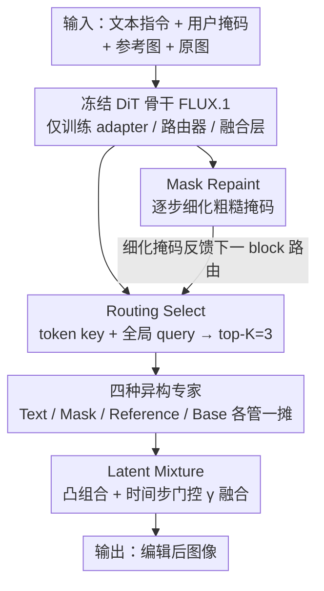

# CARE-Edit: Condition-Aware Routing of Experts for Contextual Image Editing

**会议**: CVPR2026  
**arXiv**: [2603.08589](https://arxiv.org/abs/2603.08589)  
**代码**: 待公开  
**领域**: 图像生成  
**关键词**: 图像编辑, Mixture-of-Experts, 条件感知路由, 扩散 Transformer, 多模态融合

## 一句话总结

提出 CARE-Edit，一种条件感知的专家路由框架，通过异构专家（Text/Mask/Reference/Base）配合轻量级 latent-attention 路由器，在 DiT 骨干上实现动态计算分配，有效解决统一图像编辑器中多条件信号（文本、掩码、参考图）冲突导致的颜色溢出、身份漂移等问题。

## 背景与动机

1. **统一编辑器的任务干扰**：现有统一扩散编辑器（如 OmniGen2、ACE++）使用固定共享骨干处理所有编辑任务，无法适应异构需求（局部 vs 全局、语义 vs 光度），导致不同任务之间相互干扰。

2. **静态融合的根本缺陷**：ControlNet 和 OmniControl 等方法通过简单拼接或加性 adapter 融合多模态条件（文本、掩码、参考图），无法根据去噪过程动态调整不同信号的优先级。这导致文本语义可能覆盖掩码约束，参考身份/风格被错误应用。

3. **条件信号的时变重要性**：在扩散去噪轨迹中，不同条件的重要性随时间步变化——早期步骤注重语义布局，后期步骤关注边界细化和风格一致性，但静态方法无法适应这种动态平衡。

4. **多条件冲突的具体表现**：颜色在掩码边界溢出（color bleeding）、参考图的身份或风格漂移（identity/style drift）、全局调整侵入应保留的区域、多条件输入下的不可预测行为。

5. **用户掩码质量不可控**：用户提供的粗糙掩码与目标对象边界往往不对齐，直接使用会导致编辑伪影，需要在去噪过程中动态细化掩码。

6. **MoE 在图像编辑中的应用不足**：已有的 diffusion MoE（如 EC-DiT）使用同构专家，缺乏针对不同模态/条件的异构专家设计，无法从根本上解决多条件冲突。

## 方法详解

### 整体框架

CARE-Edit 要解决统一图像编辑器的老毛病：一个固定共享骨干处理所有任务，文本、掩码、参考图这些异构条件被静态拼接在一起，结果文本语义盖过掩码约束、参考身份漂移、颜色在边界溢出。它的思路是在冻结的 DiT 骨干（FLUX.1 Dev）里塞进一套条件感知的专家路由，只训练轻量的 adapter、路由器和融合层。核心是四件事串起来：四种异构专家（Text/Mask/Reference/Base）各管一摊，Routing Select 按 token 和编辑目标动态挑专家，Mask Repaint 在去噪过程里逐步修粗糙掩码并把细化结果反馈回路由，Latent Mixture 把各专家输出按权重和时间步融合，让不同条件在去噪轨迹的不同阶段各司其职。

### 关键设计

**1. 四种异构专家：按模态分工，而不是一堆同构专家**

已有的 diffusion MoE（如 EC-DiT）用同构专家，解决不了多条件冲突。CARE-Edit 造了四种各管一摊的专家：Text 专家通过与文本 token 的交叉注意力做语义推理与对象合成；Mask 专家通过卷积结合细化掩码做空间精度与边界细化；Reference 专家通过 FiLM 调制从参考特征学身份/风格一致的变换；Base 专家通过与 base image 特征的交叉注意力维持全局一致性与背景保真。每个专家输出再经 LayerNorm + Linear 投影统一特征尺度。实验里也确实看到不同任务激活不同专家——Mask 专家主导结构编辑、Reference 专家主导风格迁移。

**2. Routing Select：token 级 Top-K 路由，让信号按需优先**

静态融合无法随去噪动态调权。Routing Select 给每个 token 算一个 token-specific key（编码局部信息）和一个 global conditioning query（编码编辑目标），经 MLP 得到各专家 logit、softmax 后取 top-K（$K=3$）个专家。为稳住训练，路由温度 $\tau$ 逐步退火、对 logit 做 EMA 平滑降方差，并固定比例 $\lambda_{\text{shared}}$ 的 token 始终走共享专家以防路由坍塌，最后用凸残差融合聚合输出。这样每个 token 都能挑到最该处理它的专家，冲突信号被抑制而非硬叠加。

**3. Mask Repaint：借去噪过程自己把粗糙掩码越修越准**

用户给的掩码常和目标边界对不齐，直接用会出伪影。Mask Repaint 在每个扩散步 $t$ 用当前 latent、参考编码和上一步预测掩码，经卷积估计残差掩码场 $\Delta m$，sigmoid 后叠加到旧掩码：$\hat{M}(t) = \text{clip}(\hat{M}(t-1) + \Delta m, 0, 1)$。训练时加边界一致性损失（梯度对齐 + 平滑正则）实现渐进式边界收紧，细化后的掩码再反馈给下一个 DiT block 的路由。整个过程不需要额外的分割模型。

**4. Latent Mixture：按 token 和时间步把专家输出融到一起**

各专家输出还得融得平滑。Latent Mixture 先按路由概率权重 $w_e$ 对专家输出做 token-wise 凸组合，再用一个学习到的、时间步相关的门控 $\gamma$ 把融合结果和 Base 专家输出混合（timestep-adaptive），并加 TV 正则鼓励混合权重图空间平滑。这让早期步偏语义布局、后期步偏边界与风格的时变需求自然落地。

### 训练策略

采用渐进式课程：前 40K 步用基础单任务数据建立通用表示，后 60K 步切到复杂多任务数据，让路由层从通用进化为专业化。总训练 100K 步，在 8×NVIDIA L20 上完成，学习率 1e-4、batch size 16。

## 实验关键数据

### 表1：指令编辑性能对比（EMU-Edit & MagicBrush 测试集）

| 方法 | 类型 | EMU-Edit CLIPim↑ | CLIPout↑ | L1↓ | DINO↑ | MagicBrush CLIPout↑ | DINO↑ |
|------|------|-----------------|----------|-----|-------|-------------------|-------|
| InstructPix2Pix | 专用 | 0.834 | 0.219 | 0.121 | 0.762 | 0.245 | 0.767 |
| EMU-Edit | 专用 | 0.859 | 0.231 | 0.094 | 0.819 | 0.261 | 0.879 |
| OmniGen2 | 统一 | 0.865 | 0.306 | 0.088 | 0.832 | 0.306 | 0.889 |
| AnyEdit | 统一 | 0.866 | 0.284 | 0.095 | 0.812 | 0.273 | 0.877 |
| **CARE-Edit** | 统一 | **0.868** | **0.313** | **0.082** | **0.835** | **0.324** | 0.885 |

### 表2：消融实验（DreamBench++ 多目标设定）

| 变体 | DINO-I↑ | CLIP-I↑ | CLIP-T↑ |
|------|---------|---------|---------|
| w/o Experts | 0.485 | 0.652 | 0.296 |
| w/o Latent Mixture | 0.509 | 0.678 | 0.301 |
| w/o Mask Repaint | 0.523 | 0.693 | 0.304 |
| K=2 | 0.541 | 0.707 | 0.312 |
| K=4 | 0.562 | 0.716 | 0.325 |
| **Full Model (K=3)** | **0.568** | **0.720** | **0.327** |

移除专家路由导致最大性能下降，验证了条件感知动态分配的核心价值。K=3 为最优。

## 亮点

1. **异构专家设计精准对应编辑需求**：四种专家分别处理语义、空间、风格、全局一致性，不同于传统同构 MoE 的通用设计，每个专家有明确的模态特化
2. **任务感知动态路由**：实验分析显示不同任务（擦除/替换/风格迁移/文本编辑）激活不同专家组合，验证了条件感知路由的有效性——Mask Expert 主导结构编辑，Reference Expert 主导风格迁移
3. **Mask Repaint 实现渐进式掩码细化**：利用扩散过程自身的 latent 信息逐步修正粗糙掩码，无需额外的分割模型
4. **训练数据效率高**：仅 120K 训练样本即达到与 OmniGen2 竞争的性能（后者数据量远多于此）
5. **DreamBench++ 全面领先**：在单目标和多目标设定下均优于 OmniGen2、UNO 等强基线

## 局限与展望

1. **超参数敏感**：top-K 值、路由温度退火策略、λ_shared 等 MoE 固有超参数需要仔细调节
2. **专家集合固定**：当前仅四种专家覆盖常见模态，面对新的编辑类型（如 3D 感知编辑、物理一致性编辑）可能需要动态专家加载或扩展
3. **计算开销**：虽然使用 sparse routing 和冻结骨干，但四个专家分支 + 路由器 + Mask Repaint 的额外计算量未在论文中明确量化
4. **依赖 FLUX.1 预训练模型**：框架的通用性受限于 DiT 骨干的选择，未验证在其他骨干（如 SD3、SDXL）上的适用性
5. **MagicBrush 上 DINO 指标略低于 OmniGen2**：在某些基准上并非全面领先

## 与相关工作的对比

- **vs OmniGen2/ACE++**：统一编辑器基线，使用固定共享骨干处理所有任务，缺乏条件感知的动态计算分配。CARE-Edit 通过异构专家路由在多数指标上超越
- **vs ControlNet/OmniControl**：通过静态拼接或加性 adapter 融合条件信号，无法动态优先级化或抑制冲突模态。CARE-Edit 的 top-K 路由实现 token 级别的条件选择
- **vs EC-DiT**：同为 diffusion MoE，但 EC-DiT 使用同构专家 + expert-choice 路由，适用于通用生成。CARE-Edit 引入异构专家并按模态分工，专门解决多条件编辑冲突
- **vs DreamBooth/BLIP-Diffusion**：主体驱动方法依赖 embedding 学习或 adapter，容易过拟合或编辑范围不可控。CARE-Edit 将参考引导作为条件能力交给专门专家处理

## 启发与关联

- 异构 MoE 的思路可推广到其他多模态生成任务（如文本+音频+视频的联合生成）
- Mask Repaint 的渐进式掩码细化可独立应用于 inpainting 等需要精确空间控制的场景
- 条件感知路由的理念可与 LLM 领域的 MoE 结合，实现多任务指令跟随的动态专家分配

## 评分

- 新颖性: ⭐⭐⭐⭐ — 将异构 MoE 引入图像编辑解决多条件冲突是新颖的切入点，各模块设计合理
- 实验充分度: ⭐⭐⭐⭐ — 覆盖指令编辑和主体驱动两大场景，消融完整，但缺乏计算开销量化
- 写作质量: ⭐⭐⭐⭐ — 问题定义清晰，专家激活分析和训练动态可视化增强了可解释性
- 价值: ⭐⭐⭐⭐ — 为统一图像编辑器的条件冲突问题提供了有效方案，实用价值高

<!-- RELATED:START -->

## 相关论文

- [\[CVPR 2026\] HP-Edit: A Human-Preference Post-Training Framework for Image Editing](hp-edit_a_human-preference_post-training_framework_for_image_editing.md)
- [\[CVPR 2026\] TAG-MoE: Task-Aware Gating for Unified Generative Mixture-of-Experts](tag-moe_task-aware_gating_for_unified_generative_mixture-of-experts.md)
- [\[CVPR 2026\] Group Editing: Edit Multiple Images in One Go](group_editing_edit_multiple_images_in_one_go.md)
- [\[CVPR 2026\] Mixture of States: Routing Token-Level Dynamics for Multimodal Generation](mixture_of_states_routing_token-level_dynamics_for_multimodal_generation.md)
- [\[CVPR 2025\] h-Edit: Effective and Flexible Diffusion-Based Editing via Doob's h-Transform](../../CVPR2025/image_generation/h-edit_effective_and_flexible_diffusion-based_editing_via_doobs_h-transform.md)

<!-- RELATED:END -->
