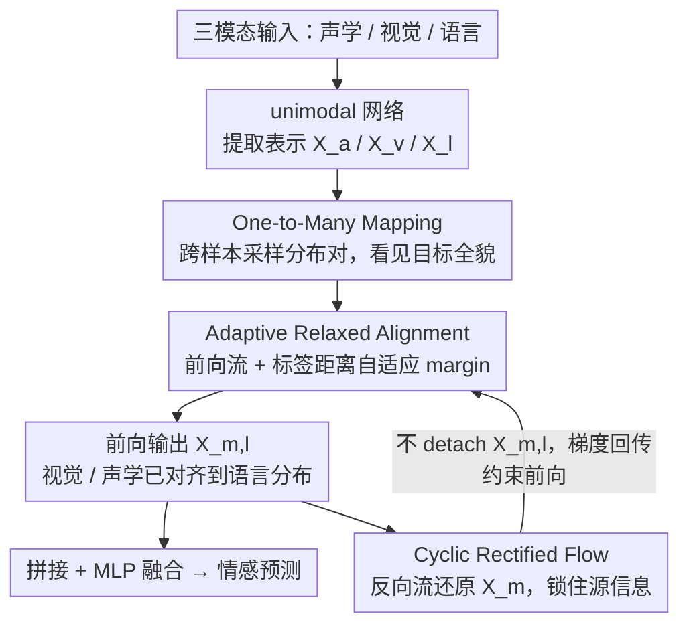

# CaReFlow: Cyclic Adaptive Rectified Flow for Multimodal Fusion

**会议**: CVPR 2026  
**arXiv**: [2602.19140](https://arxiv.org/abs/2602.19140)  
**代码**: 待确认  
**领域**: 图像生成  
**关键词**: rectified flow, modality gap, multimodal fusion, affective computing, distribution mapping

## 一句话总结
提出 CaReFlow，首次将 rectified flow 用于多模态分布映射以缩小模态间隙：通过 one-to-many mapping 让源模态数据点观测目标模态全局分布，adaptive relaxed alignment 对不同关联度的模态对施加不同对齐强度，cyclic rectified flow 保证映射后信息不丢失，即使用简单拼接融合也能在多个多模态情感计算 benchmark 上达到 SOTA。

## 研究背景与动机
**领域现状**: 多模态情感计算 (MAC) 需要融合视觉、声学、语言三种模态来分析人类情感状态。核心挑战在于不同模态特征分布差异巨大（模态间隙），导致简单的多模态拼接融合甚至不如纯语言模型。

**现有痛点**: 现有弥合模态间隙的方法（对比学习、GAN、扩散模型等）大多是 one-to-one 对齐——将源模态每个数据点只推向一个固定的目标点。这存在两个问题：(a) 每个样本内配对数据太少，对齐不充分；(b) 源模态数据点看不到目标模态的整体分布，学到的对齐不够鲁棒。

**核心矛盾**: one-to-one 映射限制了源模态对目标模态全局分布的感知，而如果直接用 one-to-many 映射（如原始 rectified flow），又会产生歧义的流方向问题（每个源点需要同时匹配多个目标点），且需要递归训练多轮才能学到直的轨迹。

**本文目标**: (a) 如何让源模态看到目标模态的全局分布？(b) 如何在 one-to-many 映射下避免歧义？(c) 如何避免映射过程中源模态信息丢失？

**切入角度**: Rectified flow 天然能将一个分布映射到另一个分布，且学到的轨迹是直的（可用少量 Euler 步模拟）。作者洞察到 rectified flow 的训练过程本身就是 one-to-many 的——随机采样分布对来训练，这正好可以暴露全局分布信息。

**核心 idea**: 用 rectified flow 做模态分布映射，通过自适应松弛对齐解决歧义问题，通过循环流保留源模态信息。

## 方法详解

### 整体框架
输入：三模态特征序列 $\mathbf{U}_m \in \mathbb{R}^{T_m \times d_m}$（$m \in \{a, v, l\}$，分别代表声学、视觉、语言），经 unimodal 网络提取表示 $\mathbf{X}_m \in \mathbb{R}^d$。由于语言是 MAC 中的主导模态，CaReFlow 将视觉和声学模态的分布映射到语言模态分布：$\mathbf{X}_{m,l} = \text{CaReFlow}_{m,l}(\mathbf{X}_m)$，然后用简单的拼接 + MLP 做融合和预测。推理时用 2 个 Euler 步完成分布转换。映射这一步内部是一套前向 + 反向的循环 rectified flow：前向流靠 One-to-Many Mapping 看见目标分布全貌、靠 Adaptive Relaxed Alignment 消解歧义，反向的 Cyclic Rectified Flow 把映射结果还原回源以锁住信息。

### 关键设计

**1. One-to-Many Mapping：让源模态看到目标分布的全貌，而不是单点**

传统对齐方法每个源点只盯着同一样本里的那一个目标点，配对太稀疏、学到的对齐不鲁棒。CaReFlow 借力 rectified flow 训练时本就要随机采样分布对这一特性：每个 mini-batch 内先构造同一样本内的模态对，再额外随机采样不同样本之间的模态对来训练速度场 $\mathbf{V}_{m_1,m_2}$，跨样本对与同样本对的数量比由超参 $\beta$ 控制（取 3–7 之间都稳定）。这样一来，源模态的每个数据点在训练过程中会被推向目标模态的许多不同点，自然就"看见"了目标分布的整体形状，而非局限于一个孤立锚点。这也是消融里影响最大的模块——去掉它 MOSI Acc2 掉 2.8 个点、CH-SIMS-v2 Acc2 掉 3.1 个点。

**2. Adaptive Relaxed Alignment：用标签距离决定该对齐多紧**

直接做 one-to-many 会引出歧义：一个源点被要求同时匹配多个目标点，流方向相互打架，原始 rectified flow 还得递归训练好几轮才能把轨迹拉直。CaReFlow 的解法是给对齐目标加一个自适应 margin $\eta_{m_1,m_2}$，只要误差落进 margin 以内就不再惩罚：

$$\mathcal{L}^f_{m_1,m_2} = \mathbb{E}\left[\max\left(\|\mathbf{V}_{m_1,m_2}(\mathbf{X}^t_{m_1,m_2}, t) - (\mathbf{X}_{m_2} - \mathbf{X}_{m_1})\|_2 - \eta_{m_1,m_2}, 0\right)\right]$$

同一样本的模态对取 $\eta=0$，退化回标准 rectified flow，要求严格对齐；不同样本的对取 $\eta_{m_1,m_2} = \epsilon + \|y_i - y_j\|_2$，由两者的情感标签距离自适应放松——标签越接近放松越小、越远放松越大。直觉上"该靠拢的紧紧贴上、该有差异的留出余地"，既保住了 one-to-many 的全局视野，又一并消化了歧义问题和递归训练的开销。

**3. Cyclic Rectified Flow：用一条反向流把源模态信息锁住，不让映射丢东西**

把分布往语言模态搬的过程中，源模态自己的判别性信息容易在对齐时被磨平。CaReFlow 额外训练一条反向速度场 $\hat{\mathbf{V}}_{m_1,m_2}$，要求它能把前向映射的输出 $\mathbf{X}_{m_1,m_2}$ 再还原回原始的 $\mathbf{X}_{m_1}$：

$$\mathcal{L}^b_{m_1,m_2} = \mathbb{E}\left[\|\hat{\mathbf{V}}_{m_1,m_2}(\hat{\mathbf{X}}^t_{m_1,m_2}, t) - (\mathbf{X}_{m_1} - \mathbf{X}_{m_1,m_2})\|_2\right]$$

关键的梯度细节是：反向 loss 对目标 $\mathbf{X}_{m_1}$ 做 detach，但**不**对前向输出 $\mathbf{X}_{m_1,m_2}$ detach——于是"还原得好不好"的梯度能顺着 $\mathbf{X}_{m_1,m_2}$ 回传去影响前向 rectified flow，逼着前向映射在搬运分布时就主动保留可还原的源信息。只要源能被还原，就说明融合表示里没把模态特异性信息丢掉。

**4. 速度场网络与 detach 解耦：让对齐任务和主任务各管各的**

速度场 $\mathbf{V}_{m_1,m_2}$ 本身实现得很轻：先用正弦/余弦位置编码把时间步 $t$ 编成 $\mathbf{TE}^t$，与输入特征拼接后过一个 MLP 即可。更要紧的是前向 loss $\mathcal{L}^f$ 对输入特征做了 detach——梯度只更新速度场、不回流到 unimodal 网络。这样分布对齐任务（训速度场）和情感预测主任务（训 unimodal 表示）就被切开，互不抢梯度，各自朝最优方向走。

### 损失函数 / 训练策略
$$\mathcal{L}_{total} = \mathcal{L} + \sum_{m \in \{a,v\}} (\alpha_f \times \mathcal{L}^f_{m,l} + \alpha_b \times \mathcal{L}^b_{m,l})$$
其中 $\mathcal{L}$ 是主任务预测损失，$\alpha_f$ 和 $\alpha_b$ 分别是前向和反向 loss 的权重。$\alpha_f$ 需要较大值（确保分布映射充分），$\alpha_b$ 需要适中值（过大会阻止分布转换）。

## 实验关键数据

### 主实验: MSA (CMU-MOSI & CMU-MOSEI)

| 方法 | 会议 | MOSI Acc7 | MOSI Acc2 | MOSI MAE↓ | MOSEI Acc2 | MOSEI MAE↓ |
|------|------|-----------|-----------|-----------|------------|------------|
| ITHP | ICLR 2024 | 47.7 | 88.5 | 0.663 | 87.1 | 0.550 |
| DLF | AAAI 2025 | 49.4 | 88.7 | 0.669 | 87.5 | 0.515 |
| AtCAF | IF 2025 | 46.5 | 88.6 | 0.650 | 87.0 | 0.508 |
| **CaReFlow** | - | **50.6** | **89.8** | **0.616** | **87.9** | **0.504** |

CH-SIMS-v2 数据集上 Acc5 达到 57.9（前 SOTA KuDA 为 53.1，提升 +4.8），Acc2 达到 82.9（前 SOTA AV-MC 为 80.6，提升 +2.3）。

### 消融实验

| 配置 | CH-SIMS-v2 Acc5 | CH-SIMS-v2 Acc2 | MOSI Acc7 | MOSI Acc2 |
|------|-----------------|-----------------|-----------|-----------|
| W/O Distribution Alignment | 55.1 | 78.4 | 45.9 | 86.7 |
| W/O Cyclic Information Flow | 56.3 | 81.7 | 47.2 | 87.9 |
| W/O Adaptive Relaxed Alignment | 56.8 | 82.4 | 47.9 | 88.5 |
| W/O One-to-Many Mapping | 57.4 | 79.8 | 47.2 | 87.0 |
| **Full CaReFlow** | **57.9** | **82.9** | **50.6** | **89.8** |

### 与其他分布映射方法对比

| 方法 | 类型 | MOSI Acc7 | MOSI Acc2 | 参数量 | CH-SIMS-v2 Acc5 |
|------|------|-----------|-----------|--------|-----------------|
| ARGF | GAN | 50.5 | 87.4 | 184.43M | 51.8 |
| MulT | Transformer | 40.7 | 88.1 | 185.51M | 54.6 |
| CLGSI | 对比学习 | 45.8 | 89.0 | 186.31M | 52.5 |
| Diffusion Bridge | 扩散模型 | 47.3 | 86.9 | 185.46M | 52.5 |
| **CaReFlow** | Rectified Flow | **50.6** | **89.8** | **185.38M** | **57.9** |

### 关键发现
- **One-to-Many 贡献最大**: 去掉后 MOSI Acc2 降 2.8%，CH-SIMS-v2 Acc2 降 3.1%，是最关键的模块
- **超参数鲁棒**: 跨模态对比率 $\beta$ 在 3-7 范围内性能稳定；Euler 步数 2-5 步变化极小（说明轨迹已经很直）
- CaReFlow 参数量适中（185.38M），少于 CLGSI（186.31M）和 MulT（185.51M），性能提升来自对齐效果而非参数增加
- t-SNE 可视化直观显示 CaReFlow 比 ARGF/CLGSI/Diffusion Bridge/DLF 更有效地缩小了模态间隙
- 更换高级融合方法（tensor fusion）可进一步提升，如 CH-SIMS-v2 Acc2 从 82.9 提升到 83.6

## 亮点与洞察
- **Rectified flow 用于模态对齐的新视角**: 将模态间隙问题重新定义为分布映射任务，利用 rectified flow 的几何直觉（直线轨迹映射两个分布）来弥合间隙。这比 GAN 和扩散模型更简单、更快
- **自适应 margin 设计巧妙**: 用标签距离 $\|y_i - y_j\|$ 自适应控制松弛程度，既保留了 one-to-many 的全局视野优势，又引导模型区分"应该对齐的"和"可以松弛的"模态对。一举解决了歧义问题和递归训练问题
- **Detach 操作实现任务解耦**: 前向 loss 对输入做 detach（不更新 unimodal 网络），反向 loss 对 $\mathbf{X}_{m_1}$ 做 detach 但不对 $\mathbf{X}_{m_1,m_2}$ 做 detach——这种精细的梯度控制使分布对齐和主任务可以充分各自优化
- **融合方法无关**: CaReFlow 作为预处理模块独立于融合机制，可以插入任何多模态系统

## 局限与展望
- 目前仅验证了多模态情感计算任务，未在视觉-语言理解等更广泛的多模态任务上测试
- 以语言为固定的目标模态（因为 MAC 中语言是主导模态），对于语言非主导的任务如何选择目标模态尚不清楚
- 速度场用简单 MLP 实现，在更复杂的分布映射场景下可能表达能力不足
- 超参数（$\beta$, $\epsilon$, $\alpha_f$, $\alpha_b$）需要调试，虽然作者展示了鲁棒性但特定数据集的最优值不同

## 相关工作与启发
- **vs Diffusion Bridge**: 同为生成模型做分布映射，但扩散模型推理慢且只做 one-to-one，CaReFlow 用 rectified flow 可 2 步完成且支持 one-to-many
- **vs CLGSI (对比学习)**: CLGSI 也实现了 one-to-many（同类别正对），但不区分同样本对和同类别对的重要性差异，CaReFlow 通过 adaptive margin 实现更精细的控制
- **vs ARGF (GAN)**: GAN 训练不稳定且难以保证信息保留，CaReFlow 通过 cyclic flow 显式约束信息保留

## 评分
- 新颖性: ⭐⭐⭐⭐ 首次将 rectified flow 用于模态对齐，三个创新点环环相扣
- 实验充分度: ⭐⭐⭐⭐ 5个数据集3个任务 + 充分的消融和可视化
- 写作质量: ⭐⭐⭐⭐ 动机推导清晰，方法描述数学形式化完善
- 价值: ⭐⭐⭐⭐ 模态间隙是多模态融合的核心问题，rectified flow 方案简洁有效

<!-- RELATED:START -->

## 相关论文

- [\[NeurIPS 2025\] Efficient Rectified Flow for Image Fusion](../../NeurIPS2025/image_generation/efficient_rectified_flow_for_image_fusion.md)
- [\[CVPR 2026\] Probabilistic Precipitation Nowcasting with Rectified Flow Transformers](probabilistic_precipitation_nowcasting_with_rectified_flow_transformers.md)
- [\[CVPR 2026\] RecTok: Reconstruction Distillation along Rectified Flow](rectok_reconstruction_distillation_along_rectified_flow.md)
- [\[CVPR 2025\] JanusFlow: Harmonizing Autoregression and Rectified Flow for Unified Multimodal Understanding and Generation](../../CVPR2025/image_generation/janusflow_harmonizing_autoregression_and_rectified_flow_for_unified_multimodal_u.md)
- [\[CVPR 2026\] Flow Matching for Multimodal Distributions](flow_matching_for_multimodal_distributions.md)

<!-- RELATED:END -->
