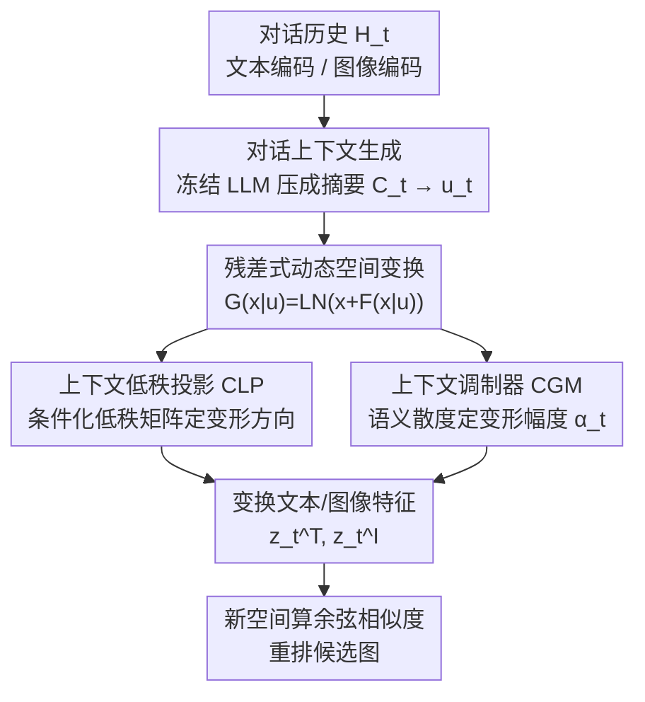

# CAST: Context-Aware Dynamic Latent Space Transformation for Interactive Text-to-Image Retrieval

**会议**: CVPR 2026  
**论文**: [CVF Open Access](https://openaccess.thecvf.com/content/CVPR2026/html/Lin_CAST_Context-Aware_Dynamic_Latent_Space_Transformation_for_Interactive_Text-to-Image_Retrieval_CVPR_2026_paper.html)  
**代码**: https://github.com/HuiGuanLab/CAST  
**领域**: 交互式文本图像检索 / 多模态VLM  
**关键词**: 交互式检索, 动态隐空间, 低秩投影, 上下文调制, 即插即用

## 一句话总结
针对交互式文本-图像检索（I-TIR）中"所有对话轮次共用一个静态特征空间"的痛点，CAST 用一个轻量模块 CASR 根据每轮对话上下文动态地把文本和图像特征所在的隐空间"变形"一下——低秩投影器（CLP）决定往哪个语义方向变、上下文调制器（CGM）决定变多大幅度——在 VisDial 上把 10 轮平均 R@1 从 ChatIR 的 48.44% 提到 51.85%，且越到后面轮次优势越大，几乎不增加参数量。

## 研究背景与动机
**领域现状**：交互式文本-图像检索（Interactive Text-to-Image Retrieval, I-TIR）让用户通过多轮自然语言对话逐步澄清、补充检索意图，比传统"一句话精确描述"的单轮检索更符合真实使用习惯。目前主流工作（ChatIR、PlugIR、ImageScope 等）的发力点集中在两类：一是用 LLM 重构/精炼对话历史，把啰嗦模糊的表述变成更聚焦的查询；二是用 LLM 生成更有判别力的提问，引导用户给出能区分候选图的回答。

**现有痛点**：无论怎么优化文本侧，这些方法的跨模态匹配始终发生在**同一个固定的多模态特征空间**里——所有对话文本和所有图像都被映射到同一张静态 embedding 流形上。它们隐含假设"文本和图像之间的几何关系在整段对话里恒定不变"。

**核心矛盾**：但交互检索本质是动态的。每一轮用户反馈都引入新的语义约束（比如这一轮强调"狗的颜色"），理应让特征空间对"颜色"这个维度更敏感、更有判别力。可如果空间本身不变，新语义只是被投影回同一张几何流形上，查询向量在原地"漂移"却没真正反映更新后的意图，那些细粒度线索（新提到的属性、被修正的物体关系）很容易在静态表示里被淹没。

**本文目标**：让特征空间本身随对话上下文演化。具体拆成两个子问题——(1) 模型该沿用户意图的**哪个语义方向**去细化检索？(2) 这次语义调制应该有**多大幅度**？

**切入角度**：把"每一轮对话"看成一次**上下文调制步骤**，它动态地把当前的多模态表示空间变形成一个更贴合本轮意图的新空间，让文本和图像 embedding 一起随上下文演化。

**核心 idea**：用一个轻量的、对每轮对话上下文条件化的**低秩残差变换**，去动态重塑文本和图像共享的隐空间几何，而不是在固定空间上反复改写查询。

## 方法详解

### 整体框架
CAST 的输入是截至第 $t$ 轮的对话历史 $H_t = C_0, (Q_1, A_1), \dots, (Q_t, A_t)$ 和图像库；输出是本轮重排后的检索结果。整条 pipeline 这样转：先用一个冻结的 LLM 把杂乱的对话历史压成一句简洁的上下文摘要 $C_t$，再用文本编码器把它编成语义条件向量 $u_t$；这个 $u_t$ 进入核心模块 **CASR（Context-Aware Space Regulator）**，由它生成一组"如何变形空间"的指令——其中 **CLP** 给出变形方向、**CGM** 给出变形幅度；最后用这组指令同时对文本特征 $x_t^T$ 和每张图像特征 $x_t^I$ 做残差式变换，得到本轮专属的动态空间下的 $z_t^T$、$z_t^I$，在新空间里算余弦相似度排序。下一轮对话来了，$u_t$ 更新，空间再次变形——所以是"一轮一个动态空间"。

CASR 的变换写成残差形式：对原空间里的任意特征 $x_t$，

$$G(x_t \mid u_t) = \mathrm{LN}\big(x_t + F(x_t \mid u_t)\big),$$

其中 $F$ 是受上下文条件化的变换函数。采用加性残差而非直接替换，是为了保住原始表示、让上下文调制只作为"平滑微调"注入语义偏移，从而稳定训练。文本和图像特征**共用同一套** $G(\cdot \mid u_t)$ 做耦合变换（这点区别于只在 query 侧条件化的 GeneCIS）。

### 关键设计

**1. 残差式动态隐空间变换：让"空间本身"随每轮意图变形，而非在固定空间改写查询**

这是全文的总纲，直接针对"静态空间淹没细粒度线索"的痛点。传统方法只能在同一张固定流形上反复重写文本查询；CAST 把变换施加到**空间几何**上：每轮根据语义条件 $u_t$ 生成一个变换 $F(x_t \mid u_t)$，通过上面的残差式 $G$ 把文本和图像特征一起搬到本轮专属的新空间。之所以用"加性残差 + LayerNorm"而不是端到端重新映射，是因为多轮交互对稳定性极敏感——直接替换特征会让表示在轮次间剧烈跳变、训练发散；残差形式保留原表示作为锚点，只让上下文相关的语义偏移以微调形式叠加，既能演化又不至于失稳。CASR 把"方向"和"幅度"这两件事拆给下面两个子模块分别解决。

**2. CLP（Context-Aware Low-Rank Projector）：用条件化低秩投影决定"往哪个语义方向变形"**

要变形 $d\times d$ 维的特征空间，最直接的做法是学一个完整的 $d\times d$ 线性变换，但这既昂贵又容易把原空间的几何结构破坏掉。CLP 改用**对 $u_t$ 条件化的低秩投影**：由两个 MLP 从语义条件实时生成两个低秩矩阵 $A_t = \mathrm{MLP}_A(u_t) \in \mathbb{R}^{d\times r}$、$B_t = \mathrm{MLP}_B(u_t) \in \mathbb{R}^{d\times r}$（$r \ll d$），先做列向 $\ell_2$ 归一化 $\hat A_t = A_t/\lVert A_t\rVert_2$、$\hat B_t = B_t/\lVert B_t\rVert_2$ 以保数值稳定，再算条件投影

$$P(x_t \mid u_t) = (x_t \hat B_t)\,\hat A_t^\top, \quad P(x_t \mid u_t)\in\mathbb{R}^{1\times d}.$$

也就是先用 $\hat B_t$ 把 $x_t$ 压进一个由 $u_t$ 张成的紧凑低秩子空间、再经 $\hat A_t^\top$ 投回原维度，形成一个"只沿与当前意图相关的几条主方向"去变形流形的方向性变换。低秩约束既把计算量压到极低（r=8 时变换 5 万张图特征约 0.002 秒），又避免无关方向上的扰动破坏几何。消融里把它换成不分解的完整矩阵 $W$，R@10 掉 1.48；换成不看上下文的共享 $W$ 掉 2.87，说明"低秩"和"上下文条件化"缺一不可。

**3. CGM（Context-Guided Modulator）：用语义散度自适应决定"变形多大幅度"**

光有方向还不够——变形幅度太大会失稳、太小又调不动。CGM 据**初始条件 $u_0$ 与当前上下文 $u_t$ 之间的语义散度**自适应地给出一个 $[0,1]$ 的缩放系数：

$$\alpha_t = \sigma\big(\mathrm{MLP}([u_0; u_t])\big),$$

再把 CLP 给出的方向乘上幅度，得到最终的变换项 $F(x_t \mid u_t) = \alpha_t \cdot P(x_t \mid u_t)$。直觉是：当前意图离初始描述偏得越远，越该大幅重塑空间；偏得少就轻微调整。这让空间在轮次间平滑演化又对重大语义转折保持敏感。消融里把它换成一个与上下文无关的可学习标量，R@10 掉 0.54——提升不大但方向一致，印证"幅度也该看上下文"。

### 损失函数 / 训练策略
训练时每个 batch 内对话样本被随机截断到不同长度、且各样本对话内容互异，使文本和图像特征在各自上下文下被分别调制。目标是一个**上下文引导对比损失**，把调制后的文本 embedding $z_t^{T_i}$ 与其对应的上下文条件化图像 embedding $z_t^{I_i}$ 对齐：

$$\mathcal{L}_{cgc} = -\frac{1}{B}\sum_{i=1}^{B}\log\frac{\exp\!\big(\mathrm{sim}(z_{t_i}^{T_i}, z_{t_i}^{I_i})/\tau\big)}{\sum_{j=1}^{B}\exp\!\big(\mathrm{sim}(z_{t_i}^{T_i}, z_{t_i}^{I_j})/\tau\big)},$$

其中 $\tau$ 是温度。与假设单一静态空间的常规对比损失不同，这里的对齐发生在一组"各自被对话条件调制过的子空间"内。此外对 $\alpha_t$ 加了一个轻量正则以保证轮次间调制平稳。骨干用 BLIP，在标准对比学习范式下微调（区别于 ChatIR 用基于 recall 的目标优化 BLIP）。

## 实验关键数据

### 主实验
数据集为 VisDial（基于 COCO，I-TIR 标准 benchmark），指标用 Recall@K（10 轮平均，K=1/5/10），baseline 统一用 BLIP 骨干。CAST 在所有指标、所有轮次上稳定领先，且优势随对话深入持续扩大。

| 指标(10轮均值) | BLIP | ChatIR | PlugIR | ImageScope | CAST(本文) |
|----------------|------|--------|--------|------------|------------|
| R@1 Avg | 33.97 | 48.44 | 44.92 | 32.19 | **51.85** |
| R@5 Avg | 55.23 | 70.88 | 67.01 | 56.81 | **74.23** |
| R@10 Avg | 64.13 | 79.90 | 75.26 | 67.86 | **82.05** |

逐轮看更能体现"动态空间"的价值：第 1 轮 R@1 为 43.60%（ChatIR 42.78%、BLIP 40.31%），优势尚小；到第 10 轮 R@1 升到 **57.56%**，远超 ChatIR 的 53.15% 和 PlugIR 的 46.61%——即随着对话上下文累积、空间被反复精细变形，对齐越来越准。此外在 ChatIR/PlugIR 提供的 4 种不同对话风格变体上（ChatGPT/Human/Flan-Alpaca-BLIP2 等），CAST 也都拿到最佳，显示对不同对话生成风格的鲁棒性。

### 消融实验
**(a) CLP 与 CGM 的贡献分解（10 轮平均）**：

| CLP | CGM | R@1 | R@5 | R@10 |
|-----|-----|-----|-----|------|
| × | × | 48.44 | 71.71 | 79.89 |
| ✓ | × | 51.04 | 73.45 | 80.90 |
| ✓ | ✓ | **51.85** | **74.23** | **82.05** |

CLP 是主力（R@1 +2.60），CGM 再补一刀（R@1 +0.81、R@10 +1.15）。

**(b) CLP 投影结构对比（Avg. R@10）**：

| 投影设计 | Avg. R@10 | Δ vs. 本文 |
|----------|-----------|-----------|
| 本文（上下文低秩投影） | 82.05 | — |
| 单个上下文感知矩阵 W（不分解） | 80.57 | -1.48 |
| 单个上下文无关共享 W | 79.18 | -2.87 |
| 每轮独立的上下文无关 W_t | 75.52 | -6.53 |

**(c) CGM 调制机制对比**：上下文引导调制器 82.05 vs. 可学习标量 81.51（-0.54）。

### 关键发现
- **CLP 的两个性质都不可替代**：去掉低秩分解（用完整 $W$）掉 1.48，去掉上下文条件化（共享 $W$）掉 2.87，每轮各学独立 $W_t$ 反而掉到 75.52（-6.53）——说明"为每轮硬学一个变换"会过拟合/不稳定，关键在于"由共享 MLP 根据上下文实时生成低秩变换"。
- **越到后期轮次优势越大**：第 1 轮领先 ChatIR 不到 1 个点，第 10 轮拉开 4+ 个点，正面印证"静态空间在长对话里淹没细粒度线索"这一动机。
- **即插即用**：作为 plug-and-play 模块插进 BLIP/PlugIR/ChatIR，三者都涨；尤其原本不为 I-TIR 设计的 BLIP 加了 CASR 后能逼近 PlugIR 水平。
- **极致轻量**：低秩公式把变换拆成两个可并行的低秩矩阵运算，r=8 时变换 5 万张图特征约 0.002 秒，几乎不增参数与算力。
- **可视化佐证**：T-SNE 显示，当上下文是"黑狗"时空间被重塑得强调颜色（黑狗聚拢），换成"草地上的狗"时转而强调场景属性，直观说明空间确实在按上下文变形。

## 亮点与洞察
- **把"改查询"升级成"改空间几何"**：以往 I-TIR 都在文本侧做文章（重构对话、生成好问题），CAST 第一个去动多模态空间本身的几何关系，且对文本和图像做耦合变换——这是一个干净且少有人碰的切入点。
- **LoRA 式低秩思想迁到"动态空间变形"**：用两个由上下文实时生成的低秩矩阵在线构造投影，既继承低秩的高效与稳定，又把"条件"从权重适配换成了"对话语义"，可直接迁移到任何需要 query 条件化重排的检索/推荐场景。
- **方向与幅度解耦**：CLP 管方向、CGM 管幅度，这种"先定 where 再定 how much"的拆法干净可复用，比单一标量门控更有解释性（可视化也对得上）。
- **真·即插即用**：几乎零开销 + 可挂任意 I-TIR 框架，工程落地友好。

## 局限与展望
- 实验只在 VisDial 单一 benchmark 上做（虽有 4 种对话风格变体），跨数据集/跨域泛化（如真实电商检索、开放词表大库）尚未验证。
- 语义条件 $u_t$ 依赖一个冻结 LLM 把对话压成摘要，LLM 摘要质量是上游瓶颈，摘要出错会直接污染变形方向；论文未分析 LLM 选择/容错的影响。⚠️ 论文未给 $\alpha_t$ 正则项的具体形式与权重，复现时需参考代码。
- 低秩 rank $r$ 与最终性能的权衡只给了效率数字（r=8），缺对 $r$ 取值的系统消融——很难判断 8 是否最优、太小会不会限制表达力。
- CGM 带来的增益偏小（R@10 +1.15、对比可学习标量仅 +0.54），其必要性相对 CLP 而言较弱，值得进一步设计更强的幅度控制。

## 相关工作与启发
- **vs ChatIR / PlugIR**：它们用 LLM 重构对话、生成判别性问题，但跨模态匹配始终在静态空间；CAST 保留这套文本侧优化（甚至复用 PlugIR 的上下文生成）的同时，额外让空间随上下文动态变形，并能直接插进它们带来增益。
- **vs QuARI**：QuARI 也做"按查询动态变换文本和视觉特征"，但工作在**单轮**假设下、每条查询独立处理；CAST 面向多轮交互，需要持续累积历史语义、随对话演化空间。
- **vs GeneCIS（多轮组合图像检索）**：GeneCIS 同样认为"相似度不是静态的、会随条件变"，与本文动机一致；但 GeneCIS 主要在 query 侧条件化表示，CAST 做的是**同时更新 query 和 image** 的耦合变换。
- **vs DAR / ImageScope**：它们用扩散先验或 LLM 推理丰富语义多样性与可解释性，但底层特征几何仍是静态的；CAST 直接重塑几何。

## 评分
- 新颖性: ⭐⭐⭐⭐⭐ 首个在 I-TIR 里"变形空间几何而非改写查询"的视角，CLP/CGM 的方向-幅度解耦干净优雅。
- 实验充分度: ⭐⭐⭐⭐ 主结果+逐轮+多对话风格+三组消融+可视化+效率都齐，但仅限 VisDial 单 benchmark。
- 写作质量: ⭐⭐⭐⭐⭐ 动机→方法→实验逻辑顺畅，公式与图示清晰，三者对得上。
- 价值: ⭐⭐⭐⭐ 轻量、即插即用、后期轮次增益明显，对交互检索工程落地有实用价值。

<!-- RELATED:START -->

## 相关论文

- [\[CVPR 2026\] Latent Diffusion Inversion Requires Understanding the Latent Space](latent_diffusion_inversion_requires_understanding_the_latent_space.md)
- [\[CVPR 2026\] OPRO: Orthogonal Panel-Relative Operators for Panel-Aware In-Context Image Generation](opro_orthogonal_panel-relative_operators_for_panel-aware_in-context_image_genera.md)
- [\[CVPR 2026\] 3D Space as a Scratchpad for Editable Text-to-Image Generation](3d_space_as_a_scratchpad_for_editable_text-to-image_generation.md)
- [\[CVPR 2026\] Unified Latent Space for Understanding and Generation via Semantic Auto-encoder](unified_latent_space_for_understanding_and_generation_via_semantic_auto-encoder.md)
- [\[CVPR 2026\] Neighbor-Aware Localized Concept Erasure in Text-to-Image Diffusion Models](neighbor-aware_localized_concept_erasure_in_text-to-image_diffusion_models.md)

<!-- RELATED:END -->
