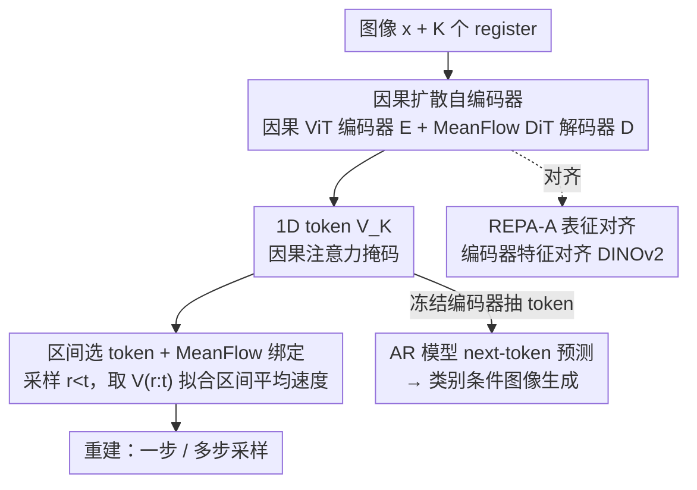

# CaTok: Taming Mean Flows for One-Dimensional Causal Image Tokenization

**会议**: CVPR 2026  
**论文**: [CVF Open Access](https://openaccess.thecvf.com/content/CVPR2026/html/Chen_CaTok_Taming_Mean_Flows_for_One-Dimensional_Causal_Image_Tokenization_CVPR_2026_paper.html)  
**代码**: https://sharelab-sii.github.io/catok-web (项目主页)  
**领域**: 图像生成 / 扩散模型  
**关键词**: 因果图像 tokenizer, 1D token, MeanFlow, 扩散自编码器, 自回归生成  

## 一句话总结
CaTok 用「在时间区间 $[r,t]$ 内选 1D token + 绑定 MeanFlow 平均速度场目标」训练一个扩散自编码器，让压缩出来的 1D 视觉 token 同时具备因果性和均衡性，既支持一步快速生成又支持多步高保真重建，在 ImageNet 重建上拿到 0.75 rFID / 22.53 PSNR / 0.674 SSIM，且训练 epoch 更少。

## 研究背景与动机
**领域现状**：自回归（AR）大语言模型靠「把句子切成 1D 因果 token + 下一个 token 预测」取得了巨大成功。视觉社区想把这套范式搬到图像生成上，关键卡点是——图像该怎么切成「有因果顺序」的 1D token。

**现有痛点**：现有视觉 tokenizer 在「因果性」这件事上都不干净。VQGAN 这类 2D tokenizer 把图像切成网格再按光栅序/随机序拉平成 1D 序列，前后 token 之间根本没有因果依赖；VAR 这类用「next-scale 预测」建立 coarse-to-fine 顺序，虽然有因果性，但破坏了 LLM 的「next-token 预测」模式。最近兴起的扩散自编码器从 encoder 的 register 里抽 1D token 当 decoder 条件，但同样有问题：Naïve flow decoder（如 FlowMo）让 decoder 条件在**全部** token 上，token 之间毫无因果；consistency decoder 用 nested dropout 只条件在**前 k 个** token 上（k 靠随机采样或时间步绑定决定），但因为靠前的 token 更容易被选中，引入了严重的**不均衡**——后面的 token 贡献被压低，反而损害 AR 生成。

**核心矛盾**：在扩散自编码器框架里，**因果性**（token 要有先后依赖）和**均衡性**（每个 token 都要被充分利用）是一对难以兼得的目标。Naïve decoder 有均衡没因果，consistency decoder 有因果没均衡。

**核心 idea**：作者发现 MeanFlow 的「平均速度场沿子路径 $[r,t]$」这个结构天然能同时给出因果和均衡——把「选哪些 token」和「拟合哪段时间区间的平均速度」绑定起来：在采样区间 $[r,t]$ 内选对应的 1D token 段 $V_{r:t}$ 去预测该区间的平均速度。这样 token 沿着 noise→image 的生成路径自然带上了因果性，又因为采样区间是均匀随机的、不偏向靠前的 token，从根上避免了不均衡。

## 方法详解

### 整体框架
CaTok 本质是一个**扩散自编码器**：一个带因果掩码的 ViT encoder $E_\delta$ 把图像压成 $K$ 个 1D token $V_K$，一个 MeanFlow DiT decoder $D_\theta$ 以这些 token 为条件、用「平均速度场」目标把噪声还原成图像。它和普通扩散自编码器最大的不同在于 **token 选择方式与训练目标的绑定**：训练时独立采两个时间步 $r<t$，只把落在区间 $[r\cdot K, t\cdot K]$ 内的 token 段 $V_{r:t}$ 喂给 decoder，让它预测区间 $[r,t]$ 上的平均速度 $u_\theta$。训练好后冻结 encoder 抽 token，再接一个标准 LlamaGen 做「next-token 预测」式的 AR 图像生成；推理时 MeanFlow decoder 支持一步直接出图 $\hat{x}=\epsilon - D_\theta(\epsilon,0,1,\hat{V}_K)$。

整个流程是「编码 → 区间选 token → MeanFlow 解码 → （冻结后）AR 生成」的串行 pipeline，外加 REPA-A 在 encoder 端做表征对齐正则，结构如下：

### 关键设计

**1. 因果扩散自编码器架构：把因果约束写进 token 之间的注意力**

要让 1D token 具备「前面的 token 不依赖后面、后面的能看到前面」这种 AR 式因果结构，光靠选 token 还不够，得在 encoder 内部就立好规矩。CaTok 给图像 $x$ 拼上 $K$ 个 register $R$ 一起送进因果 ViT encoder，输出图像特征 $H_e$ 和压缩的 1D token $V_K$：$[H_e, V_K]=E_\delta([x,R])$。关键在于这里施加了**有向因果注意力掩码**——图像 patch 之间可以互相 attend，但**看不到** 1D token；而每个 1D token 可以 attend 到所有图像特征，但在 token 之间**只能看到自己前面的** token。这就让 $V_K$ 内部形成了严格的左到右依赖，正好对上 LLM 的 next-token 范式。Decoder 端用一个 MeanFlow DiT $D_\theta$，在 frozen 的 KL-16 MAR-VAE latent 空间上操作以省算力（CATOK-B 用 DiT-B/4、CATOK-L 用 DiT-L/2）。这套「因果 ViT encoder + MeanFlow DiT decoder」就是 CaTok 区别于 FlowMo（无因果）和 VAR（破坏 next-token）的载体。

**2. 区间选 token + MeanFlow 绑定：同时拿到因果性和均衡性（核心设计）**

这是 CaTok 的灵魂。先回顾 MeanFlow：普通 rectified flow 学瞬时速度 $v(z_t,t)=\epsilon-x$，少步采样时用一个时刻的瞬时速度去近似整段平均速度会有误差；MeanFlow 直接拟合区间 $[r,t]$ 上的**平均速度**

$$u(z_t,r,t) \triangleq \frac{1}{t-r}\int_r^t v(z_\tau,\tau)\,d\tau,$$

并由恒等式 $u(z_t,r,t)=v(z_t,t)-(t-r)\big(v(z_t,t)\partial_z u+\partial_t u\big)$ 转成可训练目标，从而支持一步采样 $z_0=\epsilon-u_\theta(\epsilon,0,1)$。CaTok 的妙处是把「token 选择」**绑定**到这个区间上：训练时独立采 $r,t\in[0,1]$（$r<t$），构造流路径 $z_t=(1-t)x+t\epsilon$，然后**只把区间 $[r\cdot K, t\cdot K]$ 内的 token 段 $V_{r:t}$** 喂给 decoder 去预测该区间平均速度 $u_\theta=D_\theta(z_t,r,t,V_{r:t})$。

为什么这一招能同时解决因果和均衡？因为平均速度场刻画的是「从 $r$ 到 $t$ 这段子路径」的演化，把 token 段对应到子路径，就让 token 顺着 noise→image 的生成过程天然带上了**因果**（区间端点 $t$ 越往后、覆盖的 token 越多，越精细——论文用「256→16 token 逐步变粗」的 fine-to-coarse 重建佐证了这点）；而 $[r,t]$ 是均匀随机采的、不像 nested dropout 那样系统性偏向前 k 个 token，所以每个 token 被使用的机会**均衡**，不需要 Selftok 那种额外的 re-weighting。MeanFlow 目标实现为

$$\mathcal{L}_{MF} := \mathbb{E}\big\|u_\theta-(\epsilon-x)-\mathrm{sg}[(t-r)((\epsilon-x)\partial_z u_\theta+\partial_t u_\theta)]\big\|_2^2,$$

其中 $\mathrm{sg}[\cdot]$ 是 stop-gradient，避免对 Jacobian-向量积二次反传。同时为稳定训练，固定比例 $q=75\%$ 的样本令 $r=t$ 退化成 rectified flow，用全部 token $V_K$ 拟合瞬时速度 $\mathcal{L}_{RF}:=\mathbb{E}\|v_\theta-(\epsilon-x)\|_2^2$（loss 用 adaptive L2，$c=10^{-3}, w=1.0$）。

**3. REPA-A：为条件扩散自编码器量身定制的表征对齐正则**

扩散自编码器从零训很慢、还容易在引入 MeanFlow loss 时出现 loss 尖刺。REPA 系列的思路是用 Vision Foundation Model（VFM）的高质量表征去对齐、加速收敛，但已有变体不太适配 CaTok：REPA-E 是把梯度回传到 VAE，VA-VAE 直接正则 VAE 的压缩特征。作者提出 **REPA-A**——专门对齐 **encoder 输出的图像特征 $H_e$** 与 VFM 表征 $H_{vfm}$（用 DINOv2-B/16）：

$$\mathcal{L}_{REPA\text{-}A} := -\mathbb{E}\Big[\frac{1}{N}\sum_{n=1}^N \mathrm{sim}(H_{vfm}^{[n]}, H_e^{[n]})\Big],$$

其中 $\mathrm{sim}$ 是余弦相似度，$n$ 是 patch 索引。直接作用在 encoder 特征上让 register 能抽到更有语义、更可判别的内容，从而让 1D token 信息量更足。它和标准 REPA（作用在 decoder 中间层 $H_d$ 上）配合使用，损失权重分别为 $0.8$ 和 $1.0$。消融显示 REPA-A 能压平「在 25K 步引入 MeanFlow loss 时的 loss 尖刺」，把训练稳住。

### 损失函数 / 训练策略
总目标 = MeanFlow $\mathcal{L}_{MF}$ + Rectified Flow $\mathcal{L}_{RF}$ + REPA $\mathcal{L}_{REPA}$ + REPA-A $\mathcal{L}_{REPA\text{-}A}$，四项联合优化。Encoder 是 ViT-B/8 带 register + 因果掩码，1D token 取 16 维并归一化。训练好后**冻结** CaTok encoder 抽 token，再训一个标准 $\epsilon$LlamaGen-L（用 diffusion loss）做 AR 生成，teacher forcing + 类别 token 前缀，推理用 CFG（无 temperature 采样）。

## 实验关键数据

### 主实验
ImageNet-1K 256×256 重建（rFID 越低越好，PSNR/SSIM 越高越好）：

| 方法 | Token | #Param | Epochs | rFID↓ | PSNR↑ | SSIM↑ |
|------|-------|--------|--------|-------|-------|-------|
| FlowMo-Lo-256 | 256 | 945M | 130 | 0.95 | 22.07 | 0.649 |
| Semanticist-L-256 | 256 | 552M | 400 | 0.78 | 21.61 | 0.626 |
| **CaTok-L-256** | 256 | 552M | **160** | **0.75** | **22.53** | **0.674** |
| CaTok-B-256 | 256 | 224M | 80 | 1.17 | 22.10 | 0.666 |
| CaTok-L-256† (一步) | 256 | 552M | 160 | 4.63 | 20.99 | 0.630 |

CaTok-L-256 在 PSNR / SSIM 上超过所有扩散自编码器（SSIM 显著优于 945M 的 FlowMo），rFID 0.75 与 Semanticist 相当但只用了不到一半 epoch；CaTok-B-256 仅 80 epoch 就拿到有竞争力的结果，体现训练效率。带 † 的一步采样变体在「一步 1D tokenizer」里 PSNR/SSIM 最佳。

类别条件生成（ImageNet-1K 256×256，gFID 越低越好）：

| 方法 | #Param | Token | gFID↓ | IS↑ |
|------|--------|-------|-------|-----|
| Semanticist-L-256 | 343M | 256/32 | 2.57 | 260.9 |
| SpectralAR-64 | 310M | 64 | 3.02 | 282.2 |
| **CaTok-L-128** | 343M | 128 | **2.95** | 269.2 |
| CaTok-L-64 | 343M | 64 | 3.01 | 280.5 |
| CaTok-L-32 | 343M | 32 | 3.40 | 288.6 |

CaTok 在 tokenization 训练 epoch 大幅更少（160 vs 300+）的前提下，gFID/IS 与 SOTA tokenizer 相当，验证其学到的 1D 因果 token 适配标准 AR 建模。

### 消融实验
训练配方逐步加项（CATOK-B-256，80 epoch）：

| 配置 | rFID@1 | rFID@25 | gFID |
|------|--------|---------|------|
| 只 $\mathcal{L}_{RF}$ | 183.69 | 1.81 | 19.67 |
| + $\mathcal{L}_{MF}$ | 4.71 | 1.90 | 24.39 |
| + $\mathcal{L}_{REPA}$ | 4.31 | 1.71 | 17.92 |
| + $\mathcal{L}_{REPA\text{-}A}$ | 3.92 | 1.15 | 13.54 |
| + 区间 $[r,t]$ 选 token | 4.89 | 1.17 | **4.91** |

因果性 + 均衡性对 AR 生成的影响（token 选择方式）：

| 选择方式 | 学习 token | 使用 token | rFID | gFID |
|----------|-----------|-----------|------|------|
| 区间 $[r,t]$（默认） | 256 | 256 | 1.17 | **4.91** |
| 全部 All | 256 | 256 | 1.15 | 13.54 |
| 前 k First k | 256 | 256 | 1.37 | 9.21 |
| 前 k First k | 256 | 128 | 5.32 | 7.49 |

### 关键发现
- **「区间选 token」是 AR 生成质量的胜负手**：单看重建（rFID），加上区间选择反而从 3.92→4.89 略降；但 gFID 从 13.54 暴跌到 4.91。也就是说它牺牲了一点点重建保真，换来 AR 生成的大幅提升——这正是「因果 token」的价值所在。
- **「全部 token」rFID 最好但 gFID 最差**（1.15 / 13.54）：重建够用但没因果，AR 学不动；「前 k token」则因不均衡，gFID 也不如区间法。CaTok 不靠额外 re-weighting 就从根上解决了均衡问题。
- **MeanFlow 目标是一步采样能力的来源**：只用 $\mathcal{L}_{RF}$ 时 rFID@1 高达 183.69（一步几乎不可用），加上 $\mathcal{L}_{MF}$ 直接降到 4.71，一步采样变得可用。
- **REPA-A 既提性能又稳训练**：它把 gFID 从 17.92 推到 13.54，并压平了在 25K 步引入 MeanFlow loss 时的 loss 尖刺。

## 亮点与洞察
- **把「token 选择」绑定到「平均速度的时间区间」上**，这个结构性洞察很巧：因果性和均衡性原本是一对矛盾，但 MeanFlow 的子路径平均速度天然把二者统一了——区间端点决定覆盖多少 token（因果），区间均匀采样保证不偏心（均衡），不需要额外正则或重加权。
- **一步采样是「副产品」而非刻意优化**：CaTok 没专门为一步采样做复杂训练 recipe（如 GAN loss），但靠 MeanFlow 目标自然获得了不错的一步生成能力，体现了选对目标函数的杠杆效应。
- **「区间选 token 让重建略降、生成大涨」的 trade-off 数据**很有指导意义：它提醒做 tokenizer 的人，重建指标好≠适合下游 AR 生成，因果结构才是 AR 友好的关键。
- REPA-A「对齐 encoder 而非 decoder/VAE」的定位差异，给条件扩散自编码器的表征正则提供了一个可迁移的范式。

## 局限与展望
- 作者承认在 ImageNet-1K 上做的是**公平对比**实验，没在更大数据集、更广任务上验证；视觉 tokenizer 与 AR 生成器之间的复杂耦合（token 维度、token 数增加带来的误差累积）超出本文范围，留作 future work。
- 一步采样的 rFID（如 CATOK-L-256† 的 4.63）仍明显落后现代 2D tokenizer，因为后者靠 GAN loss 等更难的目标和复杂 recipe；CaTok 不是专为一步采样优化的，这块属于「能用但不极致」。⚠️ 一步 vs 多步的指标不在同一难度下，不宜直接横比。
- 1D token 固定 16 维、encoder 固定 ViT-B/8，token 数与模型规模的 scaling 行为没充分展开；区间采样分布（是否均匀采 $r,t$ 最优）也未深入消融。

## 相关工作与启发
- **vs FlowMo / DiTo（Naïve flow decoder）**：它们条件在全部 token 上，token 无因果，AR 难学（Tab.4 中「All」gFID 13.54）。CaTok 用区间选择引入因果，gFID 降到 4.91。
- **vs FlexTok / Semanticist / DDT / Selftok（consistency decoder）**：它们用 nested dropout 只条件在前 k token 上（随机采样或时间步绑定），靠前 token 被偏向选中导致不均衡、损害 AR。CaTok 用均匀区间采样从根上避免不均衡，且无需额外 re-weighting。
- **vs VQGAN / VAR（2D tokenizer）**：VQGAN 拉平 1D 序列缺因果，VAR 用 next-scale 预测有因果但破坏 next-token 范式。CaTok 走 1D 路线，既保因果又契合 LLM 的 next-token 模式。
- **vs REPA-E / VA-VAE（表征对齐）**：它们对齐 VAE；CaTok 的 REPA-A 专门对齐 encoder 图像特征 $H_e$，更贴合条件扩散自编码器的结构。

## 评分
- 新颖性: ⭐⭐⭐⭐⭐ 「区间选 token + MeanFlow 绑定」同时解决因果与均衡，是一个干净且有结构洞察的新点子。
- 实验充分度: ⭐⭐⭐⭐ 重建/生成/消融齐全，roadmap 与 token 选择消融很有说服力；但限于 ImageNet 单数据集、scaling 未充分展开。
- 写作质量: ⭐⭐⭐⭐⭐ 三类 decoder 的对比图把动机讲得极清晰，公式与消融逐步推进，易读。
- 价值: ⭐⭐⭐⭐ 为「AR 友好的视觉 tokenizer」提供了一条不靠 re-weighting 的可行路径，对统一语言/视觉 AR 范式有参考意义。

<!-- RELATED:START -->

## 相关论文

- [\[CVPR 2026\] Improved Mean Flows: On the Challenges of Fastforward Generative Models](improved_mean_flows_on_the_challenges_of_fastforward_generative_models.md)
- [\[CVPR 2026\] Evaluating Generative Models via One-Dimensional Code Distributions](evaluating_generative_models_via_one-dimensional_code_distributions.md)
- [\[CVPR 2026\] EVATok: 自适应长度视频Tokenization用于高效视觉自回归生成](evatok_adaptive_length_video_tokenization_for_eff.md)
- [\[CVPR 2026\] Functional Mean Flow in Hilbert Space](functional_mean_flow_in_hilbert_space.md)
- [\[CVPR 2026\] Spherical Leech Quantization for Visual Tokenization and Generation](spherical_leech_quantization_for_visual_tokenization_and_generation.md)

<!-- RELATED:END -->
