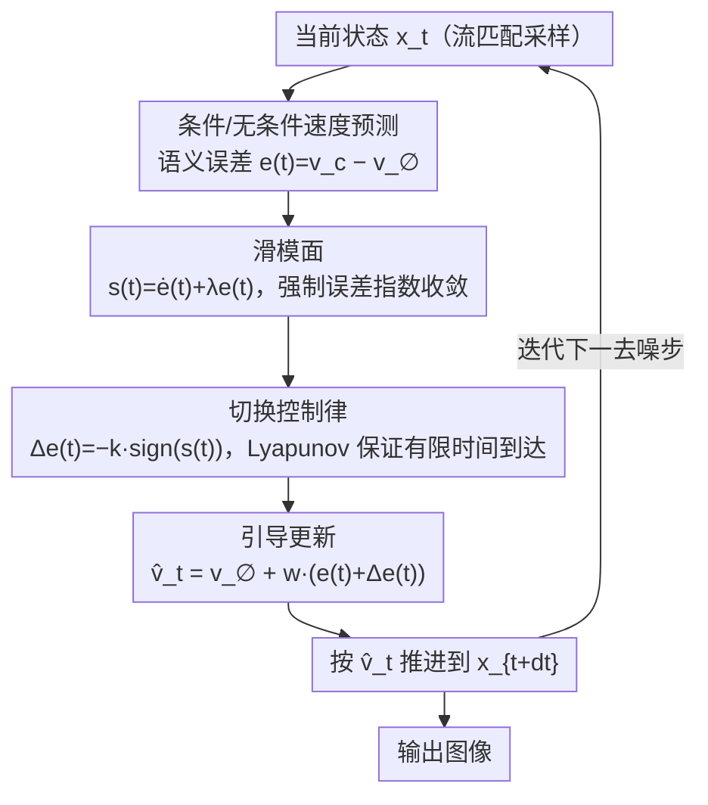

# CFG-Ctrl: Control-Based Classifier-Free Diffusion Guidance

**会议**: CVPR2026  
**arXiv**: [2603.03281](https://arxiv.org/abs/2603.03281)  
**代码**: [项目页面](https://hanyang-21.github.io/CFG-Ctrl)  
**领域**: 图像生成  
**关键词**: Classifier-Free Guidance, 控制理论, 滑模控制, Flow Matching, 文本到图像生成

## 一句话总结

将 Classifier-Free Guidance (CFG) 重新解释为流匹配扩散模型中的反馈控制过程，提出统一框架 CFG-Ctrl，并基于滑模控制 (SMC) 设计非线性反馈引导机制 SMC-CFG，在大引导尺度下显著提升语义一致性和生成鲁棒性。

## 研究背景与动机

**CFG 的核心地位**：CFG 是扩散模型中增强语义对齐的关键技术，广泛用于文生图、文生视频等任务，但其本质一直被简单视为条件/无条件预测之间的线性外推。

**线性外推的固有缺陷**：标准 CFG 在大引导尺度下容易导致颜色过饱和、结构扭曲和细节丢失，对 guidance scale 极为敏感，严重限制了实际可用的引导范围。

**现有改进方法的局限**：已有工作（Weight Scheduler、APG、CFG-Zero⋆、Rectified-CFG++ 等）虽从不同角度改进 CFG，但本质上仍依赖线性控制律，无法在高度非线性的生成动力学中保证稳定收敛。

**误差信号的自然衰减规律**：作者观察到条件与无条件速度预测之间的差异在去噪过程中逐渐减小，这一差异天然构成控制理论中的"误差信号"，为重新解释 CFG 提供了理论基础。

**控制理论的启示**：滑模控制 (SMC) 在非线性动力系统中已被广泛验证其鲁棒性和收敛性，天然适合解决 CFG 在高引导尺度下的不稳定问题。

**缺乏统一理论视角**：此前各种 CFG 变体缺少一个统一的分析框架，难以系统比较和设计新的引导策略。

## 方法详解

### 整体框架

CFG-Ctrl 想回答两个问题：为什么 CFG 在大引导尺度下会崩（过饱和、结构扭曲、细节丢失），以及能不能用一个统一视角把各种 CFG 变体都装进同一个框架。作者把流匹配的采样过程看成一个连续时间的受控动力系统：

$$\frac{d\mathbf{x}_t}{dt} = \mathbf{v}_\theta(\mathbf{x}_t, t) + \mathbf{u}_t$$

控制信号 $\mathbf{u}_t = K_t \, \Pi_t(\mathbf{e}(t))$ 拆成三部分：引导调度 $K_t$（标量/矩阵增益）、方向算子 $\Pi_t$（恒等/投影等）、语义误差 $\mathbf{e}(t) = \mathbf{v}_\theta(\mathbf{x}_t, t, \mathbf{c}) - \mathbf{v}_\theta(\mathbf{x}_t, t, \varnothing)$。在这个视角下，标准 CFG 就是比例控制器 (P-control)、Weight Scheduler 是时变增益调度、APG 与 CFG-Zero⋆ 是投影反馈控制、Rectified-CFG++ 是模型预测控制——它们全都是线性控制律，这正是它们在高度非线性的生成动力学里失稳的共同根源。SMC-CFG 把每一步采样改造成一个非线性反馈回环：计算语义误差 → 构造滑模面 → 切换控制律拉回轨迹 → 把校正量并回速度 → 更新状态并进入下一步。

### 关键设计

**1. 滑模面：让语义误差沿指数曲线稳定收敛**

线性控制律保证不了非线性系统的稳定收敛，SMC-CFG 改用滑模控制。作者在语义误差的相空间 $(\mathbf{e}, \dot{\mathbf{e}})$ 上构造一个滑模面 $\mathbf{s}(t) = \dot{\mathbf{e}}(t) + \lambda \mathbf{e}(t)$，一旦轨迹落到 $\mathbf{s}(t) = \mathbf{0}$ 上，误差就被强制沿指数曲线 $\mathbf{e}(t) = \mathbf{e}(T)\exp(-\lambda t)$ 单调收敛到零，收敛速率由 $\lambda$ 决定、与具体的网络非线性无关。

**2. 切换控制律：用非线性反馈把轨迹"拽"回滑模面**

光定义滑模面还不够，得有力把偏离的轨迹拉回来。作者引入非线性切换项 $\Delta\mathbf{e}(t) = -k \cdot \mathrm{sign}(\mathbf{s}(t))$，符号函数让控制力始终指向滑模面方向，增益 $k$ 控制牵引力度。基于 Lyapunov 函数 $V(\mathbf{s}) = \frac{1}{2}\|\mathbf{s}\|^2$ 的稳定性分析证明，只要 $k \cdot b_{\min} > \delta$，系统就在有限时间内到达滑模面：$\|\mathbf{s}(t)\| = 0,\ t \leq \frac{\|\mathbf{s}(0)\|}{\eta},\ \eta = k \cdot b_{\min} - \delta > 0$。这种有限时间收敛保证在扩散引导文献里很少见，也是它在大尺度下不崩的根本原因。

**3. 引导更新：把校正量并回无条件速度**

最后把线性误差项和非线性切换项合在一起写回采样速度：$\hat{\mathbf{v}}_t = \mathbf{v}_\theta(\mathbf{x}_t, t, \varnothing) + w \cdot (\mathbf{e}(t) + \Delta\mathbf{e}(t))$。相比标准 CFG 只有线性外推项 $w \cdot \mathbf{e}(t)$，这里多出的 $\Delta\mathbf{e}(t)$ 就是滑模反馈，且只在采样阶段改引导计算、不碰模型训练，因此即插即用。

### 超参数与使用

- **$\lambda$**：滑模面形状参数，控制收敛速率（实验最优 $\lambda=5$）
- **$k$**：切换控制增益，控制向滑模面的牵引力度（在语义对齐与图像真实感之间 trade-off）
- 跨 8B–20B 模型固定取值、无需逐模型调参；仅作用于采样阶段，无需重训。

## 实验

### 主实验：文生图生成（MS-COCO 5K）

在 SD3.5 (8B)、Flux-dev (12B)、Qwen-Image (20B) 三个主流模型上评测：

| 模型 | 方法 | FID↓ | CLIP↑ | Aesthetic↑ | ImageReward↑ | HPSv2.1↑ | MPS↑ |
|------|------|------|-------|-----------|-------------|----------|------|
| SD3.5 | CFG | 21.42 | 0.3681 | 5.588 | 0.889 | 0.284 | 7.248 |
| SD3.5 | **SMC-CFG** | **20.04** | **0.3694** | 5.579 | **0.949** | **0.288** | **7.572** |
| Flux-dev | CFG | 27.32 | 0.3692 | 5.540 | 0.875 | 0.283 | 7.839 |
| Flux-dev | **SMC-CFG** | **26.40** | **0.3743** | **5.734** | **1.056** | **0.302** | **8.231** |
| Qwen-Image | CFG | 35.43 | 0.3815 | 5.600 | 1.106 | 0.304 | 8.185 |
| Qwen-Image | **SMC-CFG** | **33.37** | **0.3856** | **5.629** | **1.204** | **0.311** | **8.432** |

SMC-CFG 在所有模型上全面超越标准 CFG 和其他变体（CFG-Zero⋆、Rect-CFG++），尤其在 ImageReward 和 MPS 等人类偏好指标上提升显著。

### 消融实验

**$\lambda$ 消融**（固定 $k=0.1$，Flux-dev）：$\lambda=5$ 时 FID 最低 (25.95)、CLIP 最高 (0.3709)，过大或过小均导致性能下降。

**$k$ 消融**（固定 $\lambda=5$）：小 $k$ 偏向低 FID（图像真实感），大 $k$ 偏向高 CLIP（语义对齐），形成明确的 quality-fidelity trade-off。

### 关键发现

- **大引导尺度鲁棒性**：在 CFG scale 逐渐增大时，标准 CFG 图像质量急剧恶化，而 SMC-CFG 保持稳定，极大拓展了可用引导范围。
- **模型无关性**：方法在 8B-20B 不同规模模型上均有效，无需针对特定模型调参（$\lambda$、$k$ 跨模型固定）。
- **定性对比**：在位置关系、文字渲染、服装细节、人体动作等复杂语义场景中，SMC-CFG 的文本一致性和细节保真度优于所有基线。

## 亮点

- **统一理论框架**：CFG-Ctrl 首次从控制论角度系统化地统一了 CFG 及其变体（P-control、增益调度、投影反馈、MPC），为引导策略设计提供了清晰的理论对标。
- **非线性控制突破**：SMC-CFG 是首个将滑模控制引入扩散引导的工作，用非线性反馈替代线性外推，从根本上解决高引导尺度不稳定问题。
- **严格理论保证**：提供了完整的 Lyapunov 稳定性分析和有限时间收敛证明，在扩散模型引导文献中少见。
- **即插即用，无需重训**：仅修改采样阶段的引导计算，不改变模型训练过程。

## 局限性

- 滑模控制的 $\mathrm{sign}$ 函数可能引入抖振 (chattering)，论文未讨论平滑近似（如 $\tanh$）的效果。
- 仅在文生图任务上验证，未扩展到文生视频、3D 生成等其他模态。
- Lyapunov 分析依赖 $\sigma_{\min}(\Gamma_s) \geq b_{\min} > 0$ 和有界性假设，对实际神经网络的成立条件未做充分验证。
- 消融实验仅在 Flux-dev 上进行，不同模型的最优超参是否一致缺乏详细分析。

## 相关工作

- **CFG 变体**：CFG++ (Chung et al., 2024)、APG (正交分解)、Weight Scheduler (时变权重)、CFG-Zero⋆ (Fan et al., 2025，优化引导尺度)、Rectified-CFG++ (Yang et al.，predictor-corrector)
- **流匹配基础**：Flow Matching (Lipman et al.)、Rectified Flow (Liu et al.)
- **控制理论应用**：PID 控制、MPC、自适应控制、滑模控制 (Edwards & Spurgeon, 1998)

## 评分

- 新颖性: ⭐⭐⭐⭐⭐ — 控制论视角解读 CFG 非常新颖，SMC 引入扩散引导为首创
- 实验充分度: ⭐⭐⭐⭐ — 三个主流模型 + 8项指标全面评测，但缺少非 T2I 任务验证
- 写作质量: ⭐⭐⭐⭐⭐ — 理论推导完整严谨，Table 1 的统一对比尤为出色
- 价值: ⭐⭐⭐⭐ — 为 CFG 改进提供了系统化的控制论工具箱，有望启发更多高级控制策略

<!-- RELATED:START -->

## 相关论文

- [\[CVPR 2026\] C$^2$FG: Control Classifier-Free Guidance via Score Discrepancy Analysis](c2fg_control_classifier-free_guidance_via_score_discrepancy_analysis.md)
- [\[AAAI 2026\] DICE: Distilling Classifier-Free Guidance into Text Embeddings](../../AAAI2026/image_generation/dice_distilling_classifier-free_guidance_into_text_embedding.md)
- [\[AAAI 2026\] Studying Classifier(-Free) Guidance From A Classifier-Centric Perspective](../../AAAI2026/image_generation/studying_classifier-free_guidance_from_a_classifier-centric_perspective.md)
- [\[NeurIPS 2025\] Towards a Golden Classifier-Free Guidance Path via Foresight Fixed Point Iterations](../../NeurIPS2025/image_generation/towards_a_golden_classifier-free_guidance_path_via_foresight_fixed_point_iterati.md)
- [\[NeurIPS 2025\] Rectified-CFG++ for Flow Based Models](../../NeurIPS2025/image_generation/rectified-cfg_for_flow_based_models.md)

<!-- RELATED:END -->
