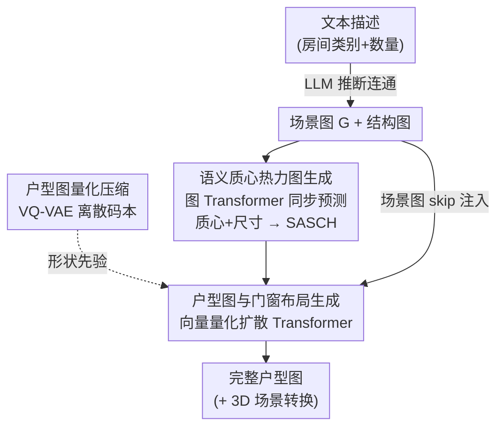

# CG-Floor: Centroid-Guided Diffusion for Large-Scale Floorplan Generation

**会议**: CVPR 2026  
**论文**: [CVF Open Access](https://openaccess.thecvf.com/content/CVPR2026/html/Lian_CG-Floor_Centroid-Guided_Diffusion_for_Large-Scale_Floorplan_Generation_CVPR_2026_paper.html)  
**代码**: https://cic.tju.edu.cn/faculty/likun/projects/CG-Floor （项目页，代码开放）  
**领域**: 扩散模型 / 图像生成  
**关键词**: 户型图生成, 质心引导扩散, VQ-VAE 码本, 拓扑-几何解耦, 大规模布局  

## 一句话总结
CG-Floor 用「先定位、后画形」的层级框架做大规模户型图生成：先用图 Transformer 一次性预测所有房间的质心与尺寸、编码成「尺寸感知语义质心热力图」（SASCH）锚定全局拓扑，再用 VQ-VAE 码本 + 向量量化扩散 Transformer 在 SASCH 引导下画出非曼哈顿（非矩形）房间形状，在大规模 MSD 数据集上把 FID 从 79.7 压到 16.0。

## 研究背景与动机
**领域现状**：户型图（floorplan）生成此前主要分两类——基于规则的优化（手工约束 + 求解）和基于学习的方法（HouseGAN++、HouseDiffusion、Graph2Plan 等）。学习类方法靠图约束或墙约束驱动，在「小于 10 个房间、形状规整」的小户型上已经做得不错。

**现有痛点**：一旦放到「几十个房间、连通关系稠密、形状不规则」的大规模场景（多单元住宅、商业楼），现有方法集体失效，暴露两个具体毛病。其一，矢量类方法（如 MHD，把每个房间表示成多边形、直接回归顶点坐标）随房间数和顶点数增长出现组合爆炸，为了能收敛只好强行把所有房间约束成矩形，导致形状失真、与结构约束严重不符。其二，像素类方法（如 Graph-informed U-Net）虽天然能容纳非曼哈顿几何，但缺少全局房间位置信息，输出边界模糊、伪影多，连房间分割都难。

**核心矛盾**：大规模户型图里，**拓扑复杂度（房间连通、相对位置）和几何复杂度（不规则形状）被现有方法纠缠在同一个生成过程里**，模型既要顾全局关系又要抠局部形状，结果两头都没顾好——语义对不齐、房间错位。

**本文目标**：在大规模、稠密连通、非矩形房型下，生成既语义一致（房间类别/数量/连通符合输入）、又形状真实多样的户型图，并支持文本输入、编辑和 3D 转换。

**切入角度**：既然纠缠是病根，就**显式解耦**——把问题拆成「先解决拓扑、再解决几何」两个阶段。作者的关键观察是：与其逐个顺序预测房间质心（易累积误差、且忽略房间尺寸），不如**一次前向同步预测所有房间的质心 + 尺寸**，用它当一个强有力的「拓扑锚点」把全局结构和输入约束对齐，再把形状细节交给后续生成。

**核心 idea**：用「质心+尺寸热力图（SASCH）」当中介，把拓扑预测和形状生成解耦——先画出每个房间该在哪、多大，再让扩散模型在这张图引导下补出不规则轮廓。

## 方法详解

### 整体框架
CG-Floor 是一个 coarse-to-fine 的层级框架，输入是场景图 $G=(V,E)$（房间节点 + 空间语义关系，可由 LLM 从文本「几间卧室几间厨房」自动生成）外加一张结构图 $I_{struct}$（建筑外轮廓/承重结构），输出是一张大规模户型图，并可进一步转成 3D 场景。整条流水线由三个模块串成：

1. **语义质心热力图生成**（§3.3）：图 Transformer 融合场景图连通信息与结构图特征，一次性预测所有房间的质心坐标和尺寸，再编码成多通道 SASCH，作为后续生成的结构条件。
2. **户型图量化压缩**（§3.4）：预训练一个 VQ-VAE，把含复杂房型的户型图压成离散码本 token，专门吃下非曼哈顿的不规则几何。
3. **户型图与门窗布局生成**（§3.5）：向量量化扩散 Transformer 在 SASCH + 码本空间里去噪生成房间-墙体图，再用一个 U-Net 补出门窗布局。

三个模块对应「先定位 → 学形状先验 → 在先验里画形并补细节」，把拓扑复杂度和几何复杂度彻底分到两个阶段。整体数据流如下：

### 关键设计

**1. 拓扑-几何显式解耦与同步质心+尺寸预测：先一次性定全局，再画形**

这是全文的根。痛点在于「逐个顺序预测质心」会累积误差、且初期忽略房间尺寸，而「一步直接出布局」又抓不住全局连通。CG-Floor 反其道而行：在**单次前向**里同步预测**所有**房间的质心位置 $\hat p_i$ 和尺寸 $\hat s_i$，把它们当作对齐全局结构与输入约束的「拓扑锚点」。这一步只关心「每个房间在哪、多大、和谁相连」，**暂时抽掉形状信息**，从而把拓扑复杂度从后续的几何复杂度里剥离出来，整体难度大幅下降。相比 MHD 那种把拓扑和几何塞进一个生成过程的做法，解耦让模型在每个阶段只解一个子问题——先把"骨架"摆对，再去"长肉"，这正是大规模场景下语义不再错位的原因。

**2. 尺寸感知语义质心热力图 SASCH：把"骨架"编码成扩散能读懂的结构条件**

光预测出质心和尺寸还不够，得变成生成器能用的条件表示。作者用一个 $L$ 层图 Transformer 联合处理场景图连通关系和结构特征：结构图先经 3 层 CNN 编码成 $f_{struct}$，节点/边特征按下式逐层更新（多头注意力，边特征参与打分）：

$$\hat w_{ij}^{k,\ell} = \frac{Q^{k,\ell}h_i^{\ell}\cdot K^{k,\ell}h_j^{\ell}}{\sqrt{d_k}}\cdot E^{k,\ell}e_{ij}^{\ell}, \qquad w_{ij}^{k,\ell}=\mathrm{softmax}_j(\hat w_{ij}^{k,\ell})$$

每层再用 cross-attention 把视觉特征 $f_{struct}$ 和节点特征动态融合。最终节点特征经 MLP 解码出质心 $\hat p_i$ 与尺寸 $\hat s_i$。然后构造 SASCH：对 $C$ 种房间类型，每种类型一个通道 $H_k$，把该类型每个房间画成一个以质心 $(x_i,y_i)$ 为中心、标准差 $\sigma_i$ 正比于房间尺寸 $s_i$ 的高斯核：

$$H_k(x,y)=\sum_{i\in\mathcal R_k}\exp\!\left(-\frac{(x-x_i)^2+(y-y_i)^2}{2\sigma_i^2}\right)$$

把 $C$ 个通道堆叠得 $H\in\mathbb R^{C\times S_l\times S_l}$。SASCH 之所以有效，在于它把"类别+全局位置+尺寸"三件事编码进一张空间热力图——既保留语义（按类型分通道），又用高斯半径隐式表达房间大小，给扩散器一个稠密、可微、语义对齐的结构引导，远比一张稀疏的连通图好用。消融里去掉它（w/o SASCH）房间数量和类型就开始出错。

**3. VQ-VAE 离散码本 + 向量量化扩散 Transformer：专治非曼哈顿不规则房型**

大规模户型里房间轮廓不再轴对齐（非曼哈顿），高度多样不规则，直接让扩散在像素空间生成既贵又容易糊。作者先用 VQ-VAE 把户型图 $F\in\{0,1\}^{C\times S\times S}$ 编码进一个含 $N$ 个向量的可学习码本 $\mathcal C=\{c_i\}$：编码器输出连续隐 $Z=E(F)$，每个空间向量量化到最近码本项 $c_t=\arg\min_{c_i\in\mathcal C}\|z_k-c_i\|_2$，得到离散 $Z_q$ 后由解码器重建 $\hat F=D(Z_q)$。这套离散码本把"丰富的房间轮廓模式"压成一组紧凑 token，相当于先学一个**形状先验库**。

随后训练一个 $M$ 层去噪 Transformer，在码本隐空间做**离散吸收扩散**（discrete absorbing diffusion）。条件注入分两路：把 SASCH 与 $f_{struct}$ 拼接后经 $1\times1$ 卷积对齐维度，加到初始噪声上形成 $Z_T$；同时——为弥补"质心表示的盲区"（比如 C 形房间的质心可能落在房间外）——通过 **skip connection** 把图 Transformer 抽出的场景图节点特征 $\{h_i^L\}$ 每隔 $M_s$ 块用 cross-attention 注入去噪过程，让生成更贴合连通和类别约束。离散吸收扩散靠并行 token 预测加速生成。生成的户型图只含房间和墙，缺门窗，于是再接一个 U-Net 预测门窗布局 $I_{dw}$，在 U-Net 编码到最小分辨率时同样用 cross-attention 注入 $h_i^L$。消融里去掉 VAE（让扩散直接画复杂形状）FID 从 16 暴涨到 270，去掉 skip 连接 FID 涨到 66.9，印证两者都不可或缺。

### 损失函数 / 训练策略
两阶段训练。第一阶段训 VQ-VAE：重建损失 $L_{rec}$（交叉熵）+ 量化损失 $L_{VQ}=\|\mathrm{sg}[Z]-Z_q\|_2+\beta\|Z-\mathrm{sg}[Z_q]\|_2$（$\mathrm{sg}$ 为停梯度，前项拉码本靠近编码输出、后项让编码 commit 到码字），合为 $L_{VAE}=L_{rec}+L_{VQ}$。第二阶段冻结 VAE，训生成模型：$L_{floorplan}=\lambda_1 L_{geo}+\lambda_2 L_{diffusion}+\lambda_3 L_{dw}$，其中 $L_{geo}$ 是质心位置与尺寸的 L2 损失，$L_{dw}$ 是门窗交叉熵，$L_{diffusion}$ 用重加权 ELBO（更重视早期去噪步）。超参 $\beta,\lambda_1,\lambda_2,\lambda_3=0.25,1,1,1$，$T=1000$，码本 $N=1024$，分辨率 $S=1024$，4 张 RTX 4090，VAE 与生成各训 1000 epoch。

## 实验关键数据

### 主实验
在大规模 MSD 数据集（约 5.3K 个中大型建筑群标注户型，是目前唯一的大规模户型数据集）上，所有 baseline 统一在「场景图 + 结构图」双输入下重训。CG-Floor 在四项指标全面领先：

| 方法 | FID↓ | KID↓ | Shape-Sim↑ | Consistency↑ |
|------|------|------|-----------|--------------|
| Graph2Plan | 279.86 | 277.49 | 0.56 | - |
| HouseGAN++ | 160.59 | 125.70 | 0.68 | - |
| UN | 179.22 | 180.67 | 0.41 | - |
| MHD | 79.72 | 63.85 | 0.65 | 87.1 |
| **Ours** | **16.03** | **6.80** | **0.71** | **91.3** |

相比次优的 MHD，FID 降 79.8%、KID 降 89.3%；Shape-Sim 0.71 vs 0.65 说明对多样几何处理更好（突破矩形假设）；Consistency 91.3 vs 87.1 说明拓扑连通保持更好（部分 baseline 因输出图像无法抽连通图而缺该指标）。

### 消融实验

| 配置 | FID↓ | KID↓ | Shape-Sim↑ | Consistency↑ | 说明 |
|------|------|------|-----------|--------------|------|
| Full model | **16.03** | **6.80** | **0.71** | **91.3** | 完整模型 |
| w/o SASCH | 21.62 | 8.61 | 0.67 | - | 去质心热力图，房间数/类型出错 |
| w/o VAE | 270.49 | 349.00 | 0.64 | - | 扩散直接画复杂形状，几乎崩 |
| w/o SKIP | 66.92 | 38.31 | 0.65 | 89.7 | 不注入场景图特征，连通变差 |
| w/o AUG | 25.95 | 15.65 | 0.68 | 90.1 | 去数据增强 |

此外用户研究（Table 3）里，在 GT-相似度/一致性/真实感三项上选择本文结果的比例分别为 95.0% / 93.2% / 92.5%，远超所有 baseline（次高的 MHD 一致性仅 4.09%）。

### 关键发现
- **VQ-VAE 是几何质量的命门**：去掉它 FID 从 16 飙到 270，说明在大规模非曼哈顿房型下，"先学离散形状先验、再让扩散在先验里采样"远比让扩散裸画像素靠谱。
- **SASCH 主管语义对齐**：去掉它 FID 退化相对最小（21.6，仍是第二好），但房间数量和类型开始出错——它的价值不在像素保真而在拓扑/语义正确性，这也印证了"解耦"的设计意图。
- **skip 连接补质心盲区**：去掉后 FID 涨到 66.9，验证了"质心可能落在房间外（如 C 形房间）"这一痛点确实存在，需要场景图特征旁路注入来纠正连通。

## 亮点与洞察
- **用"质心+尺寸热力图"当拓扑与几何的中介，是个干净的解耦支点**：它把抽象的连通约束落成一张稠密可微的空间图，既能监督（L2 回归质心/尺寸）又能引导扩散，比直接喂连通图信息量大、比直接画布局难度低。
- **尺寸感知是容易被忽略但关键的一笔**：高斯核标准差正比于房间尺寸，让"大客厅/小卫生间"在热力图上就有不同覆盖范围，相当于免费把面积先验编进条件，比只给质心点更稳。
- **离散码本 + 离散吸收扩散的组合可迁移**：把"复杂形状/版图"先量化成 token 库再做扩散，这套思路对任何"全局结构清晰、局部几何不规则"的版图类生成（电路版图、地图、UI 布局）都值得借鉴。
- **文本 → 场景图的 LLM 旁路降低了使用门槛**：用户只给"几间卧室几间厨房"，LLM 用统计约束补全连通生成场景图，避免了大规模场景下手工画图的不现实。

## 局限与展望
- 依赖 MSD 这唯一的大规模数据集（约 5.3K），泛化到其他建筑风格/国家规范的能力未充分验证。
- in-the-wild 文本输入下作者也承认会有"minor local artifacts"（局部小伪影），需后处理过滤；门窗由独立 U-Net 补出，与房间生成不是端到端联合优化，可能存在门窗-房间不完全协调。⚠️ 拓扑一致性（Consistency）指标的具体计算放在补充材料，正文未给定义，复现需查 supp。
- 两阶段、各 1000 epoch 的训练成本不低；离散吸收扩散虽并行加速，但 $T=1000$、$S=1024$ 的推理开销在正文未量化报告。
- **可改进方向**：把门窗布局并入主扩散联合建模；引入建筑规范约束（疏散、采光）做条件；探索更轻量的码本/few-step 扩散以降推理成本。

## 相关工作与启发
- **vs MHD（Modified HouseDiffusion，矢量多边形）**：MHD 直接回归房间顶点坐标，大规模下顶点组合爆炸、被迫退化成矩形；本文走像素+码本路线，天然容纳非曼哈顿形状，FID 16 vs 79.7、Shape-Sim 0.71 vs 0.65 全面占优。
- **vs UN（Graph-informed U-Net，像素）**：UN 把结构图和连通图融进像素生成但缺全局房间位置，边界模糊（Shape-Sim 仅 0.41）；本文用 SASCH 显式提供质心+尺寸锚点，解决了"无全局定位 → 边界糊"的核心缺陷。
- **vs HouseGAN++ / Graph2Plan（小户型 SOTA）**：两者在 <10 房间小户型表现尚可，但放大到几十房间时房间数错、连通断裂；本文的层级解耦专为大规模设计，是从"小户型范式"到"大规模范式"的关键补位。

## 评分
- 新颖性: ⭐⭐⭐⭐⭐ 用质心+尺寸热力图做拓扑/几何解耦、码本+离散扩散治非曼哈顿房型，针对大规模户型的痛点对症下药
- 实验充分度: ⭐⭐⭐⭐ 主实验+消融+用户研究齐全且提升巨大，但仅限单一 MSD 数据集、推理成本未量化
- 写作质量: ⭐⭐⭐⭐ 动机—解耦—模块逻辑清晰，公式完整；部分指标计算依赖补充材料
- 价值: ⭐⭐⭐⭐⭐ 把户型生成从"<10 房间"推到大规模并支持文本/编辑/3D 转换，实用价值高

<!-- RELATED:START -->

## 相关论文

- [\[CVPR 2026\] Unified Vector Floorplan Generation via Markup Representation](unified_vector_floorplan_generation_via_markup_representation.md)
- [\[CVPR 2026\] Pico-Banana-400K: A Large-Scale Dataset for Text-Guided Image Editing](pico-banana-400k_a_large-scale_dataset_for_text-guided_image_editing.md)
- [\[CVPR 2026\] 4KLSDB: A Large-Scale Dataset for 4K Image Restoration and Generation](4klsdb_a_large-scale_dataset_for_4k_image_restoration_and_generation.md)
- [\[CVPR 2026\] StyleText: A Large-Scale Dataset and Benchmark for Stylized Scene Text Inpainting](styletext_a_large-scale_dataset_and_benchmark_for_stylized_scene_text_inpainting.md)
- [\[CVPR 2026\] Scale Space Diffusion：把尺度空间塞进扩散过程](scale_space_diffusion.md)

<!-- RELATED:END -->
