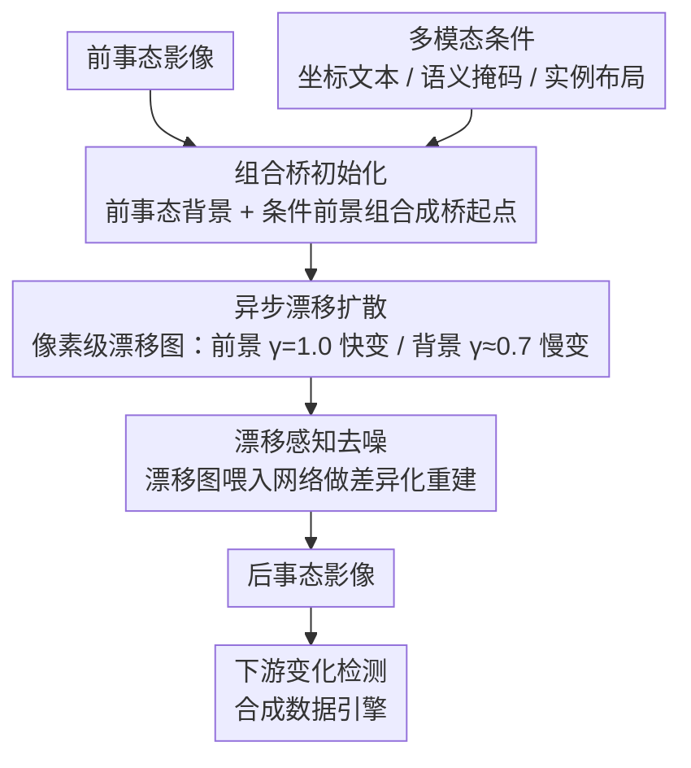

# ChangeBridge: Spatiotemporal Image Generation with Multimodal Controls for Remote Sensing

**会议**: CVPR 2026  
**arXiv**: [2507.04678](https://arxiv.org/abs/2507.04678)  
**代码**: [https://github.com/zhenghuizhao/ChangeBridge](https://github.com/zhenghuizhao/ChangeBridge)  
**领域**: 遥感 / 图像生成  
**关键词**: 时空图像生成, 扩散桥, 异步漂移, 变化检测, 遥感

## 一句话总结
提出ChangeBridge，首个遥感条件时空图像生成模型，基于漂移异步扩散桥实现从前事态图像+多模态条件（坐标文本/语义掩码/实例布局）生成后事态图像，同时建模前景事件驱动变化和背景时间演化，并可作为下游变化检测任务的数据引擎。

## 研究背景与动机

1. **领域现状**：遥感生成方法已涵盖布局到图像、模态转换等，但条件时空图像生成（基于过去观测+多模态条件模拟未来场景）极少被探索。
2. **现有痛点**：现有变化生成方法仅处理事件驱动变化（如新建筑出现），无法建模跨时间的渐变（如季节变化、植被生长）。
3. **核心挑战**：必须同时生成两种异质演化——前景的剧烈事件变化+背景的微妙时间动态——传统噪声初始化扩散模型无法区分两者。
4. **核心idea**：(1) 从组合前事态状态出发建立扩散桥（非从噪声开始）；(2) 像素级漂移图为前景分配高漂移/背景低漂移（异步扩散）；(3) 漂移感知去噪网络。

## 方法详解

### 整体框架

ChangeBridge 要解决的是遥感里的条件时空图像生成：给一张前事态影像和多模态条件（坐标文本/语义掩码/实例布局），生成对应的后事态影像，而且要同时刻画两种性质完全不同的变化——前景由事件驱动的剧烈变化（如新建筑出现）和背景随时间的渐变（如季节更替、植被生长）。整体流程不从噪声出发，而是把前事态背景和条件驱动的前景组合成扩散桥的起点，再用一张像素级漂移图让前景快变、背景慢变地去噪，最后由漂移感知网络重建出后事态影像。

### 关键设计

**1. 组合桥初始化：从前事态出发而非从噪声出发**

传统扩散从纯噪声初始化，会把背景结构信息一并抹掉，导致前后事态的空间不一致。ChangeBridge 改成把前事态背景与条件驱动的前景组合成扩散桥的起点，这样背景的空间结构在生成全程被保留，前后事态自然对齐。

**2. 异步漂移扩散：让前景快变、背景慢变**

前景的事件变化和背景的时间演化剧烈程度天差地别，统一漂移没法区分两者。作者给每个像素分配不同漂移强度，构造像素级漂移图 $\tilde{m}_t(i,j) = m_t \cdot \mathbf{z}_d(i,j)$，前景取 $\gamma^{fg}=1.0$、背景取 $\gamma^{bg}=0.7\sim0.8$，于是前景区域沿桥快速变化、背景区域缓慢演化——这把布朗桥从均匀漂移推广到了空间异步漂移。

**3. 漂移感知去噪：把漂移图喂给网络做差异化重建**

光在前向过程里区分前景背景还不够，去噪网络也得知道每个像素该变多快。作者把漂移图 $\mathbf{z}_d$ 嵌入去噪网络，引导它对前景/背景区域做差异化重建，避免背景被前景的剧烈变化"带歪"。

**4. 多模态条件：三种控制模式统一接入**

为支持不同粒度的控制需求，框架统一接入三类条件——坐标文本（用旋转 bbox 定位变化位置）、语义掩码（用颜色通道映射类别）、实例布局，覆盖从粗到细的多模态控制。

### 损失函数

$$\mathcal{L}_{asy} = \mathbb{E}[\|\tilde{m}_t(\mathbf{z}_a - \mathbf{z}_b) + \sqrt{\delta_t}\boldsymbol{\epsilon} - \boldsymbol{\epsilon}_\theta(\mathbf{z}_t, t, \mathbf{z}_a, \mathbf{z}_c, \mathbf{z}_d)\|^2]$$

异步漂移损失，让网络在漂移图 $\mathbf{z}_d$ 调制下预测从前事态 $\mathbf{z}_a$ 到后事态 $\mathbf{z}_b$ 的转移。

## 实验关键数据

### 主实验（DiT变体）

| 条件 | 数据集 | FID↓ | IS↑ | 空间指标↑ |
|------|--------|:---:|:---:|:---:|
| 坐标文本 | LEVIR-CC | **31.45** | **5.14** | CosSim 0.85 |
| 实例布局 | WHU-CD | **40.12** | **6.77** | IoU 78.13 |
| 语义掩码 | SECOND | **最优** | **最优** | mIoU **最优** |

所有条件和数据集上超越所有基线。

### 作为数据引擎的价值
用ChangeBridge合成训练数据→下游变化检测性能显著提升→验证了生成数据的实用价值。

### 关键发现
- 异步漂移vs均匀漂移：异步显著改善背景时间一致性
- 组合桥初始化vs噪声初始化：组合桥保留空间结构→跨时间空间一致性提升
- UNet vs DiT变体：DiT变体在所有指标上全面优于UNet

## 亮点与洞察
- **扩散桥+异步漂移的首次结合**：将布朗桥扩散从均匀漂移推广到像素级异步漂移—前景快变/背景慢变的设计完美匹配遥感时空演化
- **生成数据引擎的验证**：证明ChangeBridge可缓解变化检测训练数据稀缺问题
- **多模态条件框架**：统一支持坐标文本/语义掩码/实例布局三种控制模式

## 局限与展望
- $\gamma^{fg}/\gamma^{bg}$需逐数据集手动设置
- 当前仅验证遥感场景——城市街景等自然场景的泛化待探索
- 生成图像的空间分辨率受限于VQGAN的重建精度

## 评分
- 新颖性: ⭐⭐⭐⭐⭐ 异步漂移扩散桥的数学框架优雅且物理直觉明确
- 实验充分度: ⭐⭐⭐⭐ 4个数据集、3种条件、UNet+DiT变体、下游任务验证
- 写作质量: ⭐⭐⭐⭐⭐ 数学推导完整，图示清晰
- 价值: ⭐⭐⭐⭐⭐ 对遥感时空模拟和变化检测数据增强有重大意义

<!-- RELATED:START -->

## 相关论文

- [\[CVPR 2026\] OpenDPR: Open-Vocabulary Change Detection via Vision-Centric Diffusion-Guided Prototype Retrieval for Remote Sensing Imagery](opendpr_open-vocabulary_change_detection_via_vision-centric_diffusion-guided_pro.md)
- [\[CVPR 2026\] Spatiotemporal Pyramid Flow Matching for Climate Emulation](spatiotemporal_pyramid_flow_matching_for_climate_emulation.md)
- [\[CVPR 2026\] DreamOmni2: Multimodal Instruction-based Generation and Editing](dreamomni2_multimodal_instruction-based_generation_and_editing.md)
- [\[CVPR 2026\] OmniGen2: Towards Instruction-Aligned Multimodal Generation](omnigen2_towards_instruction-aligned_multimodal_generation.md)
- [\[CVPR 2026\] Proxy-Tuning: Tailoring Multimodal Autoregressive Models for Subject-Driven Image Generation](proxy-tuning_tailoring_multimodal_autoregressive_models_for_subject-driven_image.md)

<!-- RELATED:END -->
